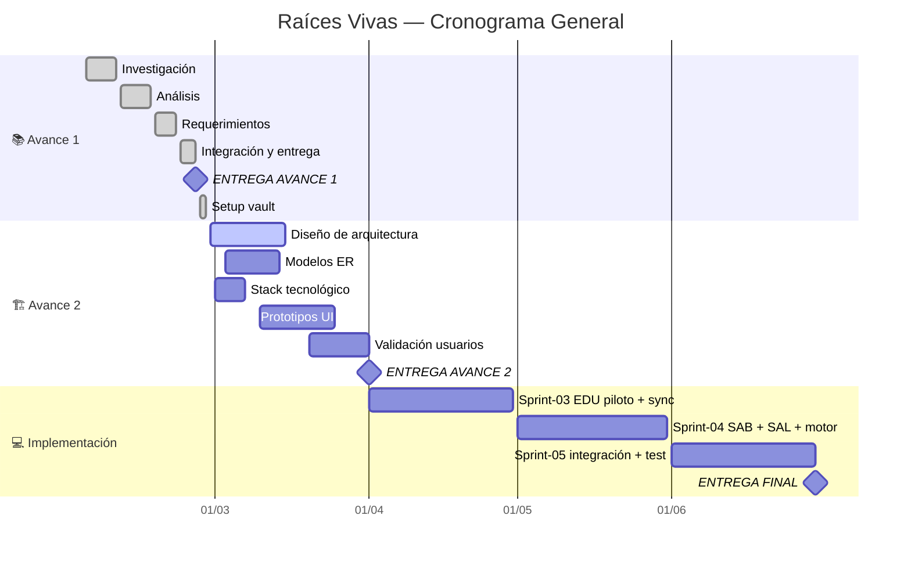

## 📊 Indicadores Clave (KPIs)

```sqlseal
SELECT
  SUM(CASE WHEN (type='task' OR type='subtask') AND path LIKE '05-Sprints%' AND status='done' THEN 1 ELSE 0 END) || '/' || SUM(CASE WHEN (type='task' OR type='subtask') AND path LIKE '05-Sprints%' THEN 1 ELSE 0 END) || ' (' || ROUND(100.0 * SUM(CASE WHEN (type='task' OR type='subtask') AND path LIKE '05-Sprints%' AND status='done' THEN 1 ELSE 0 END) / MAX(1, SUM(CASE WHEN (type='task' OR type='subtask') AND path LIKE '05-Sprints%' THEN 1 ELSE 0 END))) || '%)' as "🎯 Progreso",
  SUM(CASE WHEN type='requirement/functional' AND path LIKE '03-Requerimientos%' THEN 1 ELSE 0 END) || ' RF · ' || SUM(CASE WHEN type='requirement/non-functional' AND path LIKE '03-Requerimientos%' THEN 1 ELSE 0 END) || ' RNF' as "📋 Reqs",
  SUM(CASE WHEN type='risk' AND path LIKE '01-Proyecto/Riesgos%' AND status='open' THEN 1 ELSE 0 END) || ' / ' || SUM(CASE WHEN type='risk' AND path LIKE '01-Proyecto/Riesgos%' THEN 1 ELSE 0 END) as "⚠️ Riesgos (abiertos/total)",
  SUM(CASE WHEN type='adr' AND path LIKE '01-Proyecto/Decisiones%' AND status='accepted' THEN 1 ELSE 0 END) || ' / ' || SUM(CASE WHEN type='adr' AND path LIKE '01-Proyecto/Decisiones%' THEN 1 ELSE 0 END) as "🏗️ ADR (aceptadas/total)",
  SUM(CASE WHEN (type='task' OR type='subtask') AND path LIKE '05-Sprints%' AND status='blocked' THEN 1 ELSE 0 END) as "🚫 Bloqueadas"
FROM files
```

> ⏱️ *Horas y costos → ver* [[01-Proyecto/Finanzas|Finanzas]] *y* [[00-Dashboard/Métricas|Métricas]]

---

## 🚀 Acciones Rápidas

> **Cómo usar:** Haz clic en cualquier botón → se abre el menú QuickAdd → selecciona la opción. Los botones **Jira** ejecutan el comando directamente sobre la nota activa.

=== start-multi-column: qa-crear
```column-settings
number of columns: 3
border: off
shadow: off
```

```button
name ➕ Nueva Tarea
type command
action QuickAdd: Run QuickAdd
color blue
```

=== end-column ===

```button
name 📝 Nueva Minuta
type command
action QuickAdd: Run QuickAdd
color green
```

=== end-column ===

```button
name 🏗️ Nuevo ADR
type command
action QuickAdd: Run QuickAdd
color purple
```

=== end-multi-column

=== start-multi-column: qa-reqs
```column-settings
number of columns: 3
border: off
shadow: off
```

```button
name 📋 Nuevo RF
type command
action QuickAdd: Run QuickAdd
color cyan
```

=== end-column ===

```button
name 🔒 Nuevo RNF
type command
action QuickAdd: Run QuickAdd
color cyan
```

=== end-column ===

```button
name ⚠️ Nuevo Riesgo
type command
action QuickAdd: Run QuickAdd
color yellow
```

=== end-multi-column

=== start-multi-column: qa-sprints
```column-settings
number of columns: 3
border: off
shadow: off
```

```button
name 🎤 Entrevista
type command
action QuickAdd: Run QuickAdd
color orange
```

=== end-column ===

```button
name 🚀 Sprint Planning
type command
action QuickAdd: Run QuickAdd
color blue
```

=== end-column ===

```button
name 📋 Sprint Review
type command
action QuickAdd: Run QuickAdd
color green
```

=== end-multi-column

=== start-multi-column: qa-promover
```column-settings
number of columns: 3
border: off
shadow: off
```

```button
name 📋 Promover Action Item
type command
action QuickAdd: Run QuickAdd
color blue
```

=== end-column ===

```button
name 🏗️ Promover Decisión
type command
action QuickAdd: Run QuickAdd
color purple
```

=== end-column ===

```button
name ⚠️ Promover Riesgo
type command
action QuickAdd: Run QuickAdd
color yellow
```

=== end-multi-column

=== start-multi-column: qa-jira
```column-settings
number of columns: 3
border: off
shadow: off
```

```button
name 🔄 Crear en Jira
type command
action Jira Issue Manager: Create issue in Jira
color blue
```

=== end-column ===

```button
name 📤 Actualizar en Jira
type command
action Jira Issue Manager: Update issue in Jira
color green
```

=== end-column ===

```button
name 🔀 Cambiar Estado Jira
type command
action Jira Issue Manager: Update issue status in Jira
color yellow
```

=== end-multi-column

=== start-multi-column: qa-nav
```column-settings
number of columns: 3
border: off
shadow: off
```

```button
name 📦 Backlog
type link
action [[05-Sprints/Backlog]]
color default
```

=== end-column ===

```button
name 💰 Finanzas
type link
action [[01-Proyecto/Finanzas]]
color default
```

=== end-column ===

```button
name 🌐 Board Jira
type link
action https://ucenfotec-team-y6xzvduw.atlassian.net/jira/software/projects/RV/boards/1
color default
```

=== end-multi-column

> **18 acciones rápidas** — 12 macros QuickAdd (Nueva Tarea · Minuta · RF · RNF · Riesgo · ADR · Entrevista · Sprint Planning · Sprint Review · Promover Action Item · Promover Decisión · Promover Riesgo) · 3 Jira Sync (Crear · Actualizar · Cambiar Estado) · 3 Navegación (Backlog · Finanzas · Board Jira)

---

## 📈 Colaboración del Equipo

```sqlseal
CHART
{
  series: [{
    type: 'pie',
    radius: '60%',
    encode: { value: 'cnt', itemName: 'assignee' }
  }]
}
SELECT COALESCE(assignee, 'Sin asignar') as assignee, COUNT(*) as cnt
FROM files
WHERE (type = 'task' OR type = 'subtask') AND path LIKE '05-Sprints%'
GROUP BY assignee
```

```sqlseal
SELECT
  COALESCE(assignee, 'Sin asignar') as "👤 Integrante",
  COUNT(*) as "Asignadas",
  SUM(CASE WHEN status = 'done' THEN 1 ELSE 0 END) as "✅ Done",
  SUM(CASE WHEN status = 'in-progress' THEN 1 ELSE 0 END) as "🔄 En curso",
  SUM(CASE WHEN status NOT IN ('done', 'in-progress') THEN 1 ELSE 0 END) as "📋 Pend."
FROM files
WHERE (type = 'task' OR type = 'subtask') AND path LIKE '05-Sprints%'
GROUP BY assignee
ORDER BY assignee ASC
```

---

## 📊 Estado de Tareas

```sqlseal
CHART
{
  xAxis: { type: 'category' },
  yAxis: { type: 'value' },
  series: [{
    type: 'bar',
    encode: { x: 'status', y: 'cnt' }
  }]
}
SELECT status, COUNT(*) as cnt
FROM files
WHERE (type = 'task' OR type = 'subtask') AND path LIKE '05-Sprints%'
GROUP BY status
ORDER BY status ASC
```

```sqlseal
SELECT status as "Estado", COUNT(*) as "Cantidad"
FROM files
WHERE (type = 'task' OR type = 'subtask') AND path LIKE '05-Sprints%'
GROUP BY status
ORDER BY status ASC
```

---

## 🗺️ Navegación del Proyecto

=== start-multi-column: nav-panel
```column-settings
number of columns: 3
border: off
shadow: off
```

### 📁 Gobierno y Gestión
- 👥 [[01-Proyecto/Equipo|Equipo]]
- 📜 [[01-Proyecto/Charter|Charter]]
- 🎯 [[01-Proyecto/Alcance|Alcance]]
- 👤 [[01-Proyecto/Stakeholders|Stakeholders]]
- 📖 [[01-Proyecto/Glosario|Glosario]]
- 📋 [[01-Proyecto/Plan de Gestión|Plan de Gestión]]
- 📕 [[01-Proyecto/Guía de Workflow|Guía de Workflow]]
- 🚀 [[01-Proyecto/Onboarding|Onboarding]]
- 💰 [[01-Proyecto/Finanzas|Finanzas]]
- 🗂️ [[01-Proyecto/Decisiones/Decisiones|Decisiones (ADR)]]
- ⚠️ [[01-Proyecto/Riesgos/Riesgos|Riesgos (RSK)]]

=== end-column ===

### 📐 Técnico y Arquitectura
- 📐 [[03-Requerimientos/_RTM|RTM — Trazabilidad]]
- 🏗️ [[04-Arquitectura/WBS|WBS]]
- 🏗️ [[04-Arquitectura/Visión General|Arquitectura General]]
- 🏗️ [[04-Arquitectura/Modelo de Datos|Modelo de Datos]]
- 💻 [[04-Arquitectura/Stack Tecnológico|Stack Tecnológico]]
- 📊 [[00-Dashboard/Roadmap|Roadmap / Gantt]]
- 📈 [[00-Dashboard/Métricas|Métricas de Avance]]
- ✅ [[09-QA/README|QA — Calidad]]

=== end-column ===

### 🔬 Investigación y Entregables
- 🔍 [[02-Investigación/Contexto/Educación|Contexto EDU]]
- 🔍 [[02-Investigación/Contexto/Saberes Ancestrales|Contexto SAB]]
- 🔍 [[02-Investigación/Contexto/Salud Comunitaria|Contexto SAL]]
- 🗺️ [[02-Investigación/Contexto/Mapa de Territorios Indígenas|Mapa Territorios]]
- 📄 [[06-Entregables/Avance-1/Raíces Vivas – Sistema Integral de Apoyo a Comunidades Indígenas|Avance 1]]
- 📦 [[05-Sprints/Sprint-01/Sprint-01-Planning|Sprint 01]]
- 📦 [[05-Sprints/Sprint-02/Sprint-02-Planning|Sprint 02]]
- � [[05-Sprints/Sprint-03/Sprint-03-Planning|Sprint 03]]
- 📦 [[05-Sprints/Sprint-04/Sprint-04-Planning|Sprint 04]]
- 📦 [[05-Sprints/Sprint-05/Sprint-05-Planning|Sprint 05]]
- 📝 [[07-Reuniones/MIN-001|Minuta Kickoff]]
- 📝 [[07-Reuniones/MIN-002|Minuta Sprint-02 Arranque]]
- 📝 [[07-Reuniones/MIN-003|Minuta Prep Avance 2]]

=== end-multi-column

---

## 🏛️ Jerarquía Jira — Epics & Stories

> [🌐 Board Scrum en Jira](https://ucenfotec-team-y6xzvduw.atlassian.net/jira/software/projects/RV/boards/1)

=== start-multi-column: jira-nav
```column-settings
number of columns: 3
border: off
shadow: off
```

### 🏔️ EDU — Educación
- 🏔️ [[RV-1]] — Epic
- 📖 [[RV-4]] — RF-EDU-01 (SP: 5)
- 📖 [[RV-5]] — RF-EDU-03 (SP: 5)

=== end-column ===

### 🏔️ SAB — Saberes
- 🏔️ [[RV-2]] — Epic
- 📖 [[RV-6]] — RF-SAB-01 (SP: 5)
- 📖 [[RV-7]] — RF-SAB-04 (SP: 3)

=== end-column ===

### 🏔️ SAL — Salud
- 🏔️ [[RV-3]] — Epic
- 📖 [[RV-8]] — RF-SAL-01 (SP: 3)
- 📖 [[RV-9]] — RF-SAL-02 (SP: 5)

=== end-multi-column

### 🔄 TRANS — Transversal
- 🏔️ [[EPIC-TRANS]] — Epic (sync, i18n, gobernanza)
- 📖 [[US-TRANS-01]] — Sync offline/online (SP: 8)
- 📖 [[US-TRANS-02]] — Interfaz multilingüe (SP: 5)
- 📖 [[US-EDU-04]] — Motor práctica EDU (SP: 5)
- 📖 [[US-EDU-05]] — Seguimiento académico (SP: 3)
- 📖 [[US-SAB-03]] — Búsqueda saberes (SP: 3)
- 📖 [[US-SAL-03]] — Gestión citas SAL (SP: 5)
- 📖 [[US-SAL-05]] — Alertas clínicas (SP: 3)

```sqlseal
SELECT
  key_ as "Key",
  summary as "Nombre",
  issuetype as "Tipo",
  status as "Estado",
  story_points as "SP"
FROM files
WHERE (type = 'epic' OR type = 'story') AND (path LIKE '05-Sprints/Epics%' OR path LIKE '05-Sprints/Stories%')
ORDER BY key_ ASC
```

---

## 📅 Timeline del Proyecto



---

> [!bug]- 🔍 DIAGNÓSTICO (borrar después)
>
> ### Test A: SELECT * de una tarea
> ```sqlseal
> SELECT * FROM files WHERE path LIKE '05-Sprints/Sprint-01/T-001%' LIMIT 1
> ```
>
> ### Test B: title explícito
> ```sqlseal
> SELECT name, title, status FROM files WHERE type = 'task' LIMIT 3
> ```
>
> ### Test C: Misma query que falla abajo
> ```sqlseal
> SELECT id, title, assignee, status FROM files WHERE (type = 'task' OR type = 'subtask') AND status != 'done' AND path LIKE '05-Sprints%' LIMIT 3
> ```

---

## 🏃 Tareas Pendientes (Top 10)

```sqlseal
SELECT id as "ID", title as "Tarea", assignee as "👤", status as "Estado", priority as "Prioridad", due as "📅 Límite"
FROM files
WHERE (type = 'task' OR type = 'subtask') AND status != 'done' AND path LIKE '05-Sprints%'
ORDER BY priority ASC, due ASC
LIMIT 10
```

---

## ⚠️ Riesgos Activos

```sqlseal
SELECT id as "ID", title as "Riesgo", probability as "Prob.", impact as "Impacto", severity as "Severidad", owner as "Responsable", status as "Estado"
FROM files
WHERE type = 'risk' AND path LIKE '01-Proyecto/Riesgos%'
ORDER BY severity DESC
```

---

## 🏗️ Decisiones Arquitectónicas (ADR)

```sqlseal
SELECT id as "ID", title as "Decisión", status as "Estado", "date" as "Fecha"
FROM files
WHERE type = 'adr' AND path LIKE '01-Proyecto/Decisiones%'
ORDER BY id ASC
```

---

> [!note]- 📋 Estado de Requerimientos por Módulo (expandir)
>
> ### Funcionales
>
> ```sqlseal
> SELECT module as "Módulo", COUNT(*) as "Total RF", SUM(CASE WHEN priority = 'must' THEN 1 ELSE 0 END) as "Must", SUM(CASE WHEN priority = 'should' THEN 1 ELSE 0 END) as "Should", SUM(CASE WHEN priority = 'could' THEN 1 ELSE 0 END) as "Could"
> FROM files
> WHERE type = 'requirement/functional' AND path LIKE '03-Requerimientos/Funcionales%'
> GROUP BY module
> ```
>
> ### No Funcionales
>
> ```sqlseal
> SELECT id as "ID", title as "Requisito", category as "Categoría", priority as "MoSCoW", status as "Estado"
> FROM files
> WHERE type = 'requirement/non-functional' AND path LIKE '03-Requerimientos/No Funcionales%'
> ORDER BY priority ASC
> ```

---

> [!note]- 📈 Progreso por Fase (expandir)
>
> ```sqlseal
> SELECT COALESCE(phase, 'sin fase') as "Fase", COUNT(*) as "Total", SUM(CASE WHEN status = 'done' THEN 1 ELSE 0 END) as "Done"
> FROM files
> WHERE (type = 'task' OR type = 'subtask') AND path LIKE '05-Sprints%'
> GROUP BY phase
> ORDER BY phase ASC
> ```

---

> [!note]- 💰 Resumen Financiero (expandir)
>
> ```sqlseal
> SELECT
>   COALESCE(t.assignee, 'Sin asignar') as "👤 Integrante",
>   COUNT(*) as "Tareas",
>   SUM(CAST(t.effort AS INTEGER)) as "H. Est.",
>   SUM(CAST(COALESCE(t.effort_actual, t.effort) AS INTEGER)) as "H. Real",
>   SUM(CAST(t.effort AS INTEGER) * CAST(c.tarifa_hora AS INTEGER)) as "Costo Est. (₡)",
>   SUM(CAST(COALESCE(t.effort_actual, t.effort) AS INTEGER) * CAST(c.tarifa_hora AS INTEGER)) as "Costo Real (₡)"
> FROM files t
> LEFT JOIN file(08-Recursos/Datos/finanzas-config.csv) c ON t.assignee = c.integrante
> WHERE (t.type = 'task' OR t.type = 'subtask') AND t.path LIKE '05-Sprints%' AND t.effort IS NOT NULL AND t.effort != ''
> GROUP BY t.assignee
> ORDER BY t.assignee ASC
> ```

---

> [!note]- 📆 Próximas Fechas Límite (expandir)
>
> ```sqlseal
> SELECT title as "Tarea / Entregable", assignee as "👤", due as "Fecha", status as "Estado"
> FROM files
> WHERE due IS NOT NULL AND due != '' AND status != 'done' AND due >= date('now')
> ORDER BY due ASC
> LIMIT 10
> ```

---

> [!note]- 📝 Últimas Reuniones (expandir)
>
> ```sqlseal
> SELECT title as "Reunión", "date" as "Fecha", attendees as "Asistentes"
> FROM files
> WHERE type = 'meeting' AND path LIKE '07-Reuniones%'
> ORDER BY "date" DESC
> LIMIT 5
> ```
>
> *Para documentar reuniones: `Ctrl+P` → QuickAdd → selecciona "Nueva Minuta"*

---

## 🔗 Vistas Transcluidas

### RTM — Matriz de Trazabilidad

![[03-Requerimientos/_RTM#Matriz Dinámica]]

### Sprint Actual — Distribución

![[05-Sprints/Sprint-02/Sprint-02-Planning#Distribución por Responsable]]

---

## 📊 Milestones

| # | Milestone | Fecha | Estado |
|---|-----------|-------|--------|
| M1 | ✅ Avance 1 — Análisis y Requerimientos | 2026-02-25 | ✅ Entregado |
| M2 | 🏗️ Avance 2 — Diseño y Arquitectura | 2026-04-01 | 🔄 En progreso |
| M3 | 💻 Entrega Final — Integración y Piloto | 2026-06-30 | ⏳ Pendiente |

---

*Dashboard dinámico · Banners + Buttons + Multi-Column + Dataview + Charts + Mermaid + Jira Sync*
*Última configuración: 2026-03-26*
