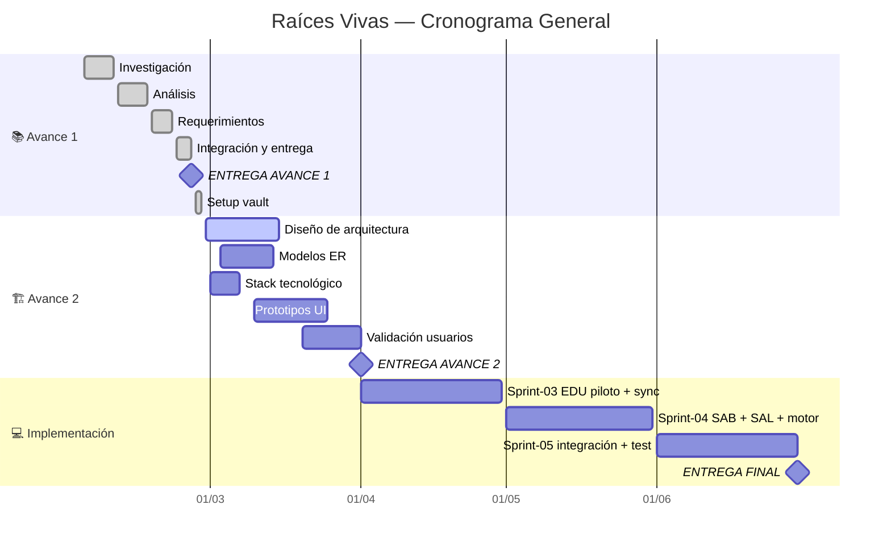

## 📊 Indicadores Clave (KPIs)

```dataviewjs
const tasks = dv.pages('"05-Sprints"').where(t => t.type === "task" || t.type === "subtask");
const done = tasks.where(t => t.status === "done").length;
const total = tasks.length;
const pct = total > 0 ? Math.round((done/total)*100) : 0;

// Sprint actual
const groups = {};
for (const t of tasks.where(t => t.sprint)) {
  const s = String(t.sprint);
  if (!groups[s]) groups[s] = { active: 0, done: 0, total: 0 };
  groups[s].total++;
  if (t.status === "done") groups[s].done++;
  else groups[s].active++;
}
const sorted = Object.keys(groups).sort();
let current = sorted[sorted.length - 1] || "N/A";
for (const s of sorted) { if (groups[s].active > 0) { current = s; break; } }
const g = groups[current] || { done: 0, total: 0 };

// Requerimientos
const rf = dv.pages('"03-Requerimientos/Funcionales"').where(r => r.type === "requirement/functional").length;
const rnf = dv.pages('"03-Requerimientos/No Funcionales"').where(r => r.type === "requirement/non-functional").length;

// Riesgos
const risks = dv.pages('"01-Proyecto/Riesgos"').where(r => r.type === "risk");
const openRisks = risks.where(r => r.status === "open").length;

// ADR
const adrs = dv.pages('"01-Proyecto/Decisiones"').where(d => d.type === "adr");
const accepted = adrs.where(d => d.status === "accepted").length;
const proposed = adrs.where(d => d.status === "proposed").length;

// Horas (estimadas vs reales)
let estHours = 0, actHours = 0, doneEstH = 0, doneActH = 0;
for (const t of tasks.where(t => t.effort)) {
  const est = ((v) => { if (!v) return 0; if (typeof v === "number") return v; const m = String(v).match(/\d+/); return m ? parseInt(m[0]) : 0; })(t.effort);
  const act = t.effort_actual ? (((v) => { if (!v) return 0; if (typeof v === "number") return v; const m = String(v).match(/\d+/); return m ? parseInt(m[0]) : 0; })(t.effort_actual)) : 0;
  estHours += est;
  actHours += act || est;
  if (t.status === "done") { doneEstH += est; doneActH += act || est; }
}

// Calidad
const blocked = tasks.where(t => t.status === "blocked").length;
const defectRate = total > 0 ? Math.round((blocked / total) * 100) : 0;

// Finanzas (usa horas reales para costos)
const tarifas = { "Geovanny": 8500, "Elkin": 6500, "Santiago": 6500 };
let estCost = 0, actCost = 0;
for (const t of tasks.where(t => t.effort)) {
  const est = ((v) => { if (!v) return 0; if (typeof v === "number") return v; const m = String(v).match(/\d+/); return m ? parseInt(m[0]) : 0; })(t.effort);
  const act = t.effort_actual ? (((v) => { if (!v) return 0; if (typeof v === "number") return v; const m = String(v).match(/\d+/); return m ? parseInt(m[0]) : 0; })(t.effort_actual)) : 0;
  const tarifa = tarifas[t.assignee] || 5000;
  estCost += est * tarifa;
  actCost += (act || est) * tarifa;
}

dv.table(
  ["📊 Indicador", "Valor", "Detalle"],
  [
    ["🎯 Progreso General", `**${pct}%** (${done}/${total})`, pct >= 80 ? "🟢" : pct >= 50 ? "🟡" : "🔴"],
    ["✅ Sprint Actual", `**${current}**`, `${g.done}/${g.total} completadas`],
    ["📋 Requerimientos", `**${rf + rnf}** total`, `${rf} RF · ${rnf} RNF`],
    ["⚠️ Riesgos", openRisks > 0 ? `**${openRisks}** abierto(s)` : "✅ Bajo control", `${risks.length} registrados`],
    ["🏗️ Decisiones (ADR)", `**${accepted}** aceptadas`, `${proposed} propuestas · ${adrs.length} total`],
    ["⏱️ Horas (est.)", `**${estHours}h** planificadas`, `${doneEstH}h en tareas done`],
    ["⏱️ Horas (real)", `**${doneActH}h** ejecutadas`, actHours !== estHours ? `Δ ${actHours - estHours > 0 ? "+" : ""}${actHours - estHours}h` : "✅ En estimado"],
    ["🎯 Calidad (LSS)", `Defectos: **${defectRate}%**`, `Throughput: **${done}** tareas`],
    ["💰 Costo (est.)", `₡${estCost.toLocaleString()}`, `~$${Math.round(estCost / 535).toLocaleString()} USD`],
    ["💰 Costo (real)", `₡${actCost.toLocaleString()}`, `~$${Math.round(actCost / 535).toLocaleString()} USD`]
  ]
);
```

---

## 🚀 Acciones Rápidas

> **Cómo usar:** Haz clic en cualquier botón → se abre el menú QuickAdd → selecciona la opción. Los botones **Jira** ejecutan el comando directamente sobre la nota activa.

=== start-multi-column: qa-crear
```column-settings
number of columns: 3
border: off
shadow: off
```

```button
name ➕ Nueva Tarea
type command
action QuickAdd: Run QuickAdd
color blue
```

=== end-column ===

```button
name 📝 Nueva Minuta
type command
action QuickAdd: Run QuickAdd
color green
```

=== end-column ===

```button
name 🏗️ Nuevo ADR
type command
action QuickAdd: Run QuickAdd
color purple
```

=== end-multi-column

=== start-multi-column: qa-reqs
```column-settings
number of columns: 3
border: off
shadow: off
```

```button
name 📋 Nuevo RF
type command
action QuickAdd: Run QuickAdd
color cyan
```

=== end-column ===

```button
name 🔒 Nuevo RNF
type command
action QuickAdd: Run QuickAdd
color cyan
```

=== end-column ===

```button
name ⚠️ Nuevo Riesgo
type command
action QuickAdd: Run QuickAdd
color yellow
```

=== end-multi-column

=== start-multi-column: qa-sprints
```column-settings
number of columns: 3
border: off
shadow: off
```

```button
name 🎤 Entrevista
type command
action QuickAdd: Run QuickAdd
color orange
```

=== end-column ===

```button
name 🚀 Sprint Planning
type command
action QuickAdd: Run QuickAdd
color blue
```

=== end-column ===

```button
name 📋 Sprint Review
type command
action QuickAdd: Run QuickAdd
color green
```

=== end-multi-column

=== start-multi-column: qa-promover
```column-settings
number of columns: 3
border: off
shadow: off
```

```button
name 📋 Promover Action Item
type command
action QuickAdd: Run QuickAdd
color blue
```

=== end-column ===

```button
name 🏗️ Promover Decisión
type command
action QuickAdd: Run QuickAdd
color purple
```

=== end-column ===

```button
name ⚠️ Promover Riesgo
type command
action QuickAdd: Run QuickAdd
color yellow
```

=== end-multi-column

=== start-multi-column: qa-jira
```column-settings
number of columns: 3
border: off
shadow: off
```

```button
name 🔄 Crear en Jira
type command
action Jira Issue Manager: Create issue in Jira
color blue
```

=== end-column ===

```button
name 📤 Actualizar en Jira
type command
action Jira Issue Manager: Update issue in Jira
color green
```

=== end-column ===

```button
name 🔀 Cambiar Estado Jira
type command
action Jira Issue Manager: Update issue status in Jira
color yellow
```

=== end-multi-column

=== start-multi-column: qa-nav
```column-settings
number of columns: 3
border: off
shadow: off
```

```button
name 📦 Backlog
type link
action [[05-Sprints/Backlog]]
color default
```

=== end-column ===

```button
name 💰 Finanzas
type link
action [[01-Proyecto/Finanzas]]
color default
```

=== end-column ===

```button
name 🌐 Board Jira
type link
action https://ucenfotec-team-y6xzvduw.atlassian.net/jira/software/projects/RV/boards/1
color default
```

=== end-multi-column

> **18 acciones rápidas** — 12 macros QuickAdd (Nueva Tarea · Minuta · RF · RNF · Riesgo · ADR · Entrevista · Sprint Planning · Sprint Review · Promover Action Item · Promover Decisión · Promover Riesgo) · 3 Jira Sync (Crear · Actualizar · Cambiar Estado) · 3 Navegación (Backlog · Finanzas · Board Jira)

---

## 📈 Colaboración del Equipo

```chart
type: pie
labels: [Geovanny, Elkin, Santiago]
series:
  - title: Tareas Asignadas
    data: [8, 6, 6]
width: 50%
labelColors: true
```

> *Gráfico de referencia. La tabla dinámica abajo muestra datos en tiempo real.*

```dataviewjs
const tasks = dv.pages('"05-Sprints"').where(t => t.type === "task" || t.type === "subtask");
const people = {};
const total = tasks.length;
for (const t of tasks) {
  const a = t.assignee || "Sin asignar";
  if (!people[a]) people[a] = { total: 0, done: 0, inProgress: 0, todo: 0, estH: 0, actH: 0 };
  people[a].total++;
  const est = ((v) => { if (!v) return 0; if (typeof v === "number") return v; const m = String(v).match(/\d+/); return m ? parseInt(m[0]) : 0; })(t.effort);
  const act = t.effort_actual ? (((v) => { if (!v) return 0; if (typeof v === "number") return v; const m = String(v).match(/\d+/); return m ? parseInt(m[0]) : 0; })(t.effort_actual)) : 0;
  people[a].estH += est;
  people[a].actH += act || est;
  if (t.status === "done") people[a].done++;
  else if (t.status === "in-progress") people[a].inProgress++;
  else people[a].todo++;
}
const headers = ["👤 Integrante", "Asignadas", "✅ Done", "🔄 En curso", "📋 Pend.", "% Colab.", "⏱️ Est.", "⏱️ Real"];
const rows = [];
for (const [person, d] of Object.entries(people).sort()) {
  const pct = total > 0 ? Math.round((d.total / total) * 100) : 0;
  const bar = "█".repeat(Math.round(pct / 5)) + "░".repeat(20 - Math.round(pct / 5));
  rows.push([person, d.total, d.done, d.inProgress, d.todo, `${bar} ${pct}%`, `${d.estH}h`, `${d.actH}h`]);
}
dv.table(headers, rows);
```

---

## 📊 Estado de Tareas

```chart
type: bar
labels: [Done, In Progress, Todo, Blocked, Review]
series:
  - title: Cantidad
    data: [15, 3, 5, 0, 2]
width: 70%
labelColors: true
fill: true
beginAtZero: true
```

> *Gráfico de referencia. La tabla dinámica Dataview abajo muestra datos en tiempo real.*

```dataviewjs
const tasks = dv.pages('"05-Sprints"').where(t => t.type === "task" || t.type === "subtask");
const statuses = {};
for (const t of tasks) {
  const s = t.status || "desconocido";
  statuses[s] = (statuses[s] || 0) + 1;
}
const icons = {"done": "✅", "todo": "📋", "in-progress": "🔄", "review": "👀", "blocked": "🚫"};
const total = tasks.length;
const headers = ["Estado", "Cantidad", "Porcentaje", "Barra"];
const rows = [];
for (const [status, count] of Object.entries(statuses).sort()) {
  const icon = icons[status] || "❓";
  const pct = Math.round((count/total)*100);
  const bar = "█".repeat(Math.round(pct/5)) + "░".repeat(20 - Math.round(pct/5));
  rows.push([`${icon} ${status}`, count, `${pct}%`, bar]);
}
dv.table(headers, rows);
```

---

## 🗺️ Navegación del Proyecto

=== start-multi-column: nav-panel
```column-settings
number of columns: 3
border: off
shadow: off
```

### 📁 Gobierno y Gestión
- 👥 [[01-Proyecto/Equipo|Equipo]]
- 📜 [[01-Proyecto/Charter|Charter]]
- 🎯 [[01-Proyecto/Alcance|Alcance]]
- 👤 [[01-Proyecto/Stakeholders|Stakeholders]]
- 📖 [[01-Proyecto/Glosario|Glosario]]
- 📋 [[01-Proyecto/Plan de Gestión|Plan de Gestión]]
- 📕 [[01-Proyecto/Guía de Workflow|Guía de Workflow]]
- 🚀 [[01-Proyecto/Onboarding|Onboarding]]
- 💰 [[01-Proyecto/Finanzas|Finanzas]]
- 🗂️ [[01-Proyecto/Decisiones/Decisiones|Decisiones (ADR)]]
- ⚠️ [[01-Proyecto/Riesgos/Riesgos|Riesgos (RSK)]]

=== end-column ===

### 📐 Técnico y Arquitectura
- 📐 [[03-Requerimientos/_RTM|RTM — Trazabilidad]]
- 🏗️ [[04-Arquitectura/WBS|WBS]]
- 🏗️ [[04-Arquitectura/Visión General|Arquitectura General]]
- 🏗️ [[04-Arquitectura/Modelo de Datos|Modelo de Datos]]
- 💻 [[04-Arquitectura/Stack Tecnológico|Stack Tecnológico]]
- 📊 [[00-Dashboard/Roadmap|Roadmap / Gantt]]
- 📈 [[00-Dashboard/Métricas|Métricas de Avance]]
- ✅ [[09-QA/README|QA — Calidad]]

=== end-column ===

### 🔬 Investigación y Entregables
- 🔍 [[02-Investigación/Contexto/Educación|Contexto EDU]]
- 🔍 [[02-Investigación/Contexto/Saberes Ancestrales|Contexto SAB]]
- 🔍 [[02-Investigación/Contexto/Salud Comunitaria|Contexto SAL]]
- 🗺️ [[02-Investigación/Contexto/Mapa de Territorios Indígenas|Mapa Territorios]]
- 📄 [[06-Entregables/Avance-1/Raíces Vivas – Sistema Integral de Apoyo a Comunidades Indígenas|Avance 1]]
- 📦 [[05-Sprints/Sprint-01/Sprint-01-Planning|Sprint 01]]
- 📦 [[05-Sprints/Sprint-02/Sprint-02-Planning|Sprint 02]]
- � [[05-Sprints/Sprint-03/Sprint-03-Planning|Sprint 03]]
- 📦 [[05-Sprints/Sprint-04/Sprint-04-Planning|Sprint 04]]
- 📦 [[05-Sprints/Sprint-05/Sprint-05-Planning|Sprint 05]]
- 📝 [[07-Reuniones/MIN-001|Minuta Kickoff]]
- 📝 [[07-Reuniones/MIN-002|Minuta Sprint-02 Arranque]]
- 📝 [[07-Reuniones/MIN-003|Minuta Prep Avance 2]]

=== end-multi-column

---

## 🏛️ Jerarquía Jira — Epics & Stories

> [🌐 Board Scrum en Jira](https://ucenfotec-team-y6xzvduw.atlassian.net/jira/software/projects/RV/boards/1)

=== start-multi-column: jira-nav
```column-settings
number of columns: 3
border: off
shadow: off
```

### 🏔️ EDU — Educación
- 🏔️ [[RV-1]] — Epic
- 📖 [[RV-4]] — RF-EDU-01 (SP: 5)
- 📖 [[RV-5]] — RF-EDU-03 (SP: 5)

=== end-column ===

### 🏔️ SAB — Saberes
- 🏔️ [[RV-2]] — Epic
- 📖 [[RV-6]] — RF-SAB-01 (SP: 5)
- 📖 [[RV-7]] — RF-SAB-04 (SP: 3)

=== end-column ===

### 🏔️ SAL — Salud
- 🏔️ [[RV-3]] — Epic
- 📖 [[RV-8]] — RF-SAL-01 (SP: 3)
- 📖 [[RV-9]] — RF-SAL-02 (SP: 5)

=== end-multi-column

### 🔄 TRANS — Transversal
- 🏔️ [[EPIC-TRANS]] — Epic (sync, i18n, gobernanza)
- 📖 [[US-TRANS-01]] — Sync offline/online (SP: 8)
- 📖 [[US-TRANS-02]] — Interfaz multilingüe (SP: 5)
- 📖 [[US-EDU-04]] — Motor práctica EDU (SP: 5)
- 📖 [[US-EDU-05]] — Seguimiento académico (SP: 3)
- 📖 [[US-SAB-03]] — Búsqueda saberes (SP: 3)
- 📖 [[US-SAL-03]] — Gestión citas SAL (SP: 5)
- 📖 [[US-SAL-05]] — Alertas clínicas (SP: 3)

```dataview
TABLE WITHOUT ID
  key as "Key",
  summary as "Nombre",
  issuetype as "Tipo",
  status as "Estado",
  story_points as "SP"
FROM "05-Sprints/Epics" OR "05-Sprints/Stories"
WHERE type = "epic" OR type = "story"
SORT key ASC
```

---

## 📅 Timeline del Proyecto



---

## 🏃 Tareas Pendientes (Top 10)

```dataview
TABLE WITHOUT ID
  id as "ID",
  title as "Tarea",
  assignee as "👤",
  status as "Estado",
  priority as "Prioridad",
  due as "📅 Límite"
FROM "05-Sprints"
WHERE (type = "task" OR type = "subtask") AND status != "done"
SORT priority ASC, due ASC
LIMIT 10
```

---

## ⚠️ Riesgos Activos

```dataview
TABLE WITHOUT ID
  id as "ID",
  title as "Riesgo",
  probability as "Prob.",
  impact as "Impacto",
  severity as "Severidad",
  owner as "Responsable",
  status as "Estado"
FROM "01-Proyecto/Riesgos"
WHERE type = "risk"
SORT severity DESC
```

---

## 🏗️ Decisiones Arquitectónicas (ADR)

```dataview
TABLE WITHOUT ID
  id as "ID",
  title as "Decisión",
  status as "Estado",
  date as "Fecha"
FROM "01-Proyecto/Decisiones"
WHERE type = "adr"
SORT id ASC
```

---

> [!note]- 📋 Estado de Requerimientos por Módulo (expandir)
>
> ### Funcionales
>
> ```dataview
> TABLE WITHOUT ID
>   module as "Módulo",
>   length(rows) as "Total RF",
>   length(filter(rows, (r) => r.priority = "must")) as "Must",
>   length(filter(rows, (r) => r.priority = "should")) as "Should",
>   length(filter(rows, (r) => r.priority = "could")) as "Could"
> FROM "03-Requerimientos/Funcionales"
> WHERE type = "requirement/functional"
> GROUP BY module
> ```
>
> ### No Funcionales
>
> ```dataview
> TABLE WITHOUT ID
>   id as "ID",
>   title as "Requisito",
>   category as "Categoría",
>   priority as "MoSCoW",
>   status as "Estado"
> FROM "03-Requerimientos/No Funcionales"
> WHERE type = "requirement/non-functional"
> SORT priority ASC
> ```

---

> [!note]- 📈 Progreso por Fase (expandir)
>
> ```dataviewjs
> const tasks = dv.pages('"05-Sprints"').where(t => t.type === "task" || t.type === "subtask");
> const phases = {};
> for (const t of tasks) {
>   const p = t.phase || "sin fase";
>   if (!phases[p]) phases[p] = {total: 0, done: 0};
>   phases[p].total++;
>   if (t.status === "done") phases[p].done++;
> }
> const headers = ["Fase", "Total", "Done", "Progreso"];
> const rows = [];
> for (const [phase, data] of Object.entries(phases).sort()) {
>   const pct = Math.round((data.done / data.total) * 100);
>   const bar = "█".repeat(Math.round(pct/10)) + "░".repeat(10 - Math.round(pct/10));
>   rows.push([phase, data.total, data.done, `${bar} ${pct}%`]);
> }
> dv.table(headers, rows);
> ```

---

> [!note]- 💰 Resumen Financiero (expandir)
>
> ```dataviewjs
> const tarifas = { "Geovanny": 8500, "Elkin": 6500, "Santiago": 6500 };
> const tasks = dv.pages('"05-Sprints"').where(t => (t.type === "task" || t.type === "subtask") && t.effort);
> const costos = {};
> for (const t of tasks) {
>   const person = t.assignee || "Sin asignar";
>   const est = ((v) => { if (!v) return 0; if (typeof v === "number") return v; const m = String(v).match(/\d+/); return m ? parseInt(m[0]) : 0; })(t.effort);
>   const act = t.effort_actual ? (((v) => { if (!v) return 0; if (typeof v === "number") return v; const m = String(v).match(/\d+/); return m ? parseInt(m[0]) : 0; })(t.effort_actual)) : 0;
>   const hours = act || est;
>   const tarifa = tarifas[person] || 5000;
>   if (!costos[person]) costos[person] = { estH: 0, actH: 0, estCost: 0, actCost: 0 };
>   costos[person].estH += est;
>   costos[person].actH += hours;
>   costos[person].estCost += est * tarifa;
>   costos[person].actCost += hours * tarifa;
> }
> let grandEst = 0, grandAct = 0;
> const headers = ["👤 Integrante", "H. Est.", "H. Real", "Costo Est. (₡)", "Costo Real (₡)", "Real (USD)"];
> const rows = [];
> for (const [person, data] of Object.entries(costos).sort()) {
>   grandEst += data.estCost;
>   grandAct += data.actCost;
>   rows.push([person, `${data.estH}h`, `${data.actH}h`, `₡${data.estCost.toLocaleString()}`, `₡${data.actCost.toLocaleString()}`, `$${Math.round(data.actCost / 535).toLocaleString()}`]);
> }
> rows.push(["**TOTAL**", "", "", `**₡${grandEst.toLocaleString()}**`, `**₡${grandAct.toLocaleString()}**`, `**$${Math.round(grandAct / 535).toLocaleString()}**`]);
> dv.table(headers, rows);
> dv.paragraph(`> Ver detalle completo en [[01-Proyecto/Finanzas|Gestión Financiera]]`);
> ```

---

> [!note]- 📆 Próximas Fechas Límite (expandir)
>
> ```dataview
> TABLE WITHOUT ID
>   title as "Tarea / Entregable",
>   assignee as "👤",
>   due as "Fecha",
>   status as "Estado"
> FROM ""
> WHERE due AND status != "done" AND due >= date(today)
> SORT due ASC
> LIMIT 10
> ```

---

> [!note]- 📝 Últimas Reuniones (expandir)
>
> ```dataview
> TABLE WITHOUT ID
>   title as "Reunión",
>   date as "Fecha",
>   attendees as "Asistentes"
> FROM "07-Reuniones"
> WHERE type = "meeting"
> SORT date DESC
> LIMIT 5
> ```
>
> *Para documentar reuniones: `Ctrl+P` → QuickAdd → selecciona "Nueva Minuta"*

---

## 🔗 Vistas Transcluidas

### RTM — Matriz de Trazabilidad

![[03-Requerimientos/_RTM#Matriz Dinámica]]

### Sprint Actual — Distribución

![[05-Sprints/Sprint-02/Sprint-02-Planning#Distribución por Responsable]]

---

## 📊 Milestones

| # | Milestone | Fecha | Estado |
|---|-----------|-------|--------|
| M1 | ✅ Avance 1 — Análisis y Requerimientos | 2026-02-25 | ✅ Entregado |
| M2 | 🏗️ Avance 2 — Diseño y Arquitectura | 2026-04-01 | 🔄 En progreso |
| M3 | 💻 Entrega Final — Integración y Piloto | 2026-06-30 | ⏳ Pendiente |

---

*Dashboard dinámico · Banners + Buttons + Multi-Column + Dataview + Charts + Mermaid + Jira Sync*
*Última configuración: 2026-03-26*
