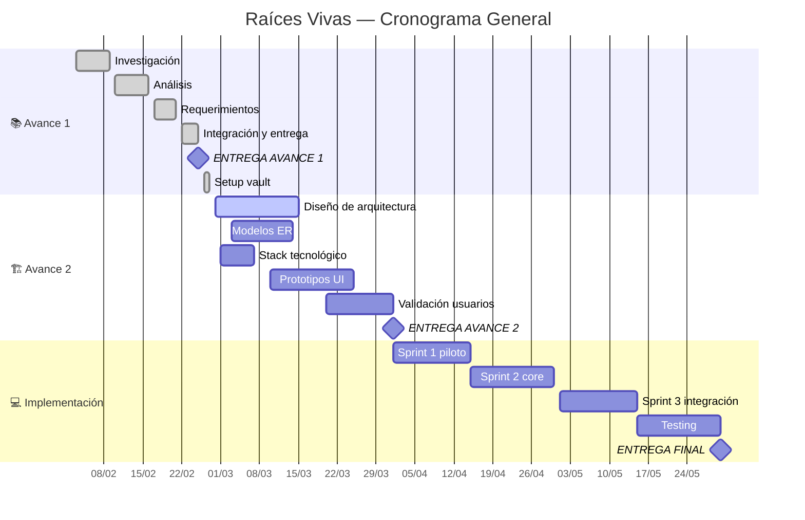

# 🎛️ Raíces Vivas — Centro de Control

> **Sistema Integral de Apoyo a Comunidades Indígenas**
> 🌿 Equipo: **Geovanny** · **Elkin** · **Santiago**

---

## 📊 Indicadores Clave

=== start-multi-column: kpi-panel
```column-settings
number of columns: 4
border: off
shadow: off
```

> [!abstract]+ 🎯 Progreso
> ```dataviewjs
> const tasks = dv.pages('"05-Sprints"').where(t => t.type === "task");
> const done = tasks.where(t => t.status === "done").length;
> const total = tasks.length;
> const pct = total > 0 ? Math.round((done/total)*100) : 0;
> const bar = "█".repeat(Math.round(pct/5)) + "░".repeat(20 - Math.round(pct/5));
> dv.paragraph(`## ${pct}%`);
> dv.paragraph(`\`${bar}\` ${done}/${total}`);
> ```

=== end-column ===

> [!tip]+ ✅ Sprint Actual
> ```dataviewjs
> const tasks = dv.pages('"05-Sprints/Sprint-01"').where(t => t.type === "task");
> const done = tasks.where(t => t.status === "done").length;
> const total = tasks.length;
> dv.paragraph(`**${done}/${total}** completadas`);
> dv.paragraph(`Sprint-01 · Avance 1`);
> ```

=== end-column ===

> [!info]+ 📋 Requerimientos
> ```dataviewjs
> const rf = dv.pages('"03-Requerimientos/Funcionales"').where(r => r.type === "requirement/functional").length;
> const rnf = dv.pages('"03-Requerimientos/No Funcionales"').where(r => r.type === "requirement/non-functional").length;
> dv.paragraph(`**${rf}** RF · **${rnf}** RNF`);
> dv.paragraph(`**${rf + rnf}** total`);
> ```

=== end-column ===

> [!warning]+ ⚠️ Riesgos
> ```dataviewjs
> const risks = dv.pages('"01-Proyecto/Riesgos"').where(r => r.type === "risk" && r.status === "open");
> dv.paragraph(risks.length > 0 ? `**${risks.length}** abierto(s)` : `✅ Bajo control`);
> ```

=== end-multi-column

---

## 🚀 Acciones Rápidas

=== start-multi-column: quick-actions
```column-settings
number of columns: 4
border: off
shadow: off
```

```button
name ➕ Nueva Tarea
type command
action QuickAdd: Run QuickAdd
color blue
```

=== end-column ===

```button
name 📝 Nueva Minuta
type command
action QuickAdd: Run QuickAdd
color green
```

=== end-column ===

```button
name ⚠️ Nuevo Riesgo
type command
action QuickAdd: Run QuickAdd
color yellow
```

=== end-column ===

```button
name 📐 Nuevo ADR
type command
action QuickAdd: Run QuickAdd
color purple
```

=== end-multi-column

=== start-multi-column: quick-actions-row2
```column-settings
number of columns: 4
border: off
shadow: off
```

```button
name 📋 Nuevo RF
type command
action QuickAdd: Run QuickAdd
color cyan
```

=== end-column ===

```button
name 🔒 Nuevo RNF
type command
action QuickAdd: Run QuickAdd
color cyan
```

=== end-column ===

```button
name 🎤 Entrevista
type command
action QuickAdd: Run QuickAdd
color orange
```

=== end-column ===

```button
name 📦 Backlog
type link
action [[05-Sprints/Backlog]]
color default
```

=== end-multi-column

---

## 🗺️ Navegación del Proyecto

=== start-multi-column: nav-panel
```column-settings
number of columns: 3
border: off
shadow: off
```

### 📁 Gobierno
- 👥 [[01-Proyecto/Equipo|Equipo]]
- 📜 [[01-Proyecto/Charter|Charter]]
- 🎯 [[01-Proyecto/Alcance|Alcance]]
- 👤 [[01-Proyecto/Stakeholders|Stakeholders]]
- 📖 [[01-Proyecto/Glosario|Glosario]]
- 📋 [[01-Proyecto/Plan de Gestión|Plan de Gestión]]
- 📕 [[01-Proyecto/Guía de Workflow|Guía de Workflow]]

=== end-column ===

### 📐 Técnico
- 📐 [[03-Requerimientos/_RTM|RTM]]
- 🏗️ [[04-Arquitectura/WBS|WBS]]
- 🏗️ [[04-Arquitectura/Visión General|Arquitectura]]
- 🏗️ [[04-Arquitectura/Modelo de Datos|Modelo de Datos]]
- 💻 [[04-Arquitectura/Stack Tecnológico|Stack]]
- 📊 [[00-Dashboard/Roadmap|Roadmap / Gantt]]
- 📈 [[00-Dashboard/Métricas|Métricas]]

=== end-column ===

### 🔬 Investigación
- 🔍 [[02-Investigación/Contexto/Educación|Contexto EDU]]
- 🔍 [[02-Investigación/Contexto/Saberes Ancestrales|Contexto SAB]]
- 🔍 [[02-Investigación/Contexto/Salud Comunitaria|Contexto SAL]]
- 📄 [[06-Entregables/Avance-1/Raíces Vivas – Sistema Integral de Apoyo a Comunidades Indígenas|Avance 1]]
- 📦 [[05-Sprints/Sprint-01/Sprint-01-Planning|Sprint 01]]
- 📦 [[05-Sprints/Sprint-02/Sprint-02-Planning|Sprint 02]]

=== end-multi-column

---

## 📅 Timeline del Proyecto



---

## 🏃 Tareas Pendientes

```dataview
TABLE WITHOUT ID
  id as "ID",
  title as "Tarea",
  assignee as "👤",
  status as "Estado",
  priority as "Prioridad",
  due as "📅 Límite"
FROM "05-Sprints"
WHERE type = "task" AND status != "done"
SORT priority ASC, due ASC
```

---

## 👤 Carga por Integrante

```dataview
TABLE WITHOUT ID
  assignee as "Responsable",
  length(rows) as "Total",
  length(filter(rows, (r) => r.status = "done")) as "✅",
  length(filter(rows, (r) => r.status = "todo" OR r.status = "in-progress")) as "🔄"
FROM "05-Sprints"
WHERE type = "task"
GROUP BY assignee
SORT assignee ASC
```

---

> [!note]- 📋 Estado de Requerimientos por Módulo (expandir)
>
> ### Funcionales
>
> ```dataview
> TABLE WITHOUT ID
>   module as "Módulo",
>   length(rows) as "Total RF",
>   length(filter(rows, (r) => r.priority = "must")) as "Must",
>   length(filter(rows, (r) => r.priority = "should")) as "Should",
>   length(filter(rows, (r) => r.priority = "could")) as "Could"
> FROM "03-Requerimientos/Funcionales"
> WHERE type = "requirement/functional"
> GROUP BY module
> ```
>
> ### No Funcionales
>
> ```dataview
> TABLE WITHOUT ID
>   id as "ID",
>   title as "Requisito",
>   category as "Categoría",
>   priority as "MoSCoW",
>   status as "Estado"
> FROM "03-Requerimientos/No Funcionales"
> WHERE type = "requirement/non-functional"
> SORT priority ASC
> ```

---

> [!note]- 📈 Progreso por Fase (expandir)
>
> ```dataviewjs
> const tasks = dv.pages('"05-Sprints"').where(t => t.type === "task");
> const phases = {};
> for (const t of tasks) {
>   const p = t.phase || "sin fase";
>   if (!phases[p]) phases[p] = {total: 0, done: 0};
>   phases[p].total++;
>   if (t.status === "done") phases[p].done++;
> }
> const headers = ["Fase", "Total", "Done", "Progreso"];
> const rows = [];
> for (const [phase, data] of Object.entries(phases).sort()) {
>   const pct = Math.round((data.done / data.total) * 100);
>   const bar = "█".repeat(Math.round(pct/10)) + "░".repeat(10 - Math.round(pct/10));
>   rows.push([phase, data.total, data.done, `${bar} ${pct}%`]);
> }
> dv.table(headers, rows);
> ```

---

> [!note]- 📈 Esfuerzo por Responsable (expandir)
>
> ```dataviewjs
> const tasks = dv.pages('"05-Sprints"').where(t => t.type === "task" && t.effort);
> const people = {};
> for (const t of tasks) {
>   const a = t.assignee || "Sin asignar";
>   const hours = parseInt(String(t.effort)) || 0;
>   if (!people[a]) people[a] = {total: 0, done: 0};
>   people[a].total += hours;
>   if (t.status === "done") people[a].done += hours;
> }
> const headers = ["Responsable", "Horas Total", "Horas Done", "Pendiente"];
> const rows = [];
> for (const [person, data] of Object.entries(people).sort()) {
>   rows.push([person, `${data.total}h`, `${data.done}h`, `${data.total - data.done}h`]);
> }
> dv.table(headers, rows);
> ```

---

## ⚠️ Riesgos

```dataview
TABLE WITHOUT ID
  id as "ID",
  title as "Riesgo",
  probability as "Prob.",
  impact as "Impacto",
  owner as "Responsable",
  status as "Estado"
FROM "01-Proyecto/Riesgos"
WHERE type = "risk"
SORT impact DESC
```

> *Si la tabla está vacía, no hay riesgos registrados. Usa el botón ⚠️ Nuevo Riesgo.*

---

> [!note]- 📆 Próximas Fechas Límite (expandir)
>
> ```dataview
> TABLE WITHOUT ID
>   title as "Tarea / Entregable",
>   assignee as "👤",
>   due as "Fecha",
>   status as "Estado"
> FROM ""
> WHERE due AND status != "done" AND due >= date(today)
> SORT due ASC
> LIMIT 10
> ```

---

> [!note]- 📝 Últimas Reuniones (expandir)
>
> ```dataview
> TABLE WITHOUT ID
>   title as "Reunión",
>   date as "Fecha",
>   attendees as "Asistentes"
> FROM "07-Reuniones"
> WHERE type = "meeting"
> SORT date DESC
> LIMIT 5
> ```
>
> *Usa el botón 📝 Nueva Minuta para documentar reuniones.*

---

## 🔗 Vistas Transcluidas

### RTM — Matriz de Trazabilidad

![[03-Requerimientos/_RTM#Matriz Dinámica]]

### Sprint Actual — Distribución

![[05-Sprints/Sprint-01/Sprint-01-Planning#Distribución por Responsable]]

---

## 📊 Milestones

| # | Milestone | Fecha | Estado |
|---|-----------|-------|--------|
| M1 | ✅ Avance 1 — Análisis y Requerimientos | 2026-02-25 | ✅ Entregado |
| M2 | 🏗️ Avance 2 — Diseño y Arquitectura | 2026-04-01 | 🔄 En progreso |
| M3 | 💻 Entrega Final — Implementación | 2026-05-30 | ⏳ Pendiente |

---

*Dashboard dinámico · Banners + Buttons + Multi-Column + Dataview + Mermaid*
*Última configuración: 2026-02-27*
