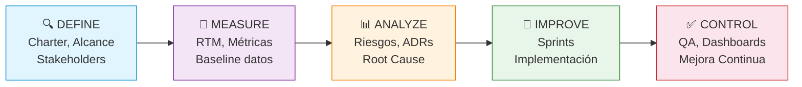

# 📈 Métricas de Avance — Raíces Vivas

> **Framework de Calidad:** Lean Six Sigma (DMAIC) · Métricas de proceso y colaboración
> Ver detalle financiero en [[01-Proyecto/Finanzas|Gestión Financiera]]

## 1. Resumen Ejecutivo

```dataviewjs
const allTasks = dv.pages('"05-Sprints"').where(t => t.type === "task" || t.type === "subtask");
const done = allTasks.where(t => t.status === "done").length;
const total = allTasks.length;
const pct = total > 0 ? Math.round((done/total)*100) : 0;
const inProgress = allTasks.where(t => t.status === "in-progress").length;
const blocked = allTasks.where(t => t.status === "blocked").length;

const rf = dv.pages('"03-Requerimientos/Funcionales"').where(r => r.type === "requirement/functional").length;
const rnf = dv.pages('"03-Requerimientos/No Funcionales"').where(r => r.type === "requirement/non-functional").length;

const risks = dv.pages('"01-Proyecto/Riesgos"').where(r => r.type === "risk");
const openRisks = risks.where(r => r.status === "open").length;

const adrs = dv.pages('"01-Proyecto/Decisiones"').where(d => d.type === "adr");
const acceptedAdrs = adrs.where(d => d.status === "accepted").length;

dv.table(
  ["📊 Métrica", "Valor", "Indicador"],
  [
    ["Progreso general", `${pct}% (${done}/${total} tareas)`, pct >= 80 ? "🟢" : pct >= 50 ? "🟡" : "🔴"],
    ["Tareas en progreso", `${inProgress}`, inProgress <= 5 ? "🟢" : "🟡"],
    ["Tareas bloqueadas", `${blocked}`, blocked === 0 ? "🟢" : "🔴"],
    ["Requerimientos funcionales", `${rf}`, "📋"],
    ["Requerimientos no funcionales", `${rnf}`, "🔒"],
    ["Total requerimientos", `${rf + rnf}`, "📦"],
    ["Riesgos abiertos", `${openRisks} / ${risks.length}`, openRisks <= 3 ? "🟢" : "🟡"],
    ["Decisiones aceptadas", `${acceptedAdrs} / ${adrs.length}`, "🏗️"],
  ]
);

// Sprint actual — dinámico
const sprintPages = dv.pages('"05-Sprints"').where(t => (t.type === "task" || t.type === "subtask") && t.sprint);
const sprintGroups = {};
for (const t of sprintPages) {
  const s = String(t.sprint);
  if (!sprintGroups[s]) sprintGroups[s] = { active: 0, total: 0 };
  sprintGroups[s].total++;
  if (t.status !== "done") sprintGroups[s].active++;
}
const sortedSprints = Object.entries(sprintGroups).sort((a, b) => a[0].localeCompare(b[0]));
let currentSprint = sortedSprints.length ? sortedSprints[sortedSprints.length - 1][0] : "N/A";
let label = "";
for (const [name, data] of sortedSprints) {
  if (data.active > 0) { currentSprint = name; label = "en curso"; break; }
  label = "completado";
}
dv.paragraph(`> **🏃 Sprint actual:** ${currentSprint} (${label})`);
```

---

## 2. Distribución de Tareas por Estado (Gráfico)

```chart
type: doughnut
labels: [Done, In Progress, Todo, Review, Blocked]
series:
  - title: Estado de Tareas
    data: [31, 0, 0, 0, 0]
width: 50%
labelColors: true
```

> *Gráfico de referencia actualizado al cierre de Sprint-02 (2026-03-26). La tabla dinámica abajo siempre está actualizada.*

```dataviewjs
const tasks = dv.pages('"05-Sprints"').where(t => t.type === "task" || t.type === "subtask");
const statuses = {};
for (const t of tasks) {
  const s = t.status || "desconocido";
  statuses[s] = (statuses[s] || 0) + 1;
}
const icons = {"done": "✅", "todo": "📋", "in-progress": "🔄", "review": "👀", "blocked": "🚫"};
const headers = ["Estado", "Cantidad", "Porcentaje", "Barra Visual"];
const total = tasks.length;
const rows = [];
for (const [status, count] of Object.entries(statuses).sort()) {
  const icon = icons[status] || "❓";
  const pct = Math.round((count/total)*100);
  const bar = "█".repeat(Math.round(pct/5)) + "░".repeat(20 - Math.round(pct/5));
  rows.push([`${icon} ${status}`, count, `${pct}%`, bar]);
}
dv.table(headers, rows);
```

---

## 3. Colaboración del Equipo — Porcentaje de Participación

### 3.1 Distribución de Tareas (Pie Chart)

```chart
type: pie
labels: [Geovanny, Elkin, Santiago, Equipo]
series:
  - title: Tareas Asignadas
    data: [11, 8, 8, 4]
width: 50%
labelColors: true
```

### 3.2 Horas por Integrante (Bar Chart)

```chart
type: bar
labels: [Geovanny, Elkin, Santiago]
series:
  - title: Horas Planificadas
    data: [60, 48, 48]
  - title: Horas Completadas
    data: [61, 49, 49]
width: 70%
labelColors: true
fill: true
beginAtZero: true
```

> *Actualizado al cierre de Sprint-02 (2026-03-26). La tabla dinámica abajo siempre está actualizada.*

### 3.3 Detalle Dinámico por Responsable

```dataviewjs
const tasks = dv.pages('"05-Sprints"').where(t => t.type === "task" || t.type === "subtask");
const people = {};
const totalTasks = tasks.length;
for (const t of tasks) {
  const a = t.assignee || "Sin asignar";
  if (!people[a]) people[a] = {total: 0, done: 0, inProgress: 0, todo: 0, estH: 0, actH: 0, doneEstH: 0, doneActH: 0};
  people[a].total++;
  const est = ((v) => { if (!v) return 0; if (typeof v === "number") return v; const m = String(v).match(/\d+/); return m ? parseInt(m[0]) : 0; })(t.effort);
  const act = t.effort_actual ? (((v) => { if (!v) return 0; if (typeof v === "number") return v; const m = String(v).match(/\d+/); return m ? parseInt(m[0]) : 0; })(t.effort_actual)) : 0;
  const real = act || est;
  people[a].estH += est;
  people[a].actH += real;
  if (t.status === "done") { people[a].done++; people[a].doneEstH += est; people[a].doneActH += real; }
  else if (t.status === "in-progress") people[a].inProgress++;
  else people[a].todo++;
}
const headers = ["👤 Integrante", "Asignadas", "✅ Done", "🔄 Curso", "📋 Pend.", "% Colaboración", "⏱️ Est.", "⏱️ Real", "% Eficiencia"];
const rows = [];
for (const [person, d] of Object.entries(people).sort()) {
  const pctColab = totalTasks > 0 ? Math.round((d.total / totalTasks) * 100) : 0;
  const pctEfic = d.total > 0 ? Math.round((d.done / d.total) * 100) : 0;
  const bar = "█".repeat(Math.round(pctColab / 5)) + "░".repeat(20 - Math.round(pctColab / 5));
  rows.push([
    person, d.total, d.done, d.inProgress, d.todo,
    `${bar} ${pctColab}%`,
    `${d.estH}h`,
    `${d.actH}h`,
    `${pctEfic}%`
  ]);
}
dv.table(headers, rows);
```

---

## 4. Tareas por Fase

```dataviewjs
const tasks = dv.pages('"05-Sprints"').where(t => t.type === "task" || t.type === "subtask");
const phases = {};
for (const t of tasks) {
  const p = t.phase || "sin fase";
  if (!phases[p]) phases[p] = {total: 0, done: 0};
  phases[p].total++;
  if (t.status === "done") phases[p].done++;
}
const order = ["investigación", "análisis", "requerimientos", "integración", "gestión", "diseño", "implementación", "testing"];
const headers = ["📍 Fase", "Total", "Done", "% Completado", "Barra"];
const rows = [];
const sorted = Object.entries(phases).sort((a,b) => order.indexOf(a[0]) - order.indexOf(b[0]));
for (const [phase, data] of sorted) {
  const pct = Math.round((data.done / data.total) * 100);
  const bar = "█".repeat(Math.round(pct/5)) + "░".repeat(20 - Math.round(pct/5));
  rows.push([phase, data.total, data.done, `${pct}%`, bar]);
}
dv.table(headers, rows);
```

---

## 5. Tareas por Módulo

```dataviewjs
const tasks = dv.pages('"05-Sprints"').where(t => t.type === "task" || t.type === "subtask");
const modules = {};
for (const t of tasks) {
  const m = t.module || "sin módulo";
  if (!modules[m]) modules[m] = {total: 0, done: 0};
  modules[m].total++;
  if (t.status === "done") modules[m].done++;
}
const headers = ["🧩 Módulo", "Tareas", "Done", "Pendiente", "% Completado"];
const rows = [];
for (const [mod, data] of Object.entries(modules).sort()) {
  const pct = Math.round((data.done / data.total) * 100);
  rows.push([mod, data.total, data.done, data.total - data.done, `${pct}%`]);
}
dv.table(headers, rows);
```

---

## 6. Requerimientos

### 6.1 Por Módulo

```dataview
TABLE WITHOUT ID
  module as "Módulo",
  length(rows) as "Total RF",
  length(filter(rows, (r) => r.priority = "must")) as "Must",
  length(filter(rows, (r) => r.priority = "should")) as "Should",
  length(filter(rows, (r) => r.priority = "could")) as "Could"
FROM "03-Requerimientos/Funcionales"
WHERE type = "requirement/functional"
GROUP BY module
```

### 6.2 Por Prioridad (MoSCoW)

```dataview
TABLE WITHOUT ID
  priority as "Prioridad",
  length(rows) as "Cantidad"
FROM "03-Requerimientos"
WHERE type = "requirement/functional" OR type = "requirement/non-functional"
GROUP BY priority
SORT priority ASC
```

---

## 7. Métricas Lean Six Sigma (DMAIC)

> **Framework:** Las métricas están alineadas con el ciclo DMAIC (Define, Measure, Analyze, Improve, Control) de Lean Six Sigma para gestión de calidad y mejora continua.

### 7.1 Indicadores de Proceso

```dataviewjs
const tasks = dv.pages('"05-Sprints"').where(t => t.type === "task" || t.type === "subtask");
const total = tasks.length;
const done = tasks.where(t => t.status === "done").length;
const blocked = tasks.where(t => t.status === "blocked").length;
const review = tasks.where(t => t.status === "review").length;
const inProgress = tasks.where(t => t.status === "in-progress").length;

// ── Lean Six Sigma Metrics ──
const throughput = done; // Tareas completadas (output)
const wip = inProgress; // Work In Progress
const defectRate = total > 0 ? ((blocked / total) * 100).toFixed(1) : 0; // % bloqueadas
const firstPassYield = total > 0 ? (((done) / total) * 100).toFixed(1) : 0; // % completadas sin retrabajo
const reworkRate = total > 0 ? ((review / total) * 100).toFixed(1) : 0; // % en revisión

// Cycle time estimado (promedio horas por tarea completada)
const doneTasks = tasks.where(t => t.status === "done" && t.effort);
let totalEffort = 0;
for (const t of doneTasks) totalEffort += t.effort_actual ? (((v) => { if (!v) return 0; if (typeof v === "number") return v; const m = String(v).match(/\d+/); return m ? parseInt(m[0]) : 0; })(t.effort_actual)) : (((v) => { if (!v) return 0; if (typeof v === "number") return v; const m = String(v).match(/\d+/); return m ? parseInt(m[0]) : 0; })(t.effort));
const avgCycleTime = doneTasks.length > 0 ? (totalEffort / doneTasks.length).toFixed(1) : "N/A";

dv.table(
  ["📏 Métrica LSS", "Valor", "Meta", "Semáforo", "Descripción"],
  [
    ["**Throughput**", `${throughput} tareas`, "≥ 80% por sprint", throughput >= total * 0.8 ? "🟢" : throughput >= total * 0.5 ? "🟡" : "🔴", "Tareas completadas (salida del proceso)"],
    ["**WIP (Work In Progress)**", `${wip} tareas`, "≤ 5", wip <= 5 ? "🟢" : wip <= 8 ? "🟡" : "🔴", "Tareas simultáneamente en curso (limitar para flujo)"],
    ["**Defect Rate**", `${defectRate}%`, "< 5%", parseFloat(defectRate) < 5 ? "🟢" : parseFloat(defectRate) < 10 ? "🟡" : "🔴", "% de tareas bloqueadas/defectuosas"],
    ["**First Pass Yield (FPY)**", `${firstPassYield}%`, "> 90%", parseFloat(firstPassYield) > 90 ? "🟢" : parseFloat(firstPassYield) > 70 ? "🟡" : "🔴", "% completadas sin retrabajo"],
    ["**Rework Rate**", `${reworkRate}%`, "< 10%", parseFloat(reworkRate) < 10 ? "🟢" : parseFloat(reworkRate) < 20 ? "🟡" : "🔴", "% de tareas que requieren revisión/retrabajo"],
    ["**Cycle Time (promedio)**", `${avgCycleTime}h`, "< 4h", avgCycleTime !== "N/A" && parseFloat(avgCycleTime) < 4 ? "🟢" : "🟡", "Horas promedio por tarea completada"],
  ]
);
```

### 7.2 Tablero de Calidad (Quality Scorecard)

```dataviewjs
const tasks = dv.pages('"05-Sprints"').where(t => t.type === "task" || t.type === "subtask");
const total = tasks.length;
const done = tasks.where(t => t.status === "done").length;
const blocked = tasks.where(t => t.status === "blocked").length;

// Process Capability
const sigma = total > 0 ? ((1 - blocked / total) * 100).toFixed(2) : 100;
let sigmaLevel = "< 3σ";
if (parseFloat(sigma) >= 99.9997) sigmaLevel = "6σ";
else if (parseFloat(sigma) >= 99.98) sigmaLevel = "5σ";
else if (parseFloat(sigma) >= 99.4) sigmaLevel = "4σ";
else if (parseFloat(sigma) >= 93.3) sigmaLevel = "3σ";
else if (parseFloat(sigma) >= 69.1) sigmaLevel = "2σ";
else sigmaLevel = "1σ";

// Schedule Variance
const sprintTasks = dv.pages('"05-Sprints/Sprint-01"').where(t => t.type === "task" || t.type === "subtask");
const sprintTotal = sprintTasks.length;
const sprintDone = sprintTasks.where(t => t.status === "done").length;
const sv = sprintTotal > 0 ? (((sprintDone / sprintTotal) - 1) * 100).toFixed(1) : 0;

dv.table(
  ["📊 Indicador", "Valor", "Interpretación"],
  [
    ["Yield del Proceso", `${sigma}%`, `Nivel Sigma: **${sigmaLevel}**`],
    ["Schedule Variance (SV)", `${sv}%`, parseFloat(sv) >= 0 ? "✅ Adelantado o a tiempo" : "⚠️ Retrasado"],
    ["Tareas sin defecto", `${total - blocked} / ${total}`, `${blocked} bloqueada(s)`],
    ["Ratio Done/Total", `${done}/${total}`, `${total > 0 ? Math.round((done/total)*100) : 0}%`],
  ]
);
```

### 7.3 Vista DMAIC del Proyecto



| Fase DMAIC | Estado | Actividades del Proyecto |
|-----------|--------|--------------------------|
| **Define** | ✅ Completada | Charter, Alcance, Stakeholders, Equipo definidos |
| **Measure** | ✅ Completada | RTM, métricas baseline, requerimientos priorizados |
| **Analyze** | 🔄 En curso | Riesgos identificados (RSK-001..006), ADRs (ADR-001..006) |
| **Improve** | ⏳ Pendiente | Sprints de implementación (Avance 2+) |
| **Control** | 🔄 Continuo | Dashboards, QA checks, Linter, RTM dinámica |

---

## 8. Velocidad por Sprint

### 8.1 Velocidad (Line Chart)

```chart
type: line
labels: [Sprint-01, Sprint-02, Sprint-03, Sprint-04, Sprint-05]
series:
  - title: Planificadas
    data: [20, 5, 0, 0, 0]
  - title: Completadas
    data: [15, 0, 0, 0, 0]
width: 80%
labelColors: true
fill: false
beginAtZero: true
tension: 0.3
```

### 8.2 Detalle Dinámico

```dataviewjs
const tasks = dv.pages('"05-Sprints"').where(t => (t.type === "task" || t.type === "subtask") && t.sprint);
const sprints = {};
for (const t of tasks) {
  const s = String(t.sprint);
  if (!sprints[s]) sprints[s] = { planned: 0, done: 0, points: 0, donePoints: 0 };
  sprints[s].planned++;
  const estPts = ((v) => { if (!v) return 1; if (typeof v === "number") return v; const m = String(v).match(/\d+/); return m ? parseInt(m[0]) : 1; })(t.effort);
  const actPts = t.effort_actual ? (((v) => { if (!v) return 0; if (typeof v === "number") return v; const m = String(v).match(/\d+/); return m ? parseInt(m[0]) : 0; })(t.effort_actual)) : 0;
  const pts = actPts || estPts;
  sprints[s].points += estPts;
  if (t.status === "done") {
    sprints[s].done++;
    sprints[s].donePoints += pts;
  }
}
const headers = ["Sprint", "Planificadas", "Completadas", "% Completado", "Story Points (plan/done)", "Velocidad"];
const rows = Object.entries(sprints)
  .sort((a, b) => a[0].localeCompare(b[0]))
  .map(([name, d]) => {
    const pct = d.planned > 0 ? Math.round((d.done / d.planned) * 100) : 0;
    const bar = "█".repeat(Math.round(pct/5)) + "░".repeat(20 - Math.round(pct/5));
    return [name, d.planned, d.done, `${bar} ${pct}%`, `${d.points} / ${d.donePoints}`, `${d.donePoints} pts`];
  });
dv.table(headers, rows);
```

---

## 9. Timeline de Completación (Burndown)

> [!note]- 📈 Burndown Sprint 01 (expandir)
>
> ```dataviewjs
> const tasks = dv.pages('"05-Sprints/Sprint-01"').where(t => (t.type === "task" || t.type === "subtask") && t.completed);
> const byDate = {};
> for (const t of tasks) {
>   const d = t.completed.toString().slice(0, 10);
>   byDate[d] = (byDate[d] || 0) + 1;
> }
> const sorted = Object.entries(byDate).sort();
> let cumulative = 0;
> const headers = ["Fecha", "Completadas ese día", "Acumulado"];
> const rows = [];
> for (const [date, count] of sorted) {
>   cumulative += count;
>   rows.push([date, count, cumulative]);
> }
> if (rows.length === 0) dv.paragraph("*No hay tareas con fecha `completed:` aún.*");
> else dv.table(headers, rows);
> ```

---

## 10. Cobertura de Validación

> [!note]- 📋 Cobertura completa de validación (expandir)
>
> ```dataview
> TABLE WITHOUT ID
>   id as "ID",
>   title as "Requerimiento",
>   validation as "Validación",
>   status as "Estado"
> FROM "03-Requerimientos"
> WHERE (type = "requirement/functional" OR type = "requirement/non-functional")
> SORT id ASC
> ```

---

## 11. Gestión de Riesgos — Resumen

```dataviewjs
const risks = dv.pages('"01-Proyecto/Riesgos"').where(r => r.type === "risk");
const headers = ["ID", "Riesgo", "Prob.", "Impacto", "Severidad", "Estado", "Responsable"];
const rows = [];
for (const r of risks.sort(r => r.severity, "desc")) {
  const sev = String(r.severity).toLowerCase();
  const sevIcon = (sev === "crítico" || sev === "critico") ? "🔴" : (sev === "alto") ? "🔴" : (sev === "medio") ? "🟠" : (sev === "bajo") ? "🟡" : "⚪";
  rows.push([r.id, r.title, r.probability, r.impact, `${sevIcon} ${r.severity}`, r.status, r.owner]);
}
dv.table(headers, rows);
```

```chart
type: polarArea
labels: [RSK-001, RSK-002, RSK-003, RSK-004, RSK-005, RSK-006]
series:
  - title: Severidad
    data: [12, 6, 9, 4, 6, 8]
width: 50%
labelColors: true
```

---

## 12. Resumen Financiero

```dataviewjs
const tarifas = { "Geovanny": 13910, "Elkin": 13910, "Santiago": 13910 };
const tasks = dv.pages('"05-Sprints"').where(t => (t.type === "task" || t.type === "subtask") && t.effort);
const costos = {};
for (const t of tasks) {
  const person = t.assignee || "Sin asignar";
  const est = ((v) => { if (!v) return 0; if (typeof v === "number") return v; const m = String(v).match(/\d+/); return m ? parseInt(m[0]) : 0; })(t.effort);
  const act = t.effort_actual ? (((v) => { if (!v) return 0; if (typeof v === "number") return v; const m = String(v).match(/\d+/); return m ? parseInt(m[0]) : 0; })(t.effort_actual)) : 0;
  const hours = act || est;
  const tarifa = tarifas[person] || 5000;
  if (!costos[person]) costos[person] = { estH: 0, actH: 0, estCost: 0, actCost: 0 };
  costos[person].estH += est;
  costos[person].actH += hours;
  costos[person].estCost += est * tarifa;
  costos[person].actCost += hours * tarifa;
}
let grandEst = 0, grandAct = 0;
const headers = ["👤 Integrante", "H. Est.", "H. Real", "Tarifa (₡/h)", "Costo Est. (₡)", "Costo Real (₡)", "Real (USD)"];
const rows = [];
for (const [person, data] of Object.entries(costos).sort()) {
  const tarifa = tarifas[person] || 5000;
  grandEst += data.estCost;
  grandAct += data.actCost;
  rows.push([person, `${data.estH}h`, `${data.actH}h`, `₡${tarifa.toLocaleString()}`, `₡${data.estCost.toLocaleString()}`, `₡${data.actCost.toLocaleString()}`, `$${Math.round(data.actCost / 535).toLocaleString()}`]);
}
rows.push(["**TOTAL**", "", "", "", `**₡${grandEst.toLocaleString()}**`, `**₡${grandAct.toLocaleString()}**`, `**$${Math.round(grandAct/535).toLocaleString()}**`]);
dv.table(headers, rows);
dv.paragraph(`> 💰 Ver detalle completo: [[01-Proyecto/Finanzas|Gestión Financiera del Proyecto]]`);
```

```chart
type: bar
labels: [Geovanny, Elkin, Santiago]
series:
  - title: Costo (miles ₡)
    data: [337, 168, 168]
width: 60%
labelColors: true
fill: true
beginAtZero: true
```

---

## 13. Glosario de Métricas

| Métrica | Definición | Fórmula |
|---------|-----------|---------|
| **Throughput** | Número de tareas completadas en un período | `count(status = "done")` |
| **WIP** | Trabajo en progreso simultáneo | `count(status = "in-progress")` |
| **Defect Rate** | % de tareas bloqueadas o con errores | `(blocked / total) × 100` |
| **First Pass Yield** | % tareas completadas sin retrabajo | `(done / total) × 100` |
| **Rework Rate** | % tareas que requieren revisión | `(review / total) × 100` |
| **Cycle Time** | Tiempo promedio para completar una tarea | `Σ effort(done) / count(done)` |
| **Velocity** | Story points completados por sprint | `Σ effort(done, sprint)` |
| **Schedule Variance** | Desviación vs. planificación | `((done/planned) - 1) × 100` |
| **Sigma Level** | Nivel de capacidad del proceso | Basado en yield % |

---

*Métricas dinámicas · Dataview JS + Charts + Lean Six Sigma + Jira Sync · Última actualización: 2026-03-05*
