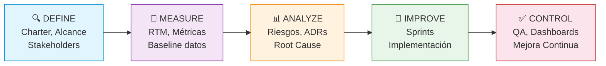

# 📈 Métricas de Avance — Raíces Vivas

> **Framework de Calidad:** Lean Six Sigma (DMAIC) · Métricas de proceso y colaboración
> Ver detalle financiero en [[01-Proyecto/Finanzas|Gestión Financiera]]

## 1. Resumen Ejecutivo

```sqlseal
SELECT
  ROUND(100.0 * SUM(CASE WHEN (type='task' OR type='subtask') AND path LIKE '05-Sprints%' AND status='done' THEN 1 ELSE 0 END) / MAX(1, SUM(CASE WHEN (type='task' OR type='subtask') AND path LIKE '05-Sprints%' THEN 1 ELSE 0 END))) || '% (' || SUM(CASE WHEN (type='task' OR type='subtask') AND path LIKE '05-Sprints%' AND status='done' THEN 1 ELSE 0 END) || '/' || SUM(CASE WHEN (type='task' OR type='subtask') AND path LIKE '05-Sprints%' THEN 1 ELSE 0 END) || ')' as "🎯 Progreso",
  SUM(CASE WHEN (type='task' OR type='subtask') AND path LIKE '05-Sprints%' AND status='in-progress' THEN 1 ELSE 0 END) as "🔄 En curso",
  SUM(CASE WHEN (type='task' OR type='subtask') AND path LIKE '05-Sprints%' AND status='blocked' THEN 1 ELSE 0 END) as "🚫 Bloq.",
  SUM(CASE WHEN type='requirement/functional' THEN 1 ELSE 0 END) || ' RF · ' || SUM(CASE WHEN type='requirement/non-functional' THEN 1 ELSE 0 END) || ' RNF' as "📋 Reqs",
  SUM(CASE WHEN type='risk' AND status='open' THEN 1 ELSE 0 END) || ' / ' || SUM(CASE WHEN type='risk' THEN 1 ELSE 0 END) as "⚠️ Riesgos",
  SUM(CASE WHEN type='adr' AND status='accepted' THEN 1 ELSE 0 END) || ' / ' || SUM(CASE WHEN type='adr' THEN 1 ELSE 0 END) as "🏗️ ADR"
FROM files
```

---

## 2. Distribución de Tareas por Estado (Gráfico)

```chart
type: doughnut
labels: [Done, In Progress, Todo, Review, Blocked]
series:
  - title: Estado de Tareas
    data: [20, 2, 20, 0, 0]
width: 50%
labelColors: true
```

> *Gráfico de referencia actualizado 2026-03-28. Sprint-01 completo (20/20). Sprint-02 en progreso (0/22 done, 2 in-progress, 20 todo). La tabla dinámica abajo siempre está actualizada.*

```sqlseal
SELECT
  CASE WHEN status = 'done' THEN '✅' WHEN status = 'todo' THEN '📋' WHEN status = 'in-progress' THEN '🔄' WHEN status = 'review' THEN '👀' WHEN status = 'blocked' THEN '🚫' ELSE '❓' END || ' ' || status as "Estado",
  COUNT(*) as "Cantidad",
  ROUND(100.0 * COUNT(*) / (SELECT COUNT(*) FROM files WHERE (type='task' OR type='subtask') AND path LIKE '05-Sprints%')) || '%' as "Porcentaje"
FROM files
WHERE (type = 'task' OR type = 'subtask') AND path LIKE '05-Sprints%'
GROUP BY status
ORDER BY status ASC
```

---

## 3. Colaboración del Equipo — Porcentaje de Participación

### 3.1 Distribución de Tareas (Pie Chart)

```chart
type: pie
labels: [Geovanny, Elkin, Santiago, Equipo]
series:
  - title: Tareas Asignadas
    data: [16, 11, 11, 4]
width: 50%
labelColors: true
```

> *Distribución total de tareas (Sprint-01 + Sprint-02). Actualizado 2026-03-28.*

### 3.2 Horas por Integrante (Bar Chart)

```chart
type: bar
labels: [Geovanny, Elkin, Santiago]
series:
  - title: Horas Planificadas
    data: [45, 27, 29]
  - title: Horas Completadas
    data: [51, 28, 29]
width: 70%
labelColors: true
fill: true
beginAtZero: true
```

> *Solo tareas con status=done. Sprint-01 completo. Sprint-02 aún en progreso. La tabla dinámica abajo siempre está actualizada. Actualizado 2026-03-28.*

### 3.3 Detalle Dinámico por Responsable

```sqlseal
SELECT
  COALESCE(assignee, 'Sin asignar') as "👤 Integrante",
  COUNT(*) as "Asignadas",
  SUM(CASE WHEN status = 'done' THEN 1 ELSE 0 END) as "✅ Done",
  SUM(CASE WHEN status = 'in-progress' THEN 1 ELSE 0 END) as "🔄 Curso",
  SUM(CASE WHEN status NOT IN ('done', 'in-progress') THEN 1 ELSE 0 END) as "📋 Pend.",
  ROUND(100.0 * COUNT(*) / (SELECT COUNT(*) FROM files WHERE (type='task' OR type='subtask') AND path LIKE '05-Sprints%')) || '%' as "% Colab.",
  SUM(CAST(REPLACE(effort, 'h', '') AS INTEGER)) || 'h' as "⏱️ Est.",
  SUM(CAST(REPLACE(COALESCE(effort_actual, effort), 'h', '') AS INTEGER)) || 'h' as "⏱️ Real",
  ROUND(100.0 * SUM(CASE WHEN status='done' THEN 1 ELSE 0 END) / MAX(1, COUNT(*))) || '%' as "% Efic."
FROM files
WHERE (type = 'task' OR type = 'subtask') AND path LIKE '05-Sprints%'
GROUP BY assignee
ORDER BY assignee ASC
```

---

## 4. Tareas por Fase

```sqlseal
SELECT
  COALESCE(phase, 'sin fase') as "📍 Fase",
  COUNT(*) as "Total",
  SUM(CASE WHEN status = 'done' THEN 1 ELSE 0 END) as "Done",
  ROUND(100.0 * SUM(CASE WHEN status='done' THEN 1 ELSE 0 END) / MAX(1, COUNT(*))) || '%' as "% Completado"
FROM files
WHERE (type = 'task' OR type = 'subtask') AND path LIKE '05-Sprints%'
GROUP BY phase
ORDER BY phase ASC
```

---

## 5. Tareas por Módulo

```sqlseal
SELECT
  COALESCE(module, 'sin módulo') as "🧩 Módulo",
  COUNT(*) as "Tareas",
  SUM(CASE WHEN status = 'done' THEN 1 ELSE 0 END) as "Done",
  COUNT(*) - SUM(CASE WHEN status = 'done' THEN 1 ELSE 0 END) as "Pendiente",
  ROUND(100.0 * SUM(CASE WHEN status='done' THEN 1 ELSE 0 END) / MAX(1, COUNT(*))) || '%' as "% Completado"
FROM files
WHERE (type = 'task' OR type = 'subtask') AND path LIKE '05-Sprints%'
GROUP BY module
ORDER BY module ASC
```

---

## 6. Requerimientos

### 6.1 Por Módulo

```sqlseal
SELECT
  module as "Módulo",
  COUNT(*) as "Total RF",
  SUM(CASE WHEN priority = 'must' THEN 1 ELSE 0 END) as "Must",
  SUM(CASE WHEN priority = 'should' THEN 1 ELSE 0 END) as "Should",
  SUM(CASE WHEN priority = 'could' THEN 1 ELSE 0 END) as "Could"
FROM files
WHERE type = 'requirement/functional' AND path LIKE '03-Requerimientos/Funcionales%'
GROUP BY module
```

### 6.2 Por Prioridad (MoSCoW)

```sqlseal
SELECT priority as "Prioridad", COUNT(*) as "Cantidad"
FROM files
WHERE (type = 'requirement/functional' OR type = 'requirement/non-functional') AND path LIKE '03-Requerimientos%'
GROUP BY priority
ORDER BY priority ASC
```

---

## 7. Métricas Lean Six Sigma (DMAIC)

> **Framework:** Las métricas están alineadas con el ciclo DMAIC (Define, Measure, Analyze, Improve, Control) de Lean Six Sigma para gestión de calidad y mejora continua.

### 7.1 Indicadores de Proceso

```sqlseal
SELECT
  SUM(CASE WHEN status='done' THEN 1 ELSE 0 END) as "📊 Throughput",
  SUM(CASE WHEN status='in-progress' THEN 1 ELSE 0 END) as "🔄 WIP",
  ROUND(100.0 * SUM(CASE WHEN status='blocked' THEN 1 ELSE 0 END) / MAX(1, COUNT(*)), 1) || '%' as "🚫 Defect Rate",
  ROUND(100.0 * SUM(CASE WHEN status='done' THEN 1 ELSE 0 END) / MAX(1, COUNT(*)), 1) || '%' as "✅ FPY",
  ROUND(100.0 * SUM(CASE WHEN status='review' THEN 1 ELSE 0 END) / MAX(1, COUNT(*)), 1) || '%' as "👀 Rework",
  CASE
    WHEN COUNT(*) > 0 AND SUM(CASE WHEN status='done' AND effort IS NOT NULL THEN 1 ELSE 0 END) > 0
    THEN ROUND(1.0 * SUM(CASE WHEN status='done' AND effort IS NOT NULL THEN CAST(REPLACE(COALESCE(effort_actual, effort), 'h', '') AS INTEGER) ELSE 0 END) / MAX(1, SUM(CASE WHEN status='done' AND effort IS NOT NULL THEN 1 ELSE 0 END)), 1) || 'h'
    ELSE 'N/A'
  END as "⏱️ Cycle Time"
FROM files
WHERE (type = 'task' OR type = 'subtask') AND path LIKE '05-Sprints%'
```

### 7.2 Tablero de Calidad (Quality Scorecard)

```sqlseal
SELECT
  ROUND(100.0 * (1.0 - 1.0 * SUM(CASE WHEN status='blocked' THEN 1 ELSE 0 END) / MAX(1, COUNT(*))), 2) || '%' as "🏭 Yield",
  CASE
    WHEN ROUND(100.0 * (1.0 - 1.0 * SUM(CASE WHEN status='blocked' THEN 1 ELSE 0 END) / MAX(1, COUNT(*))), 2) >= 99.4 THEN '≥ 4σ'
    WHEN ROUND(100.0 * (1.0 - 1.0 * SUM(CASE WHEN status='blocked' THEN 1 ELSE 0 END) / MAX(1, COUNT(*))), 2) >= 93.3 THEN '3σ'
    ELSE '< 3σ'
  END as "📏 Sigma",
  SUM(CASE WHEN status='done' THEN 1 ELSE 0 END) || ' / ' || COUNT(*) as "✅ Done/Total",
  ROUND(100.0 * SUM(CASE WHEN status='done' THEN 1 ELSE 0 END) / MAX(1, COUNT(*))) || '%' as "📊 Ratio",
  COUNT(*) - SUM(CASE WHEN status='blocked' THEN 1 ELSE 0 END) || ' / ' || COUNT(*) as "🛡️ Sin Defecto"
FROM files
WHERE (type = 'task' OR type = 'subtask') AND path LIKE '05-Sprints%'
```

### 7.3 Vista DMAIC del Proyecto



| Fase DMAIC | Estado | Actividades del Proyecto |
|-----------|--------|--------------------------|
| **Define** | ✅ Completada | Charter, Alcance, Stakeholders, Equipo definidos |
| **Measure** | ✅ Completada | RTM, métricas baseline, requerimientos priorizados |
| **Analyze** | 🔄 En curso | Riesgos identificados (RSK-001..006), ADRs (ADR-001..006) |
| **Improve** | 🔄 En curso | Sprints 1-2 completados · Sprint 3+ pendiente |
| **Control** | 🔄 Continuo | Dashboards, QA checks, Linter, RTM dinámica |

---

## 8. Velocidad por Sprint

### 8.1 Velocidad (Line Chart)

```chart
type: line
labels: [Sprint-01, Sprint-02, Sprint-03, Sprint-04, Sprint-05]
series:
  - title: Planificadas
    data: [20, 22, 0, 0, 0]
  - title: Completadas
    data: [20, 0, 0, 0, 0]
width: 80%
labelColors: true
fill: false
beginAtZero: true
tension: 0.3
```

### 8.2 Detalle Dinámico

```sqlseal
SELECT
  sprint as "Sprint",
  COUNT(*) as "Planificadas",
  SUM(CASE WHEN status = 'done' THEN 1 ELSE 0 END) as "Completadas",
  ROUND(100.0 * SUM(CASE WHEN status='done' THEN 1 ELSE 0 END) / MAX(1, COUNT(*))) || '%' as "% Completado",
  SUM(CAST(REPLACE(effort, 'h', '') AS INTEGER)) || ' / ' || SUM(CASE WHEN status='done' THEN CAST(REPLACE(COALESCE(effort_actual, effort), 'h', '') AS INTEGER) ELSE 0 END) as "SP (plan/done)",
  SUM(CASE WHEN status='done' THEN CAST(REPLACE(COALESCE(effort_actual, effort), 'h', '') AS INTEGER) ELSE 0 END) || ' pts' as "Velocidad"
FROM files
WHERE (type = 'task' OR type = 'subtask') AND path LIKE '05-Sprints%' AND sprint IS NOT NULL AND sprint != ''
GROUP BY sprint
ORDER BY sprint ASC
```

---

## 9. Timeline de Completación (Burndown)

> [!note]- 📈 Burndown Sprint 01 (expandir)
>
> ```sqlseal
> SELECT completed as "Fecha", COUNT(*) as "Completadas ese día", SUM(COUNT(*)) OVER (ORDER BY completed) as "Acumulado"
> FROM files
> WHERE (type = 'task' OR type = 'subtask') AND path LIKE '05-Sprints/Sprint-01%' AND completed IS NOT NULL AND completed != ''
> GROUP BY completed
> ORDER BY completed ASC
> ```

---

## 10. Cobertura de Validación

> [!note]- 📋 Cobertura completa de validación (expandir)
>
> ```sqlseal
> SELECT name as "ID", title as "Requerimiento", validation as "Validación", status as "Estado"
> FROM files
> WHERE (type = 'requirement/functional' OR type = 'requirement/non-functional') AND path LIKE '03-Requerimientos%'
> ORDER BY name ASC
> ```

---

## 11. Gestión de Riesgos — Resumen

```sqlseal
SELECT
  name as "ID",
  title as "Riesgo",
  probability as "Prob.",
  impact as "Impacto",
  CASE WHEN severity IN ('crítico', 'critico') THEN '🔴 ' WHEN severity = 'alto' THEN '🔴 ' WHEN severity = 'medio' THEN '🟠 ' WHEN severity = 'bajo' THEN '🟡 ' ELSE '⚪ ' END || severity as "Severidad",
  status as "Estado",
  owner as "Responsable"
FROM files
WHERE type = 'risk' AND path LIKE '01-Proyecto/Riesgos%'
ORDER BY severity DESC
```

```chart
type: polarArea
labels: [RSK-001, RSK-002, RSK-003, RSK-004, RSK-005, RSK-006]
series:
  - title: Severidad
    data: [12, 6, 9, 4, 6, 8]
width: 50%
labelColors: true
```

---

## 12. Resumen Financiero

```sqlseal
TABLE t = file(05-Sprints)
TABLE c = file(08-Recursos/Datos/finanzas-config.csv)

SELECT
  COALESCE(t.assignee, 'Sin asignar') as "👤 Integrante",
  SUM(CAST(REPLACE(t.effort, 'h', '') AS INTEGER)) || 'h' as "H. Est.",
  SUM(CAST(REPLACE(COALESCE(t.effort_actual, t.effort), 'h', '') AS INTEGER)) || 'h' as "H. Real",
  '₡' || c.tarifa_hora as "Tarifa (₡/h)",
  '₡' || SUM(CAST(REPLACE(t.effort, 'h', '') AS INTEGER) * CAST(c.tarifa_hora AS INTEGER)) as "Costo Est. (₡)",
  '₡' || SUM(CAST(REPLACE(COALESCE(t.effort_actual, t.effort), 'h', '') AS INTEGER) * CAST(c.tarifa_hora AS INTEGER)) as "Costo Real (₡)",
  '$' || ROUND(SUM(CAST(REPLACE(COALESCE(t.effort_actual, t.effort), 'h', '') AS INTEGER) * CAST(c.tarifa_hora AS INTEGER)) / 535.0) as "Real (USD)"
FROM t
LEFT JOIN c ON t.assignee = c.persona
WHERE (t.type = 'task' OR t.type = 'subtask') AND t.effort IS NOT NULL AND t.effort != ''
GROUP BY t.assignee
ORDER BY t.assignee ASC
```

```chart
type: bar
labels: [Geovanny, Elkin, Santiago]
series:
  - title: Costo (miles ₡)
    data: [434, 182, 189]
width: 60%
labelColors: true
fill: true
beginAtZero: true
```

> *Solo tareas done. Geovanny: 51h×₡8500=₡433,500. Elkin: 28h×₡6500=₡182,000. Santiago: 29h×₡6500=₡188,500. Actualizado 2026-03-28.*

---

## 13. Glosario de Métricas

| Métrica | Definición | Fórmula |
|---------|-----------|---------|
| **Throughput** | Número de tareas completadas en un período | `count(status = "done")` |
| **WIP** | Trabajo en progreso simultáneo | `count(status = "in-progress")` |
| **Defect Rate** | % de tareas bloqueadas o con errores | `(blocked / total) × 100` |
| **First Pass Yield** | % tareas completadas sin retrabajo | `(done / total) × 100` |
| **Rework Rate** | % tareas que requieren revisión | `(review / total) × 100` |
| **Cycle Time** | Tiempo promedio para completar una tarea | `Σ effort(done) / count(done)` |
| **Velocity** | Story points completados por sprint | `Σ effort(done, sprint)` |
| **Schedule Variance** | Desviación vs. planificación | `((done/planned) - 1) × 100` |
| **Sigma Level** | Nivel de capacidad del proceso | Basado en yield % |

---

*Métricas dinámicas · SQLSeal + Charts + Lean Six Sigma + Jira Sync · Última actualización: 2026-03-28*
