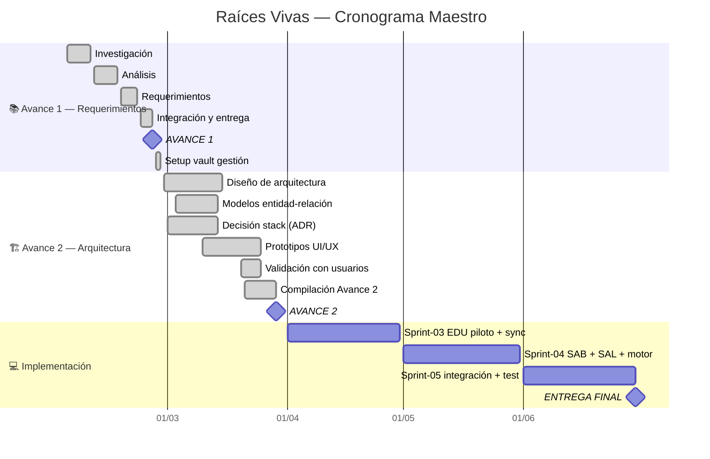
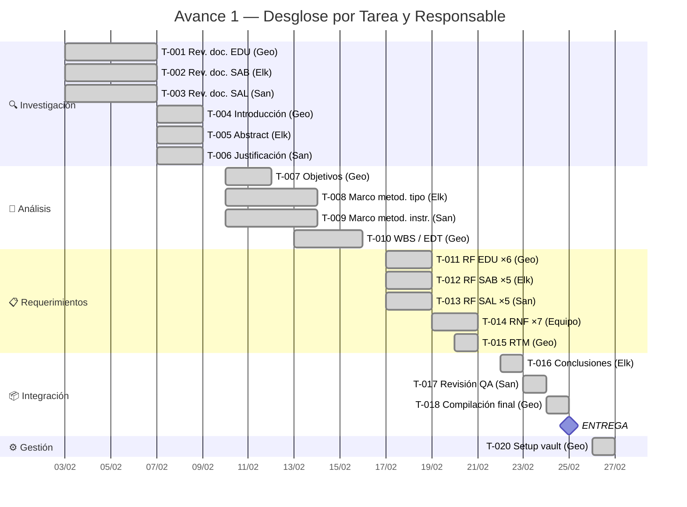
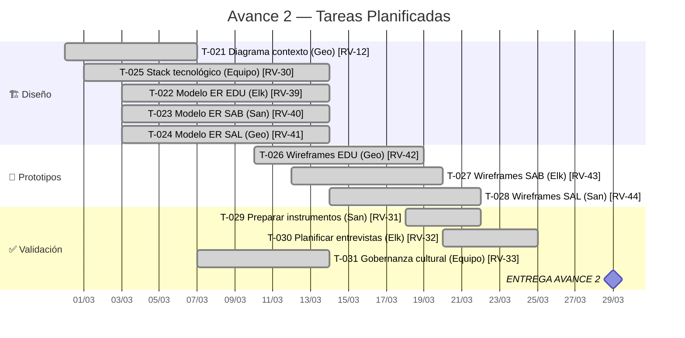

## Timeline General del Proyecto



---

## Gantt Detallado — Avance 1 (Sprint 01)



---

## Gantt Detallado — Avance 2 (Sprint 02)



---

## Milestones

| # | Milestone | Fecha Objetivo | Estado | Responsable |
|---|-----------|---------------|--------|-------------|
| M1 | Avance 1 — Requerimientos | 2026-02-25 | ✅ Entregado | Equipo |
| M2 | Avance 2 — Arquitectura | 2026-03-29 | ✅ Entregado | Equipo |
| M3 | Entrega Final | 2026-06-30 | ⏳ Pendiente | Equipo |

## Entregas Próximas

```sqlseal
SELECT
  title as "Tarea / Entrega",
  assignee as "👤",
  due as "Fecha",
  sprint as "Sprint",
  status as "Estado"
FROM files
WHERE (type = 'task' OR type = 'subtask') AND path LIKE '05-Sprints%' AND status != 'done'
ORDER BY due ASC
```

---

*Roadmap dinámico · Mermaid + SQLSeal + Jira Sync · Última actualización: 2026-03-29 (Sprint-02 completado, Avance 2 entregado)*

## Navegación

| Sprint | Enlace |
|--------|--------|
| **Sprint 01** | [[Sprint-01-Planning]] |
| **Sprint 02** | [[Sprint-02-Planning]] |
| **Sprint 03** | [[Sprint-03-Planning]] |
| **Sprint 04** | [[Sprint-04-Planning]] |
| **Sprint 05** | [[Sprint-05-Planning]] |
| **Backlog** | [[Backlog]] |
| **Dashboard** | [[Home]] |
