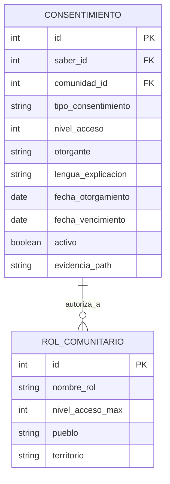

# ADR-009: Gobernanza Cultural y Protocolos de Consentimiento para Datos Indígenas

## Control Rápido

| Campo | Valor |
|-------|-------|
| **Estado** | `INPUT[suggester(option(proposed), option(accepted), option(deprecated), option(superseded)):status]` |
| **Categoría** | `INPUT[suggester(option(arquitectura), option(tecnología), option(proceso), option(diseño), option(integración), option(seguridad), option(gobernanza), option(otro)):category]` |
| **Impacto** | `INPUT[suggester(option(alto), option(medio), option(bajo)):impact]` |
| **Módulo** | `INPUT[suggester(option(educacion), option(saberes), option(salud), option(transversal), option(proyecto)):module]` |

## Contexto

Raíces Vivas maneja tres tipos de datos que requieren tratamiento diferenciado desde una perspectiva de gobernanza cultural:

1. **Saberes ancestrales** (módulo SAB): Conocimientos tradicionales que pertenecen colectivamente a los pueblos indígenas, no a individuos. Su digitalización sin protocolos adecuados puede constituir apropiación cultural o biopiratería.

2. **Datos de salud** (módulo SAL): Información clínica protegida por la Ley 8968 de Protección de la Persona frente al Tratamiento de sus Datos Personales. Incluye medicina tradicional (awá) que es confidencial por naturaleza cultural.

3. **Datos educativos** (módulo EDU): Materiales pedagógicos en lenguas indígenas que deben respetar la propiedad intelectual colectiva y las adaptaciones curriculares por territorio.

### Marco Legal Aplicable

| Instrumento Legal | Relevancia |
|-------------------|------------|
| **Convenio 169 OIT** (ratificado CR 1993) | Consulta previa, libre e informada para cualquier proyecto que afecte pueblos indígenas |
| **Ley Indígena N° 6172** (1977) | Territorios indígenas como entes autónomos con gobernanza propia |
| **Ley de Biodiversidad N° 7788** (1998) | Protección de conocimientos tradicionales, sui generis |
| **Ley 8968 Protección de Datos** (2011) | Datos personales sensibles (salud) requieren consentimiento expreso |
| **Decreto 40932-MEP** (2018) | Educación intercultural bilingüe en territorios |
| **Declaración UNDRIP** (2007) | Derecho de pueblos indígenas a controlar su patrimonio cultural |

## Opciones Consideradas

| # | Opción | Descripción |
|---|--------|-------------|
| 1 | **Principios CARE + niveles de acceso** | Implementar CARE (Collective benefit, Authority to control, Responsibility, Ethics) con 4 niveles de acceso diferenciados |
| 2 | **Modelo de consentimiento simple** | Un único nivel de consentimiento (sí/no) por dato registrado |
| 3 | **Sin restricciones especiales** | Tratar todos los datos igual con solo autenticación básica |

## Decisión

> **Estado: PROPUESTA — Pendiente de validación con comunidades indígenas.**

**Opción recomendada:** **Opción 1 — Principios CARE + Niveles de Acceso Diferenciados**

### Principios CARE para Gobernanza de Datos Indígenas

| Principio | Significado | Aplicación en Raíces Vivas |
|-----------|------------|----------------------------|
| **C** — Collective Benefit | Los datos deben beneficiar a las comunidades que los generan | Dashboards comunitarios, reportes para ADIs, materiales educativos locales |
| **A** — Authority to Control | Las comunidades tienen autoridad sobre sus datos | Roles de administrador comunal, aprobación de publicación por ADI |
| **R** — Responsibility | Quienes manejan los datos tienen responsabilidad ética | Auditoría de acceso, capacitación a usuarios, políticas de retención |
| **E** — Ethics | El uso de datos debe ser éticamente justificado | Comité de ética comunitario, consentimiento informado por nivel |

### Niveles de Acceso Propuestos

| Nivel | Nombre | Quién Accede | Ejemplo de Datos |
|-------|--------|-------------|------------------|
| **1** | 🌍 Público | Cualquier usuario autenticado | Información general del proyecto, materiales educativos aprobados para difusión |
| **2** | 🏘️ Comunitario | Miembros verificados de la comunidad | Catálogo de saberes con descripción básica, datos de salud agregados (estadísticas) |
| **3** | 🔒 Restringido | Roles específicos (docente, auxiliar salud) | Historiales médicos individuales, materiales educativos en desarrollo |
| **4** | 🛡️ Ceremonial | Solo líderes culturales autorizados (awá, sĩ'ö) | Saberes ceremoniales, medicina tradicional sagrada, rituales |

### Protocolo de Consentimiento Informado

```
┌─────────────────────────────────────────┐
│   PROTOCOLO DE CONSENTIMIENTO           │
│   Raíces Vivas                          │
├─────────────────────────────────────────┤
│ 1. Identificación del dato/saber        │
│ 2. Explicación en lengua materna        │
│ 3. Nivel de acceso propuesto            │
│ 4. Quién podrá verlo y para qué         │
│ 5. Derecho a retirar consentimiento     │
│ 6. Firma/huella del portador + testigo  │
│ 7. Registro digital con timestamp       │
│ 8. Revisión periódica (anual)           │
└─────────────────────────────────────────┘
```

### Modelo de Datos para Consentimiento



## Consecuencias

### Positivas

- Cumplimiento del Convenio 169 OIT y legislación nacional
- Respeto a la autonomía de los pueblos indígenas sobre sus datos
- Modelo replicable para otros proyectos con comunidades indígenas en CR
- Confianza de las comunidades en el sistema (adopción facilitada)
- Protección legal del equipo de proyecto

### Negativas / Riesgos

- Mayor complejidad técnica en el sistema de roles y permisos
- Proceso de registro de datos más lento (requiere consentimiento formal)
- Necesidad de capacitación a usuarios sobre los niveles de acceso
- Riesgo de sobre-restricción que dificulte el uso cotidiano

### Compromisos (Trade-offs)

- Se prioriza el respeto cultural sobre la velocidad de acceso a datos
- Se acepta complejidad técnica adicional a cambio de cumplimiento legal
- Se difiere la validación completa a una fase donde haya acceso a comunidades

## Criterios de Evaluación

| Criterio | Peso | CARE + Niveles | Consentimiento Simple | Sin Restricciones |
|----------|------|----------------|----------------------|-------------------|
| Cumplimiento legal | 30% | ★★★★★ (5) | ★★★☆☆ (3) | ★☆☆☆☆ (1) |
| Respeto cultural | 25% | ★★★★★ (5) | ★★★☆☆ (3) | ★☆☆☆☆ (1) |
| Facilidad de uso | 20% | ★★★☆☆ (3) | ★★★★☆ (4) | ★★★★★ (5) |
| Complejidad técnica | 15% | ★★☆☆☆ (2) | ★★★★☆ (4) | ★★★★★ (5) |
| Confianza comunitaria | 10% | ★★★★★ (5) | ★★★☆☆ (3) | ★☆☆☆☆ (1) |
| **Total ponderado** | **100%** | **4.05** | **3.35** | **2.30** |

## Referencias

- GIDA (Global Indigenous Data Alliance). "CARE Principles for Indigenous Data Governance." 2019.
- Convenio 169 OIT. "Convenio sobre pueblos indígenas y tribales." 1989. Ratificado CR, Ley N° 7316 (1992).
- Ley N° 6172. "Ley Indígena de Costa Rica." 1977.
- Ley N° 7788. "Ley de Biodiversidad." Art. 82-85 sobre conocimientos tradicionales.
- Ley N° 8968. "Ley de Protección de la Persona frente al Tratamiento de sus Datos Personales." 2011.

## Navegación

| Relación | Enlaces |
|----------|---------|
| **Fuente** | [[MIN-002]] |
| **Requerimientos** | [[RF-TRANS-01]] |
| **Riesgos** | [[RSK-007]], [[RSK-009]], [[RSK-013]] |
| **Índice** | [[Decisiones]] |
