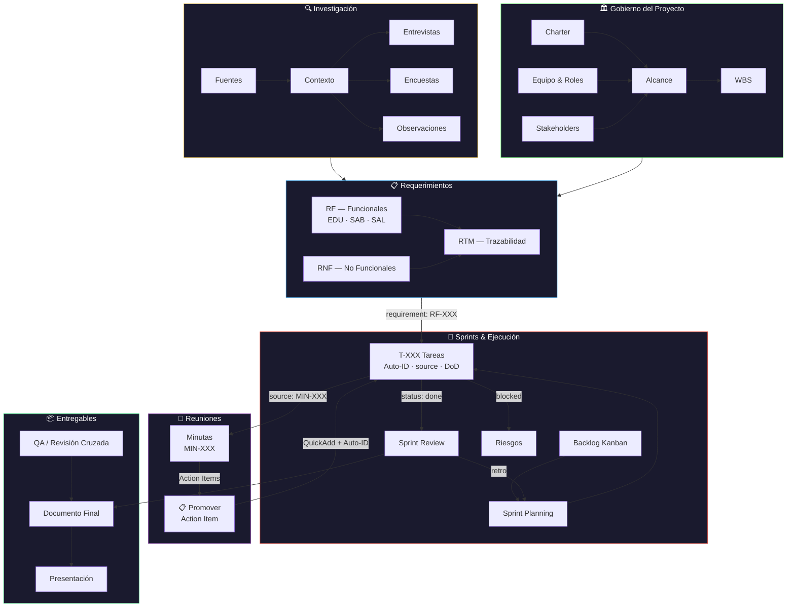
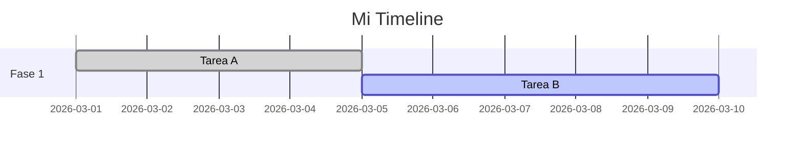
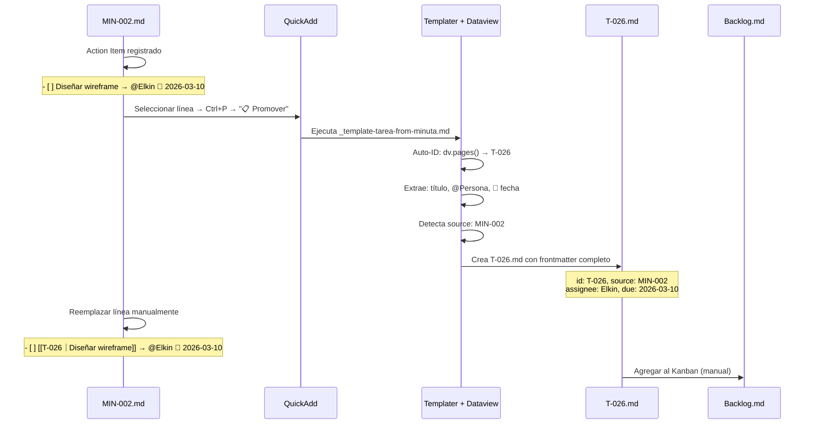
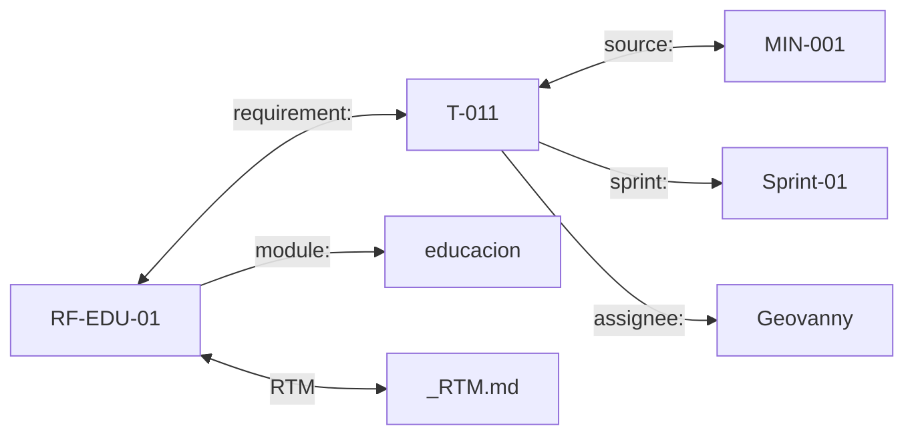

# 📕 Guía de Workflow — Vault Raíces Vivas

> Esta guía explica **cómo funciona el vault**, **en qué orden trabajar**, **qué herramientas usar** y **cómo automatizar** la gestión del proyecto. Es el manual operativo del equipo.

---

## 1. Visión General del Vault

El vault de Obsidian funciona como un **sistema de gestión de proyecto integrado** — equivalente a Confluence + Jira + Google Docs en un solo lugar. Todo es Markdown, todo es buscable, todo está interconectado.

### Arquitectura de Carpetas

```
RAICES_VIVAS/
├── 00-Dashboard/          ← Centro de control (Home, Roadmap, Métricas)
├── 01-Proyecto/           ← Gobierno: Charter, Alcance, Equipo, Riesgos, ADRs
├── 02-Investigación/      ← Contexto, entrevistas, encuestas, fuentes
├── 03-Requerimientos/     ← RF (EDU/SAB/SAL), RNF, RTM
├── 04-Arquitectura/       ← WBS, diagramas, modelos ER, stack
├── 05-Sprints/            ← Backlog Kanban + Sprint-XX/ con tareas
├── 06-Entregables/        ← Documentos entregados (Avance-1, Avance-2)
├── 07-Reuniones/          ← Minutas de reuniones
├── 08-Recursos/           ← PDFs, imágenes, datos de referencia
├── 09-QA/                 ← Testing y control de calidad
├── 99-Templates/          ← Plantillas Templater (NO editar manualmente)
├── Daily Notes/           ← Notas diarias automáticas
└── Excalidraw/            ← Diagramas de pizarra
```

### Principio Fundamental

> **Cada nota tiene un `type` en su frontmatter.** Esto es lo que hace funcionar Dataview, los dashboards y toda la automatización. Sin `type`, una nota es invisible para el sistema.

### Ciclo de Vida del Proyecto

El siguiente diagrama muestra cómo fluye la información a través de todo el sistema de gestión:



**Lectura del diagrama:**
- El flujo va de **Gobierno** e **Investigación** → **Requerimientos** → **Tareas en Sprints**
- Las **Reuniones** generan Action Items que se promueven a tareas formales con Auto-ID
- Cada **Tarea** referencia su requerimiento (`requirement:`) y su minuta origen (`source:`)
- Los **Sprint Reviews** retroalimentan la planificación del siguiente sprint
- Todo converge en los **Entregables** tras pasar por QA

---

## 2. Flujo de Trabajo Diario

### 2.1 Al Abrir Obsidian

1. **El Dashboard (Home) se abre automáticamente** gracias al plugin Homepage
2. Revisa los **KPIs** — progreso general, sprint actual, riesgos
3. Revisa **Tareas Pendientes** — comprueba si tienes tareas asignadas
4. Revisa **Próximas Fechas** — deadlines cercanas

### 2.2 Orden de Trabajo Recomendado

```
1. Revisar Dashboard → ¿Qué está pendiente?
2. Abrir Backlog (Kanban) → Mover tareas entre columnas
3. Trabajar en tu tarea → Editar/crear notas según la tarea
4. Actualizar el estado → Cambiar `status` en el frontmatter
5. Documentar → Si hay decisión importante, crear ADR o minuta
6. Commit (Git) → Se auto-guarda cada 10 min, pero puedes forzar con Ctrl+P → "Git: Commit"
```

### 2.3 Ejemplo de Flujo: "Tengo que crear un modelo ER"

1. Abre el Dashboard → localiza tu tarea (T-022, T-023 o T-024)
2. Abre la tarea → lee la descripción y criterios
3. Navega a `04-Arquitectura/Modelo de Datos.md` → trabaja allí
4. Si haces un diagrama, usa Mermaid o Diagrams
5. Al terminar, vuelve a la tarea → cambia `status: done` y `completed: 2026-03-XX`
6. En el Kanban, mueve la tarea a "Completado"

---

## 3. Cómo Crear Cosas (QuickAdd + Templater)

### 3.1 QuickAdd — El Lanzador de Macros

**Atajo:** `Ctrl+P` → escribe "QuickAdd"

Tienes **12 macros** pre-configuradas:

| Macro | Qué Crea | Dónde |
|-------|----------|-------|
| **✅ Nueva Tarea** | Nota de tarea con Auto-ID | Te pregunta sprint y datos |
| **📐 Nuevo RF** | Requerimiento funcional | `03-Requerimientos/Funcionales/` |
| **📐 Nuevo RNF** | Requerimiento no funcional | `03-Requerimientos/No Funcionales/` |
| **📝 Nueva Minuta** | Acta de reunión | `07-Reuniones/` |
| **🏗️ Nuevo ADR** | Architecture Decision Record con Auto-ID | `01-Proyecto/Decisiones/` |
| **⚠️ Nuevo Riesgo** | Riesgo con Auto-ID y severidad calculada | `01-Proyecto/Riesgos/` |
| **🎙️ Nueva Entrevista** | Guía de entrevista | `02-Investigación/Entrevistas/` |
| **🚀 Nuevo Sprint Planning** | Nota de planning de sprint | `05-Sprints/Sprint-XX/` |
| **📋 Nuevo Sprint Review** | Nota de review de sprint | `05-Sprints/Sprint-XX/` |
| **📋 Promover Action Item** | Tarea formal desde action item de minuta | Te pregunta sprint + pre-rellena datos |
| **🏗️ Promover Decisión** | ADR formal desde decisión de minuta | `01-Proyecto/Decisiones/` (auto) |
| **⚠️ Promover Riesgo** | Riesgo formal desde riesgo de minuta | `01-Proyecto/Riesgos/` (auto) |

**Uso:**
1. `Ctrl+P` → Escribir "QuickAdd" → Enter
2. Seleccionar la macro (ej: "Nueva Tarea")
3. Completar los prompts que aparecen (ID, título, asignado, sprint, etc.)
4. ✅ La nota se crea automáticamente con frontmatter completo

### 3.2 Templater — Templates Automáticos por Carpeta

**Configuración actual:** Si creas una nota nueva dentro de ciertas carpetas, Templater aplica automáticamente la plantilla correcta:

| Si creas nota en... | Se aplica template... |
|---------------------|----------------------|
| `03-Requerimientos/Funcionales/` | `_template-requerimiento-funcional` |
| `03-Requerimientos/No Funcionales/` | `_template-requerimiento-nofuncional` |
| `07-Reuniones/` | `_template-minuta` |
| `01-Proyecto/Riesgos/` | `_template-riesgo` |
| `01-Proyecto/Decisiones/` | `_template-adr` |
| `Daily Notes/` | `_template-daily-note` |

> ⚠️ **Recomendación:** Usar siempre QuickAdd para crear notas. Es más rápido y evita errores.

---

## 4. Esquema de Frontmatter (Metadatos)

### 4.1 ¿Qué es el frontmatter?

Es el bloque YAML al inicio de cada nota, entre `---`. Dataview lo lee para generar tablas, gráficos y dashboards. **Es obligatorio mantenerlo correcto.**

### 4.2 Campos por Tipo de Nota

#### Tarea (`type: task`)

```yaml
type: task
id: T-XXX
title: "Título descriptivo"
status: todo | in-progress | review | done | blocked
priority: critical | high | medium | low
assignee: Geovanny | Elkin | Santiago | Equipo
sprint: Sprint-01 | Sprint-02 | Sprint-03 | Sprint-04 | Sprint-05 | backlog
phase: investigación | análisis | requerimientos | integración | diseño | implementación | testing | gestión
module: educacion | saberes | salud | transversal | proyecto
requirement: RF-XXX | N/A
effort: Xh
started: YYYY-MM-DD
due: YYYY-MM-DD
completed: YYYY-MM-DD
source: MIN-XXX | ""          # ← Minuta que originó esta tarea (trazabilidad)
```

> **Auto-ID:** El campo `id` ya no se ingresa manualmente. Al crear una tarea con QuickAdd, el template Templater calcula automáticamente el siguiente `T-XXX` consultando todas las tareas existentes via Dataview (`dv.pages`). El archivo se renombra automáticamente al ID generado.

#### Requerimiento Funcional (`type: requirement/functional`)

```yaml
type: requirement/functional
id: RF-XXX-XX
module: educacion | saberes | salud
wbs: RV-X.X
title: "Título"
status: draft | approved | validated | deprecated
priority: must | should | could | wont
actor: [Actor1, Actor2]
source: documental | entrevista | observación | encuesta
owner: ""
validation: "Método de validación"
```

#### Requerimiento No Funcional (`type: requirement/non-functional`)

```yaml
type: requirement/non-functional
id: RNF-XX
category: conectividad | multilingüismo | rendimiento | seguridad | usabilidad | compatibilidad | gobernanza
wbs: RV-4.X
title: "Título"
status: draft | approved | validated
priority: must | should | could
metric: "Métrica de verificación"
```

#### Reunión (`type: meeting`)

```yaml
type: meeting
title: "Título de la reunión"
date: YYYY-MM-DD
attendees: [Geovanny, Elkin, Santiago]
```

#### Riesgo (`type: risk`)

```yaml
type: risk
id: RSK-XXX                    # Auto-generado via dv.pages() + Templater
title: "Descripción del riesgo"
status: open | mitigating | mitigated | occurred | closed | accepted
category: técnico | alcance | recurso | calendario | calidad | externo | cultural | comunicación
probability: alta | media | baja
impact: alto | medio | bajo
severity: crítico | alto | medio | bajo    # Calculado automáticamente (prob × imp)
strategy: mitigar | transferir | aceptar | evitar
owner: Geovanny | Elkin | Santiago | Equipo
module: educacion | saberes | salud | transversal | proyecto
phase: investigación | análisis | ... | todas
source: MIN-XXX | ""            # Minuta que originó este riesgo
trigger: ""                     # Indicador de materialización inminente
related_requirements: []        # RF/RNF afectados
related_decisions: []           # ADRs vinculados
review_date: YYYY-MM-DD         # Próxima fecha de revisión (auto: +14d)
```

> **Auto-ID:** El campo `id` se calcula automáticamente (`RSK-XXX`). El archivo se renombra al ID.
> **Severidad:** Se calcula automáticamente: `probabilidad × impacto` → crítico (≥6), alto (≥3), medio (≥2), bajo (1).

#### ADR (`type: adr`)

```yaml
type: adr
id: ADR-XXX                    # Auto-generado via dv.pages() + Templater
title: "Decisión"
status: proposed | accepted | deprecated | superseded
category: arquitectura | tecnología | proceso | diseño | integración | seguridad | gobernanza | otro
module: educacion | saberes | salud | transversal | proyecto
impact: alto | medio | bajo
deciders: [Geovanny, Elkin, Santiago]
source: MIN-XXX | ""            # Minuta que originó esta decisión
date: YYYY-MM-DD
superseded_by: ""               # ID de ADR que reemplaza a este
related_requirements: []        # RF/RNF afectados
related_risks: []               # Riesgos vinculados
```

> **Auto-ID:** El campo `id` se calcula automáticamente (`ADR-XXX`). El archivo se renombra al ID.
> **Superseded:** Cuando una decisión es reemplazada, se pone `status: superseded` y se llena `superseded_by: ADR-XXX`.

> 📌 **Trazabilidad bidireccional completa:** Cada nota de requerimiento (RF y RNF) incluye una query Dataview al final que lista automáticamente todas las tareas vinculadas. Cada nota de tarea tiene un campo `requirement:` que referencia al requerimiento asociado. Las decisiones y riesgos se interconectan entre sí y con los requerimientos que afectan.

---

## 5. Cómo Funciona Cada Herramienta

### 5.1 Dataview — El Motor de Consultas

Dataview es el plugin más importante. Lee el frontmatter de todas las notas y genera tablas/listas dinámicas.

**Ejemplos de queries que ya están activas:**

```
// Todas las tareas pendientes
FROM "05-Sprints"
WHERE type = "task" AND status != "done"
SORT due ASC

// Requerimientos por módulo
FROM "03-Requerimientos/Funcionales"
WHERE type = "requirement/functional"
GROUP BY module

// Horas por responsable (Dataview JS)
dv.pages('"05-Sprints"').where(t => t.type === "task")
```

> **Regla:** Si una tabla del Dashboard está vacía o muestra datos incorrectos, revisa el `type` y los campos en el frontmatter de las notas afectadas.

### 5.2 Mermaid — Diagramas de Código

Mermaid genera diagramas directamente en Markdown. Se usa para:

- **Gantt charts** (timelines del proyecto)
- **Mindmaps** (WBS)
- **ER diagrams** (modelos de datos)
- **Flowcharts** (flujos de proceso)
- **Sequence diagrams** (interacciones)

**Ejemplo — Gantt:**

````

````

### 5.3 Kanban — Board Visual

El archivo `05-Sprints/Backlog.md` es un tablero Kanban. Funciona con el plugin obsidian-kanban.

**Columnas:**
- 📋 Backlog → Tareas sin empezar
- 🔄 En Progreso → Trabajo activo
- 👀 En Revisión → Esperando revisión de un compañero
- ✅ Completado → Tarea terminada

**Cómo mover tareas:** Arrastra y suelta las tarjetas entre columnas en modo vista.

### 5.4 Excalidraw — Diagramas de Pizarra

Para diagramas más visuales (C4, flujos complejos, wireframes), usa Excalidraw:
1. `Ctrl+P` → "Excalidraw: Create new drawing"
2. Dibuja tu diagrama
3. Guarda en `Excalidraw/` o `04-Arquitectura/Diagramas/`
4. Enlaza desde cualquier nota: `![[mi-diagrama.excalidraw]]`

### 5.5 Charts — Gráficos

El plugin obsidian-charts permite crear gráficos Chart.js:

````
```chart
type: bar
labels: [EDU, SAB, SAL]
series:
  - title: Must
    data: [3, 3, 3]
  - title: Should
    data: [2, 2, 2]
  - title: Could
    data: [1, 0, 0]
```
````

### 5.6 Git — Control de Versiones

**Configuración actual:**
- Auto-save cada **10 minutos**
- Auto-pull al abrir Obsidian
- Commit message: `vault backup: {{date}}`

**Comandos útiles (`Ctrl+P`):**
- `Git: Commit all changes` — Guardar manualmente
- `Git: Push` — Subir cambios al remoto
- `Git: Pull` — Descargar cambios del equipo
- `Git: Open diff view` — Ver qué cambió

> ✅ **Configuración actual del equipo:**
> - **Repo:** `github.com/yonrasgg/RAICES_VIVAS` (privado)
> - **Auto commit-and-sync:** cada 10 min
> - **Split timers:** ON → push cada 10 min, pull cada 10 min
> - **Credentials:** Almacenadas con `git credential.helper store` + PAT de GitHub
> - **Cada integrante** clona el repo, abre como vault en Obsidian, instala el plugin Git con la misma config

### 5.7 Tasks — Gestión de Tareas Inline

El plugin Tasks permite checkboxes avanzados con fechas y prioridades:

```
- [ ] Revisar modelo ER 📅 2026-03-14 ⏫ 
- [x] Completar WBS ✅ 2026-02-16
```

Puedes consultar tareas inline con:
````
```tasks
not done
path includes 05-Sprints
sort by due
```
````

### 5.8 Calendar — Vista de Calendario

Abre el panel lateral (Calendar) para ver notas diarias y navegar por fechas. Las Daily Notes se crean automáticamente al hacer clic en un día.

### 5.9 Linter — Formato Automático

El Linter limpia automáticamente el Markdown al guardar:
- Línea en blanco después de YAML
- Sin espacios trailing
- Línea final en documento
- Tags compactos en YAML

> La carpeta `99-Templates/` está excluida del Linter para no romper templatesvars de Templater.

---

## 6. Convenciones del Equipo

### 6.1 Nomenclatura de IDs

| Tipo | Formato | Ejemplo |
|------|---------|---------|
| Tarea | `T-XXX` | T-001, T-025 |
| RF | `RF-MOD-XX` | RF-EDU-01, RF-SAB-03 |
| RNF | `RNF-XX` | RNF-01, RNF-07 |
| Riesgo | `RISK-XXX` | RISK-001 |
| ADR | `ADR-XXX` | ADR-001 |
| Sprint | `Sprint-XX` | Sprint-01, Sprint-02 |

### 6.2 Estados de Tareas

| Estado | Significado | Cuándo Usar |
|--------|-------------|-------------|
| `todo` | Sin empezar | Al crear la tarea |
| `in-progress` | En trabajo activo | Cuando empiezas a trabajar |
| `review` | Esperando revisión | Terminaste pero necesitas que alguien revise |
| `done` | Completada y verificada | Revisión aprobada |
| `blocked` | Bloqueada | Dependencia no resuelta |

### 6.3 Flujo de una Tarea

```
todo → in-progress → review → done
                  ↘ blocked ↗
```

**Al cambiar estado:**
1. Edita el campo `status:` en el frontmatter
2. Si es `in-progress`: llena `started: YYYY-MM-DD`
3. Si es `done`: llena `completed: YYYY-MM-DD`
4. Mueve la tarjeta en el Kanban board

### 6.4 Reglas de Revisión

- **Todo entregable pasa por revisión cruzada** antes de marcarse `done`
- Reviewer: cualquier integrante que NO sea el autor
- El reviewer verifica los criterios de aceptación (DoD) en la tarea

---

## 7. Sprints y Planificación

### 7.1 Estructura de un Sprint

Cada sprint tiene:
1. **`Sprint-XX-Planning.md`** — Meta, tareas, distribución
2. **`T-XXX.md`** (varias) — Tareas individuales dentro de `05-Sprints/Sprint-XX/`
3. **Entrada en el Backlog Kanban** — Vista board

### 7.2 Sprint Planning (cómo planificar)

1. Abrir `05-Sprints/Backlog.md` → revisar columna "Backlog"
2. Seleccionar tareas para el sprint (por prioridad y capacidad)
3. Crear las tareas como notas en `05-Sprints/Sprint-XX/`
4. Crear `Sprint-XX-Planning.md` usando la template
5. Asignar responsables y fechas

### 7.3 Sprint Review (al terminar)

1. Abrir `Sprint-XX-Planning.md` → sección "Retrospectiva"
2. Documentar qué salió bien, qué mejorar, acciones para siguiente sprint
3. Mover tareas completadas al Kanban → "Completado"

---

## 8. Promoción de Action Items → Tareas Formales

### 8.1 El Problema que Resuelve

En las reuniones surgen **Action Items** — cosas por hacer que se registran en la minuta (`MIN-XXX.md`). Pero sin un proceso de promoción, estos items:
- Se pierden en la minuta y nadie les da seguimiento
- No tienen ID, sprint, ni responsable formal
- No aparecen en el Dashboard, Kanban, ni Checklist
- No están vinculados a requerimientos

### 8.2 Flujo de Promoción



### 8.3 Paso a Paso

1. **Estás en la minuta** (ej: `MIN-002.md`)
2. **Selecciona** la línea del action item:
   ```
   - [ ] Diseñar wireframe login → @Elkin 📅 2026-03-10
   ```
3. **`Ctrl+P`** → Escribir "Promover" → Seleccionar **"📋 Promover Action Item"**
4. **El template extrae automáticamente:**
   - Título: "Diseñar wireframe login"
   - Responsable: Elkin (pre-seleccionado)
   - Fecha límite: 2026-03-10
   - Source: MIN-002 (detectado del archivo activo)
5. **Confirma o ajusta** los campos en los prompts
6. **Se crea** `T-026.md` con Auto-ID y frontmatter completo
7. **Vuelve a la minuta** y reemplaza la línea por:
   ```
   - [ ] [[T-026|Diseñar wireframe login]] → @Elkin 📅 2026-03-10
   ```
   El `[[T-026|...]]` indica que este item ya fue promovido a tarea formal.

### 8.4 Formato de Action Items en Minutas

```markdown
## Action Items

<!-- Items pendientes de promoción -->
- [ ] Descripción de la tarea → @Responsable 📅 YYYY-MM-DD

<!-- Items ya promovidos a tarea formal -->
- [ ] [[T-026|Descripción]] → @Responsable 📅 YYYY-MM-DD
```

**Regla visual:** Si la línea contiene `[[T-` ya fue promovida. Si no, está pendiente.

### 8.5 Template Especializado vs Template General

| Característica | `_template-tarea.md` | `_template-tarea-from-minuta.md` |
|---------------|---------------------|----------------------------------|
| **Uso** | Crear tarea nueva desde cero | Promover action item de minuta |
| **Auto-ID** | ✅ | ✅ |
| **Pre-relleno** | ❌ todo manual | ✅ extrae @Persona, 📅 fecha, source |
| **Status inicial** | Pregunta | Siempre `todo` |
| **Source** | Pregunta (puede quedar vacío) | Auto-detecta la minuta activa |
| **QuickAdd** | "Nueva Tarea" | "📋 Promover Action Item" |

---

## 9. Auto-ID de Tareas

### 9.1 Cómo Funciona

Al crear una tarea (por cualquier método), el template Templater ejecuta:

```javascript
// Consulta TODAS las tareas existentes en 05-Sprints/
const taskPages = dv.pages('"05-Sprints"').where(p => p.type === "task" && p.id);

// Extrae el número más alto
const ids = taskPages.map(p => parseInt(String(p.id).replace("T-", "")))
                     .filter(n => !isNaN(n));
const maxId = ids.length > 0 ? Math.max(...ids) : 0;

// Genera el siguiente: T-026, T-027, etc.
const nextId = `T-${String(maxId + 1).padStart(3, "0")}`;

// Renombra el archivo automáticamente
await tp.file.rename(nextId);
```

### 9.2 Garantías

| Propiedad | Garantía |
|-----------|----------|
| **Unicidad** | Lee TODAS las tareas antes de generar — no hay duplicados |
| **Consecutividad** | Siempre `max + 1` — sin huecos |
| **Auto-rename** | El archivo se renombra a `T-XXX.md` automáticamente |
| **Avance tag** | Se calcula `avance-N` desde el sprint seleccionado |

### 9.3 Regla de Oro

> **Nunca crear archivos `T-XXX.md` manualmente.** Siempre usar QuickAdd → "Nueva Tarea" o "📋 Promover Action Item". El Auto-ID garantiza que no haya colisiones.

---

## 10. Trazabilidad Bidireccional

### 10.1 El Grafo de Conexiones

Cada artefacto del proyecto está enlazado bidireccionalmente:



### 10.2 Campos de Trazabilidad

| Desde | Hacia | Campo / Mecanismo |
|-------|-------|-------------------|
| Tarea → Requerimiento | `requirement: RF-EDU-01` | Frontmatter + `[[RF-EDU-01]]` al final |
| Tarea → Minuta | `source: MIN-001` | Frontmatter + `[[MIN-001]]` en Notas |
| Requerimiento → Tareas | Dataview query automática | Al final de cada RF/RNF |
| Minuta → Tarea | Wikilink post-promoción | `[[T-026\|Descripción]]` en Action Items |
| RTM → Todo | Tabla centralizada | `03-Requerimientos/_RTM.md` |
| Dashboard → Todo | Queries Dataview | `00-Dashboard/Home.md` |

### 10.3 Verificación de Trazabilidad

Para verificar que una tarea está completamente trazada, debe tener:
- ✅ `requirement:` — vinculado a al menos un RF o RNF (o `N/A` si es administrativa)
- ✅ `source:` — si nació de una reunión, debe referenciar la `MIN-XXX`
- ✅ `sprint:` — asignada a un sprint o `backlog`
- ✅ `assignee:` — responsable asignado
- ✅ Al final del archivo: `[[RF-XXX]]` como wikilink para el graph view

---

## 11. Equipo y Liderazgo

### 11.1 Estructura del Equipo

| Integrante | Rol | Módulo Lead | Responsabilidad Clave |
|-----------|-----|-------------|----------------------|
| **Geovanny** | Project Lead / Arquitecto | EDU + Transversal | Coordinación general, arquitectura, vault, entregables |
| **Elkin** | Líder de Investigación / Analista | SAB | Investigación, marco metodológico, decisiones técnicas SAB |
| **Santiago** | Líder de QA / Analista | SAL | Control de calidad, instrumentos, decisiones técnicas SAL |

### 11.2 Áreas de Decisión

Cada líder tiene **autonomía para tomar decisiones técnicas** dentro de su módulo:

- **Elkin (SAB):** Cómo se documentan saberes ancestrales, qué fuentes priorizar, diseño de RF-SAB
- **Santiago (SAL):** Criterios de calidad, instrumentos de investigación, diseño de RF-SAL, revisión cruzada
- **Geovanny (EDU + Transversal):** Arquitectura, tooling, integraciones, RF-EDU, governance

Las **decisiones que afectan a más de un módulo** se toman en equipo y se documentan como ADR.

---

## 12. Plugins Instalados (Referencia Completa)

### Activos y Configurados

| Plugin | Función | Uso en el Proyecto |
|--------|---------|-------------------|
| **Dataview** | Consultas SQL sobre notas | Dashboards, tablas, métricas dinámicas |
| **Templater** | Templates con lógica JS | Creación automatizada de notas |
| **QuickAdd** | Macros y comandos rápidos | 9 macros para crear notas y sprint docs |
| **Kanban** | Tablero visual | Backlog y gestión de tareas |
| **Homepage** | Página de inicio | Dashboard automático al abrir |
| **Git** | Control de versiones | Auto commit/push/pull cada 10 min |
| **Linter** | Formato y YAML sort | Limpieza de Markdown, orden de claves YAML |
| **Calendar** | Vista calendario | Daily notes y navegación temporal |
| **Charts** | Gráficos Chart.js | Visualizaciones en dashboards |
| **Mermaid Tools** | Diagramas Mermaid | Gantt, ER, flowcharts, WBS mindmap |
| **Multi-Column** | Layout multi-columna | KPIs lado a lado, navegación en columnas |
| **Table Editor** | Edición de tablas | Tablas Markdown más fáciles |
| **Tasks** | Tareas inline avanzadas | Checkboxes con fechas y prioridades |
| **Tag Wrangler** | Gestión de tags | Renombrar, fusionar tags |
| **Folder Notes** | Notas de carpeta | README automático por carpeta |
| **Banners** | Imágenes hero en notas | Banner en dashboards con campo `banner_src` |
| **Buttons** | Botones clicables | Acciones rápidas en Dashboard |
| **Meta Bind** | Editors inline de frontmatter | Cambiar status/priority sin editar YAML |
| **Checklist** | Agregador de checklists | Panel lateral de items pendientes |
| **Periodic Notes** | Notas semanales/mensuales | Resúmenes de sprint por semana |
| **Auto Link Title** | Títulos de links | Auto-fetch de títulos web |
| **Highlightr** | Resaltado avanzado | Hallazgos clave en investigación |

---

### Plugins con Automatización — Referencia Detallada

#### 12.1 Buttons — Acciones Rápidas

Crea botones clicables dentro de notas para ejecutar comandos, abrir notas o disparar templates.

**Dónde se usa:** Dashboard Home (botones de acción rápida)

**Sintaxis:**
````
```button
name ➕ Nueva Tarea
type command
action QuickAdd: Run QuickAdd
color blue
```
````

**Tipos de botón:**
- `type command` → ejecuta un comando de Obsidian
- `type link` → abre una nota del vault
- `type template` → inserta un template en la nota actual

**Ejemplo — Botón de navegación:**
````
```button
name 📦 Ir al Backlog
type link
action [[05-Sprints/Backlog]]
color default
```
````

---

#### 12.2 Meta Bind — Edición Inline de Frontmatter

Crea dropdowns, inputs y toggles que editan directamente los campos YAML de la nota desde el cuerpo. **Es el plugin más importante para productividad.**

**Dónde se usa:** Todas las tareas del Sprint-02, template de tarea

**Sintaxis — Dropdown para `status`:**
```
`INPUT[suggester(option(todo), option(in-progress), option(review), option(done), option(blocked)):status]`
```

**Sintaxis — Dropdown para `priority`:**
```
`INPUT[suggester(option(critical), option(high), option(medium), option(low)):priority]`
```

**Sintaxis — Dropdown para `assignee`:**
```
`INPUT[suggester(option(Geovanny), option(Elkin), option(Santiago), option(Equipo)):assignee]`
```

**Tabla de Control Rápido (ya integrada en tareas):**

| Campo | Widget Meta Bind |
|-------|-----------------|
| Estado | `INPUT[suggester(...):status]` |
| Prioridad | `INPUT[suggester(...):priority]` |
| Responsable | `INPUT[suggester(...):assignee]` |
| Sprint | `INPUT[suggester(...):sprint]` |

**Cómo funciona:** Al hacer clic en el widget, aparece un menú desplegable. Al seleccionar una opción, el campo del frontmatter YAML se actualiza automáticamente. No hay que editar el YAML manualmente.

> ⚠️ **Regla importante:** Los valores del Meta Bind DEBEN coincidir exactamente con los valores esperados en las queries Dataview. Si Dataview busca `status = "done"`, el Meta Bind debe ofrecer `option(done)`, no `option(Done)` ni `option(completado)`.

---

#### 12.3 Banners — Imágenes Hero

Agrega una imagen de banner (hero) en la parte superior de cualquier nota usando frontmatter.

**Dónde se usa:** Dashboard Home, Roadmap, Métricas

> ⚠️ **Importante:** Usamos el campo personalizado `banner_src` (no `banner`) para evitar que otros plugins rendericen la imagen por duplicado. El plugin Banners está configurado con `frontmatterField: "banner_src"`.

**Configuración en frontmatter:**
```yaml
banner_src: "08-Recursos/Imágenes/cover-dashboard.png"
banner_src_y: 0.40
```

- `banner_src:` ruta a la imagen (relativa al vault)
- `banner_src_y:` posición vertical del recorte (0.0 = top, 1.0 = bottom)

**Para agregar banners a otras notas** (ej: Sprint Planning, Charter), simplemente agrega estos campos al frontmatter YAML.

---

#### 12.4 Checklist — Panel de Pendientes

Muestra un panel lateral con todos los checkboxes sin marcar del vault, filtrados por tag o carpeta.

**Dónde se usa:** Panel lateral derecho (sidebar)

**Cómo activar:** `Ctrl+P` → "Checklist: Show Checklist"

**Configuración recomendada (Settings → Checklist):**
- Tag name: `tarea` (sin `#` — coincide con el tag `tarea` del frontmatter YAML)
- Include files from: `05-Sprints/**`
- Show completed: off
- Show all todos in file: on

> **Clave técnica:** El plugin busca archivos que contengan el tag `tarea` (en frontmatter YAML o inline). El nombre interno de la propiedad en `data.json` es `todoPageName` (NO `tagName`). Cuando el tag coincide con el frontmatter, el plugin parsea **todos** los checkboxes del archivo. No se necesitan tags inline adicionales.
>
> **Propiedades válidas** del `data.json`:
> `todoPageName`, `showChecked`, `showAllTodos`, `showOnlyActiveFile`, `autoRefresh`, `subGroups`, `groupBy`, `sortDirectionItems`, `sortDirectionGroups`, `sortDirectionSubGroups`, `includeFiles`, `lookAndFeel`.

Esto crea una vista centralizada de TODOS los ítems pendientes en tareas del sprint actual.

---

#### 12.5 Periodic Notes — Notas Semanales y Mensuales

Extiende Daily Notes con creación de notas semanales y mensuales.

**Dónde se usa:** Resúmenes semanales de sprint, retrospectivas mensuales

**Configuración recomendada (Settings → Periodic Notes):**
- Weekly: Folder = `Daily Notes/`, Format = `YYYY-[W]ww`
- Monthly: Folder = `Daily Notes/`, Format = `YYYY-MM`

**Template semanal sugerida:**
```markdown
# Semana {{date:ww}} — {{date:YYYY}}

## Resumen
- Tareas completadas: 
- Tareas pendientes:
- Bloqueos:

## Notas de la semana
```

---

#### 12.6 Multi-Column Markdown — Layouts en Columnas

Crea diseños de múltiples columnas dentro de una nota.

**Dónde se usa:** Dashboard Home (KPIs, navegación, botones de acción)

**Sintaxis:**
```
=== start-multi-column: mi-id
```column-settings
number of columns: 3
border: off
shadow: off
```

Contenido columna 1

=== end-column ===

Contenido columna 2

=== end-column ===

Contenido columna 3

=== end-multi-column
```

**Reglas:**
- Cada `multi-column` necesita un ID único
- `end-column` separa columnas
- `end-multi-column` cierra el bloque
- Se puede configurar número de columnas, bordes, sombras

---

#### 12.7 Lazy Loading con Callouts Colapsables

No es un plugin sino una técnica nativa de Obsidian para mejorar rendimiento.

**Dónde se usa:** Dashboard Home, Métricas — secciones pesadas de DataviewJS que no necesitan verse inmediatamente.

**Sintaxis — Callout colapsado (cerrado por defecto):**
```
> [!note]- Título de la sección (clic para expandir)
> 
> Contenido pesado aquí (queries Dataview, tablas grandes, etc.)
```

**Sintaxis — Callout expandido por defecto:**
```
> [!note]+ Título de la sección
> 
> Contenido visible inmediatamente
```

**Regla:** El `-` después del tipo de callout (`[!note]-`) lo hace colapsado. El `+` lo hace expandido. Sin ninguno, es estático.

**Dónde aplicamos lazy loading:**
- Dashboard: Requerimientos por módulo, Progreso por fase, Esfuerzo por responsable, Fechas, Reuniones
- Métricas: Cobertura de validación, Burndown Sprint 01

---

## 13. Automatización y Productividad

### 13.1 Daily Notes Automatizadas

**Configuración recomendada:**
1. Settings → Core plugins → Daily Notes → Enable
2. New file location: `Daily Notes/`
3. Template: `99-Templates/_template-daily-note`
4. Date format: `YYYY-MM-DD`

Cada día al abrir el calendario, se crea una nota con la template de daily note que ya incluye secciones para tareas, log y bloqueos.

### 13.2 Notas Semanales con Periodic Notes

1. Settings → Community Plugins → Periodic Notes → Enable Weekly Notes
2. Folder: `Daily Notes/`
3. Format: `YYYY-[W]ww`
4. Template: crear `99-Templates/_template-weekly-note.md` con resumen semanal

**Flujo:** Cada lunes → `Ctrl+P` → "Periodic Notes: Open weekly note" → Se crea nota de la semana con resumen automático.

### 13.3 Actualización Rápida de Tareas con Meta Bind

El flujo más rápido para actualizar el estado de una tarea:

1. Abrir la nota de la tarea (ej: `T-023`)
2. En la sección **Control Rápido** (debajo del título), usar los dropdowns:
   - Cambiar Estado → `done`
   - Cambiar Prioridad → `low`
3. El frontmatter se actualiza automáticamente
4. El Dashboard refleja el cambio inmediatamente (Dataview lee el nuevo valor)

**⚡ Esto reemplaza:** Abrir YAML → editar campo → guardar → cerrar vista source.

### 13.4 Botones de Acción en Dashboard

El Dashboard Home tiene 7 botones precreados:
- ➕ Nueva Tarea → ejecuta QuickAdd
- 📝 Nueva Minuta → ejecuta QuickAdd
- 📋 Nuevo RF / RNF → crea requerimiento
- ⚠️ Nuevo Riesgo → crea nota de riesgo
- 🏗️ Nuevo ADR → crea decisión arquitectónica
- 👥 Nueva Entrevista → crea entrevista

**Para agregar más botones:** Editar `00-Dashboard/Home.md` y agregar bloques `button` con la sintaxis documentada en §12.1.

### 13.5 Atajos de Teclado Recomendados

| Atajo | Acción |
|-------|--------|
| `Ctrl+P` | Command Palette (QuickAdd, Git, todo) |
| `Ctrl+O` | Quick Switcher (abrir cualquier nota rápido) |
| `Ctrl+Shift+F` | Búsqueda global en el vault |
| `Ctrl+E` | Toggle entre edición y lectura |
| `Ctrl+K` | Insertar enlace |
| `Alt+E` | Abrir Excalidraw (si configurado) |
| `Ctrl+P` → "Mind Map" | Abrir nota como mapa mental |
| `Ctrl+P` → "Checklist" | Ver panel de pendientes |
| `Ctrl+P` → "Periodic" | Abrir nota semanal/mensual |

### 13.6 Tips de Productividad

1. **Usar `[[` para enlazar todo** — notas, tareas, requerimientos. El graph view mostrará las conexiones.
2. **Tags consistentes** — Usar siempre `#tarea`, `#requerimiento`, `#avance-1`, `#sprint-01`
3. **`Ctrl+O` para navegar** — Más rápido que el file explorer
4. **Transclusions** — Usar `![[nota#sección]]` para incrustar secciones de otras notas en el dashboard o en minutas
5. **Meta Bind para todo** — Nunca editar frontmatter YAML manualmente; usar los dropdowns inline
6. **Callouts colapsables** — Envolver secciones pesadas en `> [!note]-` para mejorar rendimiento
7. **File Explorer Note Count** — Revisar los números de notas por carpeta para verificar completitud
8. **Highlightr** — Marcar hallazgos importantes en investigación con resaltado de colores (`Ctrl+P` → "Highlightr")
9. **Auto Link Title** — Al pegar URLs, el título se autocompleta automáticamente

---

## 14. Checklist: Lo que Cada Integrante Debe Hacer Primero

### Setup Inicial (una vez)

- [ ] Clonar/sincronizar el vault en tu máquina
- [ ] Abrir en Obsidian → verificar que los 22 plugins están activos
- [ ] Verificar tema: Shiba Inu con accent `#5cf55f`
- [ ] Verificar CSS snippet `dashboard-hero.css` habilitado
- [ ] Verificar que el Dashboard (Home) abre automáticamente con banner
- [ ] Revisar esta Guía de Workflow completa
- [ ] Probar crear una nota con QuickAdd (`Ctrl+P` → QuickAdd)
- [ ] Verificar que todos los requerimientos muestran la sección 'Tareas Vinculadas' (Dataview)
- [ ] Probar cambiar un estado de tarea con Meta Bind (ver §13.3)
- [ ] Probar abrir el Checklist panel (ver §12.4)
- [ ] Verificar que Periodic Notes está configurado (ver §13.2)

### Rutina Semanal

- [ ] Revisar Dashboard → KPIs y tareas pendientes
- [ ] Actualizar estado de tus tareas con Meta Bind (dropdowns inline)
- [ ] Mover tarjetas en el Kanban
- [ ] Abrir nota semanal con Periodic Notes
- [ ] Revisar Checklist panel → items pendientes
- [ ] Documentar reuniones con template de minuta
- [ ] Commit de Git al final del día

### Antes de Cada Entrega

- [ ] Verificar que todas las tareas del sprint están `done` (Meta Bind o Kanban)
- [ ] Revisión cruzada completada
- [ ] RTM actualizada (`03-Requerimientos/_RTM.md`)
- [ ] Dashboard muestra métricas correctas (KPIs = 100%)
- [ ] Métricas.md → Tracker charts reflejan realidad
- [ ] Compilar entregable en `06-Entregables/`
- [ ] Git: Pull → Push → verificar sin conflicts

---

## 15. Resolución de Problemas Comunes

| Problema | Solución |
|----------|----------|
| Dashboard muestra tablas vacías | Verificar `type:` en frontmatter de las notas |
| Dataview no actualiza | `Ctrl+P` → "Dataview: Force Refresh All Views" |
| Template no se aplica | Verificar que QuickAdd/Templater estén habilitados |
| Kanban no muestra tarjetas | Verificar formato del kanban (no editar en modo source) |
| Git conflict | `Ctrl+P` → "Git: Pull" → resolver conflicts manualmente |
| Mermaid no renderiza | Verificar sintaxis → usar preview mode (`Ctrl+E`) |
| Nota no aparece en queries | Verificar que el campo `type` existe y es correcto |
| Meta Bind no muestra dropdown | Verificar que el plugin está habilitado y la sintaxis es exacta |
| Meta Bind cambia valor pero Dashboard no refleja | Forzar refresh Dataview (`Ctrl+P` → "Force Refresh") |
| Banner no aparece en nota | Verificar `banner_src:` en frontmatter con ruta correcta al .png |
| Banners muestra imagen cortada | Ajustar `banner_y:` (0.0=top, 0.5=centro, 1.0=bottom) |
| Checklist panel vacío | Verificar configuración de carpeta/tags en Settings → Checklist |
| Multi-Column no renderiza | Verificar que el ID sea único y la sintaxis exacta |
| Buttons no ejecuta acción | Verificar nombre del comando exacto (`Ctrl+P` → buscar) |

---

*Guía creada: 2026-02-27 · Última actualización: 2026-03-01*
*Equipo: Geovanny (Project Lead) · Elkin (Líder Investigación — SAB) · Santiago (Líder QA — SAL)*
*Versión: 5.0 — Auto-ID de tareas/decisiones/riesgos, promoción de Action Items + Decisiones + Riesgos, trazabilidad bidireccional completa, gestión de decisiones y riesgos*
*Revisar y actualizar cada sprint*
