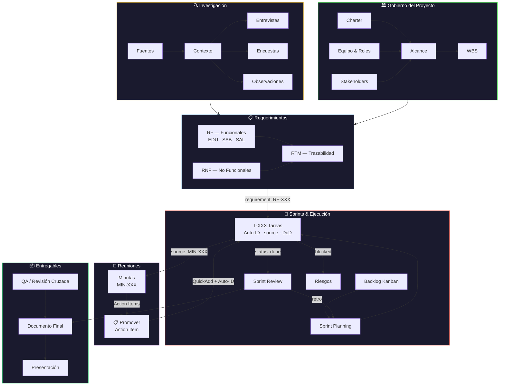
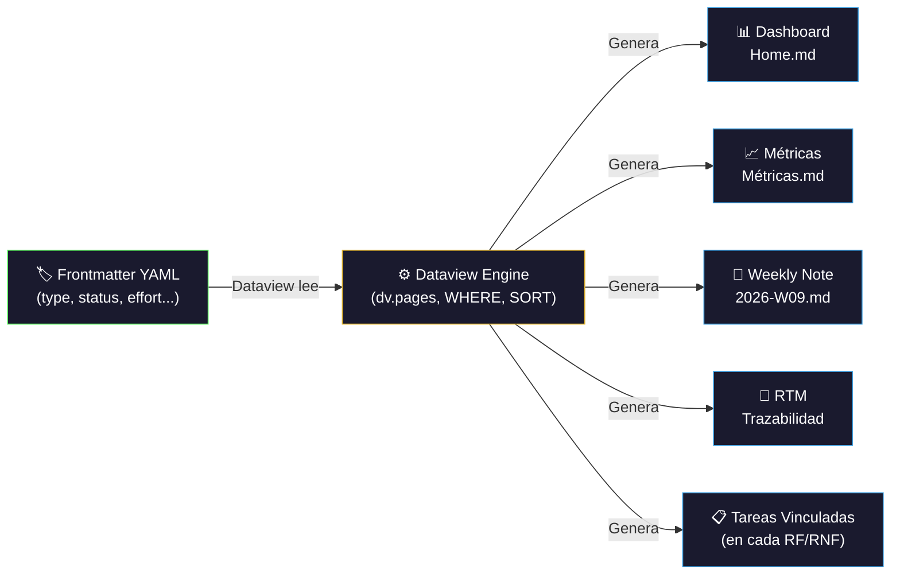
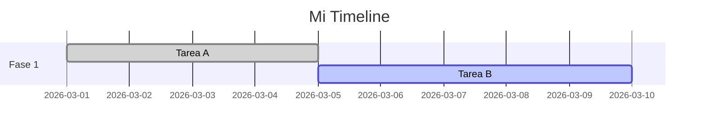
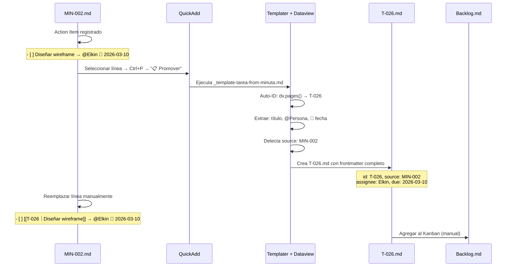
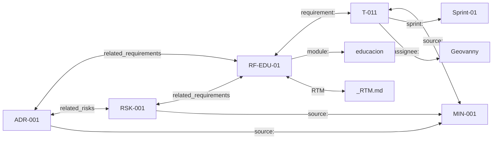
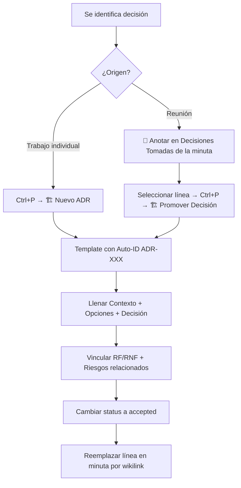
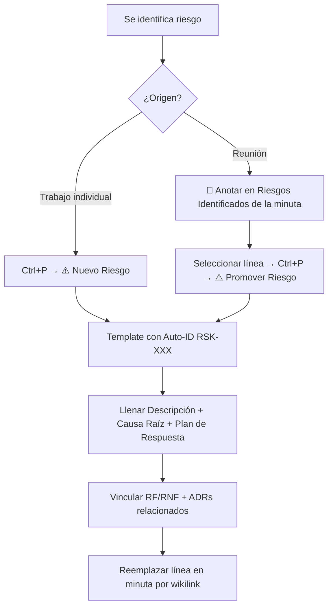

---
type: document
title: "Guía de Workflow — Vault Raíces Vivas"
project: raices-vivas
status: active
created: 2026-02-27
updated: 2026-02-28
banner_src: "08-Recursos/Imágenes/cover-proyecto.png"
banner_src_x: 0.47714
banner_src_y: 0.42
tags:
  - proyecto
  - guia
  - workflow


---
# 📕 Guía de Workflow — Vault Raíces Vivas

> Esta guía explica **cómo funciona el vault**, **en qué orden trabajar**, **qué herramientas usar** y **cómo automatizar** la gestión del proyecto. Es el manual operativo del equipo.
## 1. Visión General del Vault

El vault de Obsidian funciona como un **sistema de gestión de proyecto integrado** — equivalente a Confluence + Jira + Google Docs en un solo lugar. Todo es Markdown, todo es buscable, todo está interconectado.

### Arquitectura de Carpetas

```
RAICES_VIVAS/
├── 00-Dashboard/          ← Centro de control (Home, Roadmap, Métricas)
├── 01-Proyecto/           ← Gobierno: Charter, Alcance, Equipo, Riesgos, ADRs
├── 02-Investigación/      ← Contexto, entrevistas, encuestas, fuentes
├── 03-Requerimientos/     ← RF (EDU/SAB/SAL), RNF, RTM
├── 04-Arquitectura/       ← WBS, diagramas, modelos ER, stack
├── 05-Sprints/            ← Backlog Kanban + Sprint-XX/ con tareas
├── 06-Entregables/        ← Documentos entregados (Avance-1, Avance-2)
├── 07-Reuniones/          ← Minutas de reuniones
├── 08-Recursos/           ← PDFs, imágenes, datos de referencia
├── 09-QA/                 ← Testing y control de calidad
├── 99-Templates/          ← Plantillas Templater (NO editar manualmente)
├── Daily Notes/           ← Notas diarias automáticas
└── Excalidraw/            ← Diagramas de pizarra
```

### Principio Fundamental

> **Cada nota tiene un `type` en su frontmatter.** Esto es lo que hace funcionar Dataview, los dashboards y toda la automatización. Sin `type`, una nota es invisible para el sistema.

### Ciclo de Vida del Proyecto

El siguiente diagrama muestra cómo fluye la información a través de todo el sistema de gestión:



**Lectura del diagrama:**
- El flujo va de **Gobierno** e **Investigación** → **Requerimientos** → **Tareas en Sprints**
- Las **Reuniones** generan Action Items que se promueven a tareas formales con Auto-ID
- Cada **Tarea** referencia su requerimiento (`requirement:`) y su minuta origen (`source:`)
- Los **Sprint Reviews** retroalimentan la planificación del siguiente sprint
- Todo converge en los **Entregables** tras pasar por QA

---

## 2. Flujo de Trabajo Diario

### 2.1 Al Abrir Obsidian

1. **El Dashboard (Home) se abre automáticamente** gracias al plugin Homepage
2. Revisa los **KPIs** — progreso general, sprint actual, riesgos
3. Revisa **Tareas Pendientes** — comprueba si tienes tareas asignadas
4. Revisa **Próximas Fechas** — deadlines cercanas

### 2.2 Orden de Trabajo Recomendado

```
1. Revisar Dashboard → ¿Qué está pendiente?
2. Abrir Backlog (Kanban) → Mover tareas entre columnas
3. Trabajar en tu tarea → Editar/crear notas según la tarea
4. Actualizar el estado → Cambiar `status` en el frontmatter
5. Documentar → Si hay decisión importante, crear ADR o minuta
6. Commit (Git) → Se auto-guarda cada 10 min, pero puedes forzar con Ctrl+P → "Git: Commit"
```

### 2.3 Ejemplo de Flujo: "Tengo que crear un modelo ER"

1. Abre el Dashboard → localiza tu tarea (T-022, T-023 o T-024)
2. Abre la tarea → lee la descripción y criterios
3. Navega a `04-Arquitectura/Modelo de Datos.md` → trabaja allí
4. Si haces un diagrama, usa Mermaid o Diagrams
5. Al terminar, vuelve a la tarea → cambia `status: done` y `completed: 2026-03-XX`
6. En el Kanban, mueve la tarea a "Completado"

---

## 3. Cómo Crear Cosas (QuickAdd + Templater)

### 3.1 QuickAdd — El Lanzador de Macros

**Atajo:** `Ctrl+P` → escribe "QuickAdd"

Tienes **12 macros** pre-configuradas:

| Macro | Qué Crea | Dónde |
|-------|----------|-------|
| **✅ Nueva Tarea** | Nota de tarea con Auto-ID | Te pregunta sprint y datos |
| **📐 Nuevo RF** | Requerimiento funcional | `03-Requerimientos/Funcionales/` |
| **📐 Nuevo RNF** | Requerimiento no funcional | `03-Requerimientos/No Funcionales/` |
| **📝 Nueva Minuta** | Acta de reunión | `07-Reuniones/` |
| **🏗️ Nuevo ADR** | Architecture Decision Record con Auto-ID | `01-Proyecto/Decisiones/` |
| **⚠️ Nuevo Riesgo** | Riesgo con Auto-ID y severidad calculada | `01-Proyecto/Riesgos/` |
| **🎙️ Nueva Entrevista** | Guía de entrevista | `02-Investigación/Entrevistas/` |
| **🚀 Nuevo Sprint Planning** | Nota de planning de sprint | `05-Sprints/Sprint-XX/` |
| **📋 Nuevo Sprint Review** | Nota de review de sprint | `05-Sprints/Sprint-XX/` |
| **📋 Promover Action Item** | Tarea formal desde action item de minuta | Te pregunta sprint + pre-rellena datos |
| **🏗️ Promover Decisión** | ADR formal desde decisión de minuta | `01-Proyecto/Decisiones/` (auto) |
| **⚠️ Promover Riesgo** | Riesgo formal desde riesgo de minuta | `01-Proyecto/Riesgos/` (auto) |

**Uso:**
1. `Ctrl+P` → Escribir "QuickAdd" → Enter
2. Seleccionar la macro (ej: "Nueva Tarea")
3. Completar los prompts que aparecen (ID, título, asignado, sprint, etc.)
4. ✅ La nota se crea automáticamente con frontmatter completo

### 3.2 Templater — Templates Automáticos por Carpeta

**Configuración actual:** Si creas una nota nueva dentro de ciertas carpetas, Templater aplica automáticamente la plantilla correcta:

| Si creas nota en... | Se aplica template... |
|---------------------|----------------------|
| `03-Requerimientos/Funcionales/` | `_template-requerimiento-funcional` |
| `03-Requerimientos/No Funcionales/` | `_template-requerimiento-nofuncional` |
| `07-Reuniones/` | `_template-minuta` |
| `01-Proyecto/Riesgos/` | `_template-riesgo` |
| `01-Proyecto/Decisiones/` | `_template-adr` |
| `Daily Notes/` | `_template-daily-note` |

> ⚠️ **Recomendación:** Usar siempre QuickAdd para crear notas. Es más rápido y evita errores.

---

## 4. Esquema de Frontmatter — Referencia Definitiva

### 4.1 ¿Qué es el frontmatter y por qué es crítico?

Es el bloque YAML al inicio de cada nota, entre `---`. **Es la base de datos del proyecto.** Dataview lee estos campos para generar:

- **Dashboard KPIs** — progreso, horas, costos (Home.md)
- **Métricas Lean Six Sigma** — throughput, velocity, cycle time (Métricas.md)
- **Weekly Snapshots** — tareas completadas/pendientes por semana (Daily Notes/YYYY-WNN.md)
- **RTM dinámica** — trazabilidad requerimiento → tarea → sprint
- **Kanban board** — columnas del Backlog visual
- **Tablas de riesgos y decisiones** — filtros por severidad, estado, módulo

> **Regla cardinal:** Si un campo está vacío, mal escrito o con un tipo incorrecto, la nota **desaparece** de los dashboards y cálculos. El frontmatter no es decorativo — es el combustible de toda la automatización.

### 4.2 Motor de Automatización — Cómo los Campos se Convierten en Datos



**Cadena de dependencia:**

| Dato que ves en el Dashboard | Campo(s) del frontmatter que lo alimentan | Tipo de nota |
|-----|-----|-----|
| KPI "Progreso del Sprint" | `type`, `status`, `sprint` | task |
| KPI "Horas Estimadas / Reales" | `effort`, `effort_actual` | task |
| KPI "Costo acumulado (₡)" | `effort_actual`, `assignee` (para calcular tarifa) | task |
| Tabla "Tareas Pendientes" | `type`, `status`, `due`, `assignee`, `priority` | task |
| Tabla "Riesgos Activos" | `type`, `status`, `severity` | risk |
| Tabla "Decisiones" | `type`, `status`, `category`, `impact` | adr |
| Weekly "Completadas esta semana" | `type`, `status`, `completed`, + `week_start`/`week_end` de la weekly note | task + weekly |
| Weekly "Pendientes con fecha" | `type`, `status`, `due`, + `week_start`/`week_end` de la weekly note | task + weekly |
| Weekly "Horas ejecutadas" | `effort_actual` (o fallback a `effort`) de tareas completadas en el rango | task |
| Métricas "Velocity" | `effort`, `sprint`, `status` | task |
| Métricas "Cycle Time" | `started`, `completed` | task |
| Métricas "Colaboración" | `assignee`, `status` | task |
| RTM | `type`, `id`, `module`, `requirement` | task + requirement |

> **Implicación práctica:** Si un campo `effort_actual` queda vacío en una tarea `done`, la weekly note y el Dashboard mostrarán **0 horas** para esa tarea. Si `completed` no tiene fecha, la tarea **no aparecerá** en ninguna weekly note.

### 4.3 Convención de Valores — Reglas Generales

| Regla | Ejemplo correcto | Ejemplo incorrecto | Por qué |
|-------|-----------------|-------------------|---------|
| Strings con caracteres especiales van entre comillas | `title: "Diseño de API REST"` | `title: Diseño: API` | Los `:` rompen el YAML |
| Horas siempre entre comillas | `effort: "8h"` | `effort: 8h` | Sin comillas, Dataview lo parsea como Duration (objeto), no string |
| Fechas sin comillas, formato ISO | `due: 2026-03-14` | `due: "14/03/2026"` | Dataview necesita ISO para comparaciones con `date()` |
| Listas con corchetes o guiones | `tags:\n  - tarea` | `tags: tarea` | Dataview espera arrays para campos multi-valor |
| Campos vacíos: string vacío o nulo | `source: ""` o `completed:` | `source: null` | `null` literal puede causar errores en queries |
| IDs siempre en formato estándar | `id: T-001` | `id: T001` o `id: 1` | Los queries filtran por patrón `T-XXX` |

### 4.4 Campos por Tipo de Nota

A continuación, cada tipo de nota con su esquema completo. Los campos marcados **🔴 REQUERIDO** son indispensables para que las automatizaciones funcionen. Los marcados **🟡 RECOMENDADO** mejoran la trazabilidad. Los marcados **⚪ OPCIONAL** son informativos.

---

#### 4.4.1 Tarea (`type: task`)

**Ubicación:** `05-Sprints/Sprint-XX/T-XXX.md`
**Creación:** QuickAdd → "Nueva Tarea" o "📋 Promover Action Item"
**Template:** `99-Templates/_template-tarea.md`

```yaml
# ── Identidad ──────────────────────────────────────────────
type: task                    # 🔴 REQUERIDO — Dataview filtra por este valor
id: T-XXX                     # 🔴 REQUERIDO — Auto-generado. NUNCA editar manualmente
title: "Título descriptivo"   # 🔴 REQUERIDO — Aparece en todas las tablas

# ── Estado y Clasificación ─────────────────────────────────
status: todo                  # 🔴 REQUERIDO — Dashboard, Kanban, Weekly, Métricas
                              #   Valores: todo | in-progress | review | done | blocked
priority: high                # 🔴 REQUERIDO — Ordenamiento en tablas, filtros
                              #   Valores: critical | high | medium | low
assignee: Geovanny            # 🔴 REQUERIDO — Cálculo de costos, filtro por persona
                              #   Valores: Geovanny | Elkin | Santiago | Equipo
sprint: Sprint-02             # 🔴 REQUERIDO — Agrupación por sprint, velocity
                              #   Valores: Sprint-01..05 | backlog
phase: diseño                 # 🟡 RECOMENDADO — Filtro "Progreso por Fase" en Métricas
                              #   Valores: investigación | análisis | requerimientos |
                              #            integración | diseño | implementación |
                              #            testing | gestión
module: educacion             # 🟡 RECOMENDADO — Filtro por módulo en Dashboard
                              #   Valores: educacion | saberes | salud | transversal | proyecto

# ── Esfuerzo y Costos ─────────────────────────────────────
effort: "8h"                  # 🔴 REQUERIDO — Horas estimadas. SIEMPRE entre comillas
                              #   → Dashboard: "Horas Estimadas"
                              #   → Métricas: "Velocity", "Cycle Time"
effort_actual: "10h"          # 🔴 REQUERIDO (al completar) — Horas reales invertidas
                              #   → Dashboard: "Horas Reales", "Costo Real"
                              #   → Weekly Note: "Horas ejecutadas esta semana"
                              #   → Métricas: "Costo Real por Sprint"
                              #   ⚠️ Dejar "" hasta completar la tarea

# ── Fechas ─────────────────────────────────────────────────
started: 2026-03-07           # 🟡 RECOMENDADO — Inicio real. Para Cycle Time
due: 2026-03-14               # 🔴 REQUERIDO — Fecha límite
                              #   → Weekly Note: "Pendientes con fecha esta semana"
                              #   → Calendar plugin: marca el día
                              #   → Dashboard: ordenamiento por deadline
completed: 2026-03-13         # 🔴 REQUERIDO (al completar) — Fecha de cierre
                              #   → Weekly Note: "Completadas esta semana" (filtra por rango)
                              #   → Métricas: "Cycle Time" = completed - started
                              #   ⚠️ Dejar vacío hasta cambiar status a done

# ── Trazabilidad ──────────────────────────────────────────
requirement: "RF-EDU-01"      # 🟡 RECOMENDADO — RF/RNF padre. "N/A" si administrativa
                              #   → RTM dinámica, tabla "Tareas Vinculadas" en cada RF
source: "MIN-001"             # 🟡 RECOMENDADO — Minuta que originó esta tarea
                              #   → Trazabilidad bidireccional minuta ↔ tarea

# ── Jira Sync (jira-sync plugin) ──────────────────────────
key: "RV-XX"                  # ⚪ AUTO — Asignado por Jira al crear. NUNCA editar
summary: "Título descriptivo" # 🔴 REQUERIDO — Debe coincidir con title
issuetype: Task               # 🔴 REQUERIDO — Task | Subtask (según parent)
project: RV                   # 🔴 REQUERIDO — Siempre "RV"
parent: "RV-1"                # 🔴 REQUERIDO — Key del Epic o Story padre
                              #   Epic padre: RV-1(EDU) | RV-2(SAB) | RV-3(SAL)
                              #   Story padre: RV-4..RV-9 → issuetype cambia a Subtask
description: "Texto plano"    # 🟡 RECOMENDADO — Se convierte a ADF automáticamente
duedate: 2026-03-14           # 🟡 RECOMENDADO — Mismo valor que "due"
timetracking: "8h"            # 🟡 RECOMENDADO — Mismo valor que "effort"
labels:                       # 🟡 RECOMENDADO — Tags en Jira
  - educacion
  - sprint-01

# ── Dependencias ───────────────────────────────────────────
blocks:                       # 🟡 RECOMENDADO — Tareas que ESTA tarea bloquea
  - T-026                     #   → "No puedo empezar T-026 hasta que T-022 termine"
blocked_by:                   # 🟡 RECOMENDADO — Tareas que bloquean A ESTA tarea
  - T-021                     #   → "Necesito T-021 terminado para empezar"
impediments: []               # 🟡 RECOMENDADO — Descripción de impedimentos activos
                              #   → Ej: ["Esperando acceso BD", "Falta aprobación legal"]

# ── Metadata ───────────────────────────────────────────────
created: 2026-02-27           # ⚪ OPCIONAL — Fecha de creación de la nota
updated: 2026-02-28           # ⚪ OPCIONAL — Última actualización manual
tags:                         # 🟡 RECOMENDADO — Checklist plugin busca tag "tarea"
  - tarea                     #   → Checklist panel lateral muestra DoD pendientes
  - avance-2                  #   → Filtro por avance
```

> **Auto-ID:** Al crear con QuickAdd, Templater ejecuta `dv.pages('"05-Sprints"')` para encontrar el `T-XXX` más alto y calcula el siguiente. El archivo se renombra automáticamente. **Nunca crear T-XXX.md manualmente.**

> **⚠️ Error frecuente — `effort` sin comillas:**
> Si escribes `effort: 8h` (sin comillas), Dataview lo parsea como un objeto `Duration`, no como string. El dashboard mostrará `0h` porque `parseInt("8h")` falla sobre un Duration. **Siempre** escribir `effort: "8h"`.

> **⚠️ Error frecuente — `completed` vacío en tarea `done`:**
> Si cambias `status: done` pero no llenas `completed: YYYY-MM-DD`, la tarea NO aparecerá en ninguna weekly note y el cálculo de Cycle Time será imposible. **Siempre** llenar ambos campos juntos.

**Checklist al completar una tarea:**
1. ✅ `status: done`
2. ✅ `completed: YYYY-MM-DD` (fecha real de terminación)
3. ✅ `effort_actual: "Xh"` (horas reales invertidas)

---

#### 4.4.2 Requerimiento Funcional (`type: requirement/functional`)

**Ubicación:** `03-Requerimientos/Funcionales/<MÓDULO>/RF-<MOD>-XX.md`
**Creación:** QuickAdd → "Nuevo RF"
**Template:** `99-Templates/_template-requerimiento-funcional.md`

```yaml
# ── Identidad ──────────────────────────────────────────────
type: requirement/functional  # 🔴 REQUERIDO — Distingue de RNF y otros tipos
id: RF-EDU-01                 # 🔴 REQUERIDO — ID único del requerimiento
module: educacion             # 🔴 REQUERIDO — Agrupación por módulo
                              #   Valores: educacion | saberes | salud
wbs: RV-1.1                   # 🟡 RECOMENDADO — Código en la WBS

# ── Contenido ──────────────────────────────────────────────
title: "Registro de docentes"  # 🔴 REQUERIDO — Título en tablas y RTM
status: approved              # 🔴 REQUERIDO — Estado de aprobación
                              #   Valores: draft | approved | validated | deprecated
priority: must                # 🔴 REQUERIDO — MoSCoW → filtros en Dashboard
                              #   Valores: must | should | could | wont
actor: [Docente, Admin]       # 🟡 RECOMENDADO — Actores involucrados
source: documental            # 🟡 RECOMENDADO — Origen del requermiento
                              #   Valores: documental | entrevista | observación | encuesta
validation: "Revisión con docentes"  # 🟡 RECOMENDADO — Método de validación

# ── Metadata ───────────────────────────────────────────────
created: 2026-02-25           # ⚪ OPCIONAL
updated: 2026-02-27           # ⚪ OPCIONAL
sprint: null                  # ⚪ OPCIONAL — Sprint donde se implementará
tags:                         # 🟡 RECOMENDADO
  - requerimiento
  - funcional
  - modulo/edu
  - prioridad/must
```

> **Tareas Vinculadas (automático):** Cada RF tiene una query Dataview al final del archivo que lista todas las tareas cuyo campo `requirement:` coincide con el `id` del RF. Esta conexión es automática — solo hay que mantener el campo `requirement` correcto en las tareas.

---

#### 4.4.3 Requerimiento No Funcional (`type: requirement/non-functional`)

**Ubicación:** `03-Requerimientos/No Funcionales/RNF-XX.md`
**Creación:** QuickAdd → "Nuevo RNF"
**Template:** `99-Templates/_template-requerimiento-nofuncional.md`

```yaml
# ── Identidad ──────────────────────────────────────────────
type: requirement/non-functional  # 🔴 REQUERIDO
id: RF-TRANS-01                        # 🔴 REQUERIDO
category: conectividad            # 🔴 REQUERIDO — Clasificación del RNF
                                  #   Valores: conectividad | multilingüismo | rendimiento |
                                  #            seguridad | usabilidad | compatibilidad | gobernanza
wbs: RV-4.1                       # 🟡 RECOMENDADO

# ── Contenido ──────────────────────────────────────────────
title: "Operación offline + sync" # 🔴 REQUERIDO
status: approved                  # 🔴 REQUERIDO — draft | approved | validated
priority: must                    # 🔴 REQUERIDO — must | should | could
metric: "Permite registrar datos sin internet..."  # 🔴 REQUERIDO — Métrica verificable

# ── Metadata ───────────────────────────────────────────────
created: 2026-02-25              # ⚪ OPCIONAL
updated: 2026-02-27              # ⚪ OPCIONAL
tags:                            # 🟡 RECOMENDADO
  - requerimiento
  - no-funcional
  - transversal
  - prioridad/must
```

---

#### 4.4.4 Reunión / Minuta (`type: meeting`)

**Ubicación:** `07-Reuniones/MIN-XXX.md`
**Creación:** QuickAdd → "Nueva Minuta"
**Template:** `99-Templates/_template-minuta.md`

```yaml
# ── Identidad ──────────────────────────────────────────────
type: meeting                 # 🔴 REQUERIDO — Dataview filtra reuniones
id: MIN-001                   # 🔴 REQUERIDO — ID único de la minuta

# ── Contenido ──────────────────────────────────────────────
title: "Kickoff — Definición del Proyecto"  # 🔴 REQUERIDO
date: 2026-02-25              # 🔴 REQUERIDO — Fecha de la reunión
                              #   → Weekly Note: "Reuniones esta semana" (filtra por rango)
duration: "2h"                # 🟡 RECOMENDADO — Duración de la reunión
attendees:                    # 🔴 REQUERIDO — Quiénes participaron
  - Geovanny
  - Elkin
  - Santiago

# ── Decisiones y Acciones (en frontmatter) ─────────────────
decisions:                    # 🟡 RECOMENDADO — Lista de decisiones tomadas
  - "Obsidian como sistema central"
  - "Git + GitHub para versionado"
risks:                        # 🟡 RECOMENDADO — Riesgos identificados
  - "Dependencia en un solo integrante"
action_items:                 # ⚪ OPCIONAL — Solo si se quieren listar en frontmatter
  - "Configurar vault completo"

# ── Metadata ───────────────────────────────────────────────
tags:                         # 🟡 RECOMENDADO
  - minuta
  - reunion
```

> **Promoción:** Las decisiones, riesgos y action items de la minuta se promueven a notas formales (ADR, RSK, T-XXX) usando QuickAdd. Ver §8 para el flujo completo.

---

#### 4.4.5 Riesgo (`type: risk`)

**Ubicación:** `01-Proyecto/Riesgos/RSK-XXX.md`
**Creación:** QuickAdd → "Nuevo Riesgo" o "⚠️ Promover Riesgo"
**Template:** `99-Templates/_template-riesgo.md`

```yaml
# ── Identidad ──────────────────────────────────────────────
type: risk                    # 🔴 REQUERIDO
id: RSK-001                   # 🔴 REQUERIDO — Auto-generado via dv.pages() + Templater
title: "Dependencia en un solo integrante"  # 🔴 REQUERIDO

# ── Evaluación ─────────────────────────────────────────────
status: open                  # 🔴 REQUERIDO — Estado actual del riesgo
                              #   Valores: open | mitigating | mitigated |
                              #            occurred | closed | accepted
                              #   → Dashboard: tabla "Riesgos Activos" (filtra open)
                              #   → Weekly Note: "Riesgos Activos (snapshot)"
category: recurso             # 🔴 REQUERIDO — Clasificación
                              #   Valores: técnico | alcance | recurso | calendario |
                              #            calidad | externo | cultural | comunicación
probability: media            # 🔴 REQUERIDO — Probabilidad de ocurrencia
                              #   Valores: alta | media | baja
impact: alto                  # 🔴 REQUERIDO — Impacto si se materializa
                              #   Valores: alto | medio | bajo
severity: alto                # 🔴 REQUERIDO — Calculado: probabilidad × impacto
                              #   Valores: crítico (≥6) | alto (≥3) | medio (≥2) | bajo (1)
                              #   → Dashboard: ordenamiento de tabla de riesgos
strategy: mitigar             # 🔴 REQUERIDO — Plan de respuesta
                              #   Valores: mitigar | transferir | aceptar | evitar
owner: "Equipo"               # 🔴 REQUERIDO — Responsable de monitoreo
                              #   Valores: Geovanny | Elkin | Santiago | Equipo

# ── Contexto ───────────────────────────────────────────────
module: proyecto              # 🟡 RECOMENDADO — educacion | saberes | salud | transversal | proyecto
phase: gestión                # 🟡 RECOMENDADO — Fase del proyecto donde aplica
source: "MIN-001"             # 🟡 RECOMENDADO — Minuta de origen (trazabilidad)
trigger: "Solo una persona sabe configurar el vault"  # 🟡 RECOMENDADO — Señal de alarma

# ── Trazabilidad ──────────────────────────────────────────
related_requirements: []      # 🟡 RECOMENDADO — RF/RNF afectados si se materializa
related_decisions:            # 🟡 RECOMENDADO — ADRs que mitigan o se relacionan
  - ADR-001
  - ADR-006
review_date: 2026-03-15       # 🔴 REQUERIDO — Próxima revisión (auto: +14d al crear)
                              #   → Dashboard: filtro de riesgos con revisión vencida
```

> **Auto-ID:** El campo `id` se calcula automáticamente (`RSK-XXX`). El archivo se renombra al ID.
> **Severidad automática:** Al crear con QuickAdd, se calcula `probabilidad × impacto`:
> - alta × alto = crítico (9), alta × medio = alto (6), alta × bajo = medio (3)
> - media × alto = alto (6), media × medio = alto (4), media × bajo = medio (2)
> - baja × alto = alto (3), baja × medio = medio (2), baja × bajo = bajo (1)

---

#### 4.4.6 Decisión Arquitectónica (`type: adr`)

**Ubicación:** `01-Proyecto/Decisiones/ADR-XXX.md`
**Creación:** QuickAdd → "Nuevo ADR" o "🏗️ Promover Decisión"
**Template:** `99-Templates/_template-adr.md`

```yaml
# ── Identidad ──────────────────────────────────────────────
type: adr                     # 🔴 REQUERIDO — Dataview filtra por "adr" (NO "decision")
id: ADR-001                   # 🔴 REQUERIDO — Auto-generado via dv.pages() + Templater
title: "Obsidian como sistema central"  # 🔴 REQUERIDO

# ── Evaluación ─────────────────────────────────────────────
status: accepted              # 🔴 REQUERIDO
                              #   Valores: proposed | accepted | deprecated | superseded
                              #   → Dashboard: KPI "ADRs", tabla de decisiones
                              #   → Weekly Note: "ADR esta semana" (filtra por date)
category: tecnología          # 🔴 REQUERIDO — Clasificación de la decisión
                              #   Valores: arquitectura | tecnología | proceso | diseño |
                              #            integración | seguridad | gobernanza | otro
module: proyecto              # 🟡 RECOMENDADO — Módulo afectado
impact: alto                  # 🔴 REQUERIDO — Nivel de impacto
                              #   Valores: alto | medio | bajo
deciders:                     # 🔴 REQUERIDO — Quiénes tomaron la decisión
  - Geovanny
  - Elkin
  - Santiago

# ── Contexto ───────────────────────────────────────────────
source: "MIN-001"             # 🟡 RECOMENDADO — Minuta de origen
date: 2026-02-25              # 🔴 REQUERIDO — Fecha de la decisión
                              #   → Weekly Note: "ADR esta semana" (filtra por rango de fechas)
superseded_by: ""             # ⚪ OPCIONAL — ID de ADR que reemplaza a este

# ── Trazabilidad ──────────────────────────────────────────
related_requirements: []      # 🟡 RECOMENDADO — RF/RNF que afecta
related_risks:                # 🟡 RECOMENDADO — Riesgos que mitiga/introduce
  - RSK-001
  - RSK-003
```

> **Auto-ID:** El campo `id` se calcula automáticamente (`ADR-XXX`). El archivo se renombra al ID.
> **Superseded:** Cuando una decisión es reemplazada, se pone `status: superseded` y se llena `superseded_by: ADR-XXX`.
> **⚠️ type = "adr", NO "decision":** Los queries de Dashboard y Weekly Notes filtran por `type === "adr"`. Si escribes `type: decision`, la nota será invisible para Dataview.

---

#### 4.4.7 Nota Semanal (`type: weekly`)

**Ubicación:** `Daily Notes/YYYY-WNN.md` (ej: `2026-W09.md`)
**Creación:** `Ctrl+P` → "Periodic Notes: Open weekly note" (o Calendar plugin)
**Template:** `99-Templates/_template-weekly-note.md`

```yaml
# ── Identidad ──────────────────────────────────────────────
type: weekly                  # 🔴 REQUERIDO — Identifica como nota semanal
title: "Semana 09 — 2026"     # 🔴 REQUERIDO — Auto-generado por Templater

# ── Rango de Fechas (CRÍTICO para scoping) ─────────────────
sprint: Sprint-01             # 🟡 RECOMENDADO — Sprint activo esa semana
week_start: 2026-02-23        # 🔴 REQUERIDO — Lunes de la semana (ISO)
                              #   → Todas las queries Dataview usan date(this.week_start)
                              #   → Sin este campo, las tablas muestran TODO el vault
week_end: 2026-03-01          # 🔴 REQUERIDO — Domingo de la semana (ISO)
                              #   → Todas las queries Dataview usan date(this.week_end)
                              #   → Sin este campo, las tablas muestran TODO el vault

# ── Metadata ───────────────────────────────────────────────
created: 2026-02-22           # ⚪ OPCIONAL
tags:                         # 🟡 RECOMENDADO
  - weekly
  - reporte
```

> **Cómo funcionan los queries scoped:** Cada sección de la weekly note filtra datos usando el rango `week_start` ↔ `week_end` del propio frontmatter:
>
> | Sección | Query | Campos de tarea requeridos |
> |-----|-----|-----|
> | ✅ Completadas esta semana | `completed >= date(this.week_start) AND completed <= date(this.week_end)` | `type`, `status: done`, `completed` |
> | 🔄 En Progreso | `status = "in-progress" OR status = "review"` | `type`, `status` |
> | 📋 Pendientes con fecha | `due >= date(this.week_start) AND due <= date(this.week_end) AND status = "todo"` | `type`, `status`, `due` |
> | 🚧 Bloqueos | `status = "blocked"` | `type`, `status` |
> | 📊 Métricas | DataviewJS calcula horas, ADRs, reuniones en el rango | `effort_actual`, `completed`, `date` (en ADRs/minutas) |
> | ⚠️ Riesgos | `type = "risk" AND status = "open"` | `type`, `status` (en riesgos) |
>
> **Ejemplo práctico:** W09 (Feb 23 → Mar 1) muestra T-016 a T-020 como "completadas" porque sus campos `completed` caen entre `2026-02-23` y `2026-03-01`. Las tareas del Sprint-02 (due: Mar 7+) NO aparecen en "Pendientes" porque sus `due` son posteriores al `week_end`.

---

#### 4.4.8 Sprint Planning (`type: sprint-planning`)

**Ubicación:** `05-Sprints/Sprint-XX/Sprint-XX-Planning.md`
**Creación:** QuickAdd → "Sprint Planning"
**Template:** `99-Templates/_template-sprint-planning.md`

```yaml
# ── Identidad ──────────────────────────────────────────────
type: sprint-planning         # 🔴 REQUERIDO
title: "Sprint 02 — Avance 2: Diseño y Arquitectura"  # 🔴 REQUERIDO
sprint: Sprint-02             # 🔴 REQUERIDO — Vincula al sprint
avance: Avance-2              # 🟡 RECOMENDADO — Avance académico asociado

# ── Estado ─────────────────────────────────────────────────
status: active                # 🔴 REQUERIDO — active | done
                              #   Valores: active | done
goal: "Completar diseño de arquitectura..."  # 🔴 REQUERIDO — Meta del sprint

# ── Fechas ─────────────────────────────────────────────────
started: 2026-03-03           # 🔴 REQUERIDO — Inicio del sprint
due: 2026-03-22               # 🔴 REQUERIDO — Fin planificado
completed: 2026-03-22         # 🔴 REQUERIDO (al cerrar) — Fin real
team: [Geovanny, Elkin, Santiago]  # 🔴 REQUERIDO

# ── Metadata ───────────────────────────────────────────────
created: 2026-02-27           # ⚪ OPCIONAL
updated: 2026-03-01           # ⚪ OPCIONAL
tags:                         # 🟡 RECOMENDADO
  - sprint
  - planning
  - avance-2
banner_src: "08-Recursos/Imágenes/cover-sprints.png"  # ⚪ OPCIONAL — Banner decorativo
banner_src_y: 0.42            # ⚪ OPCIONAL
```

---

#### 4.4.9 Documento de Contexto (`type: context`)

**Ubicación:** `02-Investigación/Contexto/*.md`
**Creación:** Manual (no tiene macro QuickAdd)

```yaml
# ── Identidad ──────────────────────────────────────────────
type: context                 # 🔴 REQUERIDO — Identifica como nota de contexto
title: "Contexto — Educación en Territorios Indígenas"  # 🔴 REQUERIDO
module: educacion             # 🔴 REQUERIDO — educacion | saberes | salud | transversal
project: raices-vivas         # 🟡 RECOMENDADO
status: draft                 # 🟡 RECOMENDADO — draft | review | final

# ── Metadata ───────────────────────────────────────────────
created: 2026-02-27           # ⚪ OPCIONAL
updated: 2026-02-27           # ⚪ OPCIONAL
tags:                         # 🟡 RECOMENDADO
  - investigación
  - contexto
  - modulo/edu
banner_src: "08-Recursos/Imágenes/cover-educacion.png"  # ⚪ OPCIONAL
banner_src_y: 0.40            # ⚪ OPCIONAL
```

---

#### 4.4.10 Documento de Proyecto (`type: document` / `type: guide`)

**Ubicación:** `01-Proyecto/*.md`, `04-Arquitectura/*.md`
**Creación:** Manual

```yaml
# ── Identidad ──────────────────────────────────────────────
type: document                # 🔴 REQUERIDO — "document" o "guide" según naturaleza
                              #   "document" = referencia estática (Charter, Alcance, Plan)
                              #   "guide" = instrucciones procedurales (Onboarding, Workflow)
title: "Plan de Gestión"      # 🔴 REQUERIDO
project: raices-vivas         # 🟡 RECOMENDADO
status: active                # 🟡 RECOMENDADO — draft | active | archived

# ── Metadata ───────────────────────────────────────────────
created: 2026-02-27           # ⚪ OPCIONAL
updated: 2026-03-01           # ⚪ OPCIONAL
tags:                         # 🟡 RECOMENDADO
  - proyecto
  - gestión
```

---

#### 4.4.11 Nota Diaria (`type: daily-note`)

**Ubicación:** `Daily Notes/YYYY-MM-DD.md`
**Creación:** Calendar plugin (clic en día) o `Ctrl+P` → "Daily Notes: Open today's note"
**Template:** `99-Templates/_template-daily-note.md`

```yaml
type: daily-note              # 🔴 REQUERIDO
date: 2026-03-01              # 🔴 REQUERIDO — Fecha de la nota
tags:                         # 🟡 RECOMENDADO
  - daily
```

---

#### 4.4.12 Entrevista (`type: entrevista`)

**Ubicación:** `02-Investigación/Entrevistas/ENT-XXX.md`
**Creación:** QuickAdd → "Entrevista"
**Template:** `99-Templates/_template-entrevista.md`

```yaml
type: entrevista              # 🔴 REQUERIDO
id: ENT-001                   # 🔴 REQUERIDO
title: "Entrevista con líder comunitario Bribri"  # 🔴 REQUERIDO
date: 2026-03-10              # 🔴 REQUERIDO
tags:                         # 🟡 RECOMENDADO
  - investigación
  - entrevista
```

---

#### 4.4.13 Epic Jira (`type: epic`)

**Ubicación:** `05-Sprints/Epics/RV-X.md`
**Creación:** Manual con template o desde Jira
**Template:** `99-Templates/_template-epic.md`

```yaml
type: epic                    # 🔴 REQUERIDO
key: "RV-1"                   # 🔴 REQUERIDO — Clave Jira
summary: "Educación Intercultural Bilingüe"  # 🔴 REQUERIDO
issuetype: Epic               # 🔴 REQUERIDO
project: RV                   # 🔴 REQUERIDO
title: "Educación Intercultural Bilingüe"   # 🔴 REQUERIDO
status: in-progress           # 🔴 REQUERIDO
priority: high                # 🔴 REQUERIDO
owner: "Geovanny"             # 🔴 REQUERIDO — Responsable del Epic
module: educacion             # 🔴 REQUERIDO — educacion | saberes | salud
description: "Texto plano"    # 🟡 RECOMENDADO — Se convierte a ADF en Jira
labels:                       # 🟡 RECOMENDADO
  - educacion
  - mvp
tags:                         # 🟡 RECOMENDADO
  - epic
  - modulo/edu
created: 2026-02-03           # ⚪ AUTO
updated: 2026-03-05           # ⚪ AUTO
```

> 📌 Las notas Epic incluyen Dataview queries que resuelven automáticamente las Stories, Tasks y RFs vinculadas por el campo `parent`.

---

#### 4.4.14 User Story Jira (`type: story`)

**Ubicación:** `05-Sprints/Stories/RV-X.md`
**Creación:** Manual con template o desde Jira
**Template:** `99-Templates/_template-user-story.md`

```yaml
type: story                   # 🔴 REQUERIDO
key: "RV-4"                   # 🔴 REQUERIDO — Clave Jira
summary: "RF-EDU-01: Registro de docentes"  # 🔴 REQUERIDO
issuetype: Story              # 🔴 REQUERIDO
project: RV                   # 🔴 REQUERIDO
parent: "RV-1"                # 🔴 REQUERIDO — Key del Epic padre
title: "Registro de docentes"             # 🔴 REQUERIDO
status: todo                  # 🔴 REQUERIDO
priority: must                # 🔴 REQUERIDO
assignee: "Geovanny"          # 🔴 REQUERIDO
module: educacion             # 🔴 REQUERIDO
requirement: "RF-EDU-01"      # 🔴 REQUERIDO — Requerimiento funcional vinculado
story_points: 5               # 🔴 REQUERIDO — Fibonacci (1,2,3,5,8,13)
customfield_10016: 5          # 🔴 REQUERIDO — Mismo valor que story_points (campo Jira)
description: "Como equipo..." # 🟡 RECOMENDADO — User Story format
labels:                       # 🟡 RECOMENDADO
  - educacion
  - mvp
tags:                         # 🟡 RECOMENDADO
  - story
  - modulo/edu
created: 2026-02-03           # ⚪ AUTO
updated: 2026-03-05           # ⚪ AUTO
```

> 📌 Las notas Story incluyen Dataview queries que resuelven Subtareas vinculadas, enlace al Epic padre, y enlace al RF.

---

### 4.5 Mapa Maestro: Campo → Automatización

La siguiente tabla es la referencia definitiva de **qué campo alimenta qué automatización**. Si un campo falta, la automatización correspondiente mostrará datos incorrectos o vacíos.

| Campo | Tipo de Nota | Lo Consume | Efecto si Falta |
|-------|-------------|------------|-----------------|
| `type` | TODAS | Todos los queries Dataview | La nota es **invisible** para todo el sistema |
| `id` | task, risk, adr, meeting, req | Tablas, links, RTM | No se puede referenciar ni vincular |
| `status` | task, risk, adr, req | Dashboard KPIs, Kanban, Weekly, Métricas | No aparece en tablas filtradas por estado |
| `effort` | task | Dashboard "Horas Estimadas", Velocity | Horas estimadas = 0 |
| `effort_actual` | task | Dashboard "Horas Reales", Weekly "Horas ejecutadas", Costo real | Costo real = 0, fallback a `effort` en Weekly |
| `assignee` | task | Costo por persona (tarifa × horas), filtro por responsable | Tarifa = ₡5,000/h (fallback), no aparece en filtros |
| `completed` | task | Weekly "Completadas esta semana", Cycle Time | Tarea done desaparece de weekly, Cycle Time imposible |
| `due` | task | Weekly "Pendientes con fecha", Calendar, ordenamiento | No aparece en pendientes semanales ni en calendario |
| `started` | task | Cycle Time (started → completed) | Cycle Time = 0 |
| `sprint` | task, sprint-planning | Agrupación por sprint, Velocity | Tarea flotante sin sprint |
| `priority` | task, req | Ordenamiento, filtros | Se ordena como si no tuviera prioridad |
| `severity` | risk | Ordenamiento de riesgos | Riesgo sin clasificación de urgencia |
| `review_date` | risk | Filtro de riesgos con revisión vencida | No se detecta cuándo revisar |
| `date` | adr, meeting | Weekly "ADR esta semana", "Reuniones esta semana" | ADR/reunión no aparece en weekly notes |
| `week_start` | weekly | TODAS las queries de la weekly note | Weekly muestra TODO el vault (sin filtro temporal) |
| `week_end` | weekly | TODAS las queries de la weekly note | Weekly muestra TODO el vault (sin filtro temporal) |
| `requirement` | task | RTM, tabla "Tareas Vinculadas" en RF/RNF | Tarea sin vínculo a requerimiento |
| `source` | task, risk, adr | Trazabilidad a minuta de origen | Se pierde el historial de decisión |
| `module` | task, req, context | Filtro por módulo, agrupación | No aparece en vistas filtradas por módulo |

> 📌 **Trazabilidad bidireccional completa:** Cada nota de requerimiento (RF y RNF) incluye una query Dataview al final que lista automáticamente todas las tareas vinculadas. Cada nota de tarea tiene un campo `requirement:` que referencia al requerimiento asociado. Las decisiones y riesgos se interconectan entre sí y con los requerimientos que afectan.

---

## 5. Cómo Funciona Cada Herramienta

### 5.1 Dataview — El Motor de Consultas

Dataview es el plugin más importante. Lee el frontmatter de todas las notas y genera tablas/listas dinámicas.

**Ejemplos de queries que ya están activas:**

```
// Todas las tareas pendientes
FROM "05-Sprints"
WHERE (type = "task" OR type = "subtask") AND status != "done"
SORT due ASC

// Requerimientos por módulo
FROM "03-Requerimientos/Funcionales"
WHERE type = "requirement/functional"
GROUP BY module

// Horas por responsable (Dataview JS)
dv.pages('"05-Sprints"').where(t => t.type === "task" || t.type === "subtask")
```

> **Regla:** Si una tabla del Dashboard está vacía o muestra datos incorrectos, revisa el `type` y los campos en el frontmatter de las notas afectadas.

### 5.2 Mermaid — Diagramas de Código

Mermaid genera diagramas directamente en Markdown. Se usa para:

- **Gantt charts** (timelines del proyecto)
- **Mindmaps** (WBS)
- **ER diagrams** (modelos de datos)
- **Flowcharts** (flujos de proceso)
- **Sequence diagrams** (interacciones)

**Ejemplo — Gantt:**

````

````

### 5.3 Kanban — Board Visual

El archivo `05-Sprints/Backlog.md` es un tablero Kanban. Funciona con el plugin obsidian-kanban.

**Columnas:**
- 📋 Backlog → Tareas sin empezar
- 🔄 En Progreso → Trabajo activo
- 👀 En Revisión → Esperando revisión de un compañero
- ✅ Completado → Tarea terminada

**Cómo mover tareas:** Arrastra y suelta las tarjetas entre columnas en modo vista.

### 5.4 Excalidraw — Diagramas de Pizarra

Para diagramas más visuales (C4, flujos complejos, wireframes), usa Excalidraw:
1. `Ctrl+P` → "Excalidraw: Create new drawing"
2. Dibuja tu diagrama
3. Guarda en `Excalidraw/` o `04-Arquitectura/Diagramas/`
4. Enlaza desde cualquier nota: `![[mi-diagrama.excalidraw]]`

### 5.5 Charts — Gráficos

El plugin obsidian-charts permite crear gráficos Chart.js:

````
```chart
type: bar
labels: [EDU, SAB, SAL]
series:
  - title: Must
    data: [3, 3, 3]
  - title: Should
    data: [2, 2, 2]
  - title: Could
    data: [1, 0, 0]
```
````

### 5.6 Git — Control de Versiones

**Configuración actual:**
- Auto-save cada **10 minutos**
- Auto-pull al abrir Obsidian
- Commit message: `vault backup: {{date}}`

**Comandos útiles (`Ctrl+P`):**
- `Git: Commit all changes` — Guardar manualmente
- `Git: Push` — Subir cambios al remoto
- `Git: Pull` — Descargar cambios del equipo
- `Git: Open diff view` — Ver qué cambió

> ✅ **Configuración actual del equipo:**
> - **Repo:** `github.com/yonrasgg/RAICES_VIVAS` (privado)
> - **Auto commit-and-sync:** cada 10 min
> - **Split timers:** ON → push cada 10 min, pull cada 10 min
> - **Credentials:** Almacenadas con `git credential.helper store` + PAT de GitHub
> - **Cada integrante** clona el repo, abre como vault en Obsidian, instala el plugin Git con la misma config

### 5.7 Tasks — Gestión de Tareas Inline

El plugin Tasks permite checkboxes avanzados con fechas y prioridades:

```
- [ ] Revisar modelo ER 📅 2026-03-14 ⏫ 
- [x] Completar WBS ✅ 2026-02-16
```

Puedes consultar tareas inline con:
````
```tasks
not done
path includes 05-Sprints
sort by due
```
````

### 5.8 Calendar — Vista de Calendario

Abre el panel lateral (Calendar) para ver notas diarias y navegar por fechas. Las Daily Notes se crean automáticamente al hacer clic en un día.

### 5.9 Linter — Formato Automático

El Linter limpia automáticamente el Markdown al guardar:
- Línea en blanco después de YAML
- Sin espacios trailing
- Línea final en documento
- Tags compactos en YAML

> La carpeta `99-Templates/` está excluida del Linter para no romper templatesvars de Templater.

---

## 6. Convenciones del Equipo

### 6.1 Nomenclatura de IDs

| Tipo | Formato | Ejemplo |
|------|---------|---------|
| Tarea | `T-XXX` | T-001, T-031 |
| RF | `RF-MOD-XX` | RF-EDU-01, RF-SAB-03 |
| RNF | `RNF-XX` | RF-TRANS-01, RF-TRANS-03 |
| Riesgo | `RSK-XXX` | RSK-001, RSK-006 |
| ADR | `ADR-XXX` | ADR-001, ADR-006 |
| Sprint | `Sprint-XX` | Sprint-01, Sprint-02 |
| Minuta | `MIN-XXX` | MIN-001 |
| Entrevista | `ENT-XXX` | ENT-001 |
| Weekly Note | `YYYY-WNN` | 2026-W09, 2026-W10 |

### 6.2 Estados de Tareas

| Estado | Significado | Cuándo Usar |
|--------|-------------|-------------|
| `todo` | Sin empezar | Al crear la tarea |
| `in-progress` | En trabajo activo | Cuando empiezas a trabajar |
| `review` | Esperando revisión | Terminaste pero necesitas que alguien revise |
| `done` | Completada y verificada | Revisión aprobada |
| `blocked` | Bloqueada | Dependencia no resuelta |

### 6.3 Flujo de una Tarea

```
todo → in-progress → review → done
                  ↘ blocked ↗
```

**Al cambiar estado:**
1. Edita el campo `status:` en el frontmatter
2. Si es `in-progress`: llena `started: YYYY-MM-DD`
3. Si es `done`: llena `completed: YYYY-MM-DD`
4. Mueve la tarjeta en el Kanban board

### 6.4 Reglas de Revisión

- **Todo entregable pasa por revisión cruzada** antes de marcarse `done`
- Reviewer: cualquier integrante que NO sea el autor
- El reviewer verifica los criterios de aceptación (DoD) en la tarea

### 6.5 Sistema de Dependencias e Impedimentos

El vault implementa un sistema de dependencias bidireccional a nivel de frontmatter para rastrear qué tarea bloquea a qué otra, y documentar impedimentos descriptivos.

#### Campos de Dependencia

| Campo | Tipo | Propósito | Ejemplo |
|-------|------|-----------|---------|
| `blocks` | Array YAML | Tareas que **esta** tarea bloquea | `[T-022, T-023]` |
| `blocked_by` | Array YAML | Tareas que bloquean **a esta** tarea | `[T-021]` |
| `impediments` | Array YAML | Descripción textual de bloqueos externos | `["Esperando acceso BD"]` |

#### Reglas de Uso

1. **Siempre bidireccional**: Si T-021 tiene `blocks: [T-022]`, entonces T-022 **debe** tener `blocked_by: [T-021]`
2. **Usar IDs de Obsidian**: Escribir `T-022`, no `RV-39` ni el título completo
3. **Impedimentos ≠ Dependencias**: Un impedimento es un bloqueo externo (acceso, aprobación, recurso). Una dependencia es una relación entre tareas del mismo proyecto
4. **Limpiar al resolver**: Cuando un impedimento se resuelve, eliminarlo del array

#### Ejemplo en Frontmatter

```yaml
blocks:
  - T-026
  - T-027
blocked_by:
  - T-021
impediments:
  - "Esperando definición de paleta de colores por parte del cliente"
```

#### Queries Automáticas

Cada nota de tarea (template `_template-tarea.md`) incluye dos queries Dataview que muestran automáticamente:
- **"Esta tarea bloquea"**: Lista de tareas que dependen de esta
- **"Esta tarea está bloqueada por"**: Lista de tareas que deben completarse primero

El Sprint Planning incluye:
- **Mapa de Dependencias**: Diagrama Mermaid con la cadena completa del sprint
- **Tareas con Bloqueos Activos**: Query que muestra solo las tareas con bloqueadores pendientes
- **Impedimentos Activos**: Query que muestra impedimentos descriptivos

#### Cómo Registrar un Impedimento

1. Abrir la nota de la tarea afectada
2. En el frontmatter, editar `impediments`:
   ```yaml
   impediments:
     - "Descripción clara del impedimento"
   ```
3. Cuando se resuelva, cambiar a `impediments: []`

---

## 7. Sprints y Planificación

### 7.1 Estructura de un Sprint

Cada sprint tiene:
1. **`Sprint-XX-Planning.md`** — Meta, tareas, distribución
2. **`T-XXX.md`** (varias) — Tareas individuales dentro de `05-Sprints/Sprint-XX/`
3. **Entrada en el Backlog Kanban** — Vista board

### 7.2 Sprint Planning (cómo planificar)

1. Abrir `05-Sprints/Backlog.md` → revisar columna "Backlog"
2. Seleccionar tareas para el sprint (por prioridad y capacidad)
3. Crear las tareas como notas en `05-Sprints/Sprint-XX/`
4. Crear `Sprint-XX-Planning.md` usando la template
5. Asignar responsables y fechas

### 7.3 Sprint Review (al terminar)

1. Abrir `Sprint-XX-Planning.md` → sección "Retrospectiva"
2. Documentar qué salió bien, qué mejorar, acciones para siguiente sprint
3. Mover tareas completadas al Kanban → "Completado"

---

## 8. Promoción de Action Items → Tareas Formales

### 8.1 El Problema que Resuelve

En las reuniones surgen **Action Items** — cosas por hacer que se registran en la minuta (`MIN-XXX.md`). Pero sin un proceso de promoción, estos items:
- Se pierden en la minuta y nadie les da seguimiento
- No tienen ID, sprint, ni responsable formal
- No aparecen en el Dashboard, Kanban, ni Checklist
- No están vinculados a requerimientos

### 8.2 Flujo de Promoción



### 8.3 Paso a Paso

1. **Estás en la minuta** (ej: `MIN-002.md`)
2. **Selecciona** la línea del action item:
   ```
   - [ ] Diseñar wireframe login → @Elkin 📅 2026-03-10
   ```
3. **`Ctrl+P`** → Escribir "Promover" → Seleccionar **"📋 Promover Action Item"**
4. **El template extrae automáticamente:**
   - Título: "Diseñar wireframe login"
   - Responsable: Elkin (pre-seleccionado)
   - Fecha límite: 2026-03-10
   - Source: MIN-002 (detectado del archivo activo)
5. **Confirma o ajusta** los campos en los prompts
6. **Se crea** `T-026.md` con Auto-ID y frontmatter completo
7. **Vuelve a la minuta** y reemplaza la línea por:
   ```
   - [ ] [[T-026|Diseñar wireframe login]] → @Elkin 📅 2026-03-10
   ```
   El `[[T-026|...]]` indica que este item ya fue promovido a tarea formal.

### 8.4 Formato de Action Items en Minutas

```markdown
## Action Items

<!-- Items pendientes de promoción -->
- [ ] Descripción de la tarea → @Responsable 📅 YYYY-MM-DD

<!-- Items ya promovidos a tarea formal -->
- [ ] [[T-026|Descripción]] → @Responsable 📅 YYYY-MM-DD
```

**Regla visual:** Si la línea contiene `[[T-` ya fue promovida. Si no, está pendiente.

### 8.5 Template Especializado vs Template General

| Característica | `_template-tarea.md` | `_template-tarea-from-minuta.md` |
|---------------|---------------------|----------------------------------|
| **Uso** | Crear tarea nueva desde cero | Promover action item de minuta |
| **Auto-ID** | ✅ | ✅ |
| **Pre-relleno** | ❌ todo manual | ✅ extrae @Persona, 📅 fecha, source |
| **Status inicial** | Pregunta | Siempre `todo` |
| **Source** | Pregunta (puede quedar vacío) | Auto-detecta la minuta activa |
| **QuickAdd** | "Nueva Tarea" | "📋 Promover Action Item" |

---

## 9. Auto-ID de Tareas

### 9.1 Cómo Funciona

Al crear una tarea (por cualquier método), el template Templater ejecuta:

```javascript
// Consulta TODAS las tareas existentes en 05-Sprints/
const taskPages = dv.pages('"05-Sprints"').where(p => p.type === "task" && p.id);

// Extrae el número más alto
const ids = taskPages.map(p => parseInt(String(p.id).replace("T-", "")))
                     .filter(n => !isNaN(n));
const maxId = ids.length > 0 ? Math.max(...ids) : 0;

// Genera el siguiente: T-026, T-027, etc.
const nextId = `T-${String(maxId + 1).padStart(3, "0")}`;

// Renombra el archivo automáticamente
await tp.file.rename(nextId);
```

### 9.2 Garantías

| Propiedad | Garantía |
|-----------|----------|
| **Unicidad** | Lee TODAS las tareas antes de generar — no hay duplicados |
| **Consecutividad** | Siempre `max + 1` — sin huecos |
| **Auto-rename** | El archivo se renombra a `T-XXX.md` automáticamente |
| **Avance tag** | Se calcula `avance-N` desde el sprint seleccionado |

### 9.3 Regla de Oro

> **Nunca crear archivos `T-XXX.md` manualmente.** Siempre usar QuickAdd → "Nueva Tarea" o "📋 Promover Action Item". El Auto-ID garantiza que no haya colisiones.

---

## 10. Trazabilidad Bidireccional

### 10.1 El Grafo de Conexiones

Cada artefacto del proyecto está enlazado bidireccionalmente:



### 10.2 Campos de Trazabilidad

| Desde | Hacia | Campo / Mecanismo |
|-------|-------|-------------------|
| Tarea → Requerimiento | `requirement: RF-EDU-01` | Frontmatter + `[[RF-EDU-01]]` al final |
| Tarea → Minuta | `source: MIN-001` | Frontmatter + `[[MIN-001]]` en Notas |
| Requerimiento → Tareas | Dataview query automática | Al final de cada RF/RNF |
| Minuta → Tarea | Wikilink post-promoción | `[[T-026\|Descripción]]` en Action Items |
| Minuta → Decisión | Wikilink post-promoción | `[[ADR-001\|Descripción]]` en Decisiones |
| Minuta → Riesgo | Wikilink post-promoción | `[[RSK-001\|Descripción]]` en Riesgos |
| ADR → Requerimientos | `related_requirements:` | Frontmatter + wikilinks en cuerpo |
| ADR → Riesgos | `related_risks:` | Frontmatter + wikilinks en cuerpo |
| Riesgo → Requerimientos | `related_requirements:` | Frontmatter + wikilinks en cuerpo |
| Riesgo → Decisiones | `related_decisions:` | Frontmatter + wikilinks en cuerpo |
| RTM → Todo | Tabla centralizada | `03-Requerimientos/_RTM.md` |
| Dashboard → Todo | Queries Dataview | `00-Dashboard/Home.md` |

### 10.3 Verificación de Trazabilidad

Para verificar que un artefacto está completamente trazado:

**Tarea:**
- ✅ `requirement:` — vinculado a al menos un RF o RNF (o `N/A` si es administrativa)
- ✅ `source:` — si nació de una reunión, debe referenciar la `MIN-XXX`
- ✅ `sprint:` — asignada a un sprint o `backlog`
- ✅ `assignee:` — responsable asignado
- ✅ Al final del archivo: `[[RF-XXX]]` como wikilink para el graph view

**Decisión (ADR):**
- ✅ `source:` — si nació de una reunión, debe referenciar la `MIN-XXX`
- ✅ `related_requirements:` — RF/RNF que esta decisión afecta
- ✅ `related_risks:` — riesgos que esta decisión mitiga o introduce
- ✅ `deciders:` — quiénes tomaron la decisión

**Riesgo:**
- ✅ `source:` — si nació de una reunión, debe referenciar la `MIN-XXX`
- ✅ `related_requirements:` — RF/RNF que podrían verse afectados
- ✅ `related_decisions:` — ADRs que mitigan este riesgo
- ✅ `owner:` — responsable de monitoreo
- ✅ `review_date:` — próxima fecha de revisión

---

## 11. Equipo y Liderazgo

### 11.1 Estructura del Equipo

| Integrante | Rol | Módulo Lead | Responsabilidad Clave |
|-----------|-----|-------------|----------------------|
| **Geovanny** | Project Lead / Arquitecto | EDU + Transversal | Coordinación general, arquitectura, vault, entregables |
| **Elkin** | Líder de Investigación / Analista | SAB | Investigación, marco metodológico, decisiones técnicas SAB |
| **Santiago** | Líder de QA / Analista | SAL | Control de calidad, instrumentos, decisiones técnicas SAL |

### 11.2 Áreas de Decisión

Cada líder tiene **autonomía para tomar decisiones técnicas** dentro de su módulo:

- **Elkin (SAB):** Cómo se documentan saberes ancestrales, qué fuentes priorizar, diseño de RF-SAB
- **Santiago (SAL):** Criterios de calidad, instrumentos de investigación, diseño de RF-SAL, revisión cruzada
- **Geovanny (EDU + Transversal):** Arquitectura, tooling, integraciones, RF-EDU, governance

Las **decisiones que afectan a más de un módulo** se toman en equipo y se documentan como ADR.

---

## 12. Gestión de Decisiones (ADRs)

### 12.1 ¿Qué es un ADR?

Un **Architecture Decision Record** documenta una decisión técnica o de proceso significativa, su contexto, las opciones consideradas, y las consecuencias. No se limita a arquitectura — cualquier decisión que afecte el rumbo del proyecto se registra como ADR.

### 12.2 ¿Cuándo Crear un ADR?

| Situación | ¿ADR? | Ejemplo |
|-----------|-------|---------|
| Cambio de stack tecnológico | ✅ Sí | "Usar Flutter en vez de React Native" |
| Decisión de diseño cross-módulo | ✅ Sí | "Centralizar autenticación en API Gateway" |
| Elección de metodología | ✅ Sí | "Adoptar MoSCoW para priorización" |
| Corrección de bug específico | ❌ No | Fix minor en template |
| Cambio cosmético | ❌ No | Renombrar un campo |

**Regla de oro:** Si la decisión podría cuestionarse en 3 meses, documéntala como ADR.

### 12.3 Flujo de Creación



### 12.4 Estados del Ciclo de Vida

| Estado | Significado | Cuándo |
|--------|------------|--------|
| `proposed` | Propuesta, pendiente de discusión | Recién creado |
| `accepted` | Aprobado por el equipo | Después de consensus |
| `deprecated` | Ya no aplica (obsoleto) | Cambió el contexto |
| `superseded` | Reemplazado por otro ADR | Llenar `superseded_by: ADR-XXX` |

### 12.5 Estadísticas desde Dashboard

```dataviewjs
// Ejemplo de query para Home.md
const adrs = dv.pages('"01-Proyecto/Decisiones"').where(p => p.type === "adr");
dv.table(["ID", "Título", "Estado", "Categoría", "Impacto", "Fecha"],
  adrs.sort(p => p.id, "asc").map(p => [
    p.file.link, p.title, p.status, p.category, p.impact, p.date
  ])
);
```

**Métricas disponibles:**
- Total de ADRs por estado (`proposed`, `accepted`, `deprecated`, `superseded`)
- ADRs por categoría (arquitectura, proceso, tecnología, etc.)
- ADRs por módulo afectado
- ADRs por nivel de impacto

---

## 13. Gestión de Riesgos

### 13.1 Metodología

El proyecto usa una **gestión de riesgos proactiva** basada en:
- **Identificación continua** — en cada reunión y sprint review
- **Evaluación cuantitativa** — probabilidad × impacto = severidad
- **Respuesta documentada** — plan preventivo y de contingencia
- **Monitoreo periódico** — review_date auto-calculada cada 14 días

### 13.2 Matriz de Severidad (Automática)

La severidad se calcula automáticamente al crear el riesgo:

| | Impacto Bajo (1) | Impacto Medio (2) | Impacto Alto (3) |
|---|---|---|---|
| **Prob. Alta (3)** | medio (3) | **alto (6)** | **🔴 crítico (9)** |
| **Prob. Media (2)** | medio (2) | **alto (4)** | **alto (6)** |
| **Prob. Baja (1)** | bajo (1) | medio (2) | alto (3) |

> La fórmula en el template: `severidad = prob × imp` → crítico (≥6), alto (≥3), medio (≥2), bajo (1)

### 13.3 Flujo de Creación



### 13.4 Estados del Ciclo de Vida

| Estado | Significado | Cuándo |
|--------|------------|--------|
| `open` | Identificado, en monitoreo | Recién creado |
| `mitigating` | Acciones preventivas en curso | Se están ejecutando acciones |
| `mitigated` | Riesgo reducido a nivel aceptable | Acciones completadas |
| `occurred` | El riesgo se materializó | Ejecutar plan de contingencia |
| `closed` | Ya no es relevante | Condiciones cambiaron |
| `accepted` | Se acepta el riesgo sin acción | Costo de mitigación > impacto |

### 13.5 Estrategias de Respuesta

| Estrategia | Cuándo Usar | Ejemplo |
|-----------|------------|---------|
| **Mitigar** | Se puede reducir probabilidad o impacto | "Agregar tests unitarios para reducir bugs" |
| **Transferir** | Otro equipo/herramienta puede absorberlo | "Usar servicio cloud con SLA de 99.9%" |
| **Aceptar** | Impacto bajo o costo de mitigación alto | "Aceptar que habrá 5% de datos incompletos" |
| **Evitar** | Eliminar la causa raíz por completo | "No implementar feature de alta complejidad" |

### 13.6 Estadísticas desde Dashboard

```dataviewjs
// Ejemplo de query para Home.md
const risks = dv.pages('"01-Proyecto/Riesgos"').where(p => p.type === "risk");
dv.table(["ID", "Título", "Severidad", "Estado", "Owner", "Revisión"],
  risks.sort(p => p.severity === "crítico" ? 0 : p.severity === "alto" ? 1 : p.severity === "medio" ? 2 : 3)
    .map(p => [
      p.file.link, p.title, p.severity, p.status, p.owner, p.review_date
    ])
);
```

**Métricas disponibles:**
- Riesgos abiertos por severidad (heat map)
- Distribución por categoría (técnico, alcance, recurso, etc.)
- Riesgos por módulo afectado
- Riesgos vencidos de revisión (`review_date < today`)
- Tendencia: riesgos abiertos vs cerrados por sprint

### 13.7 Revisión Periódica

Cada **Sprint Review** debe incluir:
1. Revisar riesgos con `review_date` vencida
2. Re-evaluar probabilidad e impacto
3. Actualizar tabla de Seguimiento en cada RSK
4. Cerrar riesgos que ya no aplican
5. Identificar nuevos riesgos del sprint

---

## 14. Plugins Instalados (Referencia Completa)

### Activos y Configurados

| Plugin | Función | Uso en el Proyecto |
|--------|---------|-------------------|
| **Dataview** | Consultas SQL sobre notas | Dashboards, tablas, métricas dinámicas |
| **Templater** | Templates con lógica JS | Creación automatizada de notas |
| **QuickAdd** | Macros y comandos rápidos | 12 macros para crear notas, promover decisiones y riesgos |
| **Kanban** | Tablero visual | Backlog y gestión de tareas |
| **Homepage** | Página de inicio | Dashboard automático al abrir |
| **Git** | Control de versiones | Auto commit/push/pull cada 10 min |
| **Linter** | Formato y YAML sort | Limpieza de Markdown, orden de claves YAML |
| **Calendar** | Vista calendario | Daily notes y navegación temporal |
| **Charts** | Gráficos Chart.js | Visualizaciones en dashboards |
| **Mermaid Tools** | Diagramas Mermaid | Gantt, ER, flowcharts, WBS mindmap |
| **Multi-Column** | Layout multi-columna | KPIs lado a lado, navegación en columnas |
| **Table Editor** | Edición de tablas | Tablas Markdown más fáciles |
| **Tasks** | Tareas inline avanzadas | Checkboxes con fechas y prioridades |
| **Tag Wrangler** | Gestión de tags | Renombrar, fusionar tags |
| **Folder Notes** | Notas de carpeta | README automático por carpeta |
| **Banners** | Imágenes hero en notas | Banner en dashboards con campo `banner_src` |
| **Buttons** | Botones clicables | Acciones rápidas en Dashboard |
| **Meta Bind** | Editors inline de frontmatter | Cambiar status/priority sin editar YAML |
| **Checklist** | Agregador de checklists | Panel lateral de items pendientes |
| **Periodic Notes** | Notas semanales/mensuales | Resúmenes de sprint por semana |
| **Auto Link Title** | Títulos de links | Auto-fetch de títulos web |
| **Highlightr** | Resaltado avanzado | Hallazgos clave en investigación |
| **Jira Issue Manager** (jira-sync) | Sincronización con Jira Cloud | Crear, actualizar y traer issues. Mapeo frontmatter → Jira API. Push de summary, priority, assignee, description, labels, parent, duedate, timetracking, SP |

---

### Plugins con Automatización — Referencia Detallada

#### 12.1 Buttons — Acciones Rápidas

Crea botones clicables dentro de notas para ejecutar comandos, abrir notas o disparar templates.

**Dónde se usa:** Dashboard Home (botones de acción rápida)

**Sintaxis:**
````
```button
name ➕ Nueva Tarea
type command
action QuickAdd: Run QuickAdd
color blue
```
````

**Tipos de botón:**
- `type command` → ejecuta un comando de Obsidian
- `type link` → abre una nota del vault
- `type template` → inserta un template en la nota actual

**Ejemplo — Botón de navegación:**
````
```button
name 📦 Ir al Backlog
type link
action [[05-Sprints/Backlog]]
color default
```
````

---

#### 12.2 Meta Bind — Edición Inline de Frontmatter

Crea dropdowns, inputs y toggles que editan directamente los campos YAML de la nota desde el cuerpo. **Es el plugin más importante para productividad.**

**Dónde se usa:** Todas las tareas del Sprint-02, template de tarea

**Sintaxis — Dropdown para `status`:**
```
`INPUT[suggester(option(todo), option(in-progress), option(review), option(done), option(blocked)):status]`
```

**Sintaxis — Dropdown para `priority`:**
```
`INPUT[suggester(option(critical), option(high), option(medium), option(low)):priority]`
```

**Sintaxis — Dropdown para `assignee`:**
```
`INPUT[suggester(option(Geovanny), option(Elkin), option(Santiago), option(Equipo)):assignee]`
```

**Tabla de Control Rápido (ya integrada en tareas):**

| Campo | Widget Meta Bind |
|-------|-----------------|
| Estado | `INPUT[suggester(...):status]` |
| Prioridad | `INPUT[suggester(...):priority]` |
| Responsable | `INPUT[suggester(...):assignee]` |
| Sprint | `INPUT[suggester(...):sprint]` |

**Cómo funciona:** Al hacer clic en el widget, aparece un menú desplegable. Al seleccionar una opción, el campo del frontmatter YAML se actualiza automáticamente. No hay que editar el YAML manualmente.

> ⚠️ **Regla importante:** Los valores del Meta Bind DEBEN coincidir exactamente con los valores esperados en las queries Dataview. Si Dataview busca `status = "done"`, el Meta Bind debe ofrecer `option(done)`, no `option(Done)` ni `option(completado)`.

---

#### 12.3 Banners — Imágenes Hero

Agrega una imagen de banner (hero) en la parte superior de cualquier nota usando frontmatter.

**Dónde se usa:** Dashboard Home, Roadmap, Métricas

> ⚠️ **Importante:** Usamos el campo personalizado `banner_src` (no `banner`) para evitar que otros plugins rendericen la imagen por duplicado. El plugin Banners está configurado con `frontmatterField: "banner_src"`.

**Configuración en frontmatter:**
```yaml
banner_src: "08-Recursos/Imágenes/cover-dashboard.png"
banner_src_y: 0.40
```

- `banner_src:` ruta a la imagen (relativa al vault)
- `banner_src_y:` posición vertical del recorte (0.0 = top, 1.0 = bottom)

**Para agregar banners a otras notas** (ej: Sprint Planning, Charter), simplemente agrega estos campos al frontmatter YAML.

---

#### 12.4 Checklist — Panel de Pendientes

Muestra un panel lateral con todos los checkboxes sin marcar del vault, filtrados por tag o carpeta.

**Dónde se usa:** Panel lateral derecho (sidebar)

**Cómo activar:** `Ctrl+P` → "Checklist: Show Checklist"

**Configuración recomendada (Settings → Checklist):**
- Tag name: `tarea` (sin `#` — coincide con el tag `tarea` del frontmatter YAML)
- Include files from: `05-Sprints/**`
- Show completed: off
- Show all todos in file: on

> **Clave técnica:** El plugin busca archivos que contengan el tag `tarea` (en frontmatter YAML o inline). El nombre interno de la propiedad en `data.json` es `todoPageName` (NO `tagName`). Cuando el tag coincide con el frontmatter, el plugin parsea **todos** los checkboxes del archivo. No se necesitan tags inline adicionales.
>
> **Propiedades válidas** del `data.json`:
> `todoPageName`, `showChecked`, `showAllTodos`, `showOnlyActiveFile`, `autoRefresh`, `subGroups`, `groupBy`, `sortDirectionItems`, `sortDirectionGroups`, `sortDirectionSubGroups`, `includeFiles`, `lookAndFeel`.

Esto crea una vista centralizada de TODOS los ítems pendientes en tareas del sprint actual.

---

#### 12.5 Periodic Notes — Notas Semanales con Scoped Queries

Extiende Daily Notes con creación de notas semanales automáticas que funcionan como **snapshots semanales del proyecto**.

**Dónde se usa:** Resúmenes semanales de sprint, métricas por semana, seguimiento de riesgos.

**Configuración (Settings → Periodic Notes):**
- Weekly: Folder = `Daily Notes/`, Format = `YYYY-[W]ww`
- Template: `99-Templates/_template-weekly-note.md`

**Cómo funciona el template `_template-weekly-note.md`:**

El template usa Templater para calcular automáticamente las fechas de la semana:

```javascript
// Templater calcula lunes y domingo de la semana actual
const monday = moment().startOf('isoWeek').format('YYYY-MM-DD');
const sunday = moment().endOf('isoWeek').format('YYYY-MM-DD');
```

Esto inyecta `week_start` y `week_end` en el frontmatter. Luego, **cada query Dataview** en la nota usa esas fechas como filtro:

```sql
-- Ejemplo: solo tareas completadas ESTA semana
WHERE completed >= date(this.week_start) AND completed <= date(this.week_end)
```

**Resultado:** Cada weekly note es un snapshot aislado. W09 solo muestra datos de Feb 23–Mar 1. W10 solo muestra datos de Mar 2–8. No hay contaminación entre semanas.

**Secciones de la weekly note:**

| Sección | Qué muestra | Query scope |
|---------|------------|-------------|
| ✅ Completadas | Tareas con `completed` en el rango | `completed >= week_start AND <= week_end` |
| 🔄 En Progreso | Tareas activas (snapshot global) | `status = "in-progress" OR "review"` |
| 📋 Pendientes | Tareas con `due` en el rango | `due >= week_start AND due <= week_end AND status = "todo"` |
| 🚧 Bloqueos | Tareas bloqueadas (snapshot global) | `status = "blocked"` |
| 📊 Métricas | KPIs calculados: horas, ADRs, reuniones | DataviewJS con rango week_start ↔ week_end |
| ⚠️ Riesgos | Riesgos abiertos (snapshot global) | `type = "risk" AND status = "open"` |

> **⚠️ Campos críticos para que funcione:** `week_start` y `week_end` en el frontmatter de la weekly note, y `completed`/`due` en las tareas. Si faltan, las tablas muestran datos globales en vez de semanales. Ver §4.4.7 para el esquema completo.

**Flujo:** Cada lunes → `Ctrl+P` → "Periodic Notes: Open weekly note" → Se crea `Daily Notes/YYYY-WNN.md` con el template.

---

#### 12.6 Multi-Column Markdown — Layouts en Columnas

Crea diseños de múltiples columnas dentro de una nota.

**Dónde se usa:** Dashboard Home (KPIs, navegación, botones de acción)

**Sintaxis:**
```
=== start-multi-column: mi-id
```column-settings
number of columns: 3
border: off
shadow: off
```

Contenido columna 1

=== end-column ===

Contenido columna 2

=== end-column ===

Contenido columna 3

=== end-multi-column
```

**Reglas:**
- Cada `multi-column` necesita un ID único
- `end-column` separa columnas
- `end-multi-column` cierra el bloque
- Se puede configurar número de columnas, bordes, sombras

---

#### 12.7 Lazy Loading con Callouts Colapsables

No es un plugin sino una técnica nativa de Obsidian para mejorar rendimiento.

**Dónde se usa:** Dashboard Home, Métricas — secciones pesadas de DataviewJS que no necesitan verse inmediatamente.

**Sintaxis — Callout colapsado (cerrado por defecto):**
```
> [!note]- Título de la sección (clic para expandir)
> 
> Contenido pesado aquí (queries Dataview, tablas grandes, etc.)
```

**Sintaxis — Callout expandido por defecto:**
```
> [!note]+ Título de la sección
> 
> Contenido visible inmediatamente
```

**Regla:** El `-` después del tipo de callout (`[!note]-`) lo hace colapsado. El `+` lo hace expandido. Sin ninguno, es estático.

**Dónde aplicamos lazy loading:**
- Dashboard: Requerimientos por módulo, Progreso por fase, Esfuerzo por responsable, Fechas, Reuniones
- Métricas: Cobertura de validación, Burndown Sprint 01

---

## 15. Automatización y Productividad

### 15.1 Daily Notes Automatizadas

**Configuración recomendada:**
1. Settings → Core plugins → Daily Notes → Enable
2. New file location: `Daily Notes/`
3. Template: `99-Templates/_template-daily-note`
4. Date format: `YYYY-MM-DD`

Cada día al abrir el calendario, se crea una nota con la template de daily note que ya incluye secciones para tareas, log y bloqueos.

### 15.2 Notas Semanales con Periodic Notes (Scoped Snapshots)

1. Settings → Community Plugins → Periodic Notes → Enable Weekly Notes
2. Folder: `Daily Notes/`
3. Format: `YYYY-[W]ww`
4. Template: `99-Templates/_template-weekly-note.md` (ya existe y funciona)

**Cómo funciona:**
- El template calcula `week_start` (lunes) y `week_end` (domingo) automáticamente con Templater + Moment.js
- Inyecta esas fechas en el frontmatter de la weekly note
- Cada query Dataview dentro de la nota filtra por `date(this.week_start)` y `date(this.week_end)`
- **Resultado:** Cada weekly note es un snapshot aislado de esa semana específica

**Para que las weekly notes muestren datos correctos, las tareas DEBEN tener:**
1. `completed: YYYY-MM-DD` — para aparecer en "Completadas esta semana"
2. `due: YYYY-MM-DD` — para aparecer en "Pendientes con fecha esta semana"
3. `effort_actual: "Xh"` — para que "Horas ejecutadas" sea preciso (si falta, usa `effort` como fallback)
4. `status` actualizado — para "En Progreso" y "Bloqueos"

**Flujo:** Cada lunes → `Ctrl+P` → "Periodic Notes: Open weekly note" → Se crea `Daily Notes/YYYY-WNN.md` con queries scoped a esa semana.

Ver §4.4.7 para el esquema completo del frontmatter de weekly notes y §12.5 para detalles del plugin.

### 15.3 Actualización Rápida de Tareas con Meta Bind

El flujo más rápido para actualizar el estado de una tarea:

1. Abrir la nota de la tarea (ej: `T-023`)
2. En la sección **Control Rápido** (debajo del título), usar los dropdowns:
   - Cambiar Estado → `done`
   - Cambiar Prioridad → `low`
3. El frontmatter se actualiza automáticamente
4. El Dashboard refleja el cambio inmediatamente (Dataview lee el nuevo valor)

**⚡ Esto reemplaza:** Abrir YAML → editar campo → guardar → cerrar vista source.

### 15.4 Botones de Acción en Dashboard

El Dashboard Home tiene 7 botones precreados:
- ➕ Nueva Tarea → ejecuta QuickAdd
- 📝 Nueva Minuta → ejecuta QuickAdd
- 📋 Nuevo RF / RNF → crea requerimiento
- ⚠️ Nuevo Riesgo → crea nota de riesgo
- 🏗️ Nuevo ADR → crea decisión arquitectónica
- 👥 Nueva Entrevista → crea entrevista

**Para agregar más botones:** Editar `00-Dashboard/Home.md` y agregar bloques `button` con la sintaxis documentada en §14.1.

### 15.5 Atajos de Teclado Recomendados

| Atajo | Acción |
|-------|--------|
| `Ctrl+P` | Command Palette (QuickAdd, Git, todo) |
| `Ctrl+O` | Quick Switcher (abrir cualquier nota rápido) |
| `Ctrl+Shift+F` | Búsqueda global en el vault |
| `Ctrl+E` | Toggle entre edición y lectura |
| `Ctrl+K` | Insertar enlace |
| `Alt+E` | Abrir Excalidraw (si configurado) |
| `Ctrl+P` → "Mind Map" | Abrir nota como mapa mental |
| `Ctrl+P` → "Checklist" | Ver panel de pendientes |
| `Ctrl+P` → "Periodic" | Abrir nota semanal/mensual |

### 15.6 Tips de Productividad

1. **Usar `[[` para enlazar todo** — notas, tareas, requerimientos. El graph view mostrará las conexiones.
2. **Tags consistentes** — Usar siempre `#tarea`, `#requerimiento`, `#avance-1`, `#sprint-01`
3. **`Ctrl+O` para navegar** — Más rápido que el file explorer
4. **Transclusions** — Usar `![[nota#sección]]` para incrustar secciones de otras notas en el dashboard o en minutas
5. **Meta Bind para todo** — Nunca editar frontmatter YAML manualmente; usar los dropdowns inline
6. **Callouts colapsables** — Envolver secciones pesadas en `> [!note]-` para mejorar rendimiento
7. **File Explorer Note Count** — Revisar los números de notas por carpeta para verificar completitud
8. **Highlightr** — Marcar hallazgos importantes en investigación con resaltado de colores (`Ctrl+P` → "Highlightr")
9. **Auto Link Title** — Al pegar URLs, el título se autocompleta automáticamente

---

## 16. Checklist: Lo que Cada Integrante Debe Hacer Primero

### Setup Inicial (una vez)

- [ ] Clonar/sincronizar el vault en tu máquina
- [ ] Abrir en Obsidian → verificar que los 22 plugins están activos
- [ ] Verificar tema: Shiba Inu con accent `#5cf55f`
- [ ] Verificar CSS snippet `dashboard-hero.css` habilitado
- [ ] Verificar que el Dashboard (Home) abre automáticamente con banner
- [ ] Revisar esta Guía de Workflow completa
- [ ] Probar crear una nota con QuickAdd (`Ctrl+P` → QuickAdd)
- [ ] Verificar que todos los requerimientos muestran la sección 'Tareas Vinculadas' (Dataview)
- [ ] Probar cambiar un estado de tarea con Meta Bind (ver §15.3)
- [ ] Probar abrir el Checklist panel (ver §14.4)
- [ ] Verificar que Periodic Notes está configurado (ver §13.2)

### Rutina Semanal

- [ ] Revisar Dashboard → KPIs y tareas pendientes
- [ ] Actualizar estado de tus tareas con Meta Bind (dropdowns inline)
- [ ] Mover tarjetas en el Kanban
- [ ] Abrir nota semanal con Periodic Notes
- [ ] Revisar Checklist panel → items pendientes
- [ ] Documentar reuniones con template de minuta
- [ ] Commit de Git al final del día

### Antes de Cada Entrega

- [ ] Verificar que todas las tareas del sprint están `done` (Meta Bind o Kanban)
- [ ] Revisión cruzada completada
- [ ] RTM actualizada (`03-Requerimientos/_RTM.md`)
- [ ] Dashboard muestra métricas correctas (KPIs = 100%)
- [ ] Métricas.md → Tracker charts reflejan realidad
- [ ] Compilar entregable en `06-Entregables/`
- [ ] Git: Pull → Push → verificar sin conflicts

---

## 17. Resolución de Problemas Comunes

| Problema | Solución |
|----------|----------|
| Dashboard muestra tablas vacías | Verificar `type:` en frontmatter de las notas |
| Dataview no actualiza | `Ctrl+P` → "Dataview: Force Refresh All Views" |
| Template no se aplica | Verificar que QuickAdd/Templater estén habilitados |
| Kanban no muestra tarjetas | Verificar formato del kanban (no editar en modo source) |
| Git conflict | `Ctrl+P` → "Git: Pull" → resolver conflicts manualmente |
| Mermaid no renderiza | Verificar sintaxis → usar preview mode (`Ctrl+E`) |
| Nota no aparece en queries | Verificar que el campo `type` existe y es correcto |
| Meta Bind no muestra dropdown | Verificar que el plugin está habilitado y la sintaxis es exacta |
| Meta Bind cambia valor pero Dashboard no refleja | Forzar refresh Dataview (`Ctrl+P` → "Force Refresh") |
| Banner no aparece en nota | Verificar `banner_src:` en frontmatter con ruta correcta al .png |
| Banners muestra imagen cortada | Ajustar `banner_y:` (0.0=top, 0.5=centro, 1.0=bottom) |
| Checklist panel vacío | Verificar configuración de carpeta/tags en Settings → Checklist |
| Multi-Column no renderiza | Verificar que el ID sea único y la sintaxis exacta |
| Buttons no ejecuta acción | Verificar nombre del comando exacto (`Ctrl+P` → buscar) |
| Jira: "Create issue" no envía campos | Verificar que el frontmatter tiene `summary`, `issuetype`, `project` como mínimo |
| Jira: Assignee muestra error | El campo `assignee` debe ser nombre exacto: Geovanny, Elkin, Santiago, Equipo |
| Jira: Description vacía en Jira | El campo `description` en frontmatter debe ser texto plano (se convierte a ADF) |
| Jira: Priority no mapea | Valores válidos: critical, must, high, should, medium, low, lowest |
| Jira: Story Points no aparecen | Usar `customfield_10016` (no `story_points`) como campo frontmatter para sync |
| Jira: Parent rechazado | Task bajo Story → `issuetype: Subtask`. Task bajo Epic → `issuetype: Task` |

---

## 18. Gestión Financiera

El proyecto cuenta con un documento de gestión financiera completo. Ver [[01-Proyecto/Finanzas|Gestión Financiera — Raíces Vivas]].

### 18.1 Resumen de Costos

| Categoría | Descripción | Estado |
|-----------|------------|--------|
| **Recursos Humanos** | Tarifas por hora × horas invertidas (Dataview dinámico) | ✅ Activo |
| **Herramientas** | Stack 100% gratuito (Obsidian, GitHub, Git, VS Code) | ✅ Costo cero |
| **Administrativo / Legal** | Registro de marca, constitución de asociación, MEIC | ⏳ Fase implementación |
| **Gubernamental** | Plan de gestión de marca, consulta previa CONAI | ⏳ Fase implementación |

### 18.2 Cómo Registrar Costos

Las horas trabajadas se rastrean automáticamente via el campo `effort:` en cada tarea:

1. Al crear una tarea (`Ctrl+P` → QuickAdd → Nueva Tarea), el prompt pide **Esfuerzo (horas)**
2. Al completar la tarea, el campo `effort:` ya contiene el dato
3. Los dashboards [[00-Dashboard/Home|Home]] y [[00-Dashboard/Métricas|Métricas]] calculan costos automáticamente:
   - Horas × Tarifa/hora = **Costo por integrante**
   - Sumatorias por sprint, por módulo, y total del proyecto
4. La sección financiera de [[01-Proyecto/Finanzas|Finanzas]] muestra:
   - Costo acumulado por integrante (dinámico)
   - Horas por sprint (matiz cruzada)
   - Presupuesto estimado por fase
   - Gráfico de distribución de costos (bar + doughnut)

### 18.3 Tarifas de Referencia

| Integrante | Tarifa (₡/h) | Tarifa (USD/h) |
|-----------|--------------|----------------|
| Geovanny | ₡7,500 | ~$14 |
| Elkin | ₡6,000 | ~$11 |
| Santiago | ₡6,000 | ~$11 |

> Tipo de cambio referencial: ₡535/USD (BCCR, marzo 2026)

### 18.4 Marco Legal — Territorios Indígenas

Para proyectos que trabajan con comunidades indígenas de Costa Rica:

| Aspecto | Ley/Convenio | Implicación |
|---------|-------------|-------------|
| Consulta previa | Convenio 169 OIT | Obligatoria antes de implementar en territorios |
| Saberes ancestrales | Ley 7788 Biodiversidad | No patentables; protección de conocimientos |
| Gobernanza territorial | Ley 6172 Indígena | ADIs como estructura reconocida |
| Coordinación estatal | Ley 5251 CONAI | Ente rector para asuntos indígenas |

Ver detalle completo en [[01-Proyecto/Finanzas#5. Marco Legal para Territorios Indígenas|Finanzas §5]].

### 18.5 Métricas de Calidad (Lean Six Sigma)

El dashboard [[00-Dashboard/Métricas|Métricas]] incorpora indicadores alineados con **DMAIC**:

| Métrica LSS | Qué Mide | Meta | Dónde se Ve |
|-------------|----------|------|-------------|
| Throughput | Tareas completadas | ≥ 80% por sprint | Métricas §7.1 |
| WIP | Trabajo simultáneo | ≤ 5 tareas | Métricas §7.1 |
| Defect Rate | % bloqueadas | < 5% | Métricas §7.1 |
| First Pass Yield | % sin retrabajo | > 90% | Métricas §7.1 |
| Cycle Time | Horas promedio/tarea | < 4h | Métricas §7.1 |
| Velocity | Story points/sprint | Tendencia creciente | Métricas §8 |

Los gráficos de colaboración (pie, bar) y velocidad (line) se actualizan en cada sprint. Ver [[00-Dashboard/Métricas#3. Colaboración del Equipo|Métricas §3]] y [[00-Dashboard/Métricas#8. Velocidad por Sprint|Métricas §8]].

---

*Guía creada: 2026-02-27 · Última actualización: 2026-03-05*
*Equipo: Geovanny (Project Lead) · Elkin (Líder Investigación — SAB) · Santiago (Líder QA — SAL)*
*Versión: 8.1 — §4.4.1 incluye campos de dependencia (blocks, blocked_by, impediments). §6.5 documenta el sistema de dependencias e impedimentos. Integración Jira Cloud: §4.4.13–14 documentan tipos epic/story. §14 incluye plugin jira-sync. §17 incluye troubleshooting Jira. Frontmatter de tareas ampliado con campos Jira Sync. Jerarquía Epic > Story > Task/Subtask alineada con Jira.*
*Revisar y actualizar cada sprint*
