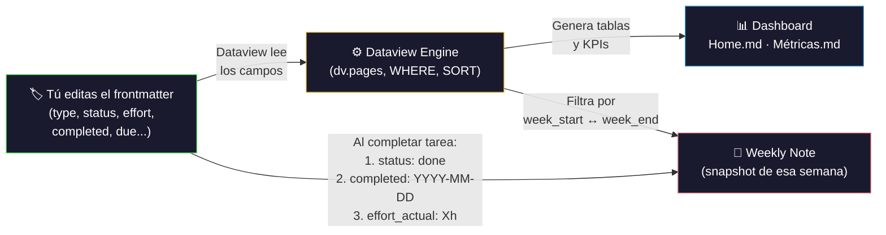

## 1. Requisitos Previos

| Requisito | Dónde obtenerlo |
|-----------|-----------------|
| **Git** (≥ 2.39) | https://git-scm.com/downloads |
| **Obsidian** (≥ 1.5) | https://obsidian.md/download |
| **Cuenta GitHub** | https://github.com (con acceso al repo) |
| **Personal Access Token (PAT)** | GitHub → Settings → Developer Settings → Tokens |

### 1.1 Crear Personal Access Token (PAT) en GitHub

1. Abre https://github.com/settings/tokens
2. Clic en **"Generate new token"** → selecciona **"Generate new token (classic)"**
3. En **Note** escribe: `Obsidian RAICES_VIVAS`
4. En **Expiration** selecciona: `90 days` (o `No expiration` si prefieres)
5. Marca los scopes:
   - ✅ `repo` (acceso completo a repositorios privados)
6. Clic en **"Generate token"**
7. **COPIA EL TOKEN INMEDIATAMENTE** — no se muestra de nuevo
8. Guárdalo en un lugar seguro (gestor de contraseñas o archivo local)

---

## 2. Clonar el Repositorio

Abre una **terminal** (Terminal en Linux/Mac, Git Bash en Windows):

```bash
cd ~/Documents
git clone https://github.com/yonrasgg/RAICES_VIVAS.git
```

Si pide usuario y contraseña:
- **Username:** tu usuario de GitHub
- **Password:** pega tu **PAT** (NO tu contraseña de GitHub)

Para que no vuelva a pedir credenciales:
```bash
git config --global credential.helper store
```

---

## 3. Abrir el Vault en Obsidian

1. Abre **Obsidian**
2. En la pantalla de inicio, clic en **"Open folder as vault"** (Abrir carpeta como vault)
3. Navega hasta: `~/Documents/RAICES_VIVAS`
4. Clic en **"Abrir"** / **"Open"**
5. Si aparece un aviso sobre **"Trust author and enable plugins"**:
   - Clic en **"Trust author and enable plugins"** ✅
   - Esto activa los 22 plugins que el proyecto necesita

> ⚠️ **IMPORTANTE:** Si no confías en los plugins, el Dashboard, las métricas, los templates y las automatizaciones **NO funcionarán**.

---

## 4. Configurar el Plugin Git (obsidian-git)

El plugin ya viene configurado en el vault. Verifica que funciona:

1. Presiona `Ctrl+P` (o `Cmd+P` en Mac) para abrir la **Paleta de Comandos**
2. Escribe: `Git: Pull`
3. Selecciona **"Obsidian Git: Pull"** presionando `Enter`
4. Debe aparecer una notificación: *"Pull successful"* o *"Already up to date"*

### Configuración automática (ya incluida):

| Parámetro | Valor | Qué hace |
|-----------|-------|----------|
| Auto pull interval | 10 min | Trae cambios del repo cada 10 minutos |
| Auto commit interval | 10 min | Commitea cambios locales cada 10 minutos |
| Auto push interval | 10 min | Sube cambios al repo cada 10 minutos |
| Commit message | `vault backup: {{date}}` | Mensaje automático con fecha |
| Pull on startup | ✅ Activado | Trae cambios al abrir Obsidian |
| Push on backup | ✅ Activado | Sube al hacer commit |

### Si el auto-sync NO funciona:

1. `Ctrl+P` → escribe `Git: Open source control view` → `Enter`
2. Revisa si hay errores en rojo
3. Si dice "Authentication failed": repite el paso de PAT (Sección 1.1)
4. Si dice "Git is not ready": cierra y reabre Obsidian

---

## 5. Estructura del Vault

```
RAICES_VIVAS/
├── 00-Dashboard/         ← Home.md (se abre al iniciar), Métricas, Roadmap
├── 01-Proyecto/          ← Charter, Equipo, Plan, Workflow, Finanzas, ADRs, Riesgos
├── 02-Investigación/     ← Contextos (EDU, SAB, SAL), Entrevistas, Fuentes
├── 03-Requerimientos/    ← RTM, RF (EDU/SAB/SAL), RNF
├── 04-Arquitectura/      ← WBS, Stack, Modelo de Datos, Diagramas, Prototipos
├── 05-Sprints/           ← Backlog, Sprint-01..05, Tareas (T-001..T-XXX)
├── 06-Entregables/       ← Avance-1, Avance-2, Presentaciones
├── 07-Reuniones/         ← Minutas (MIN-001..MIN-XXX)
├── 08-Recursos/          ← Imágenes, PDFs, Datos, Scripts
├── 09-QA/                ← Control de calidad
├── 99-Templates/         ← 11 templates (NUNCA editar directamente)
└── Daily Notes/          ← Notas semanales automáticas
```

---

## 6. Operaciones Diarias — Paso a Paso

### 6.1 Crear una Nueva Tarea

**Cuándo usar:** Cuando se necesita registrar trabajo nuevo para un sprint.

1. Presiona `Ctrl+P` para abrir la Paleta de Comandos
2. Escribe: `QuickAdd`
3. Selecciona: **"QuickAdd: Run QuickAdd"** → presiona `Enter`
4. Aparece una lista de 12 macros → selecciona: **"Nueva Tarea"** → `Enter`
5. Aparecen prompts secuenciales — completa cada uno:

| Prompt | Qué escribir | Ejemplo |
|--------|-------------|---------|
| **Título** | Nombre descriptivo de la tarea | `Diseñar modelo ER del módulo EDU` |
| **Assignee (responsable)** | Nombre del integrante | `Geovanny` |
| **Sprint** | Número de sprint | `Sprint-02` |
| **Módulo** | EDU, SAB, SAL o Transversal | `EDU` |
| **Prioridad** | must, should, could | `must` |
| **Fase** | investigación, análisis, diseño, etc. | `diseño` |
| **Esfuerzo (horas)** | Estimación en horas | `4` |
| **Requerimiento relacionado** | ID del RF/RNF | `RF-EDU-01` |

6. Se crea automáticamente el archivo con ID `T-XXX` (calculado por Templater)
7. La tarea se ubica en `05-Sprints/Sprint-XX/T-XXX.md`
8. **Verificación:** Abre la tarea y confirma que el frontmatter se llenó correctamente

### 6.2 Cambiar el Estado de una Tarea

**Cuándo usar:** Al empezar, completar, o bloquear una tarea.

**Opción A — Editar frontmatter directamente:**
1. Abre la tarea (ej: `T-015.md`)
2. Clic en el campo `status:` en el frontmatter (zona gris superior)
3. Cambia el valor. Valores válidos:
   - `todo` → Pendiente
   - `in-progress` → En progreso
   - `review` → En revisión
   - `done` → Completada
   - `blocked` → Bloqueada
4. Si cambias a `done`, agrega también: `completed: 2026-03-01` (fecha actual)

**Opción B — Usar Meta Bind (si la nota tiene controles interactivos):**
1. Abre la tarea
2. Busca la sección **"Control Rápido"** (tabla con dropdowns)
3. Haz clic en el dropdown de **Estado**
4. Selecciona el nuevo estado de la lista
5. El frontmatter se actualiza automáticamente

**Opción C — Desde el Kanban (Backlog):**
1. Abre [[05-Sprints/Backlog|Backlog]]
2. Arrastra la tarjeta de una columna a otra (Todo → In Progress → Done)
3. El estado se sincroniza automáticamente

### 6.3 Crear una Nueva Minuta

**Cuándo usar:** Para documentar cada reunión del equipo.

1. `Ctrl+P` → `QuickAdd` → `Enter`
2. Selecciona: **"Nueva Minuta"** → `Enter`
3. Completa:
   - **Título:** nombre de la reunión (ej: `Revisión Sprint 01`)
   - **Fecha:** formato YYYY-MM-DD (ej: `2026-03-01`)
   - **Asistentes:** nombres separados por coma (ej: `Geovanny, Elkin, Santiago`)
4. Se crea `07-Reuniones/MIN-XXX.md` con template completo
5. **Dentro de la minuta**, completa estas secciones:
   - **Agenda:** temas a discutir
   - **Decisiones:** escribe cada decisión tomada
   - **Riesgos Identificados:** cualquier riesgo nuevo
   - **Action Items:** checklist de tareas que salieron de la reunión

### 6.4 Promover un Action Item a Tarea Formal

**Cuándo usar:** Después de una reunión, para convertir action items en tareas rastreables.

1. `Ctrl+P` → `QuickAdd` → `Enter`
2. Selecciona: **"📋 Promover Action Item"** → `Enter`
3. Completa:
   - **Título:** el texto del action item
   - **Minuta origen:** ID de la minuta (ej: `MIN-001`)
   - **Responsable:** quién lo ejecutará
   - **Sprint:** en qué sprint se trabajará
4. Se crea una nueva tarea `T-XXX.md` con campo `source: "MIN-001"`
5. **Trazabilidad:** La tarea referencia la minuta de origen

### 6.5 Promover una Decisión a ADR Formal

**Cuándo usar:** Cuando una decisión importante de reunión necesita documentación formal.

1. `Ctrl+P` → `QuickAdd` → `Enter`
2. Selecciona: **"🏗️ Promover Decisión"** → `Enter`
3. Completa:
   - **Título:** la decisión (ej: `Usar PostgreSQL como base de datos`)
   - **Minuta origen:** ID de la minuta (ej: `MIN-001`)
   - **Estado:** `proposed` o `accepted`
4. Se crea `01-Proyecto/Decisiones/ADR-XXX.md` con ID automático
5. **Dentro del ADR**, completa: Contexto, Opciones, Justificación, Consecuencias

### 6.6 Promover un Riesgo a Nota Formal

**Cuándo usar:** Cuando se identifica un riesgo en reunión que necesita seguimiento.

1. `Ctrl+P` → `QuickAdd` → `Enter`
2. Selecciona: **"⚠️ Promover Riesgo"** → `Enter`
3. Completa:
   - **Título:** descripción del riesgo
   - **Minuta origen:** ID de la minuta
   - **Probabilidad:** 1 (baja) a 5 (muy alta)
   - **Impacto:** 1 (bajo) a 5 (muy alto)
   - **Responsable (owner):** quién lo monitorea
4. La **severidad se calcula automáticamente** (prob × impacto)
5. Se crea `01-Proyecto/Riesgos/RSK-XXX.md` con plan de respuesta vacío para completar

### 6.7 Crear un Requerimiento Funcional

1. `Ctrl+P` → `QuickAdd` → `Enter`
2. Selecciona: **"Nuevo RF"** → `Enter`
3. Completa:
   - **Módulo:** `EDU`, `SAB` o `SAL`
   - **Título:** nombre del requerimiento
   - **Prioridad MoSCoW:** `must`, `should`, `could`, `wont`
   - **Stakeholder:** quién lo necesita
4. Se crea en `03-Requerimientos/Funcionales/<MÓDULO>/RF-<MOD>-XX.md`

### 6.8 Crear un Requerimiento No Funcional

1. `Ctrl+P` → `QuickAdd` → `Enter`
2. Selecciona: **"Nuevo RNF"** → `Enter`
3. Completa:
   - **Título:** nombre del requisito
   - **Categoría:** rendimiento, seguridad, usabilidad, etc.
   - **Prioridad MoSCoW:** `must`, `should`, `could`, `wont`
4. Se crea en `03-Requerimientos/No Funcionales/RNF-XX.md`

### 6.9 Registrar una Entrevista

1. `Ctrl+P` → `QuickAdd` → `Enter`
2. Selecciona: **"Entrevista"** → `Enter`
3. Completa los campos solicitados (participante, fecha, contexto)
4. Se crea en `02-Investigación/Entrevistas/`

### 6.10 Sprint Planning / Sprint Review

**Sprint Planning:**
1. `Ctrl+P` → `QuickAdd` → **"Sprint Planning"** → `Enter`
2. Completa: número de sprint, fechas, metas
3. Se crea en `05-Sprints/Sprint-XX/Sprint-XX-Planning.md`

**Sprint Review:**
1. `Ctrl+P` → `QuickAdd` → **"Sprint Review"** → `Enter`
2. Completa: número de sprint, logros, obstáculos
3. Se crea en `05-Sprints/Sprint-XX/Sprint-XX-Review.md`

---

## 7. Flujo de Trabajo Diario

### Al iniciar sesión

1. **Abre Obsidian** — el plugin Git hace **auto-pull** automáticamente al iniciar
2. **Espera 5 segundos** para que Obsidian cargue todos los plugins
3. El **Dashboard** ([[00-Dashboard/Home|Home]]) se abre automáticamente (plugin Homepage)
4. **Revisa:**
   - 📊 KPIs en la parte superior (progreso, sprint actual, riesgos)
   - 🏃 Tareas pendientes (tabla dinámica)
   - ⚠️ Riesgos activos
5. **Planifica tu trabajo:** revisa las tareas asignadas a ti

### Durante el trabajo

1. **Abre tu tarea actual** desde el Dashboard o desde el Backlog
2. **Cambia el estado** a `in-progress` (ver 6.2)
3. **Trabaja en la tarea** — edita los archivos necesarios
4. **Al terminar**, cambia el estado a `done` y agrega `completed: YYYY-MM-DD`
5. Los cambios se **sincronizan automáticamente** cada 10 minutos

### Al terminar sesión

- **No necesitas hacer nada** — el auto-sync guarda y sube cada 10 min
- **Para forzar un sync inmediato:**
  1. `Ctrl+P` → escribe: `Git: Commit all changes` → `Enter`
  2. `Ctrl+P` → escribe: `Git: Push` → `Enter`
  3. Debe aparecer: *"Push successful"*

---

## 8. Comandos Git Útiles desde Obsidian

| Acción | Teclas | Comando a seleccionar |
|--------|--------|----------------------|
| Abrir paleta de comandos | `Ctrl+P` | — |
| Traer cambios del repo | `Ctrl+P` → escribe `Git Pull` | **Obsidian Git: Pull** |
| Subir tus cambios | `Ctrl+P` → escribe `Git Push` | **Obsidian Git: Push** |
| Commitear todo ahora | `Ctrl+P` → escribe `Git Commit` | **Obsidian Git: Commit all changes** |
| Ver panel de cambios | `Ctrl+P` → escribe `Git Source` | **Obsidian Git: Open source control view** |
| Ver historial de archivo | `Ctrl+P` → escribe `Git History` | **Obsidian Git: View file history** |
| Abrir QuickAdd | `Ctrl+P` → escribe `QuickAdd` | **QuickAdd: Run QuickAdd** |

---

## 9. Reglas de Colaboración (No Negociables)

| # | Regla | Por qué |
|---|-------|---------|
| 1 | **No editar el mismo archivo simultáneamente** | Evita conflictos de merge |
| 2 | **Coordinar por chat antes de editar archivos compartidos** | Reducir colisiones |
| 3 | **Usar QuickAdd para crear notas** | Garantiza frontmatter correcto y Auto-ID |
| 4 | **No editar dashboards ni queries manualmente** | Se actualizan solos vía Dataview |
| 5 | **No borrar archivos sin avisar al equipo** | Especialmente templates y configs |
| 6 | **Si hay conflicto de merge** → avisar al equipo inmediatamente | No resolver solo si no estás seguro |
| 7 | **Mantener el campo `status:` actualizado** en tus tareas | Dashboards dependen de este campo |
| 8 | **Siempre usar las convenciones de frontmatter** | Ver [[Guía de Workflow]] §4 |

---

## 10. Frontmatter — El Motor de Automatización del Vault

El frontmatter (bloque YAML entre `---` al inicio de cada nota) es la **base de datos del proyecto**. Los dashboards, métricas, weekly notes y tablas automáticas leen estos campos via Dataview. Si un campo está vacío o incorrecto, la nota **desaparece** del sistema.

> 📌 **Referencia completa:** [[Guía de Workflow]] §4 contiene los 12 esquemas detallados con campos REQUERIDO/RECOMENDADO/OPCIONAL y el mapa campo→automatización. Esta sección es un resumen rápido.

### 10.1 Tarjeta de Referencia Rápida por Tipo de Nota

#### Tarea (`type: task`) — La más importante

| Campo | Ejemplo | ¿Cuándo llenarlo? | Si falta... |
|-------|---------|-------------------|-------------|
| `type: task` | — | Al crear (automático) | ❌ Invisible para TODO el sistema |
| `id: T-XXX` | `T-026` | Al crear (auto-ID) | ❌ No se puede referenciar |
| `status` | `todo`, `in-progress`, `done` | **Cada vez que cambia** | ❌ No aparece en Dashboard ni Kanban |
| `priority` | `high`, `medium`, `low` | Al crear | ⚠️ Sin ordenamiento correcto |
| `assignee` | `Geovanny` | Al crear | ❌ Costo = ₡0, sin filtro por persona |
| `effort: "8h"` | `"4h"` | Al crear (estimación) | ⚠️ Horas estimadas = 0 |
| `effort_actual: "10h"` | `"6h"` | **Al completar la tarea** | ❌ Horas reales = 0, costo = 0 |
| `due` | `2026-03-14` | Al crear | ❌ No aparece en weekly "Pendientes" ni Calendar |
| `completed` | `2026-03-13` | **Al cambiar a `done`** | ❌ No aparece en weekly "Completadas" |
| `sprint` | `Sprint-02` | Al crear | ⚠️ Tarea sin sprint = flotante |

> **⚠️ Error #1 más común:** Cambiar `status: done` pero olvidar llenar `completed: YYYY-MM-DD` y `effort_actual: "Xh"`. Esto hace que la tarea no aparezca en la weekly note y el costo se calcule como ₡0.

> **⚠️ Error #2 más común:** Escribir `effort: 8h` sin comillas. Dataview lo interpreta como Duration (objeto), no string. **Siempre** usar `effort: "8h"` con comillas.

**Checklist al completar una tarea:**
1. ✅ `status: done`
2. ✅ `completed: 2026-03-01` (fecha real)
3. ✅ `effort_actual: "Xh"` (horas reales)

#### Riesgo (`type: risk`)

| Campo | Lo que alimenta | Si falta... |
|-------|----------------|-------------|
| `type: risk` | Tabla de riesgos en Dashboard y Weekly | ❌ Invisible |
| `status: open` | Filtro "Riesgos Activos" | ❌ No aparece como activo |
| `severity` | Ordenamiento por urgencia | ⚠️ Sin clasificación |
| `review_date` | Alertas de revisión vencida | ⚠️ No se sabe cuándo revisar |

#### ADR (`type: adr`)

| Campo | Lo que alimenta | Si falta... |
|-------|----------------|-------------|
| `type: adr` | KPI "ADRs" en Dashboard (⚠️ NO usar `type: decision`) | ❌ Invisible |
| `date` | Weekly Note "ADR esta semana" | ❌ No aparece en weekly |
| `status` | Conteo por estado en Métricas | ⚠️ Sin clasificación |

#### Weekly Note (`type: weekly`)

| Campo | Lo que alimenta | Si falta... |
|-------|----------------|-------------|
| `week_start: 2026-02-23` | TODAS las queries de la weekly note | ❌ Muestra TODO el vault |
| `week_end: 2026-03-01` | TODAS las queries de la weekly note | ❌ Muestra TODO el vault |

> Las weekly notes se crean automáticamente con Periodic Notes. El template calcula `week_start` y `week_end` usando Templater. **No hay que llenar estos campos manualmente.**

#### Reunión (`type: meeting`)

| Campo | Lo que alimenta | Si falta... |
|-------|----------------|-------------|
| `type: meeting` | Conteo de reuniones en Weekly y Métricas | ❌ Invisible |
| `date` | Weekly "Reuniones esta semana" | ❌ No aparece en weekly |
| `id: MIN-XXX` | Trazabilidad (`source:` en tareas/ADRs/riesgos) | ⚠️ Sin vínculo |

### 10.2 Diagrama: Cómo Fluyen los Datos



> 📌 **Para la referencia completa de los 12 tipos de nota, todos los campos, y el mapa exacto de qué campo alimenta qué automatización:** [[Guía de Workflow#4. Esquema de Frontmatter — Referencia Definitiva|Guía de Workflow §4]].

---

## 11. Resolución de Problemas Comunes

| Problema | Causa probable | Solución paso a paso |
|----------|----------------|---------------------|
| "Git is not ready" | Plugin no inicializó bien | 1. Cierra Obsidian completamente. 2. Reabre Obsidian. 3. Espera 10 seg. |
| Push pide usuario/contraseña | Credenciales no guardadas | 1. Abre terminal. 2. Ejecuta: `git config --global credential.helper store`. 3. Haz `git push` manual una vez. 4. Ingresa usuario + PAT. |
| Plugins no cargan | Cache corrupto | 1. `Ctrl+P` → `Reload app without saving` → `Enter`. 2. Si persiste: cierra, borra `.obsidian/workspace.json`, reabre. |
| Conflicto de merge | Dos personas editaron el mismo archivo | 1. `Ctrl+P` → `Git: Pull` (intenta auto-merge). 2. Si falla: abrir terminal → `git pull --rebase`. 3. Si hay conflicto: buscar `<<<<<<<` en el archivo → resolver → commit. |
| Banner no aparece | Campo `banner_src:` incorrecto | 1. Abrir frontmatter. 2. Verificar que la ruta del archivo existe en `08-Recursos/Imágenes/`. |
| Dashboard vacío | Dataview no ha indexado | 1. `Ctrl+P` → `Dataview: Force refresh all views` → `Enter`. 2. Espera 5 seg. |
| QuickAdd no muestra macros | Plugin no cargó correctamente | 1. `Ctrl+P` → `Reload app without saving`. 2. Verificar: Settings → Community Plugins → QuickAdd está habilitado (toggle azul). |
| Tarea no aparece en Dashboard | Frontmatter incorrecto | 1. Abrir la tarea. 2. Verificar que tiene `type: task`. 3. Verificar `status:` tiene un valor válido. |
| Checklist panel vacío | Tag incorrecto | 1. Verificar que las tareas tienen `tags: tarea` en frontmatter. 2. Verificar que están en `05-Sprints/`. |

---

## 12. Editar desde el Navegador (Emergencia)

Si **no puedes instalar Obsidian** en alguna máquina (computadora de la universidad, etc.):

1. Abre el navegador web
2. Ve a **https://github.com/yonrasgg/RAICES_VIVAS**
3. Presiona la tecla **`.`** (punto) en tu teclado
4. Se abre **VS Code Web** — puedes editar cualquier archivo Markdown
5. Los cambios se commitean directamente al repo
6. ⚠️ **Limitación:** No tendrás Dataview, QuickAdd ni templates — solo edición básica

---

## 13. Contacto del Equipo

| Integrante | Rol | Módulo | Contacto |
|------------|-----|--------|----------|
| **Geovanny** | Project Lead / Arquitecto | EDU + Transversal | GitHub: @yonrasgg |
| **Elkin** | Líder de Investigación / Analista | SAB | Coordinar por chat grupal |
| **Santiago** | Líder de QA / Analista | SAL | Coordinar por chat grupal |

---

## 14. Tabla de Atajos Esenciales

| Atajo | Acción | Cuándo usar |
|-------|--------|-------------|
| `Ctrl+P` | Paleta de comandos | Para CUALQUIER comando |
| `Ctrl+O` | Abrir archivo rápido | Buscar cualquier nota por nombre |
| `Ctrl+E` | Alternar edición/vista | Ver el Markdown renderizado |
| `Ctrl+N` | Nueva nota vacía | Solo para notas temporales (preferir QuickAdd) |
| `Ctrl+Shift+F` | Buscar en todo el vault | Encontrar texto en cualquier archivo |
| `Ctrl+Click` | Abrir link en nueva pestaña | Navegar sin perder la nota actual |
| `Alt+←` / `Alt+→` | Navegar atrás/adelante | Como un navegador web |
| `Ctrl+,` | Abrir configuración | Ajustar plugins y opciones |

---

## 15. Resumen de Macros QuickAdd Disponibles

| # | Macro | Qué crea | Dónde se guarda |
|---|-------|---------|-----------------|
| 1 | **Nueva Tarea** | Tarea `T-XXX.md` con auto-ID | `05-Sprints/Sprint-XX/` |
| 2 | **Nuevo RF** | Requerimiento funcional | `03-Requerimientos/Funcionales/<MOD>/` |
| 3 | **Nuevo RNF** | Requerimiento no funcional | `03-Requerimientos/No Funcionales/` |
| 4 | **Nueva Minuta** | Minuta de reunión `MIN-XXX.md` | `07-Reuniones/` |
| 5 | **Nuevo ADR** | Decisión arquitectónica `ADR-XXX.md` | `01-Proyecto/Decisiones/` |
| 6 | **Nuevo Riesgo** | Riesgo formal `RSK-XXX.md` | `01-Proyecto/Riesgos/` |
| 7 | **Entrevista** | Nota de entrevista | `02-Investigación/Entrevistas/` |
| 8 | **Sprint Planning** | Planificación de sprint | `05-Sprints/Sprint-XX/` |
| 9 | **Sprint Review** | Revisión de sprint | `05-Sprints/Sprint-XX/` |
| 10 | **📋 Promover Action Item** | Tarea desde action item de minuta | `05-Sprints/Sprint-XX/` |
| 11 | **🏗️ Promover Decisión** | ADR desde decisión de minuta | `01-Proyecto/Decisiones/` |
| 12 | **⚠️ Promover Riesgo** | Riesgo desde minuta | `01-Proyecto/Riesgos/` |

---

> 📌 **¿Dudas sobre convenciones avanzadas?** Consulta [[Guía de Workflow]] para la referencia completa de frontmatter, tags, emojis, diagramas y flujos detallados.
