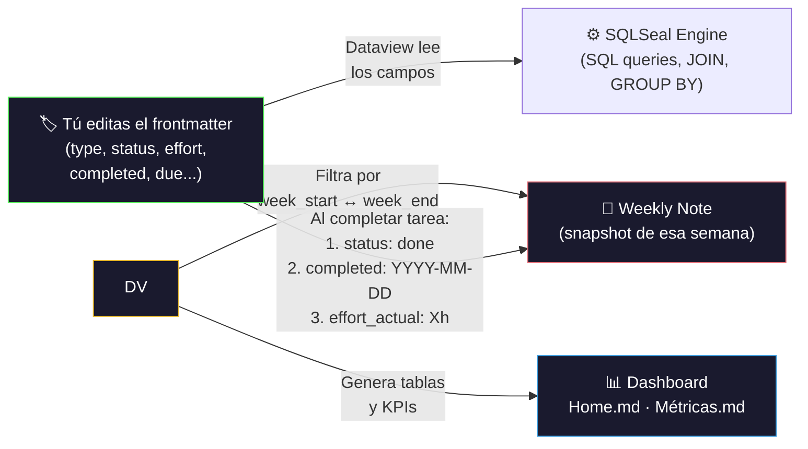

## 3. Abrir el Vault en Obsidian

1. Abre **Obsidian**
2. En la pantalla de inicio, clic en **"Open folder as vault"** (Abrir carpeta como vault)
3. Navega hasta: `~/Documents/RAICES_VIVAS`
4. Clic en **"Abrir"** / **"Open"**
5. Si aparece un aviso sobre **"Trust author and enable plugins"**:
   - Clic en **"Trust author and enable plugins"** ✅
   - Esto activa los 22 plugins que el proyecto necesita

> ⚠️ **IMPORTANTE:** Si no confías en los plugins, el Dashboard, las métricas, los templates y las automatizaciones **NO funcionarán**.

---

## 4. Configurar el Plugin Git (obsidian-git)

El plugin ya viene configurado en el vault. **No hay que configurar nada extra.**

### Autenticación (cada vez que se abre el vault)

Al abrir Obsidian (o al hacer la primera operación Pull/Push), aparece una **ventanita emergente** pidiendo credenciales. Esto es **normal** y ocurre por seguridad:

1. En **Username:** escribí tu **usuario de GitHub**
2. En **Password:** escribí tu **contraseña de GitHub**
3. Listo — el plugin sincroniza automáticamente

> 💡 Este popup aparece **cada vez que abrís el vault**. Es el comportamiento esperado. Simplemente ingresá tus credenciales de GitHub y continuá trabajando.

### Verificar que funciona:

1. Después de ingresar las credenciales, presioná `Ctrl+P` (o `Cmd+P` en Mac)
2. Escribí: `Git: Pull`
3. Seleccioná **"Obsidian Git: Pull"** presionando `Enter`
4. Debe aparecer una notificación: *"Pull successful"* o *"Already up to date"*

### Configuración automática (ya incluida):

| Parámetro | Valor | Qué hace |
|-----------|-------|----------|
| Auto pull interval | 10 min | Trae cambios del repo cada 10 minutos |
| Auto commit interval | 10 min | Commitea cambios locales cada 10 minutos |
| Auto push interval | 10 min | Sube cambios al repo cada 10 minutos |
| Commit message | `vault backup: {{date}}` | Mensaje automático con fecha |
| Pull on startup | ✅ Activado | Trae cambios al abrir Obsidian |
| Push on backup | ✅ Activado | Sube al hacer commit |

### Si el auto-sync NO funciona:

1. `Ctrl+P` → escribe `Git: Open source control view` → `Enter`
2. Revisa si hay errores en rojo
3. Si dice "Authentication failed": verificá que tu usuario y contraseña de GitHub son correctos (probá iniciando sesión en https://github.com desde el navegador)
4. Si dice "Git is not ready": cierra y reabre Obsidian

---

## 5. Git Hooks (Información Histórica)

> [!info] **Estado actual:** El pre-commit hook está **deshabilitado** desde la migración a Jira (2026-03-04). El frontmatter ahora se gestiona a través del plugin **jira-sync** y los templates de Templater. No es necesario ejecutar `setup-hooks.sh`.

El script `08-Recursos/scripts/setup-hooks.sh` está disponible como referencia histórica pero **no hace falta ejecutarlo**. La integridad del frontmatter se garantiza por:

1. **Templates Templater** — Generan frontmatter correcto al crear notas
2. **Plugin jira-sync** — Sincroniza y valida campos al interactuar con Jira
3. **Convenciones del equipo** — Documentadas en [[Guía de Workflow]] §4

> [!tip] Si ves un archivo con frontmatter roto, corrígelo manualmente siguiendo la [[Guía de Workflow#4. Esquema de Frontmatter — Referencia Definitiva|referencia de frontmatter en §4]].

---

## 6. Estructura del Vault — Guía Completa

> Cada directorio tiene un propósito específico. Usar la carpeta correcta es **CRÍTICO**: las queries de Dataview filtran por ruta (`FROM "05-Sprints"`, etc.), así que una nota en la carpeta equivocada simplemente **no aparece** en los dashboards.

### 📊 `00-Dashboard/` — Centro de Control

| Archivo | Qué hace | Cómo se actualiza |
|---------|----------|-------------------|
| `Home.md` | Dashboard principal: KPIs, botones Quick Action, Jira hierarchy, navegación, milestones | **Automático** vía Dataview — No editar queries manualmente |
| `Métricas.md` | Análisis profundo: Lean Six Sigma, velocidad por sprint, costos, Quality Scorecard | **Automático** vía Dataview |
| `Roadmap.md` | Gantt visual (Mermaid) con milestones del proyecto | **Manual** — actualizar fechas y estados al cerrar cada fase |

> 💡 **Home.md se abre automáticamente al iniciar Obsidian** (plugin Homepage). Es tu punto de partida cada día. Desde ahí podés navegar a cualquier parte del proyecto con un solo clic.

### 📁 `01-Proyecto/` — Gobierno y Gestión

| Archivo / Carpeta | Contenido | Template | Cuándo actualizar |
|-------------------|-----------|----------|-------------------|
| `Charter.md` | Carta del proyecto (alcance, objetivos, restricciones) | — | Referencia constante, solo se edita al inicio |
| `Alcance.md` | Declaración de alcance formal y exclusiones | — | Referencia |
| `Equipo.md` | Integrantes, roles, módulos, contacto Jira | — | Al agregar/cambiar integrantes o asignaciones |
| `Stakeholders.md` | Partes interesadas, niveles de influencia, expectativas | — | Referencia |
| `Plan de Gestión.md` | Plan maestro: stack tecnológico, plugins, automatización, Jira | — | Referencia |
| `Guía de Workflow.md` | **La referencia técnica definitiva** (18 secciones, v8.0) | — | Cuando necesitas detalles avanzados de frontmatter, naming, queries |
| `Onboarding.md` | **Este documento** — guía para incorporar nuevos integrantes | — | Al cambiar procesos |
| `Finanzas.md` | Gestión financiera: tarifas, presupuesto, costos por sprint | — | Al actualizar tarifas o cerrar sprints |
| `Glosario.md` | Términos técnicos y de negocio del proyecto | — | Al introducir nuevos conceptos |
| `Propuesta de Gestión.md` | Propuesta original del proyecto (documento histórico) | — | No editar — referencia histórica |
| `Decisiones/` | ADRs (Architecture Decision Records): `ADR-001`..`ADR-XXX` | `_template-adr.md` | Al tomar decisiones arquitectónicas o estratégicas |
| `Riesgos/` | Registro de riesgos formales: `RSK-001`..`RSK-XXX` | `_template-riesgo.md` | Al identificar nuevos riesgos o actualizar existentes |

### 🔬 `02-Investigación/` — Datos e Investigación de Campo

| Carpeta | Contenido | Template |
|---------|-----------|----------|
| `Contexto/` | 4 documentos de contexto: Educación, Saberes Ancestrales, Salud Comunitaria, Mapa Territorios | — |
| `Encuestas/` | Instrumentos y resultados de encuestas a usuarios | — |
| `Entrevistas/` | Transcripciones y notas de entrevistas a stakeholders | `_template-entrevista.md` |
| `Fuentes/` | Bibliografía, fuentes secundarias, papers de referencia | — |
| `Observaciones/` | Notas de observación de campo | — |

### 📋 `03-Requerimientos/` — Especificaciones

| Carpeta / Archivo | Contenido | Template |
|-------------------|-----------|----------|
| `_RTM.md` | **Matriz de Trazabilidad** — query automática que cruza RFs con tareas y validación | — (automático) |
| `Funcionales/EDU/` | RFs módulo Educación: `RF-EDU-01`..`RF-EDU-06` | `_template-requerimiento-funcional.md` |
| `Funcionales/SAB/` | RFs módulo Saberes: `RF-SAB-01`..`RF-SAB-05` | `_template-requerimiento-funcional.md` |
| `Funcionales/SAL/` | RFs módulo Salud: `RF-SAL-01`..`RF-SAL-05` | `_template-requerimiento-funcional.md` |
| `No Funcionales/` | RNFs transversales: `RF-TRANS-01`..`RF-TRANS-03` | `_template-requerimiento-nofuncional.md` |

> 💡 **Cada RF está vinculado a una Story en Jira** (ej: `RF-EDU-01` → `RV-4`). La trazabilidad completa se ve en la [[03-Requerimientos/_RTM|RTM]].

### 🏗️ `04-Arquitectura/` — Diseño Técnico

| Archivo / Carpeta | Contenido |
|-------------------|-----------|
| `WBS.md` | Work Breakdown Structure vinculada a Epics Jira |
| `Stack Tecnológico.md` | Tecnologías seleccionadas con justificación |
| `Visión General.md` | Arquitectura de alto nivel y diagrama C4 |
| `Modelo de Datos.md` | Modelos entidad-relación por módulo |
| `Diagramas/` | Diagramas técnicos (C4, sequence, flujo, deployment) |
| `Prototipos/` | Wireframes y mockups UI (Avance 2) |

### 🏃 `05-Sprints/` — Ejecución Ágil

> ⚠️ **LA MÁS IMPORTANTE para queries.** Todas las notas de trabajo deben estar aquí.

| Carpeta / Archivo | Contenido | Template |
|-------------------|-----------|----------|
| `Backlog.md` | Kanban visual con todas las tareas clasificadas por estado | — (manual) |
| `Epics/` | Notas de Epics Jira: `RV-1.md`, `RV-2.md`, `RV-3.md` | `_template-epic.md` |
| `Stories/` | Notas de User Stories Jira: `RV-4.md`..`RV-9.md` | `_template-user-story.md` |
| `Sprint-01/` | Sprint 1 (cerrado): Planning + 20 tareas `T-001`..`T-020` | `_template-tarea.md` |
| `Sprint-02/` | Sprint 2 (activo): Planning + 5 tareas `T-021`..`T-025` | `_template-tarea.md` |
| `Sprint-03/` a `Sprint-05/` | Sprints futuros (vacíos) | `_template-sprint-planning.md` |

> ⚠️ **REGLA ABSOLUTA:** Toda nota con `type: task` o `type: subtask` **DEBE** estar en `05-Sprints/Sprint-XX/`. Las queries del Dashboard filtran `FROM "05-Sprints"`. Una tarea fuera de esta ruta es **INVISIBLE** para el sistema.

### 📄 `06-Entregables/` — Documentos de Entrega

| Carpeta | Contenido |
|---------|-----------|
| `Avance-1/` | Documento integrado del Avance 1 (entregado 2026-02-25) |
| `Avance-2/` | Documento del Avance 2 (en progreso) |
| `Presentaciones/` | Slides y presentaciones formales |

### 📝 `07-Reuniones/` — Minutas

Contiene todas las minutas de reunión (`MIN-001`..`MIN-XXX`).
- **Template:** `_template-minuta.md`
- **Crear via:** QuickAdd → **Nueva Minuta**
- **Promover Items:** Desde una minuta podés promover action items a tareas, decisiones a ADRs, y riesgos a notas formales

### 📦 `08-Recursos/` — Assets

| Carpeta | Contenido |
|---------|-----------|
| `Imágenes/` | Capturas, logos, banners de portada (`cover-*.png`) |
| `PDFs/` | Documentos externos de referencia |
| `Datos/` | Datasets y archivos de datos |
| `scripts/` | Scripts de automatización: `generate_covers.py` (genera banners), `setup-hooks.sh` (histórico) |

### ✅ `09-QA/` — Control de Calidad

Contiene `README.md` con las reglas de QA del vault: convenciones de naming, frontmatter obligatorio, checklist pre-commit.

### 📐 `99-Templates/` — Plantillas (17 templates)

> ⚠️ **NUNCA editar estos archivos directamente.** Son plantillas que usa Templater/QuickAdd. Si se modifican, TODAS las notas futuras se verán afectadas.

### 📅 `Daily Notes/` — Notas Semanales

Notas semanales automáticas generadas por Periodic Notes (cada lunes). Formato: `YYYY-WXX.md`. Contienen queries Dataview que muestran el snapshot de la semana: tareas completadas, riesgos, decisiones, reuniones.

---

### 6.1 Taxonomía de Tags

> Los tags se asignan en el frontmatter (`tags:` array YAML). Son usados para filtrar, agrupar y buscar notas. **Siempre** usar los tags exactos de esta lista.

#### Tags de Tipo de Contenido

| Tag | Se aplica a | Ejemplo de nota |
|-----|------------|-----------------|
| `tarea` | Todas las tareas (`type: task`) | `T-001.md` |
| `epic` | Epics Jira (`type: epic`) | `RV-1.md` |
| `story` | User Stories Jira (`type: story`) | `RV-4.md` |
| `adr` | Decisiones arquitectónicas | `ADR-001.md` |
| `riesgo` | Riesgos formales | `RSK-001.md` |
| `reunion` | Minutas de reunión | `MIN-001.md` |
| `decisión` | Decisiones (tag complementario) | `ADR-001.md` |
| `dashboard` | Dashboards | `Home.md`, `Métricas.md` |
| `metricas` | Dashboard de métricas | `Métricas.md` |
| `guia` | Documentos guía | `Onboarding.md`, `Workflow.md` |
| `onboarding` | Este documento | `Onboarding.md` |

#### Tags de Sprint

| Tag | Significado |
|-----|------------|
| `sprint` | Tag base para cualquier nota de sprint |
| `sprint-01` | Tarea pertenece a Sprint 1 |
| `sprint-02` | Tarea pertenece a Sprint 2 |
| `sprint-XX` | Patrón: siempre `sprint-` + número con 2 dígitos |

#### Tags de Módulo

| Tag | Módulo | Responsable |
|-----|--------|-------------|
| `educacion` | EDU — Educación Intercultural Bilingüe | Geovanny |
| `modulo/edu` | EDU (formato alternativo con namespace) | Geovanny |
| `modulo/sab` | SAB — Saberes Ancestrales y Patrimonio | Elkin |
| `modulo/sal` | SAL — Salud Comunitaria e Intercultural | Santiago |
| `transversal` | Aplica a todos los módulos | Equipo |

#### Tags de Fase

| Tag | Fase del SDLC |
|-----|--------------|
| `investigación` | Fase de investigación y contexto |
| `análisis` | Fase de análisis de requerimientos |
| `diseño` | Fase de diseño de arquitectura |
| `implementación` | Fase de codificación |
| `testing` | Fase de pruebas y QA |
| `integración` | Fase de integración y entrega |
| `gestión` | Tareas de gestión de proyecto |

#### Tags Especiales

| Tag | Uso |
|-----|-----|
| `lean-six-sigma` | Métricas alineadas a Lean Six Sigma |
| `moscow` | Priorización MoSCoW (must/should/could/wont) |
| `kickoff` | Reunión de kickoff del proyecto |
| `mvp` | Related al Minimum Viable Product |
| `avance-1`, `avance-2` | Pertenece a un entregable específico |

---

### 6.2 Catálogo de Templates (17 plantillas)

> Todas las plantillas están en `99-Templates/`. Se invocan vía **QuickAdd** (12 macros) o manualmente via **Templater**.

#### Templates con Macro QuickAdd (automáticos)

| # | Template | Macro QuickAdd | Qué genera | Carpeta destino | Campos clave |
|---|----------|---------------|------------|-----------------|--------------|
| 1 | `_template-tarea.md` | **Nueva Tarea** | Tarea `T-XXX.md` con auto-ID | `05-Sprints/Sprint-XX/` | type, id, status, assignee, sprint, module, priority, effort, due |
| 2 | `_template-minuta.md` | **Nueva Minuta** | Minuta `MIN-XXX.md` con auto-ID | `07-Reuniones/` | type, id, date, attendees, agenda |
| 3 | `_template-adr.md` | **Nuevo ADR** | ADR `ADR-XXX.md` con auto-ID | `01-Proyecto/Decisiones/` | type, id, status, date, deciders |
| 4 | `_template-riesgo.md` | **Nuevo Riesgo** | Riesgo `RSK-XXX.md` con auto-ID | `01-Proyecto/Riesgos/` | type, id, probability, impact, severity, owner |
| 5 | `_template-requerimiento-funcional.md` | **Nuevo RF** | RF `RF-MOD-XX.md` con auto-ID | `03-Requerimientos/Funcionales/MOD/` | type, id, module, priority, stakeholder |
| 6 | `_template-requerimiento-nofuncional.md` | **Nuevo RNF** | RNF `RNF-XX.md` con auto-ID | `03-Requerimientos/No Funcionales/` | type, id, category, priority |
| 7 | `_template-entrevista.md` | **Entrevista** | Nota de entrevista | `02-Investigación/Entrevistas/` | type, participant, date, context |
| 8 | `_template-sprint-planning.md` | **Sprint Planning** | Planning de sprint | `05-Sprints/Sprint-XX/` | sprint, goal, dates, commitment |
| 9 | `_template-sprint-review.md` | **Sprint Review** | Review de sprint | `05-Sprints/Sprint-XX/` | sprint, achievements, velocity |

#### Templates de Promoción (desde Minutas)

| # | Template | Macro QuickAdd | Qué genera | Campos extra |
|---|----------|---------------|------------|--------------|
| 10 | `_template-tarea-from-minuta.md` | **📋 Promover Action Item** | Tarea desde action item | `source: "MIN-XXX"` (trazabilidad) |
| 11 | `_template-adr-from-minuta.md` | **🏗️ Promover Decisión** | ADR desde decisión de reunión | `source: "MIN-XXX"` |
| 12 | `_template-riesgo-from-minuta.md` | **⚠️ Promover Riesgo** | Riesgo desde reunión | `source: "MIN-XXX"` |

#### Templates Manuales (sin macro QuickAdd)

| # | Template | Cómo usar | Cuándo usar |
|---|----------|-----------|-------------|
| 13 | `_template-epic.md` | Templater: Insert template → seleccionar | Al crear un nuevo Epic (raro, solo 3 existen) |
| 14 | `_template-user-story.md` | Templater: Insert template → seleccionar | Al crear una nueva Story Jira |
| 15 | `_template-jira-issue.md` | Referencia para importar issues de Jira | Al importar batch desde JQL |
| 16 | `_template-daily-note.md` | Periodic Notes (automático cada lunes) | No se invoca manualmente |
| 17 | `_template-weekly-note.md` | Periodic Notes (automático) | No se invoca manualmente |

> 💡 **Para crear una nota nueva:** Siempre preferir QuickAdd (`Ctrl+P` → QuickAdd). Solo usar Templater manualmente para Epics, Stories o imports Jira.

---

## 7. Operaciones Diarias — Paso a Paso

### 7.1 Crear una Nueva Tarea

**Cuándo usar:** Cuando se necesita registrar trabajo nuevo para un sprint.

1. Presiona `Ctrl+P` para abrir la Paleta de Comandos
2. Escribe: `QuickAdd`
3. Selecciona: **"QuickAdd: Run QuickAdd"** → presiona `Enter`
4. Aparece una lista de 12 macros → selecciona: **"Nueva Tarea"** → `Enter`
5. Aparecen prompts secuenciales — completa cada uno:

| Prompt | Qué escribir | Ejemplo |
|--------|-------------|---------|
| **Título** | Nombre descriptivo de la tarea | `Diseñar modelo ER del módulo EDU` |
| **Assignee (responsable)** | Nombre del integrante | `Geovanny` |
| **Sprint** | Número de sprint | `Sprint-02` |
| **Módulo** | EDU, SAB, SAL o Transversal | `EDU` |
| **Prioridad** | must, should, could | `must` |
| **Fase** | investigación, análisis, diseño, etc. | `diseño` |
| **Esfuerzo (horas)** | Estimación en horas | `4` |
| **Bloquea a (blocks)** | IDs de tareas separados por coma | `T-026, T-027` |
| **Bloqueada por (blocked_by)** | IDs de tareas separados por coma | `T-021` |

6. Se crea automáticamente el archivo con ID `T-XXX` (calculado por Templater)
7. La tarea se ubica en `05-Sprints/Sprint-XX/T-XXX.md`
8. **Verificación:** Abre la tarea y confirma que el frontmatter se llenó correctamente

> [!tip] Dependencias
> Si tu tarea depende de otra que aún no termina, agrégala en `blocked_by`.
> Si otra tarea necesita que la tuya termine primero, agrégala en `blocks`.
> **Siempre mantén la relación bidireccional.** Si T-021 tiene `blocks: [T-022]`, abre T-022 y agrega `blocked_by: [T-021]`.

### 7.2 Cambiar el Estado de una Tarea

**Cuándo usar:** Al empezar, completar, o bloquear una tarea.

**Opción A — Editar frontmatter directamente:**
1. Abre la tarea (ej: `T-015.md`)
2. Clic en el campo `status:` en el frontmatter (zona gris superior)
3. Cambia el valor. Valores válidos:
   - `todo` → Pendiente
   - `in-progress` → En progreso
   - `review` → En revisión
   - `done` → Completada
   - `blocked` → Bloqueada
4. Si cambias a `done`, agrega también: `completed: 2026-03-01` (fecha actual)
5. **Si cambias a `blocked`**, agrega un impedimento:
   ```yaml
   impediments:
     - "Descripción del bloqueo externo"
   ```

**Opción B — Usar Meta Bind (si la nota tiene controles interactivos):**
1. Abre la tarea
2. Busca la sección **"Control Rápido"** (tabla con dropdowns)
3. Haz clic en el dropdown de **Estado**
4. Selecciona el nuevo estado de la lista
5. El frontmatter se actualiza automáticamente

**Opción C — Desde el Kanban (Backlog):**
1. Abre [[05-Sprints/Backlog|Backlog]]
2. Arrastra la tarjeta de una columna a otra (Todo → In Progress → Done)
3. El estado se sincroniza automáticamente

### 7.3 Crear una Nueva Minuta

**Cuándo usar:** Para documentar cada reunión del equipo.

1. `Ctrl+P` → `QuickAdd` → `Enter`
2. Selecciona: **"Nueva Minuta"** → `Enter`
3. Completa:
   - **Título:** nombre de la reunión (ej: `Revisión Sprint 01`)
   - **Fecha:** formato YYYY-MM-DD (ej: `2026-03-01`)
   - **Asistentes:** nombres separados por coma (ej: `Geovanny, Elkin, Santiago`)
4. Se crea `07-Reuniones/MIN-XXX.md` con template completo
5. **Dentro de la minuta**, completa estas secciones:
   - **Agenda:** temas a discutir
   - **Decisiones:** escribe cada decisión tomada
   - **Riesgos Identificados:** cualquier riesgo nuevo
   - **Action Items:** checklist de tareas que salieron de la reunión

### 7.4 Promover un Action Item a Tarea Formal

**Cuándo usar:** Después de una reunión, para convertir action items en tareas rastreables.

1. `Ctrl+P` → `QuickAdd` → `Enter`
2. Selecciona: **"📋 Promover Action Item"** → `Enter`
3. Completa:
   - **Título:** el texto del action item
   - **Minuta origen:** ID de la minuta (ej: `MIN-001`)
   - **Responsable:** quién lo ejecutará
   - **Sprint:** en qué sprint se trabajará
4. Se crea una nueva tarea `T-XXX.md` con campo `source: "MIN-001"`
5. **Trazabilidad:** La tarea referencia la minuta de origen

### 7.5 Promover una Decisión a ADR Formal

**Cuándo usar:** Cuando una decisión importante de reunión necesita documentación formal.

1. `Ctrl+P` → `QuickAdd` → `Enter`
2. Selecciona: **"🏗️ Promover Decisión"** → `Enter`
3. Completa:
   - **Título:** la decisión (ej: `Usar PostgreSQL como base de datos`)
   - **Minuta origen:** ID de la minuta (ej: `MIN-001`)
   - **Estado:** `proposed` o `accepted`
4. Se crea `01-Proyecto/Decisiones/ADR-XXX.md` con ID automático
5. **Dentro del ADR**, completa: Contexto, Opciones, Justificación, Consecuencias

### 7.6 Promover un Riesgo a Nota Formal

**Cuándo usar:** Cuando se identifica un riesgo en reunión que necesita seguimiento.

1. `Ctrl+P` → `QuickAdd` → `Enter`
2. Selecciona: **"⚠️ Promover Riesgo"** → `Enter`
3. Completa:
   - **Título:** descripción del riesgo
   - **Minuta origen:** ID de la minuta
   - **Probabilidad:** 1 (baja) a 5 (muy alta)
   - **Impacto:** 1 (bajo) a 5 (muy alto)
   - **Responsable (owner):** quién lo monitorea
4. La **severidad se calcula automáticamente** (prob × impacto)
5. Se crea `01-Proyecto/Riesgos/RSK-XXX.md` con plan de respuesta vacío para completar

### 7.7 Crear un Requerimiento Funcional

1. `Ctrl+P` → `QuickAdd` → `Enter`
2. Selecciona: **"Nuevo RF"** → `Enter`
3. Completa:
   - **Módulo:** `EDU`, `SAB` o `SAL`
   - **Título:** nombre del requerimiento
   - **Prioridad MoSCoW:** `must`, `should`, `could`, `wont`
   - **Stakeholder:** quién lo necesita
4. Se crea en `03-Requerimientos/Funcionales/<MÓDULO>/RF-<MOD>-XX.md`

### 7.8 Crear un Requerimiento No Funcional

1. `Ctrl+P` → `QuickAdd` → `Enter`
2. Selecciona: **"Nuevo RNF"** → `Enter`
3. Completa:
   - **Título:** nombre del requisito
   - **Categoría:** rendimiento, seguridad, usabilidad, etc.
   - **Prioridad MoSCoW:** `must`, `should`, `could`, `wont`
4. Se crea en `03-Requerimientos/No Funcionales/RNF-XX.md`

### 7.9 Registrar una Entrevista

1. `Ctrl+P` → `QuickAdd` → `Enter`
2. Selecciona: **"Entrevista"** → `Enter`
3. Completa los campos solicitados (participante, fecha, contexto)
4. Se crea en `02-Investigación/Entrevistas/`

### 7.10 Sprint Planning / Sprint Review

**Sprint Planning:**
1. `Ctrl+P` → `QuickAdd` → **"Sprint Planning"** → `Enter`
2. Completa: número de sprint, fechas, metas
3. Se crea en `05-Sprints/Sprint-XX/Sprint-XX-Planning.md`

**Sprint Review:**
1. `Ctrl+P` → `QuickAdd` → **"Sprint Review"** → `Enter`
2. Completa: número de sprint, logros, obstáculos
3. Se crea en `05-Sprints/Sprint-XX/Sprint-XX-Review.md`

---

## 8. Flujo de Trabajo Diario

### Al iniciar sesión

1. **Abre Obsidian** — el plugin Git hace **auto-pull** automáticamente al iniciar
2. **Espera 5 segundos** para que Obsidian cargue todos los plugins
3. El **Dashboard** ([[00-Dashboard/Home|Home]]) se abre automáticamente (plugin Homepage)
4. **Revisa:**
   - 📊 KPIs en la parte superior (progreso, sprint actual, riesgos)
   - 🏃 Tareas pendientes (tabla dinámica)
   - ⚠️ Riesgos activos
5. **Planifica tu trabajo:** revisa las tareas asignadas a ti

### Durante el trabajo

1. **Abre tu tarea actual** desde el Dashboard o desde el Backlog
2. **Cambia el estado** a `in-progress` (ver 6.2)
3. **Trabaja en la tarea** — edita los archivos necesarios
4. **Al terminar**, cambia el estado a `done` y agrega `completed: YYYY-MM-DD`
5. Los cambios se **sincronizan automáticamente** cada 10 minutos

### Al terminar sesión

- **No necesitas hacer nada** — el auto-sync guarda y sube cada 10 min
- **Para forzar un sync inmediato:**
  1. `Ctrl+P` → escribe: `Git: Commit all changes` → `Enter`
  2. `Ctrl+P` → escribe: `Git: Push` → `Enter`
  3. Debe aparecer: *"Push successful"*

---

## 9. Comandos Git Útiles desde Obsidian

| Acción | Teclas | Comando a seleccionar |
|--------|--------|----------------------|
| Abrir paleta de comandos | `Ctrl+P` | — |
| Traer cambios del repo | `Ctrl+P` → escribe `Git Pull` | **Obsidian Git: Pull** |
| Subir tus cambios | `Ctrl+P` → escribe `Git Push` | **Obsidian Git: Push** |
| Commitear todo ahora | `Ctrl+P` → escribe `Git Commit` | **Obsidian Git: Commit all changes** |
| Ver panel de cambios | `Ctrl+P` → escribe `Git Source` | **Obsidian Git: Open source control view** |
| Ver historial de archivo | `Ctrl+P` → escribe `Git History` | **Obsidian Git: View file history** |
| Abrir QuickAdd | `Ctrl+P` → escribe `QuickAdd` | **QuickAdd: Run QuickAdd** |

---

## 10. Reglas de Colaboración (No Negociables)

| # | Regla | Por qué |
|---|-------|---------|
| 1 | **No editar el mismo archivo simultáneamente** | Evita conflictos de merge |
| 2 | **Coordinar por chat antes de editar archivos compartidos** | Reducir colisiones |
| 3 | **Usar QuickAdd para crear notas** | Garantiza frontmatter correcto y Auto-ID |
| 4 | **No editar dashboards ni queries manualmente** | Se actualizan solos vía Dataview |
| 5 | **No borrar archivos sin avisar al equipo** | Especialmente templates y configs |
| 6 | **Si hay conflicto de merge** → avisar al equipo inmediatamente | No resolver solo si no estás seguro |
| 7 | **Mantener el campo `status:` actualizado** en tus tareas | Dashboards dependen de este campo |
| 8 | **Siempre usar las convenciones de frontmatter** | Ver [[Guía de Workflow]] §4 |

---

## 11. Frontmatter — El Motor de Automatización del Vault

El frontmatter (bloque YAML entre `---` al inicio de cada nota) es la **base de datos del proyecto**. Los dashboards, métricas, weekly notes y tablas automáticas leen estos campos via Dataview. Si un campo está vacío o incorrecto, la nota **desaparece** del sistema.

> 📌 **Referencia completa:** [[Guía de Workflow]] §4 contiene los 12 esquemas detallados con campos REQUERIDO/RECOMENDADO/OPCIONAL y el mapa campo→automatización. Esta sección es un resumen rápido.

### 11.1 Tarjeta de Referencia Rápida por Tipo de Nota

#### Tarea (`type: task`) — La más importante

| Campo | Ejemplo | ¿Cuándo llenarlo? | Si falta... |
|-------|---------|-------------------|-------------|
| `type: task` | — | Al crear (automático) | ❌ Invisible para TODO el sistema |
| `id: T-XXX` | `T-026` | Al crear (auto-ID) | ❌ No se puede referenciar |
| `status` | `todo`, `in-progress`, `done` | **Cada vez que cambia** | ❌ No aparece en Dashboard ni Kanban |
| `priority` | `high`, `medium`, `low` | Al crear | ⚠️ Sin ordenamiento correcto |
| `assignee` | `Geovanny` | Al crear | ❌ Costo = ₡0, sin filtro por persona |
| `effort: "8h"` | `"4h"` | Al crear (estimación) | ⚠️ Horas estimadas = 0 |
| `effort_actual: "10h"` | `"6h"` | **Al completar la tarea** | ❌ Horas reales = 0, costo = 0 |
| `due` | `2026-03-14` | Al crear | ❌ No aparece en weekly "Pendientes" ni Calendar |
| `completed` | `2026-03-13` | **Al cambiar a `done`** | ❌ No aparece en weekly "Completadas" |
| `sprint` | `Sprint-02` | Al crear | ⚠️ Tarea sin sprint = flotante |

> **⚠️ Error #1 más común:** Cambiar `status: done` pero olvidar llenar `completed: YYYY-MM-DD` y `effort_actual: "Xh"`. Esto hace que la tarea no aparezca en la weekly note y el costo se calcule como ₡0.

> **⚠️ Error #2 más común:** Escribir `effort: 8h` sin comillas. Dataview lo interpreta como Duration (objeto), no string. **Siempre** usar `effort: "8h"` con comillas.

**Checklist al completar una tarea:**
1. ✅ `status: done`
2. ✅ `completed: 2026-03-01` (fecha real)
3. ✅ `effort_actual: "Xh"` (horas reales)

#### Riesgo (`type: risk`)

| Campo | Lo que alimenta | Si falta... |
|-------|----------------|-------------|
| `type: risk` | Tabla de riesgos en Dashboard y Weekly | ❌ Invisible |
| `status: open` | Filtro "Riesgos Activos" | ❌ No aparece como activo |
| `severity` | Ordenamiento por urgencia | ⚠️ Sin clasificación |
| `review_date` | Alertas de revisión vencida | ⚠️ No se sabe cuándo revisar |

#### ADR (`type: adr`)

| Campo | Lo que alimenta | Si falta... |
|-------|----------------|-------------|
| `type: adr` | KPI "ADRs" en Dashboard (⚠️ NO usar `type: decision`) | ❌ Invisible |
| `date` | Weekly Note "ADR esta semana" | ❌ No aparece en weekly |
| `status` | Conteo por estado en Métricas | ⚠️ Sin clasificación |

#### Weekly Note (`type: weekly`)

| Campo | Lo que alimenta | Si falta... |
|-------|----------------|-------------|
| `week_start: 2026-02-23` | TODAS las queries de la weekly note | ❌ Muestra TODO el vault |
| `week_end: 2026-03-01` | TODAS las queries de la weekly note | ❌ Muestra TODO el vault |

> Las weekly notes se crean automáticamente con Periodic Notes. El template calcula `week_start` y `week_end` usando Templater. **No hay que llenar estos campos manualmente.**

#### Reunión (`type: meeting`)

| Campo | Lo que alimenta | Si falta... |
|-------|----------------|-------------|
| `type: meeting` | Conteo de reuniones en Weekly y Métricas | ❌ Invisible |
| `date` | Weekly "Reuniones esta semana" | ❌ No aparece en weekly |
| `id: MIN-XXX` | Trazabilidad (`source:` en tareas/ADRs/riesgos) | ⚠️ Sin vínculo |

### 11.2 Diagrama: Cómo Fluyen los Datos



> 📌 **Para la referencia completa de los 12 tipos de nota, todos los campos, y el mapa exacto de qué campo alimenta qué automatización:** [[Guía de Workflow#4. Esquema de Frontmatter — Referencia Definitiva|Guía de Workflow §4]].

---

## 12. Resolución de Problemas Comunes

| Problema | Causa probable | Solución paso a paso |
|----------|----------------|---------------------|
| "Git is not ready" | Plugin no inicializó bien | 1. Cierra Obsidian completamente. 2. Reabre Obsidian. 3. Espera 10 seg. |
| Push pide usuario/contraseña | Comportamiento normal del plugin | Ingresá tu **usuario** y **contraseña** de GitHub en la ventanita emergente. Esto ocurre cada vez que se abre el vault. |
| "Authentication failed" | Credenciales incorrectas | 1. Verificá que podés iniciar sesión en https://github.com desde el navegador. 2. Si tu contraseña cambió, usá la nueva. 3. Verificá que tenés acceso al repo RAICES_VIVAS. |
| Plugins no cargan | Cache corrupto | 1. `Ctrl+P` → `Reload app without saving` → `Enter`. 2. Si persiste: cierra, borra `.obsidian/workspace.json`, reabre. |
| Conflicto de merge | Dos personas editaron el mismo archivo | 1. `Ctrl+P` → `Git: Pull` (intenta auto-merge). 2. Si falla: abrir terminal → `git pull --rebase`. 3. Si hay conflicto: buscar `<<<<<<<` en el archivo → resolver → commit. |
| Banner no aparece | Campo `banner_src:` incorrecto | 1. Abrir frontmatter. 2. Verificar que la ruta del archivo existe en `08-Recursos/Imágenes/`. |
| Dashboard vacío | Dataview no ha indexado | 1. `Ctrl+P` → `Dataview: Force refresh all views` → `Enter`. 2. Espera 5 seg. |
| QuickAdd no muestra macros | Plugin no cargó correctamente | 1. `Ctrl+P` → `Reload app without saving`. 2. Verificar: Settings → Community Plugins → QuickAdd está habilitado (toggle azul). |
| Tarea no aparece en Dashboard | Frontmatter incorrecto | 1. Abrir la tarea. 2. Verificar que tiene `type: task`. 3. Verificar `status:` tiene un valor válido. |
| Checklist panel vacío | Tag incorrecto | 1. Verificar que las tareas tienen `tags: tarea` en frontmatter. 2. Verificar que están en `05-Sprints/`. |

---

## 13. Editar desde el Navegador (Emergencia)

Si **no puedes instalar Obsidian** en alguna máquina (computadora de la universidad, etc.):

1. Abre el navegador web
2. Ve a **https://github.com/yonrasgg/RAICES_VIVAS**
3. Presiona la tecla **`.`** (punto) en tu teclado
4. Se abre **VS Code Web** — puedes editar cualquier archivo Markdown
5. Los cambios se commitean directamente al repo
6. ⚠️ **Limitación:** No tendrás Dataview, QuickAdd ni templates — solo edición básica

---

## 14. Contacto del Equipo

| Integrante | Rol | Módulo | Contacto |
|------------|-----|--------|----------|
| **Geovanny** | Project Lead / Arquitecto | EDU + Transversal | GitHub: @yonrasgg |
| **Elkin** | Líder de Investigación / Analista | SAB | Coordinar por chat grupal |
| **Santiago** | Líder de QA / Analista | SAL | Coordinar por chat grupal |

---

## 15. Tabla de Atajos Esenciales

| Atajo | Acción | Cuándo usar |
|-------|--------|-------------|
| `Ctrl+P` | Paleta de comandos | Para CUALQUIER comando |
| `Ctrl+O` | Abrir archivo rápido | Buscar cualquier nota por nombre |
| `Ctrl+E` | Alternar edición/vista | Ver el Markdown renderizado |
| `Ctrl+N` | Nueva nota vacía | Solo para notas temporales (preferir QuickAdd) |
| `Ctrl+Shift+F` | Buscar en todo el vault | Encontrar texto en cualquier archivo |
| `Ctrl+Click` | Abrir link en nueva pestaña | Navegar sin perder la nota actual |
| `Alt+←` / `Alt+→` | Navegar atrás/adelante | Como un navegador web |
| `Ctrl+,` | Abrir configuración | Ajustar plugins y opciones |

---

## 16. Integración Obsidian ↔ Jira Cloud

### Visión General

Obsidian es el **hub central** de documentación y planificación. Jira Cloud es la herramienta de **gestión operativa**, proveyendo board Scrum visual, reportes nativos (burndown, velocity) y trazabilidad institucional.

**La regla es simple: todo se crea y edita en Obsidian, y se sincroniza a Jira con un comando.**

| Recurso | URL |
|---------|-----|
| **Board Scrum** | [RV Board](https://ucenfotec-team-y6xzvduw.atlassian.net/jira/software/projects/RV/boards/1) |
| **Proyecto** | `RV` en Jira Cloud |
| **Plugin** | jira-sync v1.4.4 (Jira Issue Manager) |

### Jerarquía del Proyecto

```
Epic (RV-1, RV-2, RV-3)           → 05-Sprints/Epics/RV-X.md
  └── Story (RV-4 … RV-9)         → 05-Sprints/Stories/RV-X.md
       └── Subtask (bajo Story)    → 05-Sprints/Sprint-XX/T-XXX.md
  └── Task (bajo Epic directo)     → 05-Sprints/Sprint-XX/T-XXX.md
```

| Jira Key | Tipo | Nombre | Módulo | Nota Obsidian |
|----------|------|--------|--------|---------------|
| RV-1 | Epic | Educación Intercultural Bilingüe | EDU | [[RV-1]] |
| RV-2 | Epic | Saberes Ancestrales y Patrimonio | SAB | [[RV-2]] |
| RV-3 | Epic | Salud Comunitaria e Intercultural | SAL | [[RV-3]] |
| RV-4 | Story | RF-EDU-01: Registro de docentes (SP: 5) | EDU | [[RV-4]] |
| RV-5 | Story | RF-EDU-03: Materiales multimedia (SP: 5) | EDU | [[RV-5]] |
| RV-6 | Story | RF-SAB-01: Saberes ancestrales (SP: 5) | SAB | [[RV-6]] |
| RV-7 | Story | RF-SAB-04: Restricción acceso (SP: 3) | SAB | [[RV-7]] |
| RV-8 | Story | RF-SAL-01: Registro pacientes (SP: 3) | SAL | [[RV-8]] |
| RV-9 | Story | RF-SAL-02: Historial médico (SP: 5) | SAL | [[RV-9]] |

### Templates Disponibles

| Template | Tipo | Comando QuickAdd |
|----------|------|------------------|
| `_template-epic.md` | Epic | Manual (raro crear nuevos) |
| `_template-user-story.md` | User Story | Manual |
| `_template-tarea.md` | Task / Subtask | **Nueva Tarea** (QuickAdd) |

Cada template incluye campos de Jira en el frontmatter. Al crear la nota, los campos se llenan automáticamente.

### Campos Sincronizados (Frontmatter → Jira)

| Campo Frontmatter | Campo Jira | Dirección | Notas |
|--------------------|------------|-----------|-------|
| `key` | Issue Key | ← solo lectura | Jira lo asigna al crear |
| `summary` | Summary | → push | Título del issue |
| `issuetype` | Issue Type | → push | Epic / Story / Task / Subtask |
| `project` | Project | → push | Siempre `RV` |
| `parent` | Parent | → push | Key del Epic o Story padre |
| `priority` | Priority | → push | Smart map: critical→Highest, must→Highest, high→High, should→High, medium→Medium, low→Low |
| `assignee` | Assignee | → push | Nombre → accountId automático: Geovanny, Elkin, Santiago, Equipo |
| `description` | Description | → push | Texto plano → ADF automático |
| `duedate` | Due Date | → push | Formato `YYYY-MM-DD` |
| `timetracking` | Time Estimate | → push | Formato `Xh` (ej: `8h`, `4h`) |
| `labels` | Labels | → push | Array YAML |
| `customfield_10016` | Story Points | → push | Numérico (Fibonacci: 1,2,3,5,8,13) |
| `status` | Status | ← solo lectura | Cambiar vía comando de transición |

### Comandos Jira en Obsidian (`Ctrl+P`)

| Acción | Comando |
|--------|---------|
| **Crear issue** nuevo en Jira | `Jira Issue Manager: Create issue in Jira` |
| **Actualizar** issue existente | `Jira Issue Manager: Update issue in Jira` |
| **Cambiar estado** | `Jira Issue Manager: Update issue status in Jira` |
| **Traer** issue de Jira | `Jira Issue Manager: Get issue from Jira with custom key` |
| **Importar** batch por JQL | `Jira Issue Manager: Batch Fetch Issues by JQL` |
| **Registrar** tiempo | `Jira Issue Manager: Update work log in Jira manually` |

### Flujo de Trabajo Diario

#### Crear y sincronizar una tarea nueva

1. `Ctrl+P` → **Nueva Tarea** (QuickAdd) → completar prompts
2. Verificar frontmatter (summary, priority, assignee, parent, description, labels)
3. `Ctrl+P` → **Create issue in Jira** → seleccionar proyecto `RV`
4. Jira asigna una key (ej: `RV-45`) y la escribe en el frontmatter

#### Actualizar una tarea existente

1. Editar el frontmatter en Obsidian (ej: cambiar `priority`, `duedate`, `assignee`)
2. `Ctrl+P` → **Update issue in Jira**
3. Los cambios se reflejan en Jira inmediatamente

#### Cambiar estado de una tarea

1. `Ctrl+P` → **Update issue status in Jira**
2. Seleccionar: To Do → In Progress → Done

#### Crear un Epic o Story (poco frecuente)

1. Crear nota manualmente usando `_template-epic.md` o `_template-user-story.md`
2. Llenar frontmatter (key vacío, summary, module, etc.)
3. `Ctrl+P` → **Create issue in Jira**
4. Mover nota a `05-Sprints/Epics/` o `05-Sprints/Stories/`

### Navegación por Jerarquía en Obsidian

Cada nota tiene **Dataview queries automáticas** que muestran la jerarquía:

- **Epic** → lista Stories vinculadas + Tasks directas + RFs del módulo + barra de progreso
- **Story** → lista Subtasks vinculadas + enlace a Epic padre + enlace a RF
- **Task** → enlace a Parent (Epic o Story) + enlace a RF

Usar `[[RV-1]]`, `[[RV-4]]`, `[[RF-EDU-01]]` como wikilinks para navegar la jerarquía.

### Sprints

| Sprint | ID Jira | Estado | Contenido |
|--------|---------|--------|-----------|
| Sprint 1 | 1 | Cerrado | 17 tasks + 2 impedimentos (todo Done) |
| Sprint 2 | 34 | Activo | 6 Stories + 5 Tasks (todo To Do) |

> 📌 Referencia técnica: [[01-Proyecto/Decisiones/ADR-007|ADR-007]]

---

## 17. Resumen de Macros QuickAdd Disponibles

| # | Macro | Qué crea | Dónde se guarda |
|---|-------|---------|-----------------|
| 1 | **Nueva Tarea** | Tarea `T-XXX.md` con auto-ID | `05-Sprints/Sprint-XX/` |
| 2 | **Nuevo RF** | Requerimiento funcional | `03-Requerimientos/Funcionales/<MOD>/` |
| 3 | **Nuevo RNF** | Requerimiento no funcional | `03-Requerimientos/No Funcionales/` |
| 4 | **Nueva Minuta** | Minuta de reunión `MIN-XXX.md` | `07-Reuniones/` |
| 5 | **Nuevo ADR** | Decisión arquitectónica `ADR-XXX.md` | `01-Proyecto/Decisiones/` |
| 6 | **Nuevo Riesgo** | Riesgo formal `RSK-XXX.md` | `01-Proyecto/Riesgos/` |
| 7 | **Entrevista** | Nota de entrevista | `02-Investigación/Entrevistas/` |
| 8 | **Sprint Planning** | Planificación de sprint | `05-Sprints/Sprint-XX/` |
| 9 | **Sprint Review** | Revisión de sprint | `05-Sprints/Sprint-XX/` |
| 10 | **📋 Promover Action Item** | Tarea desde action item de minuta | `05-Sprints/Sprint-XX/` |
| 11 | **🏗️ Promover Decisión** | ADR desde decisión de minuta | `01-Proyecto/Decisiones/` |
| 12 | **⚠️ Promover Riesgo** | Riesgo desde minuta | `01-Proyecto/Riesgos/` |

---

> 📌 **¿Dudas sobre convenciones avanzadas?** Consulta [[Guía de Workflow]] para la referencia completa de frontmatter, tags, emojis, diagramas y flujos detallados.
