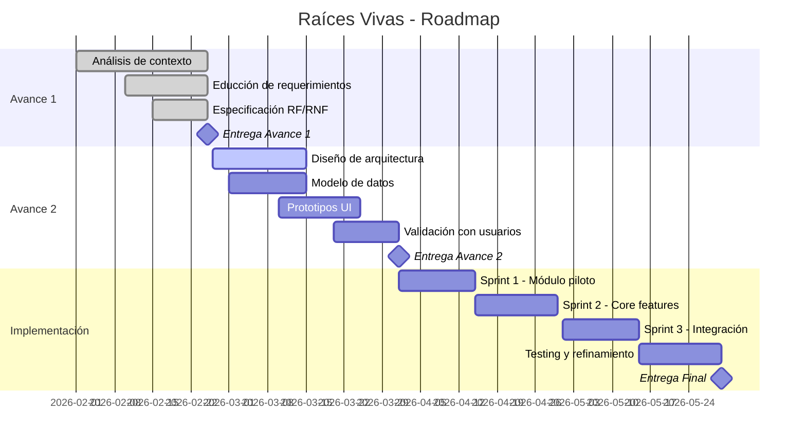

# Propuesta de Gestión del Proyecto "Raíces Vivas" en Obsidian

> **Objetivo:** Convertir este vault de Obsidian en un sistema profesional de gestión de proyecto de software — equivalente funcional a Confluence + Jira + Wiki técnica — usando plugins, templates, frontmatter estructurado y convenciones estrictas.

---

## 1. Plugins Recomendados (Core Stack)

### 1.1 Plugins Esenciales (Instalar Primero)

| Plugin | Propósito | Por qué |
|--------|-----------|---------|
| **Dataview** | Queries, tablas dinámicas, dashboards | Es el "SQL de Obsidian". Consulta frontmatter para generar RTM, KPIs, métricas en tiempo real |
| **Templater** | Templates con lógica JavaScript | Prompts interactivos, Auto-ID de tareas (`dv.pages`), auto-rename de archivos, cálculo de tags |
| **QuickAdd** | 10 macros de creación rápida | Crear tareas, minutas, RF, RNF, riesgos, ADRs, sprint plannings/reviews, y promover action items |
| **Tasks** | Checkboxes con metadata (emoji format) | `📅` due, `✅` done, `❌` cancelled, `⏫` priority. Statuses custom: `[/]` In Progress, `[-]` Cancelled |
| **Kanban** | Tableros Kanban (Backlog) | Visualización: Backlog → In Progress → Review → Done |
| **Calendar** | Vista calendario | Integra con Daily Notes y Tasks para ver timeline con `due:` |
| **Periodic Notes** | Weekly notes automáticas | Genera `Daily Notes/YYYY-WNN.md` con template pre-configurado |

### 1.2 Plugins de QA y Formato

| Plugin | Propósito | Por qué |
|--------|-----------|---------|
| **Linter** | Formato consistente automático | YAML sort, heading gaps, trailing spaces. Se ejecuta al guardar |
| **Advanced Tables** | Edición de tablas Markdown | Tabulación inteligente, ordenamiento. Esencial para RTM y matrices grandes |
| **Highlightr** | Resaltado de texto con colores | Markup visual para destacar hallazgos o notas importantes |
| **Latex Suite** | Snippets matemáticos | Atajos para notación durante la redacción académica |

### 1.3 Plugins de Visualización

| Plugin | Propósito | Por qué |
|--------|-----------|---------|
| **Mermaid Tools** | Diagramas como código + toolbar | Flowcharts, secuencia, Gantt, C4, ERD. Plugin agrega toolbar de edición visual |
| **Charts** | Gráficas de datos | Burndown charts, distribución de requerimientos, progreso por sprint |
| **Multi-Column Markdown** | Layouts multi-columna | Dashboards con múltiples paneles lado a lado |
| **Banners** | Imágenes de cabecera | Decoración visual de notas principales |

### 1.4 Plugins de Metadata y Navegación

| Plugin | Propósito | Por qué |
|--------|-----------|---------|
| **Meta Bind** | Edición inline del frontmatter | Suggesters embebidos en tablas "Control Rápido" para cambiar estado/prioridad sin abrir YAML |
| **Folder Notes** | Nota índice por carpeta | Cada carpeta tiene una nota descripción accesible al hacer click |
| **Homepage** | Página de inicio automática | `Home.md` se abre al iniciar Obsidian. Punto de entrada obligatorio |
| **Checklist** | Panel lateral de DoD pendientes | Muestra todos los checkboxes pendientes de archivos con tag `tarea` en `05-Sprints/` |
| **Projects** | Vista portafolio con filtros | Tabla/board/calendar de notas. Alternativa visual a Dataview |

### 1.5 Plugins de Colaboración

| Plugin | Propósito | Por qué |
|--------|-----------|---------|
| **Git** (obsidian-git) | Control de versiones | Auto-commit cada 10 min, push/pull. GitHub como fuente de verdad |
| **Auto Link Title** | Títulos automáticos en URLs | Al pegar una URL, inserta el título de la página como texto del link |

> **Total: 22 plugins activos.** Cada uno cumple una función específica y no redundante.

---

## 2. Arquitectura de Directorios

```
RAICES_VIVAS/                          ← Vault root
│
├── 00-Dashboard/                      ← Página de inicio y dashboards
│   ├── Home.md                        ← Dashboard principal (KPIs, queries Dataview)
│   ├── Métricas.md                    ← Métricas de avance detalladas
│   └── Roadmap.md                     ← Timeline y milestones
│
├── 01-Proyecto/                       ← Gobierno del proyecto
│   ├── Charter.md                     ← Acta de constitución
│   ├── Alcance.md                     ← Scope statement
│   ├── Plan de Gestión.md             ← Plan de proyecto (este documento)
│   ├── Propuesta de Gestión.md        ← Fundamentación técnica de tooling
│   ├── Guía de Workflow.md            ← Guía operativa completa v4.0
│   ├── Equipo.md                      ← Roles y responsabilidades
│   ├── Stakeholders.md                ← Registro de interesados
│   ├── Onboarding.md                  ← Guía de incorporación
│   ├── Glosario.md                    ← Términos y acrónimos
│   ├── Decisiones/                    ← ADRs (Architecture Decision Records)
│   └── Riesgos/                       ← Registro de riesgos (1 nota = 1 riesgo)
│
├── 02-Investigación/                  ← Fase de descubrimiento
│   ├── Contexto/                      ← Análisis del entorno (4 documentos)
│   │   ├── Educación.md
│   │   ├── Saberes Ancestrales.md
│   │   ├── Salud Comunitaria.md
│   │   └── Mapa de Territorios Indígenas.md
│   ├── Entrevistas/                   ← Resultados de educción
│   ├── Encuestas/                     ← Instrumentos y resultados
│   ├── Observaciones/                 ← Notas de campo
│   └── Fuentes/                       ← Referencias bibliográficas
│
├── 03-Requerimientos/                 ← Especificaciones del sistema
│   ├── _RTM.md                        ← Matriz de trazabilidad (Dataview automática)
│   ├── Funcionales/                   ← RF por módulo
│   │   ├── EDU/ (RF-EDU-01..06)       ← Módulo Educativo (6 RF)
│   │   ├── SAB/ (RF-SAB-01..05)       ← Módulo Saberes (5 RF)
│   │   └── SAL/ (RF-SAL-01..05)       ← Módulo Salud (5 RF)
│   └── No Funcionales/ (RNF-01..07)   ← 7 RNF transversales
│
├── 04-Arquitectura/                   ← Diseño técnico
│   ├── Visión General.md              ← Arquitectura de alto nivel
│   ├── WBS.md                         ← Work Breakdown Structure
│   ├── Modelo de Datos.md             ← Entidades, atributos, relaciones
│   ├── Stack Tecnológico.md           ← Decisiones de tecnología
│   ├── Diagramas/                     ← Mermaid embebido
│   └── Prototipos/                    ← Wireframes y mockups
│
├── 05-Sprints/                        ← Gestión iterativa
│   ├── Backlog.md                     ← Product Backlog (Kanban plugin)
│   ├── Sprint-01/ (T-001..T-020)      ← 20 tareas completadas
│   │   ├── Sprint-01-Planning.md
│   │   └── T-001.md .. T-020.md       ← Auto-ID, frontmatter completo
│   ├── Sprint-02/ (T-021..T-025)      ← 5 tareas en progreso
│   │   ├── Sprint-02-Planning.md
│   │   └── T-021.md .. T-025.md
│   ├── Sprint-03/ → Sprint-05/        ← Planificados
│
├── 06-Entregables/                    ← Documentos de entrega
│   ├── Avance-1/                      ← Entrega 1 completada
│   ├── Avance-2/                      ← Entrega 2 en progreso
│   └── Presentaciones/
│
├── 07-Reuniones/                      ← Minutas y acuerdos
│   └── MIN-001.md                     ← Action Items → promovibles a tareas
│
├── 08-Recursos/                       ← Archivos de soporte
│   ├── PDFs/                          ← Documentos fuente
│   ├── Imágenes/
│   ├── Datos/                         ← Datasets
│   └── scripts/                       ← Scripts de automatización
│
├── 09-QA/                             ← Control de calidad
│   └── README.md
│
├── 99-Templates/                      ← 11 plantillas del vault
│   ├── _template-tarea.md             ← Con Auto-ID + source + avance tag
│   ├── _template-tarea-from-minuta.md ← Promoción de action items
│   ├── _template-requerimiento-funcional.md
│   ├── _template-requerimiento-nofuncional.md
│   ├── _template-minuta.md            ← Con guía de promoción
│   ├── _template-sprint-planning.md
│   ├── _template-sprint-review.md
│   ├── _template-entrevista.md
│   ├── _template-adr.md
│   ├── _template-riesgo.md
│   ├── _template-daily-note.md
│   └── _template-weekly-note.md
│
├── Daily Notes/                       ← Weekly notes automáticas
│   └── 2026-W09.md
│
└── .obsidian/                         ← Config del vault (22 plugins)
```

### Por qué esta estructura

| Directorio | Equivalente en industria | Justificación |
|------------|--------------------------|---------------|
| `00-Dashboard` | Confluence Home | Punto de entrada único. Dashboards con Dataview |
| `01-Proyecto` | Project Management Plan | Gobierno: alcance, riesgos, stakeholders, decisiones |
| `02-Investigación` | Discovery/Research | Separar evidencia cruda de especificaciones derivadas |
| `03-Requerimientos` | SRS / Product Backlog | **1 nota = 1 requerimiento** permite queries, Kanban, trazabilidad |
| `04-Arquitectura` | Architecture Docs | Diagramas y decisiones técnicas |
| `05-Sprints` | Jira Sprints | Planificación iterativa cuando llegue la implementación |
| `06-Entregables` | Release Docs | Lo que se entrega al profesor / stakeholder |
| `07-Reuniones` | Meeting Notes | Trazabilidad de decisiones y acuerdos |
| `99-Templates` | Confluence Templates | Templates con Templater para consistencia |

---

## 3. Convención de Frontmatter (Esquema Estándar)

### 3.1 Frontmatter para Requerimientos Funcionales

```yaml
---
id: RF-EDU-01
type: requirement/functional
module: educacion          # educacion | saberes | salud
wbs: RV-1.1
title: "Registro de docentes comunitarios"
status: draft              # draft | review | approved | implemented | tested
priority: must             # must | should | could | wont (MoSCoW)
actor: [Docente, Admin]
source: entrevista         # entrevista | encuesta | observacion | documental
validation: "Revisión con docentes"
created: 2026-02-25
updated: 2026-02-25
sprint: null
tags:
  - requerimiento
  - funcional
  - modulo/edu
  - prioridad/must
---
```

### 3.2 Frontmatter para Requerimientos No Funcionales

```yaml
---
id: RNF-01
type: requirement/non-functional
category: conectividad     # conectividad | multilingüismo | seguridad | usabilidad | rendimiento | compatibilidad | gobernanza
wbs: RV-4.1
title: "Operación offline + sincronización"
status: draft
priority: must
metric: "Permite registrar datos sin internet. Sincroniza al detectar conectividad."
created: 2026-02-25
updated: 2026-02-25
tags:
  - requerimiento
  - no-funcional
  - transversal
  - prioridad/must
---
```

### 3.3 Frontmatter para Tareas

```yaml
---
type: task
id: T-026                     # Auto-generado via dv.pages() + Templater (NUNCA manual)
title: "Diseñar wireframe login"
status: todo                  # todo | in-progress | review | done | blocked
priority: high                # critical | high | medium | low
assignee: "Elkin"
sprint: Sprint-02
phase: diseño                 # investigación | análisis | requerimientos | integración | diseño | implementación | testing | gestión
module: saberes               # educacion | saberes | salud | transversal | proyecto
requirement: "RF-SAB-01"      # Link al requerimiento padre
effort: "4h"
started: 2026-03-01
due: 2026-03-10
completed:
source: "MIN-002"             # Minuta que originó esta tarea (trazabilidad bidireccional)
created: 2026-03-01
updated: 2026-03-01
tags:
  - tarea
  - avance-2                  # Calculado automáticamente desde el sprint
---
```

> **Auto-ID:** El campo `id` se calcula automáticamente al crear la tarea. Templater ejecuta `dv.pages('"05-Sprints"')` para encontrar el máximo ID existente y asignar `max + 1`. El archivo se renombra automáticamente a `T-XXX.md`.
>
> **Source:** Cuando una tarea nace de un Action Item de una minuta, el campo `source` registra la minuta origen para trazabilidad bidireccional.

### 3.4 Frontmatter para Minutas de Reunión

```yaml
---
type: meeting
title: "Kickoff del proyecto"
date: 2026-02-25
attendees: [Geovanny, Elkin, Santiago]
decisions: []
action-items: []
tags:
  - reunión
  - decisión
---
```

### 3.5 Frontmatter para ADRs (Architecture Decision Records)

```yaml
---
type: adr
id: ADR-001
title: "Selección de stack tecnológico"
status: proposed           # proposed | accepted | deprecated | superseded
date: 2026-02-25
deciders: [Geovanny, Elkin, Santiago]
tags:
  - adr
  - arquitectura
---
```

---

## 4. Sistema de Tags (Plano — YAML Frontmatter)

El proyecto usa **tags planos** en el campo `tags:` del frontmatter YAML. No se usan tags jerárquicos (`#tipo/x`) ni inline (`#todo`).

```
Tags activos del proyecto:
├── tarea                    ← Toda nota en 05-Sprints/ tipo task
├── requerimiento            ← RF y RNF
├── funcional                ← Subtipo de requerimiento
├── no-funcional             ← Subtipo de requerimiento
├── reunión                  ← Minutas en 07-Reuniones/
├── decisión                 ← ADRs en 01-Proyecto/Decisiones/
├── sprint                   ← Sprint plannings y reviews
├── planificación            ← Notas de planning
├── adr                      ← Architecture Decision Records
├── arquitectura             ← Notas de diseño técnico
├── meta                     ← Notas sobre el proyecto mismo
├── avance-1                 ← Tareas asociadas al Avance 1
├── avance-2                 ← Tareas asociadas al Avance 2
├── riesgo                   ← Registro de riesgos
├── modulo/edu               ← Módulo Educativo (solo en RF)
├── modulo/sab               ← Módulo Saberes (solo en RF)
├── modulo/sal               ← Módulo Salud (solo en RF)
└── prioridad/must|should|could|wont  ← MoSCoW (solo en RF/RNF)
```

> **Regla:** Los tags de módulo y prioridad (`modulo/edu`, `prioridad/must`) se usan únicamente en requerimientos. Las tareas usan `tarea` + `avance-N`. Las minutas usan `reunión`. El campo `tags:` es la única fuente de verdad — nunca se usan tags inline como `#todo`.

---

## 5. Queries Dataview (Dashboards Dinámicos)

### 5.1 Dashboard Home - Tabla de Requerimientos por Módulo

```dataview
TABLE
  id as "ID",
  title as "Título",
  priority as "Prioridad",
  status as "Estado",
  actor as "Actor"
FROM "03-Requerimientos"
WHERE type = "requirement/functional"
SORT module ASC, priority ASC
```

### 5.2 Conteo de Requerimientos por Estado

```dataview
TABLE
  length(rows) as "Cantidad"
FROM "03-Requerimientos"
WHERE type = "requirement/functional" OR type = "requirement/non-functional"
GROUP BY status
```

### 5.3 Tareas Pendientes (vista tipo Jira)

```dataview
TABLE
  status as "Estado",
  priority as "Prioridad",
  assignee as "Responsable",
  due as "Fecha límite",
  sprint as "Sprint"
FROM "05-Sprints"
WHERE type = "task" AND status != "done"
SORT priority ASC
```

### 5.4 Matriz de Trazabilidad Dinámica

```dataview
TABLE
  id as "ID",
  module as "Módulo",
  wbs as "WBS",
  priority as "MoSCoW",
  source as "Fuente",
  validation as "Validación",
  status as "Estado"
FROM "03-Requerimientos"
SORT wbs ASC
```

### 5.5 Timeline de Reuniones

```dataview
TABLE
  date as "Fecha",
  attendees as "Asistentes",
  decisions as "Decisiones"
FROM "07-Reuniones"
SORT date DESC
```

---

## 6. Templates (Referencia)

> **Fuente de verdad:** Las plantillas actuales se mantienen en `99-Templates/`. Los ejemplos a continuación son representativos — consultar los archivos originales para la versión vigente.

### 6.1 Template: Requerimiento Funcional (`_template-requerimiento-funcional.md`)

```yaml
---
id: RF-XXX-NN         # Módulo + secuencial
type: requirement/functional
module: null           # educacion | saberes | salud
wbs: null
title: ""
status: draft
priority: null         # must | should | could | wont
actor: []
source: null           # entrevista | encuesta | observacion | documental
validation: ""
created: <% tp.date.now("YYYY-MM-DD") %>
updated: <% tp.date.now("YYYY-MM-DD") %>
sprint: null
tags:
  - requerimiento
  - funcional
---
```

Secciones principales: Descripción, Problema de Origen, Necesidad Identificada, Criterios de Aceptación, Notas de Validación, Trazabilidad, Historial de Cambios.

### 6.2 Template: Minuta de Reunión (`_template-minuta.md`)

```yaml
---
type: meeting
title: ""
date: <% tp.date.now("YYYY-MM-DD") %>
attendees: []
decisions: []
action-items: []
tags:
  - reunión
---
```

Secciones principales: Agenda, Discusión, Decisiones Tomadas, Action Items (con formato `- [ ] Tarea → @Responsable 📅 YYYY-MM-DD`), Próxima Reunión.

> **Promoción:** Los Action Items se pueden promover a tareas formales con `Ctrl+P → "📋 Promover Action Item"`.

### 6.3 Template: Sprint Planning (`_template-sprint-planning.md`)

```yaml
---
type: sprint-planning
sprint: null
start: <% tp.date.now("YYYY-MM-DD") %>
end: 
goal: ""
status: active
tags:
  - sprint
  - planificación
---
```

Secciones principales: Compromisos (Must/Should/Could), Capacidad del Equipo, Riesgos del Sprint, Definition of Done.

### 6.4 Template: Tarea (`_template-tarea.md`)

```yaml
---
type: task
id: T-XXX              # Auto-generado via dv.pages() + Templater
title: ""
status: todo           # todo | in-progress | review | done | blocked
priority: medium       # critical | high | medium | low
assignee: ""
sprint: Sprint-NN
phase: ""              # investigación | análisis | diseño | implementación | testing | gestión
module: ""             # educacion | saberes | salud | transversal | proyecto
requirement: ""
effort: ""
started:
due:
completed:
source: ""             # Minuta origen (trazabilidad bidireccional)
created: <% tp.date.now("YYYY-MM-DD") %>
updated: <% tp.date.now("YYYY-MM-DD") %>
tags:
  - tarea
  - avance-N           # Calculado automáticamente desde el sprint
---
```

> **Auto-ID:** Al crear con QuickAdd, Templater calcula `max(T-XXX) + 1` y renombra el archivo.
> **Source:** Cuando nace de una minuta, `source: "MIN-XXX"` registra el origen.

### 6.5 Template: ADR (`_template-adr.md`)

```yaml
---
type: adr
id: ADR-NNN
title: ""
status: proposed           # proposed | accepted | deprecated | superseded
date: <% tp.date.now("YYYY-MM-DD") %>
deciders: [Geovanny, Elkin, Santiago]
tags:
  - adr
  - arquitectura
---
```

Secciones principales: Estado, Contexto, Opciones Consideradas, Decisión, Consecuencias (Positivas/Negativas), Referencias.

---

## 7. Estrategia de Vinculación (Links, Backlinks, MOCs)

### 7.1 Principio: Todo se conecta

```
Problema → Necesidad → WBS → Requerimiento → Tarea → Sprint → Entregable
     ↑                                                           ↓
     └────────── Validación / Feedback ──────────────────────────┘
```

### 7.2 Convenciones de links

| Tipo de link | Formato | Ejemplo |
|-------------|---------|---------|
| Requerimiento → WBS | `wbs:` en frontmatter + `[[WBS]]` | `wbs: RV-1.2` + `[[WBS#RV-1.2]]` |
| Tarea → Requerimiento | `requirement:` en frontmatter | `requirement: RF-EDU-01` + `[[RF-EDU-01]]` |
| Entrevista → Requerimiento | Inline link | `Esto valida [[RF-SAB-04]]` |
| Reunión → Decisión | `decisions:` en frontmatter | Link a ADR |
| Sprint → Tareas | Dataview query | Query filtra por `sprint: Sprint-01` |

### 7.3 MOCs (Maps of Content)

Cada directorio principal tiene un `_index.md` o nota MOC que sirve como tabla de contenido navegable:

- `03-Requerimientos/_RTM.md` → MOC de todos los requerimientos (query Dataview)
- `04-Arquitectura/Visión General.md` → MOC de diagramas y decisiones
- `05-Sprints/Backlog.md` → MOC de todas las tareas (Kanban board)
- `00-Dashboard/Home.md` → MOC del proyecto completo

---

## 8. Integración con Calendario

### 8.1 Periodic Notes (Weekly)
- Plugins: **Calendar** + **Periodic Notes**
- Carpeta: `Daily Notes/YYYY-WXX.md` (notas semanales, no diarias)
- Template: `99-Templates/_template-weekly-note.md`

### 8.2 Milestones en el calendario
- Usar frontmatter `due:` en tareas
- Dataview query para mostrar próximos deadlines:

```dataview
TABLE
  title as "Entregable",
  due as "Fecha",
  status as "Estado"
FROM ""
WHERE due AND due >= date(today)
SORT due ASC
LIMIT 10
```

### 8.3 Gantt con Mermaid (embebido)



---

## 9. Control de Versiones y Colaboración

### 9.1 Decisión: GitHub como fuente de verdad (3 integrantes)

> **Decisión tomada (2026-02-26):** Se descarta Google Drive Sync a favor de un **repositorio privado en GitHub** sincronizado con el vault de Obsidian mediante el plugin **Obsidian Git**.

**Justificación (GitHub vs Google Drive para 3 personas editando `.md`):**

| Criterio | GitHub | Google Drive |
|---|---|---|
| **Versionado** | Control real (git log, diff, revert) | Versiones automáticas limitadas (30 días) |
| **Conflictos** | Merge explícito y controlado | Sobrescritura silenciosa o archivos duplicados |
| **Trazabilidad** | Cada cambio tiene autor, fecha, mensaje | Sin trazabilidad granular |
| **Colaboración** | Pull requests, issues, reviews | Solo edición simultánea sin control de conflictos en `.md` |
| **VS Code** | Integración nativa (git panel, GitLens) | Requiere app externa |
| **Obsidian** | Plugin `obsidian-git` (auto commit/push/pull) | Funciona pero sin historial real |
| **Offline** | Funciona 100% offline, sync cuando quieras | Requiere conexión para sync |
| **Costo** | Gratis (repos privados ilimitados) | Gratis hasta 15 GB |

### 9.2 Configuración del Equipo

**Equipo actual:**

| Integrante | Rol | Módulo | Herramienta principal | Sync |
|---|---|---|---|---|
| **Geovanny** | Project Lead / Arquitecto | EDU + Transversal | VS Code + Obsidian | Git CLI / Obsidian Git |
| **Elkin** | Líder de Investigación / Analista | SAB | Obsidian | Plugin Obsidian Git (auto-sync) |
| **Santiago** | Líder de QA / Analista | SAL | Obsidian | Plugin Obsidian Git (auto-sync) |

> **Liderazgo distribuido:** Cada integrante es líder de su área y tiene autonomía para tomar decisiones técnicas dentro de su módulo. Las decisiones transversales se toman en equipo y se documentan como ADR.

**Flujo de sincronización:**
```
Integrante 1 (Obsidian) → commit → push → GitHub (repo privado)
Integrante 2 (Obsidian)          → pull  → edita → push ↑
Integrante 3 (github.dev)        → edita directamente en navegador ↑
```

### 9.3 Configuración Técnica

**Plugin Obsidian Git — Configuración recomendada:**
- Auto commit cada **10 minutos**
- Auto push después de cada commit
- Auto pull al abrir Obsidian
- Commit message: `vault backup: {{date}}`

**`.gitignore` del vault:**
```gitignore
.obsidian/workspace.json
.obsidian/workspace-mobile.json
.obsidian/plugins/*/data.json
.trash/
.DS_Store
```

**Archivos pesados (PDFs, imágenes >10 MB):**
- Opción A: **Git LFS** (Large File Storage)
- Opción B: Carpeta compartida de Google Drive solo para assets pesados
- Los `.md` y archivos de texto siempre van en GitHub

### 9.4 Reglas de Colaboración

1. **Siempre hacer pull antes de editar** (Obsidian Git lo hace automático)
2. **No editar el mismo archivo simultáneamente** — coordinar por chat
3. **Commits descriptivos** para cambios manuales importantes
4. **Branches opcionales** para cambios grandes (ej: reestructurar sección)
5. **Conflictos**: Git avisa explícitamente — resolver juntos, nunca sobrescribir

### 9.3 Integración con GitHub Projects (Oportunidad Futura)

```
Obsidian Vault (Documentación)     ←→     GitHub Repo (Código + Issues)
        ↓                                         ↓
    Requerimientos                           GitHub Issues
    Tareas (Tasks plugin)         ←→      GitHub Projects Board
    ADRs                                    Wiki / Discussions
    Sprints                       ←→      GitHub Milestones
```

**Estrategia de puente:**

1. **GitHub Issues como fuente de tareas**: Cada requerimiento aprobado en Obsidian genera un Issue en GitHub con labels (`module:edu`, `priority:must`)
2. **GitHub Projects Board**: Kanban board que refleja el Backlog de Obsidian
3. **Milestones = Sprints**: Cada sprint de Obsidian es un Milestone en GitHub
4. **Bidireccionalidad**: Usar Obsidian para documentación rica + GitHub para tracking de código y CI/CD
5. **Automatización futura**: GitHub Actions para sincronizar estados

**Plugins útiles para el puente:**
- **Obsidian Git**: Sync del vault al repo
- **GitHub Publisher**: Publicar notas seleccionadas
- Se puede usar un script Python/Node que lea el frontmatter y cree Issues vía GitHub API

---

## 10. Flujo de Trabajo Propuesto

### Flujo diario
```
1. Abrir Home.md (Dashboard)
2. Revisar Dataview: tareas pendientes, deadlines próximos
3. Abrir Daily Note del día
4. Trabajar en tareas asignadas
5. Actualizar frontmatter (status, updated)
6. Registrar notas/hallazgos en la nota correspondiente
7. Commit (manual o automático con Obsidian Git)
```

### Flujo por Sprint
```
1. Sprint Planning → definir objetivo y tareas
2. Crear/actualizar tareas con frontmatter
3. Mover tareas en Kanban (Backlog → In Progress → Review → Done)
4. Sprint Review → documentar qué se completó
5. Sprint Retro → lecciones aprendidas
6. Actualizar Roadmap y Métricas
```

### Flujo para nuevo requerimiento
```
1. Cmd+P → QuickAdd → "Nuevo Requerimiento Funcional"
2. Templater solicita: ID, módulo, WBS, título, prioridad
3. Se crea nota en 03-Requerimientos/Funcionales/{MÓDULO}/
4. Completar: descripción, criterios de aceptación, trazabilidad
5. Status: draft → review (equipo/profesor) → approved
6. Aparece automáticamente en RTM (Dataview)
```

---

## 11. Estado de Implementación (Completado)

> **Setup completado el 2026-02-28.** Todos los pasos se ejecutaron exitosamente.

| Paso | Acción | Estado |
|------|--------|--------|
| 1 | Instalar 22 plugins activos | ✅ Completado |
| 2 | Crear estructura de 10 directorios | ✅ Completado |
| 3 | Crear 11 templates en `99-Templates/` | ✅ Completado |
| 4 | Configurar Templater + QuickAdd (10 macros) | ✅ Completado |
| 5 | Migrar contenido del Avance 1 (20 tareas + 16 RF + 7 RNF) | ✅ Completado |
| 6 | Crear `Home.md` con dashboards Dataview | ✅ Completado |
| 7 | Crear `_RTM.md` con query dinámico | ✅ Completado |
| 8 | Configurar Kanban board (Backlog.md) | ✅ Completado |
| 9 | Configurar Obsidian Git (auto-commit 10 min, push/pull) | ✅ Completado |
| 10 | Crear diagramas de arquitectura (Mermaid) | ✅ Completado |
| 11 | Implementar Auto-ID de tareas (Templater + Dataview) | ✅ Completado |
| 12 | Implementar promoción de Action Items (QuickAdd macro) | ✅ Completado |
| 13 | Configurar Checklist plugin (DoD tracking) | ✅ Completado |
| 14 | Configurar trazabilidad bidireccional (campo `source`) | ✅ Completado |

---

## 12. Resumen Ejecutivo

| Aspecto | Decisión |
|---------|----------|
| **IDE de documentación** | Obsidian con 22 plugins profesionales |
| **Esquema de datos** | Frontmatter YAML estricto + Dataview queries |
| **Templates** | Templater con prompts interactivos + Auto-ID via Dataview |
| **Diagramas** | Mermaid (código) + Charts (métricas) |
| **Tareas** | Tasks plugin (emoji format) + Kanban boards + Auto-ID (`T-XXX`) |
| **Queries** | Dataview (SQL-like sobre Markdown) |
| **Calendario** | Calendar plugin + Periodic Notes (Weekly) |
| **Trazabilidad** | Frontmatter (`requirement:`, `source:`) → Dataview → RTM dinámica |
| **Tags** | Flat: `tarea`, `requerimiento`, `avance-N` |
| **Versiones** | GitHub repo privado + plugin Obsidian Git (auto-commit 10 min) |
| **Gestión** | Kanban + Tasks + Checklist panel + Dashboard Dataview con KPIs |
| **Promoción** | Action Items de minutas → Tareas formales via QuickAdd macro |
| **Equipo** | 3 integrantes con liderazgo distribuido por módulo (EDU/SAB/SAL) |
| **Colaboración** | GitHub (Obsidian Git auto-sync para todos) |

> **Filosofía:** Cada nota es un nodo de conocimiento con metadata estructurada. Dataview convierte el vault en una base de datos viva. Los links crean la red de trazabilidad bidireccional. Los templates con Auto-ID garantizan consistencia. La promoción de Action Items cierra el gap entre reuniones y ejecución. Los plugins añaden las vistas (tabla, kanban, calendario, checklist, gráfico) que transforman Markdown plano en un sistema de gestión profesional.
