# Registro de Stakeholders — Raíces Vivas

## Actores del Sistema (Usuarios Directos)

| Actor | Rol | Módulo | Necesidades Clave | Nivel de Influencia |
|-------|-----|--------|-------------------|-------------------|
| **Docente comunitario** | Crea contenido, registra estudiantes, da seguimiento | EDU | Materiales bilingües, ejercicios de práctica, modo offline | Alta |
| **Estudiante** | Accede materiales, practica ejercicios | EDU | Contenido en su lengua, práctica para pruebas nacionales | Media |
| **Portador de saber** | Documenta conocimiento ancestral | SAB | Registro seguro, consentimiento, control de acceso | Alta |
| **Administrador comunitario** | Gestiona permisos, gobernanza cultural | SAB | Roles configurables, niveles de acceso, auditoría | Muy Alta |
| **Líder comunal** | Aprueba uso del sistema, define políticas | SAB/Transversal | Gobernanza, respeto cultural, control comunitario | Muy Alta |
| **Personal de salud** | Registra pacientes, programa citas, alertas | SAL | Historial médico, citas, alertas, privacidad | Alta |

## Actores Secundarios (Indirectos)

| Actor | Rol | Interés | Relación con el Sistema |
|-------|-----|---------|------------------------|
| **Familias / cuidadores** | Soporte a estudiantes y pacientes | Acceso a información relevante | Usuarios indirectos |
| **MEP** | Ente rector educativo | Alineación curricular | Referencia normativa |
| **CCSS / MINSA** | Salud pública | Estándares de salud | Referencia normativa |
| **Profesor del curso** | Evaluador académico | Calidad de entregables | Stakeholder académico |

## Matriz Poder/Interés

```mermaid
block-beta
    columns 2
    block:q2["🔵 Mantener Satisfecho\n(Alto Poder · Bajo Interés)"]:1
        MEP["MEP (0.3, 0.8)"]
        CCSS["CCSS (0.25, 0.7)"]
    end
    block:q1["🔴 Gestionar de Cerca\n(Alto Poder · Alto Interés)"]:1
        Lider["Líder comunal (0.8, 0.9)"]
        Admin["Admin comunitario (0.85, 0.75)"]
        Portador["Portador saber (0.7, 0.7)"]
        Docente["Docente (0.9, 0.6)"]
        Salud["Personal salud (0.85, 0.55)"]
        Profesor["Profesor curso (0.6, 0.6)"]
    end
    block:q3["⚪ Monitorear\n(Bajo Poder · Bajo Interés)"]:1
        Familia["Familia (0.5, 0.2)"]
    end
    block:q4["🟢 Mantener Informado\n(Bajo Poder · Alto Interés)"]:1
        Estudiante["Estudiante (0.75, 0.3)"]
    end

    style q1 fill:#fee2e2,stroke:#dc2626,color:#991b1b
    style q2 fill:#dbeafe,stroke:#2563eb,color:#1e40af
    style q3 fill:#f3f4f6,stroke:#6b7280,color:#374151
    style q4 fill:#dcfce7,stroke:#16a34a,color:#166534
```

> **Lectura:** Eje X = Interés (izquierda bajo, derecha alto) · Eje Y = Poder (abajo bajo, arriba alto). Coordenadas (Interés, Poder) entre 0 y 1.
