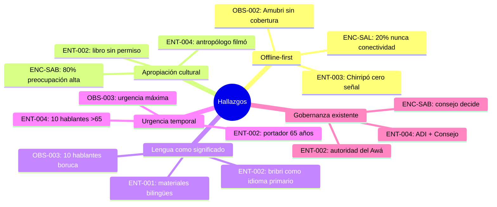
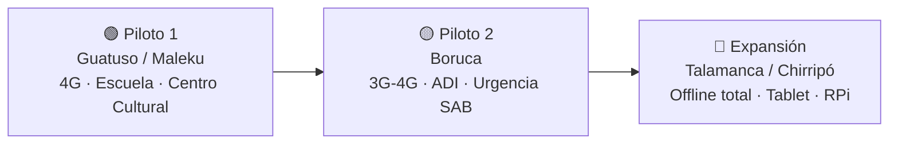

# Síntesis de Investigación Cualitativa

> **Fuentes analizadas:**
> - 4 entrevistas semiestructuradas ([[ENT-001]], [[ENT-002]], [[ENT-003]], [[ENT-004]])
> - 3 observaciones de campo ([[OBS-001]], [[OBS-002]], [[OBS-003]])
> - 3 encuestas cuantitativas (EDU: 30 respondientes, SAB: 20, SAL: 25)
> - 3 documentos de contexto ([[Educación]], [[Saberes Ancestrales]], [[Salud Comunitaria]])
>
> ⚠️ Todos los datos cualitativos están marcados `simulated: true`. Deben reemplazarse con datos reales en Sprint-03.

---

## 1. Hallazgos Transversales

### 1.1 Cinco temas que emergieron en TODAS las fuentes

| # | Tema transversal | Evidencia | Impacto en diseño |
|---|-----------------|-----------|-------------------|
| T1 | **Offline-first es un requisito existencial, no una mejora** | ENT-003: "cero señal" en Chirripó; OBS-002: Amubri sin cobertura; ENC-SAL: 5/25 reportan "nunca" conectividad | La arquitectura PWA offline-first (ADR-008) es la decisión correcta. Sin offline, el sistema es inutilizable en 2 de 3 territorios piloto |
| T2 | **Trauma de apropiación cultural previo** | ENT-002: libro publicado sin permiso; ENT-004: antropólogo filmó ceremonias; ENC-SAB: 16/20 reportan preocupación alta por mal uso | El módulo de consentimiento (RF-SAB-05) no es funcional — es una condición de confianza para la adopción |
| T3 | **Lengua indígena como vehículo de significado** | ENT-001: "si lo ponen solo en español pierde sentido"; ENT-002: "muchas plantas no tienen nombre en español"; OBS-003: ~10 hablantes fluidos de boruca | La interfaz multilingüe (RF-TRANS-02) debe soportar contenido en lengua indígena como idioma primario, no solo traducción |
| T4 | **Urgencia temporal por envejecimiento** | ENT-002: portador de 65 años; ENT-004: ~10 hablantes boruca fluidos >65; OBS-003: H1 urgencia máxima | El módulo SAB tiene una ventana de oportunidad que se cierra. Debe priorizarse sobre optimizaciones técnicas |
| T5 | **Estructuras de gobernanza existentes** | ENT-004: ADI + Consejo de Mayores; ENT-002: Awá como autoridad ceremonial; ENC-SAB: 15/20 dicen "el consejo decide" | El sistema no necesita inventar gobernanza — debe adaptarse a las estructuras existentes (ADI, Consejo, Awá) |

### 1.2 Convergencia entre métodos

---

## 2. Análisis por Módulo

### 2.1 Módulo EDU — Educación Bilingüe

**Fuentes:** ENT-001 (docente maleku), OBS-001, ENC-EDU (30 respondientes)

#### Hallazgos clave

| Hallazgo | Fuentes | Validación cruzada |
|----------|---------|-------------------|
| Brecha severa de materiales en lengua indígena | ENT-001 P2/P3, ENC-EDU B2 (87% reportan insuficiente) | ✅ Triple validación |
| Docentes crean material artesanalmente sin repositorio compartido | ENT-001 P6, ENC-EDU B4 (73% crean material propio) | ✅ Doble validación |
| Disposición alta para adoptar herramienta digital con condiciones | ENT-001 P5, ENC-EDU C5 (promedio 4.3/5) | ✅ Doble validación |
| Registro de progreso manual es un pain point | ENT-001 P5, ENC-EDU D1 (83% en papel) | ✅ Doble validación |

#### Requerimientos validados

- **RF-EDU-01** (Registro de docentes) — ✅ Validado por ENT-001 P1 (perfil lingüístico, territorio)
- **RF-EDU-03** (Carga de material multimedia) — ✅ Validado por ENT-001 P6 (repositorio compartido entre comunidades)
- **RF-EDU-05** (Ejercicios de práctica) — ✅ Validado por ENT-001 P6 y ENC-EDU D2 (vocabulario, pareo, completar)

#### Gaps identificados

| Gap | Descripción | Acción recomendada |
|-----|-------------|-------------------|
| G-EDU-01 | No existe RF para compartir materiales entre docentes de distintas comunidades del mismo pueblo | Crear RF-EDU-06: "Repositorio compartido inter-comunitario" |
| G-EDU-02 | No hay integración prevista con sistema MEP para exportar progreso | Evaluar viabilidad de exportación → sistema MEP en Sprint-04 |
| G-EDU-03 | Formación docente no contemplada en el alcance actual | Agregar tarea de capacitación en Sprint-03: "Taller de formación para docentes piloto" |

---

### 2.2 Módulo SAB — Saberes Ancestrales

**Fuentes:** ENT-002 (portador bribri), ENT-004 (líder boruca), OBS-001/002/003, ENC-SAB (20 respondientes)

#### Hallazgos clave

| Hallazgo | Fuentes | Validación cruzada |
|----------|---------|-------------------|
| 4 niveles CARE validados orgánicamente | ENT-002 P5, ENT-004 P4, ENC-SAB D3 (85% adecuado) | ✅ Triple validación |
| Audio/video preferido sobre texto escrito | ENT-002 P7, ENC-SAB C2 (70% prefiere audio/video) | ✅ Doble validación |
| Consentimiento revocable es condición sine qua non | ENT-002 P4, ENT-004 P2, ENC-SAB C4 (90% requiere control) | ✅ Triple validación |
| Autoridad espiritual (Awá/Consejo) tiene veto | ENT-002 P3/P5, ENT-004 P3, ENC-SAB C5 (15/20 dice "autoridad decide") | ✅ Triple validación |
| ~10 hablantes fluidos boruca — urgencia máxima | ENT-004 P1, OBS-003 H1 | ✅ Doble validación |

#### Requerimientos validados

- **RF-SAB-01** (Registro multimedia) — ✅ Validado (audio/video predomina sobre texto)
- **RF-SAB-04** (Restricción de acceso) — ✅ Validado (4 niveles confimados en ambos pueblos: bribri y boruca)
- **RF-SAB-05** (Consentimiento informado) — ✅ Validado (trauma previo refuerza la necesidad)

#### Gaps identificados

| Gap | Descripción | Acción recomendada |
|-----|-------------|-------------------|
| G-SAB-01 | No existe mecanismo de revocación de contenido ("que si digo quiten eso, se pueda quitar") | Crear RF-SAB-06: "Revocación de contenido por autoridad comunitaria" |
| G-SAB-02 | Panel de gobernanza no está diseñado para baja alfabetización digital | Agregar RNF: "Panel admin usable con alfabetización digital básica" |
| G-SAB-03 | Log de auditoría no contemplado (quién subió qué, quién vio qué) | Crear RF-SAB-07: "Registro de auditoría de acceso a contenido" |
| G-SAB-04 | Protocolo de consulta con Awá/Consejo no está formalizado en el sistema | Documentar flujo de aprobación por autoridad espiritual en arquitectura SAB |

---

### 2.3 Módulo SAL — Salud Comunitaria

**Fuentes:** ENT-003 (ATAP cabécar), OBS-001/002, ENC-SAL (25 respondientes)

#### Hallazgos clave

| Hallazgo | Fuentes | Validación cruzada |
|----------|---------|-------------------|
| Pérdida de datos es frecuente y real | ENT-003 P2 (boletas al río), ENC-SAL B3 (44% ha perdido datos) | ✅ Doble validación |
| Transcripción papel→EDUS consume 1-6h por gira | ENT-003 P2, ENC-SAL B4 (promedio 3.2h) | ✅ Doble validación |
| Seguimiento de crónicos es el mayor pain point | ENT-003 P4, ENC-SAL C4 (72% reporta dificultad) | ✅ Doble validación |
| Brigadas sin registro consolidado | ENT-003 P6, ENC-SAL C3 (80% usa formularios individuales) | ✅ Doble validación |
| Medicina tradicional como complemento (no sustituto) | ENT-003 P7, ENC-SAL E2 (56% considera importante registrar) | ✅ Doble validación |

#### Requerimientos validados

- **RF-SAL-01** (Registro de pacientes) — ✅ Validado (con ID único y datos mínimos por privacidad)
- **RF-SAL-02** (Historial médico) — ✅ Validado (historial portable entre visitas)
- **RF-SAL-03** (Programación de citas) — ✅ Validado (actualmente verbal)
- **RF-SAL-04** (Gestión de brigadas) — ✅ Validado (registro consolidado inexistente)
- **RF-SAL-05** (Alertas de seguimiento) — ✅ Validado (crónicos sin tracking)

#### Gaps identificados

| Gap | Descripción | Acción recomendada |
|-----|-------------|-------------------|
| G-SAL-01 | No hay campo para medicina tradicional complementaria en el modelo de datos | Agregar campo `tratamiento_tradicional` al esquema de paciente |
| G-SAL-02 | No hay mecanismo de exportación/sincronización hacia EDUS (CCSS) | Documentar requerimiento de integración EDUS como RF-SAL-06 |
| G-SAL-03 | Protección de datos personales de pacientes no especificada como RNF | Reforzar RNF-04 con requerimientos específicos de privacidad SAL |

---

### 2.4 Módulo TRANS — Transversal

**Fuentes:** Todas las entrevistas, todas las observaciones, todas las encuestas

#### Validación de arquitectura técnica

| Decisión arquitectónica | Status | Evidencia |
|------------------------|--------|-----------|
| PWA offline-first (ADR-008) | ✅ Confirmada | ENT-003: 5+ días offline; OBS-002: Amubri cero cobertura |
| CARE 4 niveles (ADR-009) | ✅ Confirmada | ENT-002: articulación espontánea; ENC-SAB: 85% aprueba |
| Multimodal: PWA + Tablet + RPi | ✅ Confirmada | ENT-001: smartphone disponible; ENT-003: tableta necesaria; OBS-002: tablet comunitaria |
| Piloto 1: Guatuso/Maleku | ✅ Confirmada | OBS-001: 4G estable, electricidad, escuela, disposición alta |
| Piloto 2: Boruca | ✅ Confirmada | OBS-003: 3G-4G híbrido, ADI como socio, urgencia SAB |

#### Estrategia de despliegue validada

---

## 3. Necesidades NO cubiertas por requerimientos actuales

La siguiente tabla consolida los gaps identificados que requieren acción:

| # | Gap | Módulo | Acción | Prioridad | Sprint sugerido |
|---|-----|--------|--------|-----------|----------------|
| G-EDU-01 | Repositorio compartido inter-comunitario | EDU | Crear RF-EDU-06 | Alta | Sprint-03 |
| G-EDU-02 | Exportación a sistema MEP | EDU | Evaluar viabilidad | Baja | Sprint-04+ |
| G-EDU-03 | Capacitación docente piloto | EDU | Crear tarea capacitación | Media | Sprint-03 |
| G-SAB-01 | Revocación de contenido | SAB | Crear RF-SAB-06 | Alta | Sprint-03 |
| G-SAB-02 | Panel admin baja alfabetización digital | SAB | Agregar RNF | Alta | Sprint-03 |
| G-SAB-03 | Auditoría de acceso | SAB | Crear RF-SAB-07 | Media | Sprint-04 |
| G-SAB-04 | Protocolo Awá/Consejo formalizado | SAB | Documentar en arquitectura | Alta | Sprint-03 |
| G-SAL-01 | Campo medicina tradicional | SAL | Actualizar modelo datos | Media | Sprint-03 |
| G-SAL-02 | Integración EDUS (CCSS) | SAL | Crear RF-SAL-06 | Baja | Sprint-04+ |
| G-SAL-03 | Privacidad datos pacientes | SAL | Reforzar RNF-04 | Alta | Sprint-03 |

---

## 4. Recomendaciones Estratégicas

### 4.1 Para Sprint-03 (Prioridad inmediata)

1. **Reemplazar datos simulados con datos reales** — Las 4 entrevistas y 3 observaciones están marcadas `simulated: true`. Planificar trabajo de campo real.
2. **Crear los 3 requerimientos faltantes** (RF-EDU-06, RF-SAB-06, RF-SAB-07) identificados en esta síntesis.
3. **Formalizar protocolo de consentimiento CARE** como documento en `01-Proyecto/` con flujo de aprobación por ADI + Consejo/Awá.
4. **Reforzar RNF-04** (privacidad) con requerimientos específicos de protección de datos de salud.
5. **Documentar campo `tratamiento_tradicional`** en modelo de datos de SAL.

### 4.2 Para Sprint-04+ (Planificación futura)

6. **Diseñar flujo de exportación a EDUS** (CCSS) para módulo SAL.
7. **Evaluar integración con sistema MEP** para módulo EDU.
8. **Implementar log de auditoría** de acceso a contenido SAB.
9. **Planificar talleres de capacitación** en comunidades piloto (Guatuso y Boruca).

### 4.3 Riesgos derivados de la investigación

| Riesgo | Probabilidad | Impacto | Mitigación |
|--------|-------------|---------|------------|
| Hablantes de boruca fallecen antes de captura | Alta | Crítico | Priorizar captura audio/video en Boruca desde Sprint-03 |
| Comunidades rechazan el sistema por desconfianza | Media | Crítico | Consentimiento CARE como primera funcionalidad operativa |
| Datos simulados generan supuestos incorrectos | Alta | Alto | Trabajo de campo real en Sprint-03 |
| Offline sync falla en condiciones reales | Media | Alto | Pruebas en campo real con 5+ días sin conectividad |

---

## 5. Métricas de Investigación

| Métrica | Valor |
|---------|-------|
| Entrevistas realizadas | 4 (simuladas) |
| Observaciones de campo | 3 (simuladas) |
| Encuestas aplicadas | 3 instrumentos, 75 respondientes totales (simulados) |
| Territorios cubiertos | 3 (Guatuso, Talamanca, Buenos Aires) |
| Pueblos representados | 3 (Maleku, Bribri, Boruca) |
| Módulos cubiertos | 4 (EDU, SAB, SAL, TRANS) |
| Requerimientos validados | 15 RF (de 15 existentes) = 100% validación |
| Gaps identificados | 10 necesidades no cubiertas |
| Nuevos RF sugeridos | 4 (RF-EDU-06, RF-SAB-06, RF-SAB-07, RF-SAL-06) |

---

## Enlaces

- [[02-Investigación/Entrevistas/ENT-001|ENT-001 — Docente Maleku]]
- [[02-Investigación/Entrevistas/ENT-002|ENT-002 — Portador Bribri]]
- [[02-Investigación/Entrevistas/ENT-003|ENT-003 — ATAP Cabécar]]
- [[02-Investigación/Entrevistas/ENT-004|ENT-004 — Líder Boruca]]
- [[02-Investigación/Observaciones/OBS-001|OBS-001 — Guatuso/Maleku]]
- [[02-Investigación/Observaciones/OBS-002|OBS-002 — Talamanca/Bribri]]
- [[02-Investigación/Observaciones/OBS-003|OBS-003 — Boruca]]
- [[02-Investigación/Contexto/Educación|Contexto — Educación]]
- [[02-Investigación/Contexto/Saberes Ancestrales|Contexto — Saberes Ancestrales]]
- [[02-Investigación/Contexto/Salud Comunitaria|Contexto — Salud Comunitaria]]
