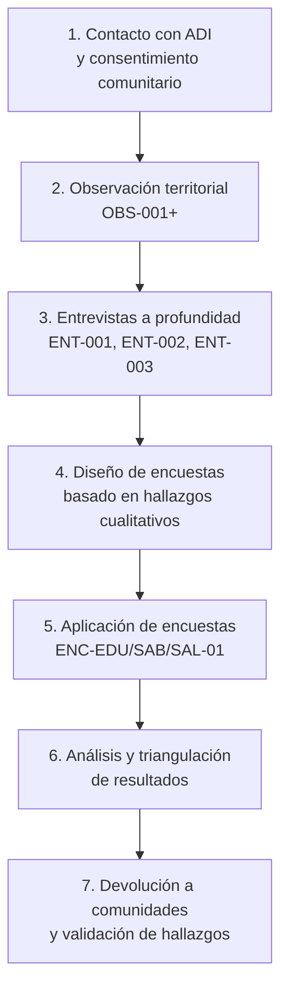

← [[00-Dashboard/Home|Volver al Dashboard]]

# Enfoque Metodológico para Investigación con Comunidades Indígenas

> Marco de referencia para el diseño, aplicación y análisis de instrumentos de recolección de datos en los 24 territorios indígenas de Costa Rica, alineado con los principios CARE y el marco legal vigente.

---

## 1. Fundamentación Epistemológica

### 1.1 Paradigma de Investigación

Raíces Vivas adopta un enfoque **mixto con prioridad cualitativa** (QUAL → QUAN), donde:

- La fase **cualitativa** (entrevistas, observaciones) genera comprensión contextual de las necesidades reales de cada comunidad
- La fase **cuantitativa** (encuestas cerradas) permite dimensionar y priorizar las necesidades identificadas en la fase cualitativa
- Los hallazgos cualitativos **guían** el diseño de los instrumentos cuantitativos, no al revés

### 1.2 Principios Orientadores

| Principio | Aplicación en Raíces Vivas |
|-----------|---------------------------|
| **Investigación participativa** | Las comunidades no son "objetos de estudio" sino co-constructoras del sistema |
| **Pertinencia cultural** | Los instrumentos se adaptan al contexto sociocultural de cada pueblo |
| **Oralidad como fuente válida** | Las respuestas orales tienen el mismo peso que las escritas |
| **Consentimiento previo e informado** | Operacionalizado según principios CARE ([[ADR-009]]) |
| **Devolución de resultados** | Toda investigación se comparte con la comunidad en su lengua |

---

## 2. Consideraciones Culturales por Pueblo Indígena

### 2.1 Estructura de Autoridad y Protocolo de Acceso

Antes de aplicar cualquier instrumento, se debe respetar la estructura jerárquica comunitaria:

| Pueblo | Autoridad máxima | Protocolo de acceso | Idioma(s) | Consideración especial |
|--------|-----------------|---------------------|-----------|----------------------|
| **Bribri** | Awá (autoridad espiritual) + Consejo de mayores | Solicitud formal a ADI → Aprobación del Awá para temas ceremoniales | Bribri, español | Los clanes matrilineales definen acceso a ciertos saberes |
| **Cabécar** | Jawá (similar a Awá) + Consejo de mayores | Solicitud a ADI → Autorización por clan | Cabécar, español | Mayor aislamiento geográfico; algunas comunidades sin carretera |
| **Maleku** | Consejo de territorios + líderes comunales | Solicitud a ADI de Guatuso | Maleku jaíka, español | Población reducida (~600); alto bilingüismo |
| **Boruca** | ADI + Consejo de mayores | Contacto directo con ADI | Boruca (en recuperación), español | Revitalización lingüística activa; sensibilidad alta |
| **Térraba** | ADI + autoridades tradicionales | Solicitud formal a ADI | Térraba (casi extinto), español | Conflicto territorial con PHED → precaución investigativa |
| **Ngäbe-Buglé** | Mama Chi (líderes espirituales) + caciques | Solicitud a ADI → Mediación por CONAI | Ngäbere, español | Población binacional (CR-Panamá); migración estacional |
| **Huetar** | ADI + Junta directiva | Contacto directo con ADI | Español (lengua huetar extinta) | Cercanía urbana; contexto más occidentalizado |
| **Bröran (Térraba)** | ADI + autoridades comunitarias | Solicitud formal | Térraba, español | Esfuerzos de revitalización cultural activos |

### 2.2 Adaptación Lingüística de Instrumentos

Para cada instrumento se debe considerar:

1. **Idioma de aplicación**: Priorizar la lengua indígena cuando el entrevistado lo prefiera
2. **Traductor comunitario**: Siempre un hablante nativo reconocido por la comunidad, no un traductor externo
3. **Registro de respuestas**: En la lengua en que fueron dadas, con traducción posterior documentada
4. **Terminología**: Evitar jerga técnica; usar términos validados con líderes comunitarios
5. **Formato oral**: Para pueblos de tradición oral fuerte (Bribri, Cabécar), preferir registro en audio sobre formularios escritos

### 2.3 Distribución Territorial y Logística

| Zona | Territorios | Acceso | Conectividad | Logística requerida |
|------|-------------|--------|-------------|-------------------|
| **Valle Central** | Quitirrisí, Zapatón (Huetar) | Carretera asfaltada | 4G estable | Visita diaria desde San José |
| **Norte** | Guatuso (Maleku) | Carretera pavimentada | 3G-4G | Pernocta en San Carlos |
| **Sur — Buenos Aires** | Boruca, Térraba, Rey Curré, Salitre, Cabagra, Ujarrás | Carretera + caminos de lastre | 3G intermitente | Base en Buenos Aires, 3-5 días |
| **Talamanca** | Talamanca Bribri, Talamanca Cabécar, Kéköldi | Caminos de lastre + río | 2G-3G inestable | Base en Bribri/Shiroles, 5-7 días |
| **Alto Chirripó** | Chirripó, Tayní, Telire, Nairi Awari | A pie / caballo / lancha | Sin cobertura estable | Equipos con RPi + solar, 7+ días |
| **Osa/Coto Brus** | Conte Burica, Abrojos Montezuma, Coto Brus | Caminos de lastre | 2G-3G esporádico | Base en Ciudad Neily, 3-5 días |

---

## 3. Tipos de Instrumentos y su Aplicación

### 3.1 Matriz de Instrumentos por Módulo

| Instrumento | Tipo | Módulo(s) | Población objetivo | Método | Formato |
|------------|------|-----------|-------------------|--------|---------|
| ENC-EDU-01 | Encuesta | EDU | Docentes comunitarios (n≈30) | Cerrado + Likert | Digital (tableta) / papel |
| ENC-SAB-01 | Encuesta | SAB | Guías culturales, líderes (n≈20) | Semi-estructurado | Oral con audio + transcripción |
| ENC-SAL-01 | Encuesta | SAL | ATAP, auxiliares de salud (n≈25) | Cerrado + Likert | Digital / papel |
| ENT-001+ | Entrevista | EDU | Docente comunitario | Semi-estructurado | Audio + transcripción |
| ENT-002+ | Entrevista | SAB | Guía cultural / Portador de saber | Profundidad | Audio + transcripción |
| ENT-003+ | Entrevista | SAL | Auxiliar de salud (ATAP) | Semi-estructurado | Audio + transcripción |
| OBS-001+ | Observación | Transversal | Contexto territorio | No participante | Ficha + fotografías |

### 3.2 Secuencia de Aplicación

---

## 4. Ética y Consentimiento

### 4.1 Protocolo CARE Aplicado a Investigación

Según [[ADR-009|ADR-009 — Gobernanza Cultural]], todo instrumento debe:

1. **Collective Benefit**: Explicar cómo los datos beneficiarán a la comunidad
2. **Authority to Control**: La comunidad decide qué datos se recopilan y cómo se usan
3. **Responsibility**: El equipo se compromete a proteger los datos y devolver resultados
4. **Ethics**: Minimizar riesgos, no extractivismo, respetar temporalidades comunitarias

### 4.2 Consentimiento Informado — Tres Niveles

| Nivel | Quién autoriza | Qué cubre | Formato |
|-------|---------------|-----------|---------|
| **Comunitario** | ADI / Consejo de mayores | Permiso para investigar en el territorio | Acta firmada colectiva |
| **Individual** | Cada participante | Participación voluntaria, uso de datos, grabación | Formulario individual (oral o escrito) |
| **Cultural** | Awá / autoridad espiritual | Temas ceremoniales o sagrados | Protocolo comunitario específico |

### 4.3 Datos Sensibles — Clasificación

| Categoría | Ejemplos | Tratamiento |
|-----------|----------|-------------|
| **Público** | Estadísticas agregadas, opiniones generales | Publicable en informes |
| **Comunitario** | Nombres de participantes, prácticas específicas | Solo uso interno del proyecto |
| **Restringido** | Saberes medicinales, rituales | Solo con autorización del consejo |
| **Ceremonial** | Conocimiento sagrado | Excluido de la investigación digital |

---

## 5. Validez y Triangulación

### 5.1 Estrategias de Validez

- **Triangulación de fuentes**: Contrastar datos de encuestas, entrevistas y observaciones
- **Validación por pares**: Revisión cruzada entre miembros del equipo
- **Member checking**: Devolver hallazgos a participantes para verificación
- **Auditoría de trail**: Todo dato trazable a su instrumento, participante y fecha

### 5.2 Limitaciones Declaradas

1. **Datos simulados en Sprint-02**: Las encuestas y entrevistas de Sprint-02 usan datos sintéticos. La validación real se planifica para Sprint-03 ([[RSK-008]], [[RSK-014]])
2. **Cobertura territorial limitada**: El piloto cubre 2-3 territorios; los hallazgos no se generalizan a los 24 ([[RSK-009]])
3. **Sesgo de accesibilidad**: Los territorios más aislados son los más difíciles de investigar pero posiblemente los que más necesitan el sistema

---

## 6. Almacenamiento y Gestión de Datos

| Tipo de dato | Ubicación en el vault | Formato |
|-------------|----------------------|---------|
| Instrumentos (encuestas) | `02-Investigación/Encuestas/` | Markdown (.md) |
| Entrevistas transcritas | `02-Investigación/Entrevistas/` | Markdown (.md) |
| Observaciones de campo | `02-Investigación/Observaciones/` | Markdown (.md) |
| Referencias bibliográficas | `02-Investigación/Fuentes/` | Markdown (.md) |
| Respuestas tabuladas | `08-Recursos/Datos/` | CSV (.csv) |
| Audio / fotografías | `08-Recursos/` (Datos o Imágenes) | .opus, .webp |

---

## Referencias

- [[ADR-009|Gobernanza Cultural y Protocolos de Consentimiento]]
- [[ADR-014|Límites Multimedia por Conectividad Territorial]]
- [[02-Investigación/Contexto/Mapa de Territorios Indígenas|Mapa de Territorios Indígenas]]
- [[RSK-008|Datos simulados no reflejan realidad territorial]]
- [[RSK-009|7 territorios sin conectividad estable]]
- [[RSK-013|Coordinación logística CONAI para entrevistas]]
- [[RSK-014|Sin validación con usuarios reales en Sprint-02]]
- Convenio 169 OIT — Consulta previa, libre e informada
- Ley 6172 — Ley Indígena de Costa Rica
- Ley 7788 — Ley de Biodiversidad (Título V, conocimiento tradicional)
- Ley 8968 — Protección de la Persona frente al Tratamiento de sus Datos Personales
- CARE Principles for Indigenous Data Governance (Global Indigenous Data Alliance, 2019)
