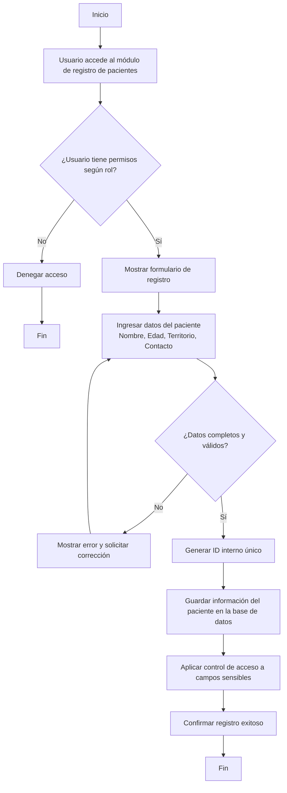

```mermaid
flowchart TD

A[Inicio] --> B[Usuario accede al módulo de registro de pacientes]

B --> C{¿Usuario tiene permisos según rol?}

C -- No --> D[Denegar acceso]
D --> E[Fin]

C -- Sí --> F[Mostrar formulario de registro]

F --> G[Ingresar datos del paciente<br>Nombre, Edad, Territorio, Contacto]

G --> H{¿Datos completos y válidos?}

H -- No --> I[Mostrar error y solicitar corrección]
I --> G

H -- Sí --> J[Generar ID interno único]

J --> K[Guardar información del paciente en la base de datos]

K --> L[Aplicar control de acceso a campos sensibles]

L --> M[Confirmar registro exitoso]

M --> N[Fin]
```

> Diagrama de flujo correspondiente a [[RF-SAL-01|RF-SAL-01: Registro de pacientes]].
