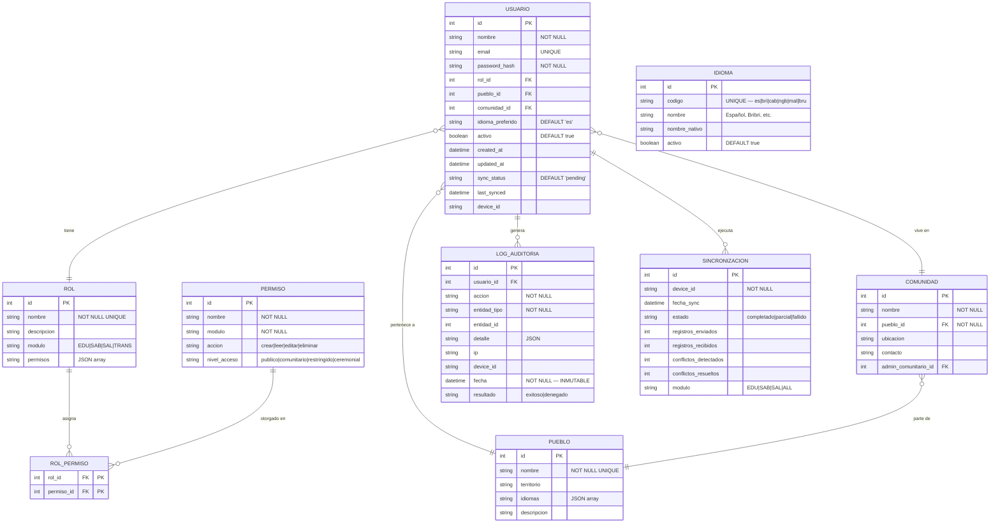
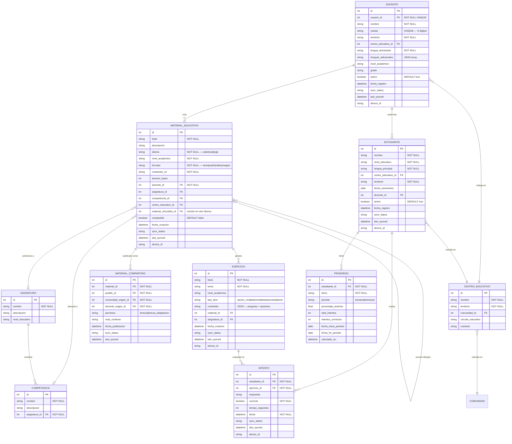
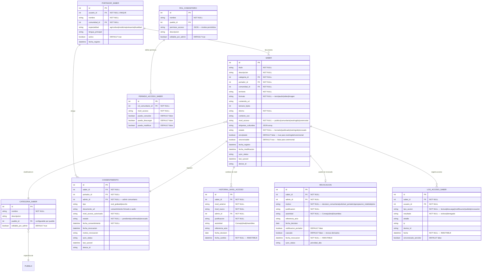
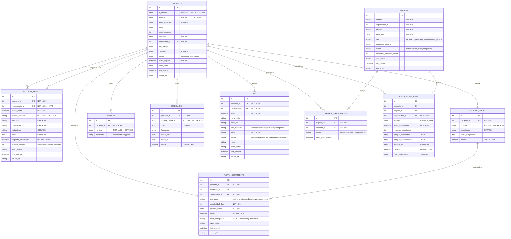
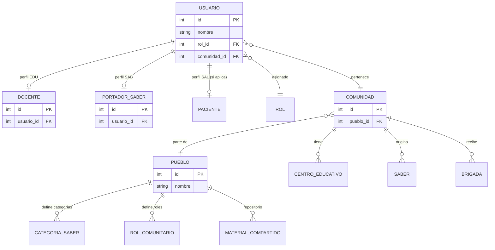

---
type: document
title: "Modelo de Datos — Raíces Vivas"
project: raices-vivas
status: draft
banner_src: "08-Recursos/Imágenes/cover-arquitectura.png"
banner_src_x: 0.47714
banner_src_y: 0.42
tags:
  - arquitectura
  - modelo-datos
---

# Modelo de Datos — Raíces Vivas

> Modelo relacional detallado derivado de los 23 requerimientos funcionales (RF-EDU-01..07, RF-SAB-01..07, RF-SAL-01..06, RF-TRANS-01..03) y los 4 requerimientos no funcionales (RNF-01..04).  
> Cada entidad incluye campos de sincronización offline-first (`sync_status`, `last_synced`, `device_id`) requeridos por RF-TRANS-01.  
> Los datos médicos (módulo SAL) requieren cifrado AES-256 en reposo (RNF-02).

---

## Diagrama ER — Entidades Transversales (TRANS)

> **Fuente:** RF-TRANS-01 (sync), RF-TRANS-02 (i18n), RF-TRANS-03 (gobernanza), RNF-02 (auditoría)

---

## Diagrama ER — Módulo Educativo (EDU)

> **Fuente:** RF-EDU-01 (docentes), RF-EDU-02 (estudiantes), RF-EDU-03 (materiales), RF-EDU-04 (organización), RF-EDU-05 (ejercicios), RF-EDU-06 (progreso), RF-EDU-07 (compartir inter-comunitario)

---

## Diagrama ER — Módulo Saberes Ancestrales (SAB)

> **Fuente:** RF-SAB-01 (registro), RF-SAB-02 (clasificación), RF-SAB-03 (búsqueda), RF-SAB-04 (acceso), RF-SAB-05 (consentimiento), RF-SAB-06 (revocación), RF-SAB-07 (auditoría)

---

## Diagrama ER — Módulo Salud Comunitaria (SAL)

> **Fuente:** RF-SAL-01 (pacientes), RF-SAL-02 (historial), RF-SAL-03 (citas), RF-SAL-04 (brigadas), RF-SAL-05 (alertas), RF-SAL-06 (exportación EDUS). Todos los datos encriptados AES-256 (RNF-02).

---

## Diagrama ER — Vista Integrada (Inter-Módulos)

> Relaciones entre entidades que cruzan módulos: USUARIO como eje central, COMUNIDAD/PUEBLO como contexto territorial y SINCRONIZACIÓN como mecanismo transversal.

---

## Notas Técnicas

### Campos de Sincronización (RF-TRANS-01)
Todas las entidades de datos incluyen:
- `sync_status`: `pending` | `synced` | `conflict` | `local_only` (ceremonial)
- `last_synced`: datetime de última sincronización exitosa
- `device_id`: identificador del dispositivo donde se creó/modificó el registro

### Cifrado (RNF-02)
- **AES-256 en reposo:** Campos marcados como `CIFRADO` en módulo SAL
- **TLS 1.3 en tránsito:** Toda sincronización de datos médicos
- **Saberes restringidos/ceremoniales:** Encriptados localmente (campo `encriptado = true`)

### Inmutabilidad (RF-SAB-07)
- `LOG_AUDITORIA` y `LOG_ACCESO_SABER`: registros inmutables (no se permiten UPDATE ni DELETE)
- `REVOCACION` e `HISTORIAL_NIVEL_ACCESO`: timestamps inmutables

### Reglas de Negocio Implementadas en el Modelo
1. **Consentimiento obligatorio (RF-SAB-05):** `SABER.estado` no puede ser `publicado` sin un `CONSENTIMIENTO.estado = 'confirmado'` asociado
2. **Revocación prevalece (RF-SAB-06):** En conflicto de sincronización, la revocación siempre gana
3. **Ceremonial no sincroniza (RF-TRANS-01):** Saberes con `nivel_acceso = 'ceremonial'` tienen `sincronizable = false`
4. **Duplicado de paciente (RF-SAL-01):** Validación por `nombre + fecha_nacimiento + territorio` antes de crear
5. **Interacción medicamentosa (RF-SAL-02):** Verificación cruzada `MEDICACION.activa = true` al registrar nuevo tratamiento
