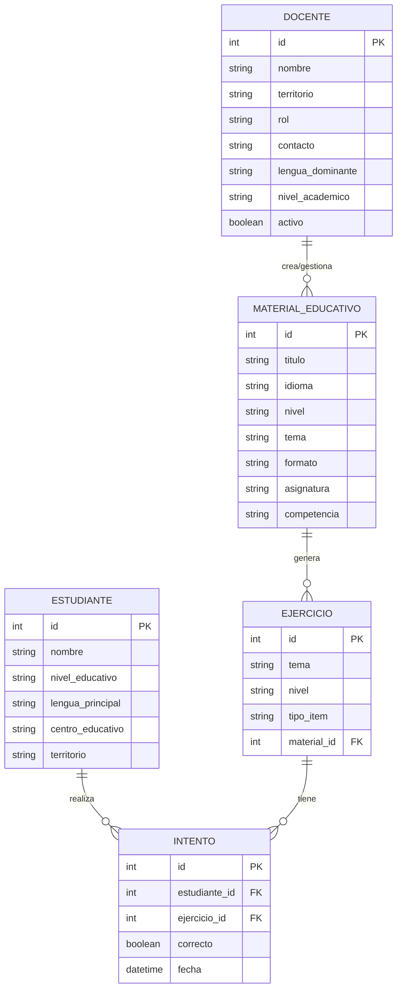
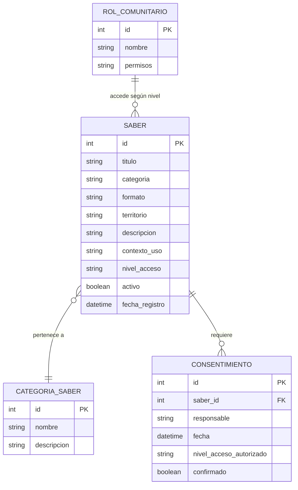
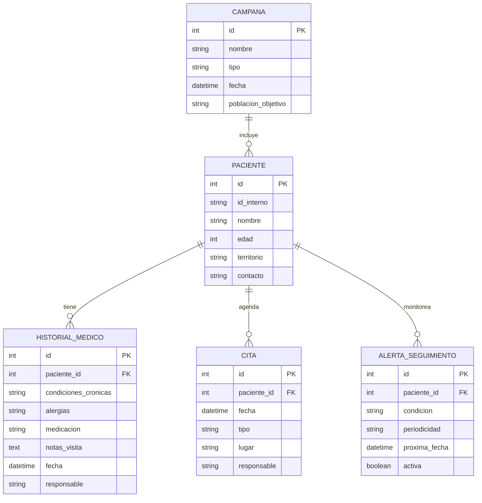
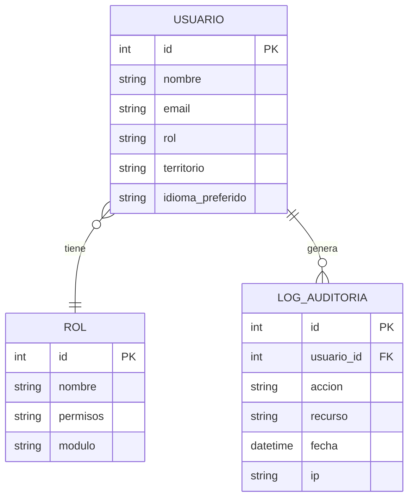

# Modelo de Datos — Raíces Vivas

> Modelo conceptual inicial derivado de los requerimientos funcionales del Avance 1.  
> Se refinará durante la fase de diseño detallado (Avance 2).

## Diagrama ER — Módulo Educativo (EDU)

## Diagrama ER — Módulo Saberes Ancestrales (SAB)

## Diagrama ER — Módulo Salud (SAL)

## Entidades Transversales

## Notas

- Los diagramas son **conceptuales** — se refinarán con tipos de datos específicos y constraints en Avance 2
- El modelo offline-sync requiere campos adicionales: `sync_status`, `last_synced`, `conflict_resolution`
- Los datos médicos requieren cifrado at-rest (definido en [[RNF-02-confidencialidad]])
