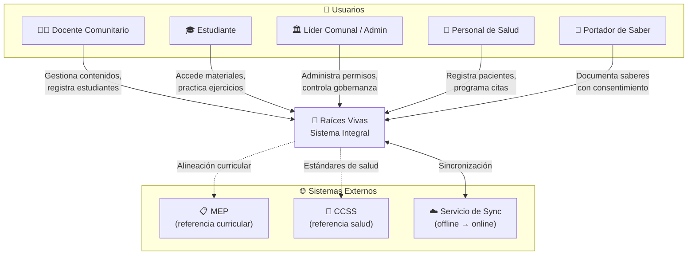
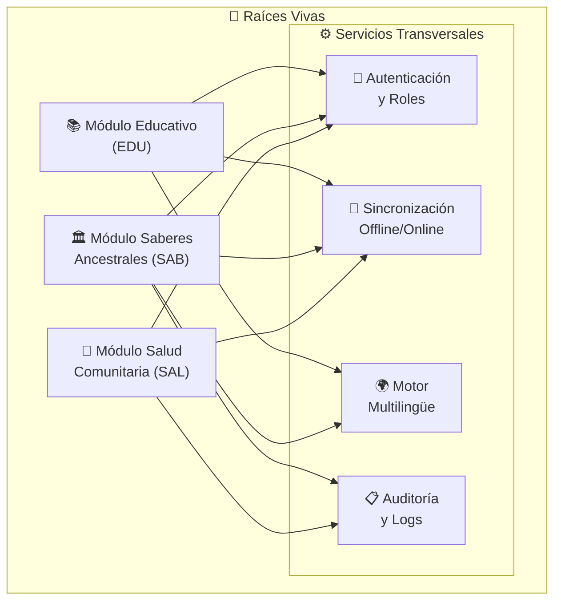

# Visión General de Arquitectura — Raíces Vivas

## Diagrama de Contexto (C4 - Nivel 1)

## Diagrama de Módulos (C4 - Nivel 2)

## Principios de Arquitectura

1. **Modularidad:** Cada módulo (EDU, SAB, SAL) es independiente y puede desarrollarse/desplegarse por separado
2. **Offline-first:** El sistema funciona sin conexión; la sincronización es eventual
3. **Control comunitario:** La gobernanza de datos es configurable por comunidad
4. **Ligereza:** Compatible con dispositivos de gama media-baja (Android + navegadores modernos)
5. **Multilingüe nativo:** Tanto la UI como los contenidos soportan español + lenguas indígenas

## Stack Tecnológico

> Pendiente de definición formal → Ver [[Stack Tecnológico]] o [[ADR-001-stack-tecnologico]]

## Notas

- Diagrama de despliegue: pendiente para Sprint de implementación
- Modelo de datos (ER): ver [[Modelo de Datos]]
