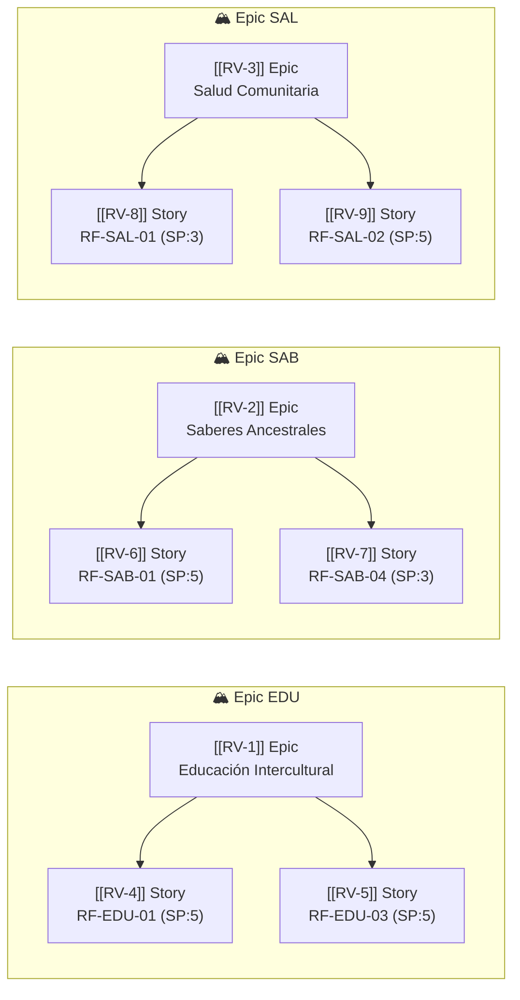

# WBS — Work Breakdown Structure

## Diagrama WBS (Mermaid)

```mermaid
graph TD
    RV["🌿 Raíces Vivas<br/>Sistema Integral"]
    
    RV --> RV1["📚 RV-1<br/>Módulo Educativo (EDU)"]
    RV --> RV2["🏛️ RV-2<br/>Módulo Saberes Ancestrales (SAB)"]
    RV --> RV3["🏥 RV-3<br/>Módulo Salud Comunitaria (SAL)"]
    RV --> RV4["⚙️ RV-4<br/>Requerimientos Transversales (NFR)"]
    
    RV1 --> RV11["RV-1.1<br/>Gestión de Actores Educativos"]
    RV1 --> RV12["RV-1.2<br/>Gestión de Contenidos Educativos"]
    RV1 --> RV13["RV-1.3<br/>Evaluación y Práctica Académica"]
    RV1 --> RV14["RV-1.4<br/>Acceso Bilingüe / Offline"]
    
    RV2 --> RV21["RV-2.1<br/>Registro Multiformato de Saberes"]
    RV2 --> RV22["RV-2.2<br/>Catalogación y Búsqueda"]
    RV2 --> RV23["RV-2.3<br/>Gobernanza y Control Comunitario"]
    RV2 --> RV24["RV-2.4<br/>Preservación y Trazabilidad Cultural"]
    
    RV3 --> RV31["RV-3.1<br/>Registro y Gestión de Pacientes"]
    RV3 --> RV32["RV-3.2<br/>Citas y Brigadas Comunitarias"]
    RV3 --> RV33["RV-3.3<br/>Seguimiento y Alertas"]
    RV3 --> RV34["RV-3.4<br/>Confidencialidad / Offline"]
    
    RV4 --> RV41["RV-4.1<br/>Conectividad y Modo Offline"]
    RV4 --> RV42["RV-4.2<br/>Multilingüismo y Accesibilidad"]
    RV4 --> RV43["RV-4.3<br/>Seguridad, Privacidad y Auditoría"]
    RV4 --> RV44["RV-4.4<br/>Rendimiento y Compatibilidad"]
```



## Diccionario WBS

| Código | Paquete | Módulo | Propósito | Entregable | Fuera de Alcance |
|--------|---------|--------|-----------|------------|------------------|
| RV-1.1 | Gestión de Actores Educativos | EDU | Registrar docentes y estudiantes | Perfiles educativos | Nómina, pagos |
| RV-1.2 | Gestión de Contenidos Educativos | EDU | Repositorio bilingüe | Materiales organizados | Certificación MEP |
| RV-1.3 | Evaluación y Práctica | EDU | Práctica para evaluaciones | Banco de ejercicios | Notas oficiales |
| RV-1.4 | Acceso Bilingüe/Offline | EDU | Uso sin conectividad | Modo offline educativo | — |
| RV-2.1 | Registro Multiformato | SAB | Documentar saberes | Registros con metadatos | Publicación abierta |
| RV-2.2 | Catalogación y Búsqueda | SAB | Recuperar saberes | Catálogo + buscador | IA de indexación |
| RV-2.3 | Gobernanza Comunitaria | SAB | Control de acceso cultural | Roles y permisos | Identidad estatal |
| RV-2.4 | Preservación Cultural | SAB | Trazabilidad de contenidos | Historial de cambios | — |
| RV-3.1 | Registro de Pacientes | SAL | Información básica de salud | Perfil + historial | Expediente hospitalario |
| RV-3.2 | Citas y Brigadas | SAL | Coordinar atención | Agenda comunitaria | Referencia hospitalaria |
| RV-3.3 | Seguimiento y Alertas | SAL | Reducir pérdida de seguimiento | Alertas configurables | Diagnóstico automático |
| RV-3.4 | Confidencialidad/Offline | SAL | Privacidad y continuidad | Cifrado + sync | — |
| RV-4.1 | Conectividad/Offline | NFR | Operación sin internet | Sync automática | — |
| RV-4.2 | Multilingüismo | NFR | UI e contenidos multilingüe | Selector de idioma | — |
| RV-4.3 | Seguridad/Privacidad | NFR | Protección de datos | Roles + auditoría | — |
| RV-4.4 | Rendimiento/Compat. | NFR | Funcionar en gama baja | <3s respuesta | — |

## Trazabilidad WBS ↔ Jira ↔ Requerimientos

> Cada nodo WBS está vinculado a un **Epic** en Jira y sus **Stories** implementan los requerimientos funcionales correspondientes.

### Mapa de Trazabilidad



### Tabla de Trazabilidad WBS → Jira → RF

| Código WBS | Paquete | Epic Jira | Stories Jira | RF Vinculados |
|-----------|---------|-----------|--------------|---------------|
| RV-1.1 | Gestión de Actores Educativos | [[RV-1]] | [[RV-4]] | [[RF-EDU-01]], [[RF-EDU-02]] |
| RV-1.2 | Gestión de Contenidos Educativos | [[RV-1]] | [[RV-5]] | [[RF-EDU-03]], [[RF-EDU-04]] |
| RV-1.3 | Evaluación y Práctica | [[RV-1]] | — | [[RF-EDU-05]] |
| RV-1.4 | Acceso Bilingüe/Offline | [[RV-1]] | — | [[RF-EDU-06]] |
| RV-2.1 | Registro Multiformato | [[RV-2]] | [[RV-6]] | [[RF-SAB-01]], [[RF-SAB-02]] |
| RV-2.2 | Catalogación y Búsqueda | [[RV-2]] | — | [[RF-SAB-03]] |
| RV-2.3 | Gobernanza Comunitaria | [[RV-2]] | [[RV-7]] | [[RF-SAB-04]] |
| RV-2.4 | Preservación Cultural | [[RV-2]] | — | [[RF-SAB-05]] |
| RV-3.1 | Registro de Pacientes | [[RV-3]] | [[RV-8]] | [[RF-SAL-01]] |
| RV-3.2 | Citas y Brigadas | [[RV-3]] | [[RV-9]] | [[RF-SAL-02]], [[RF-SAL-03]] |
| RV-3.3 | Seguimiento y Alertas | [[RV-3]] | — | [[RF-SAL-04]] |
| RV-3.4 | Confidencialidad/Offline | [[RV-3]] | — | [[RF-SAL-05]] |
| RV-4.1 | Conectividad/Offline | — | — | [[RF-TRANS-01]] |
| RV-4.2 | Multilingüismo | — | — | [[RF-TRANS-02]], [[RNF-01]] |
| RV-4.3 | Seguridad/Privacidad | — | — | [[RNF-02]], [[RNF-03]] |
| RV-4.4 | Rendimiento/Compat. | — | — | [[RNF-04]], [[RF-TRANS-03]] |

### Dataview — Estado de Tareas por Epic

```dataview
TABLE WITHOUT ID
  key as "Key",
  summary as "Epic / Story",
  issuetype as "Tipo",
  status as "Estado"
FROM "05-Sprints/Epics" OR "05-Sprints/Stories"
WHERE type = "epic" OR type = "story"
SORT key ASC
```

---

*WBS dinámico · Mermaid + Dataview + Jira Sync · Última actualización: 2026-03-05*
