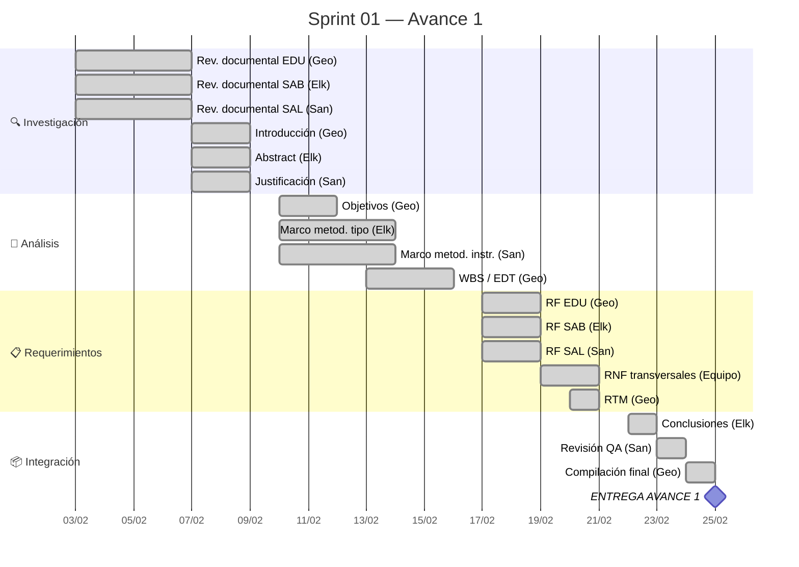

# Sprint 01 — Avance 1: Análisis y Requerimientos

## Meta del Sprint

> Completar el análisis integral de la problemática, identificar actores y necesidades reales, y producir una especificación de requerimientos funcionales y no funcionales verificable para el sistema Raíces Vivas.

## Período

| Campo | Valor |
|-------|-------|
| **Inicio** | 2026-02-03 |
| **Fin** | 2026-02-25 |
| **Duración** | 23 días (3.3 semanas) |
| **Estado** | ✅ Completado |

## Distribución de Fases



## Tareas del Sprint

```sqlseal
SELECT
  id as "ID",
  title as "Tarea",
  assignee as "Responsable",
  phase as "Fase",
  status as "Estado",
  effort as "Esfuerzo",
  started as "Inicio",
  due as "Fin"
FROM files
WHERE (type = 'task' OR type = 'subtask') AND path LIKE '05-Sprints/Sprint-01%'
ORDER BY started ASC, id ASC
```

## Distribución por Responsable

```sqlseal
SELECT
  assignee as "👤 Responsable",
  COUNT(*) as "Tareas",
  SUM(CASE WHEN status = 'done' THEN 1 ELSE 0 END) as "✅ Done"
FROM files
WHERE (type = 'task' OR type = 'subtask') AND path LIKE '05-Sprints/Sprint-01%'
GROUP BY assignee
ORDER BY assignee ASC
```

## Distribución por Fase

```sqlseal
SELECT
  phase as "📍 Fase",
  COUNT(*) as "Tareas",
  SUM(CASE WHEN status = 'done' THEN 1 ELSE 0 END) as "✅ Done"
FROM files
WHERE (type = 'task' OR type = 'subtask') AND path LIKE '05-Sprints/Sprint-01%'
GROUP BY phase
```

## Métricas del Sprint

| Métrica | Valor |
|---------|-------|
| **Tareas planificadas** | 20 |
| **Tareas completadas** | 20 |
| **Velocidad** | 20/20 (100%) |
| **Esfuerzo total estimado** | ~108h |
| **Promedio por integrante** | ~36h |

## Retrospectiva

### ✅ Qué salió bien
- División clara de módulos por integrante (EDU→Geo, SAB→Elk, SAL→San)
- Trazabilidad completa en la RTM
- Entrega a tiempo

### ⚠️ Qué mejorar
- Iniciar gestión en vault desde el Sprint 1 (no al final)
- Documentar decisiones como ADR desde el inicio
- Programar revisiones cruzadas antes de la última semana

### 🔄 Acciones para Sprint 02
- Configurar vault completamente antes de iniciar trabajo
- Usar Kanban board activamente
- Reunión semanal con minuta documentada

## Índice de Tareas

- [[T-001]]
- [[T-002]]
- [[T-003]]
- [[T-004]]
- [[T-005]]
- [[T-006]]
- [[T-007]]
- [[T-008]]
- [[T-009]]
- [[T-010]]
- [[T-011]]
- [[T-012]]
- [[T-013]]
- [[T-014]]
- [[T-015]]
- [[T-016]]
- [[T-017]]
- [[T-018]]
- [[T-019]]
- [[T-020]]
