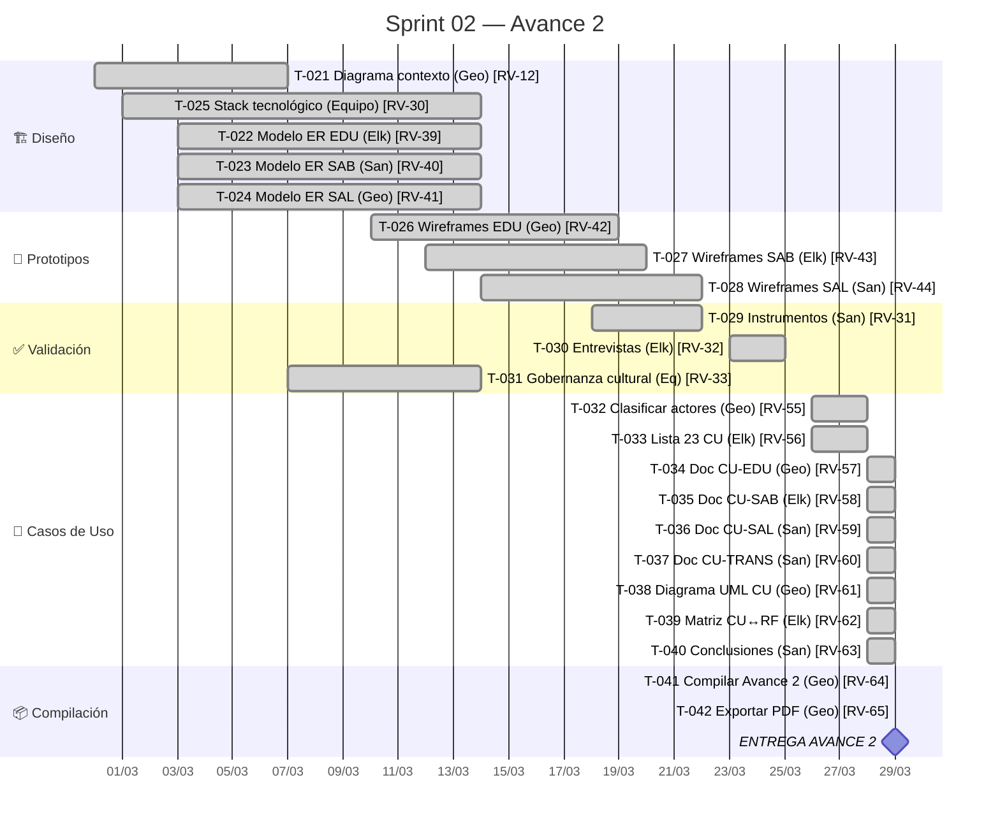
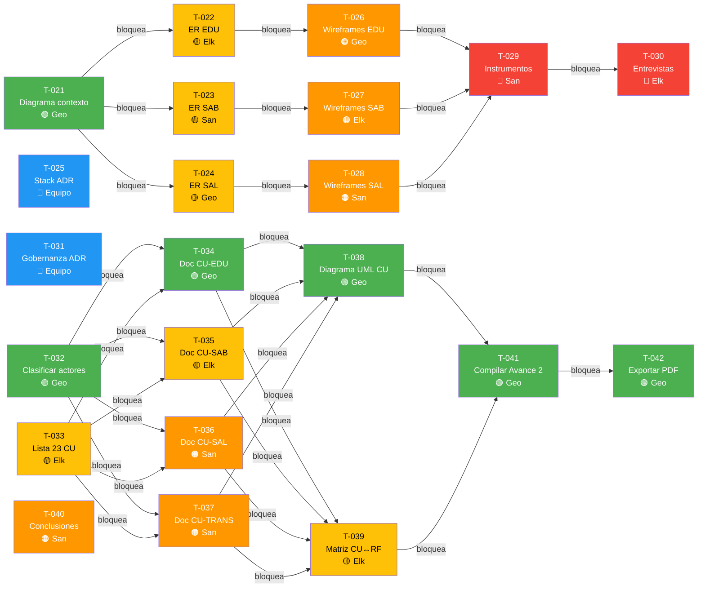

# Sprint 02 — Avance 2: Diseño y Arquitectura

## Meta del Sprint

> Producir el diseño de arquitectura del sistema Raíces Vivas: diagrama de contexto (C4), modelos entidad-relación por módulo, decisión de stack tecnológico, prototipos UI/UX iniciales, y validación preliminar con usuarios potenciales.

## Período

| Campo | Valor |
|-------|-------|
| **Inicio** | 2026-02-28 |
| **Fin** | 2026-04-01 |
| **Duración** | ~32 días (4.5 semanas) |
| **Estado** | ✅ Completado (entregado 2026-03-29) |

## Timeline del Sprint



## Tareas del Sprint

```sqlseal
SELECT name as "ID", title as "Tarea", assignee as "👤", status as "Estado", priority as "Prioridad", due as "Fecha Límite"
FROM files
WHERE (type = 'task' OR type = 'subtask') AND path LIKE '05-Sprints/Sprint-02%'
ORDER BY due ASC, name ASC
```

## Distribución por Responsable

```sqlseal
SELECT assignee as "👤 Responsable", COUNT(*) as "Tareas", SUM(CASE WHEN status = 'done' THEN 1 ELSE 0 END) as "✅ Done"
FROM files
WHERE (type = 'task' OR type = 'subtask') AND path LIKE '05-Sprints/Sprint-02%'
GROUP BY assignee
ORDER BY assignee ASC
```

## 🔗 Mapa de Dependencias



> **Ruta crítica:** T-021 → T-022/T-023/T-024 → T-026/T-027/T-028 → T-029 → T-030
> **Ruta CU:** T-032/T-033 → T-034..T-037 → T-038/T-039 → T-041 → T-042
> T-025, T-031 y T-040 pueden ejecutarse en paralelo con las rutas principales.

## 🚧 Tareas con Bloqueos Activos

```sqlseal
SELECT
  name as "Tarea Bloqueada",
  status as "Estado",
  assignee as "Responsable",
  blocked_by as "Bloqueada por"
FROM files
WHERE path LIKE '05-Sprints/Sprint-02%'
  AND (type = 'task' OR type = 'subtask')
  AND blocked_by IS NOT NULL AND blocked_by != ''
ORDER BY name ASC
```

## ⚠️ Impedimentos Activos

```sqlseal
SELECT
  name as "Tarea",
  assignee as "Responsable",
  impediments as "Impedimento"
FROM files
WHERE path LIKE '05-Sprints/Sprint-02%'
  AND (type = 'task' OR type = 'subtask')
  AND impediments IS NOT NULL AND impediments != ''
ORDER BY name ASC
```

## Capacidad del Equipo

| Integrante | Tareas Asignadas | Horas Estimadas |
|-----------|-----------------|-----------------|
| Geovanny | [[T-021]], [[T-024]], [[T-026]], [[T-032]], [[T-034]], [[T-038]], [[T-041]], [[T-042]] | ~35h |
| Elkin | [[T-022]], [[T-027]], [[T-030]], [[T-033]], [[T-035]], [[T-039]] | ~29h |
| Santiago | [[T-023]], [[T-028]], [[T-029]], [[T-036]], [[T-037]], [[T-040]] | ~30h |
| Equipo | [[T-025]], [[T-031]] | ~10h |
| **Total** | **22 tareas** | **~104h** |

## Entregables Esperados

- [x] Diagrama de contexto C4 nivel 1
- [x] Modelo ER del módulo EDU
- [x] Modelo ER del módulo SAB
- [x] Modelo ER del módulo SAL
- [x] ADR: Decisión de stack tecnológico
- [x] Wireframes iniciales (al menos 3 pantallas por módulo)
- [x] Informe de validación con usuarios
- [x] Clasificación de actores y lista de 23 casos de uso
- [x] Documentación expandida de 8 casos de uso representativos
- [x] Diagrama UML de casos de uso
- [x] Matriz de trazabilidad CU ↔ RF
- [x] Documento Avance 2 compilado y entregado

## Criterios de Éxito

- Todos los modelos ER son consistentes con los RF del Avance 1
- El stack tecnológico respeta las restricciones de RNF (offline, gama baja, multilingüe)
- Al menos 2 usuarios potenciales validan el diseño propuesto
- Trazabilidad completa: RF → Entidad ER → Prototipo UI
