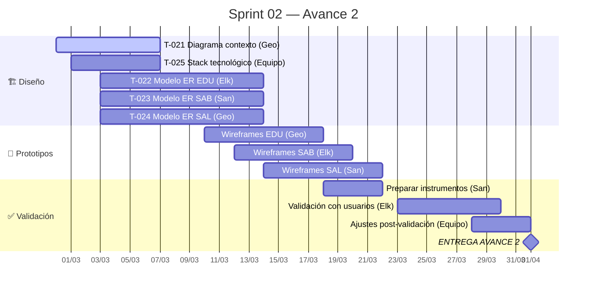

# Sprint 02 — Avance 2: Diseño y Arquitectura

## Meta del Sprint

> Producir el diseño de arquitectura del sistema Raíces Vivas: diagrama de contexto (C4), modelos entidad-relación por módulo, decisión de stack tecnológico, prototipos UI/UX iniciales, y validación preliminar con usuarios potenciales.

## Período

| Campo | Valor |
|-------|-------|
| **Inicio** | 2026-02-28 |
| **Fin** | 2026-04-01 |
| **Duración** | ~32 días (4.5 semanas) |
| **Estado** | 🔄 En progreso |

## Timeline del Sprint



## Tareas del Sprint

```dataview
TABLE WITHOUT ID
  id as "ID",
  title as "Tarea",
  assignee as "👤",
  status as "Estado",
  priority as "Prioridad",
  due as "Fecha Límite"
FROM "05-Sprints/Sprint-02"
WHERE type = "task"
SORT due ASC, id ASC
```

## Distribución por Responsable

```dataview
TABLE WITHOUT ID
  assignee as "👤 Responsable",
  length(rows) as "Tareas",
  length(filter(rows, (r) => r.status = "done")) as "✅ Done"
FROM "05-Sprints/Sprint-02"
WHERE type = "task"
GROUP BY assignee
SORT assignee ASC
```

## Capacidad del Equipo

| Integrante | Tareas Asignadas | Horas Estimadas |
|-----------|-----------------|-----------------|
| Geovanny | T-021, T-024, + wireframes, + compilación | ~24h |
| Elkin | T-022, + wireframes, + validación usuarios | ~20h |
| Santiago | T-023, + wireframes, + instrumentos | ~20h |
| Equipo | T-025, ajustes post-validación | ~8h |

## Entregables Esperados

- [ ] Diagrama de contexto C4 nivel 1
- [ ] Modelo ER del módulo EDU
- [ ] Modelo ER del módulo SAB
- [ ] Modelo ER del módulo SAL
- [ ] ADR: Decisión de stack tecnológico
- [ ] Wireframes iniciales (al menos 3 pantallas por módulo)
- [ ] Informe de validación con usuarios
- [ ] Documento Avance 2 compilado

## Criterios de Éxito

- Todos los modelos ER son consistentes con los RF del Avance 1
- El stack tecnológico respeta las restricciones de RNF (offline, gama baja, multilingüe)
- Al menos 2 usuarios potenciales validan el diseño propuesto
- Trazabilidad completa: RF → Entidad ER → Prototipo UI
