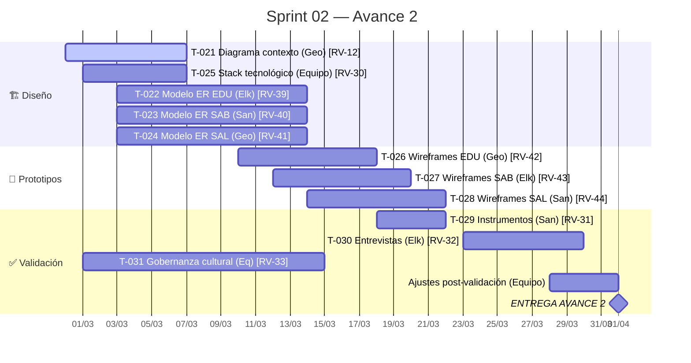
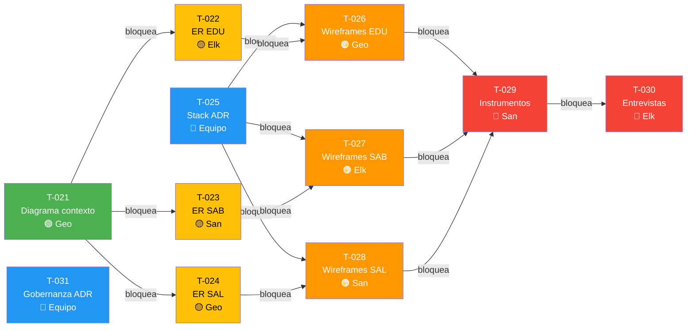

# Sprint 02 — Avance 2: Diseño y Arquitectura

## Meta del Sprint

> Producir el diseño de arquitectura del sistema Raíces Vivas: diagrama de contexto (C4), modelos entidad-relación por módulo, decisión de stack tecnológico, prototipos UI/UX iniciales, y validación preliminar con usuarios potenciales.

## Período

| Campo | Valor |
|-------|-------|
| **Inicio** | 2026-02-28 |
| **Fin** | 2026-04-01 |
| **Duración** | ~32 días (4.5 semanas) |
| **Estado** | 🔄 En progreso |

## Timeline del Sprint



## Tareas del Sprint

```dataview
TABLE WITHOUT ID
  id as "ID",
  title as "Tarea",
  assignee as "👤",
  status as "Estado",
  priority as "Prioridad",
  due as "Fecha Límite"
FROM "05-Sprints/Sprint-02"
WHERE type = "task" OR type = "subtask"
SORT due ASC, id ASC
```

## Distribución por Responsable

```dataview
TABLE WITHOUT ID
  assignee as "👤 Responsable",
  length(rows) as "Tareas",
  length(filter(rows, (r) => r.status = "done")) as "✅ Done"
FROM "05-Sprints/Sprint-02"
WHERE type = "task" OR type = "subtask"
GROUP BY assignee
SORT assignee ASC
```

## 🔗 Mapa de Dependencias



> **Ruta crítica:** T-021 → T-022/T-023/T-024 → T-026/T-027/T-028 → T-029 → T-030
> T-025 y T-031 pueden ejecutarse en paralelo con la ruta crítica.

## 🚧 Tareas con Bloqueos Activos

```dataviewjs
const tasks = dv.pages('"05-Sprints/Sprint-02"')
  .where(t => (t.type === "task" || t.type === "subtask") && t.blocked_by && t.blocked_by.length > 0);

const rows = [];
for (const t of tasks) {
  const blockers = t.blocked_by.map(String);
  const blockerPages = dv.pages('"05-Sprints/Sprint-02"')
    .where(p => blockers.includes(String(p.id)));
  const pendingBlockers = blockerPages.where(p => p.status !== "done");
  
  if (pendingBlockers.length > 0) {
    const blockerList = pendingBlockers.map(p => `${p.id} (${p.status})`).join(", ");
    rows.push([t.file.link, t.status, t.assignee, blockerList]);
  }
}

if (rows.length > 0) {
  dv.table(["Tarea Bloqueada", "Estado", "Responsable", "Bloqueada por (pendientes)"], rows);
} else {
  dv.paragraph("✅ **No hay bloqueos activos** — todas las dependencias previas están resueltas.");
}
```

## ⚠️ Impedimentos Activos

```dataviewjs
const tasks = dv.pages('"05-Sprints/Sprint-02"')
  .where(t => t.impediments && t.impediments.length > 0);

if (tasks.length > 0) {
  const rows = tasks.map(t => [
    t.file.link,
    t.assignee,
    t.impediments.join("; ")
  ]);
  dv.table(["Tarea", "Responsable", "Impedimento"], rows);
} else {
  dv.paragraph("✅ **Sin impedimentos registrados.**");
}
```

## Capacidad del Equipo

| Integrante | Tareas Asignadas | Horas Estimadas |
|-----------|-----------------|-----------------|
| Geovanny | [[T-021]], [[T-024]], [[T-026]] | ~24h |
| Elkin | [[T-022]], [[T-027]], [[T-030]] | ~20h |
| Santiago | [[T-023]], [[T-028]], [[T-029]] | ~20h |
| Equipo | [[T-025]], [[T-031]] | ~12h |
| **Total** | **11 tareas** | **~76h** |

## Entregables Esperados

- [ ] Diagrama de contexto C4 nivel 1
- [ ] Modelo ER del módulo EDU
- [ ] Modelo ER del módulo SAB
- [ ] Modelo ER del módulo SAL
- [ ] ADR: Decisión de stack tecnológico
- [ ] Wireframes iniciales (al menos 3 pantallas por módulo)
- [ ] Informe de validación con usuarios
- [ ] Documento Avance 2 compilado

## Criterios de Éxito

- Todos los modelos ER son consistentes con los RF del Avance 1
- El stack tecnológico respeta las restricciones de RNF (offline, gama baja, multilingüe)
- Al menos 2 usuarios potenciales validan el diseño propuesto
- Trazabilidad completa: RF → Entidad ER → Prototipo UI
