# Raíces Vivas — Avance 2: Casos de Uso

> **Curso:** Introducción a la Ingeniería de Software — CENFOTEC (SOFT-09, SCV7)
> **Docente:** Johnny Marin
> **Equipo:** Geovanny Alpízar (PM/Arquitecto), Elkin (Investigación/SAB), Santiago (QA/SAL)
> **Fecha de entrega:** 01 de abril de 2026
> **Sprint:** Sprint-02 (2026-02-28 → 2026-04-01)

---

## 1. Introducción

Este documento presenta el segundo avance del proyecto **Raíces Vivas**, un sistema integral de apoyo a comunidades indígenas de Costa Rica en tres ejes: educación intercultural bilingüe (EDU), preservación de saberes ancestrales (SAB) y salud comunitaria (SAL), con un módulo transversal (TRANS) que gestiona conectividad, multilingüismo y gobernanza cultural.

El presente avance se centra en el análisis de **casos de uso** del sistema: identificación de actores, documentación de 23 casos de uso (12 en formato expandido), diagrama UML y trazabilidad con los requerimientos funcionales establecidos en el Avance 1. Los 4 casos de uso adicionales (CU-EDU-07, CU-SAB-06, CU-SAB-07, CU-SAL-06) fueron incorporados a partir de los hallazgos del [[02-Investigación/Análisis de Entrevistas|Análisis de Investigación Cualitativa]].

### 1.1 Estructura del Documento

| Sección | Contenido | Criterio de Rúbrica |
|---------|-----------|-------------------|
| §2 | Identificación y clasificación de actores | Criterio 1 (4 pts) |
| §3 | Lista general de 23 casos de uso | Criterio 2 (4 pts) |
| §4 | Documentación expandida de 12 casos de uso | Criterios 3-5 (12 pts) |
| §5 | Diagrama de casos de uso (UML) | Criterio 6 (4 pts) |
| §6 | Referencia cruzada RF ↔ CU | Criterio 7 (4 pts) |
| §7 | Conclusiones y recomendaciones | Criterio 8 (4 pts) |
| Anexo A | Contexto arquitectónico (C4, ER, stack) | Complementario |
| Anexo B | Contribuciones del equipo | Criterio 10 (4 pts) |

### 1.2 Investigación de Base

Los requerimientos funcionales y casos de uso de este avance se fundamentan en la investigación de campo realizada durante el Sprint-01, siguiendo el [[Enfoque-Metodológico]] del proyecto. Las fuentes primarias incluyen:

| Módulo | Entrevistas | Encuestas | Observaciones | Contexto |
|--------|------------|-----------|---------------|----------|
| **EDU** | [[ENT-001]] (líder educativo Maleku) | [[ENC-EDU-01]] (35 resp.) | [[OBS-001]] (Guatuso) | [[Educación]] |
| **SAB** | [[ENT-002]], [[ENT-004]] (portadores Bribri, Boruca) | [[ENC-SAB-01]] (40 resp.) | [[OBS-002]], [[OBS-003]] (Talamanca, Boruca) | [[Saberes Ancestrales]] |
| **SAL** | [[ENT-003]] (auxiliar salud Cabécar) | [[ENC-SAL-01]] (30 resp.) | [[OBS-002]], [[OBS-003]] (Talamanca, Boruca) | [[Salud Comunitaria]] |
| **TRANS** | [[ENT-001]]–[[ENT-004]] (transversal) | — | — | [[Bibliografía]] §6 |

> **Referencia completa:** La [[Bibliografía]] contiene 30 fuentes documentales organizadas por categoría temática.

---

## 2. Identificación y Clasificación de Actores

El sistema Raíces Vivas interactúa con **10 actores humanos** y **4 sistemas externos**. Se clasifican en actores **primarios** (quienes inician casos de uso para lograr un objetivo directo) y **secundarios** (quienes participan reactivamente o proveen información complementaria).

### 2.1 Actores Primarios

| # | Actor | Descripción | Módulo(s) | Justificación |
|---|-------|-------------|-----------|---------------|
| 1 | **Docente comunitario** | Educador bilingüe que trabaja en centros educativos ubicados en territorios indígenas. Opera el módulo EDU: registra estudiantes, sube materiales didácticos bilingües, genera ejercicios de práctica y consulta el progreso académico. | EDU | Principal usuario operativo del módulo educativo; lidera el proceso de enseñanza-aprendizaje intercultural. |
| 2 | **Guía cultural / Portador de saber** | Persona reconocida por la comunidad como portadora de conocimientos ancestrales (agricultura, medicina, artesanía, ceremonial). Documenta saberes en formato multimedia (audio, video, texto) y gestiona su nivel de acceso. | SAB | Fuente primaria de conocimiento; sin su participación, el módulo SAB no tendría contenido. |
| 3 | **Auxiliar de salud (ATAP)** | Promotor de salud comunitario o Asistente Técnico de Atención Primaria del CCSS. Registra pacientes, gestiona historiales médicos, programa citas y coordina brigadas de salud en territorios. | SAL | Único perfil de salud con presencia permanente en territorios; opera el módulo SAL en campo. |
| 4 | **Administrador del sistema** | Responsable técnico de la plataforma. Gestiona usuarios, roles, configuración general, sincronización servidor central y monitoreo de auditoría. | TRANS | Garantiza la operación técnica y seguridad de toda la plataforma. |
| 5 | **Administrador comunitario** | Líder comunal designado que gestiona los niveles de acceso a saberes según la gobernanza cultural de su comunidad. Configura permisos CARE, aprueba/revoca consentimientos. | SAB, TRANS | Representa la autoridad de la comunidad sobre sus datos; requisito de los principios CARE y la Ley 6172. |

### 2.2 Actores Secundarios

| # | Actor | Descripción | Módulo(s) | Tipo de Interacción |
|---|-------|-------------|-----------|-------------------|
| 6 | **Estudiante** | Destinatario del contenido educativo (primaria y secundaria). Realiza ejercicios de práctica y consulta materiales. No administra contenido. | EDU | Consumidor de contenido; sujeto de seguimiento académico. |
| 7 | **Paciente / Miembro de comunidad** | Persona que recibe atención de salud. Proporciona información personal para su registro pero no opera el sistema directamente. | SAL | Proveedor de información personal; sujeto de expediente médico. |
| 8 | **Consejo de mayores** | Colectivo de autoridad comunitaria que autoriza cambios de nivel de acceso a contenido restringido o ceremonial. Interactúa a través del admin comunitario. | SAB | Autoridad intermedia para contenido de acceso restringido. |
| 9 | **Awá / Autoridad espiritual** | Máxima autoridad espiritual de la comunidad. Autoriza el acceso a contenido sagrado y ceremonial. Su participación es requerida por protocolo CARE para el nivel de acceso más alto. | SAB | Autoridad máxima para contenido ceremonial; veto sobre acceso espiritual. |
| 10 | **Traductor comunitario** | Hablante nativo que provee traducciones de la interfaz y contenido a lenguas indígenas (bribri, cabécar, ngäbere). No opera el sistema de forma regular. | TRANS | Proveedor de contenido lingüístico; interacción puntual durante sprints de i18n. |

### 2.3 Sistemas Externos (Actores No Humanos)

| # | Sistema | Interacción | Protocolo | Módulo |
|---|---------|-------------|-----------|--------|
| 11 | **CouchDB (servidor central)** | Recibe y distribuye datos sincronizados desde dispositivos PouchDB | HTTP/REST | TRANS |
| 12 | **Raspberry Pi (servidor local)** | Nodo de sincronización LAN en cada territorio; gateway entre dispositivos y servidor central | LAN / HTTP | TRANS |
| 13 | **MEP (Ministerio de Educación Pública)** | Fuente de planes de estudio y currículo nacional; importación de datos curriculares | CSV / REST | EDU |
| 14 | **CCSS / EBAIS** | Referencia de protocolos de salud y coordinación de brigadas; exportación futura de expedientes | Manual / PDF | SAL |

### 2.4 Diagrama Resumen: Actor ↔ Módulo

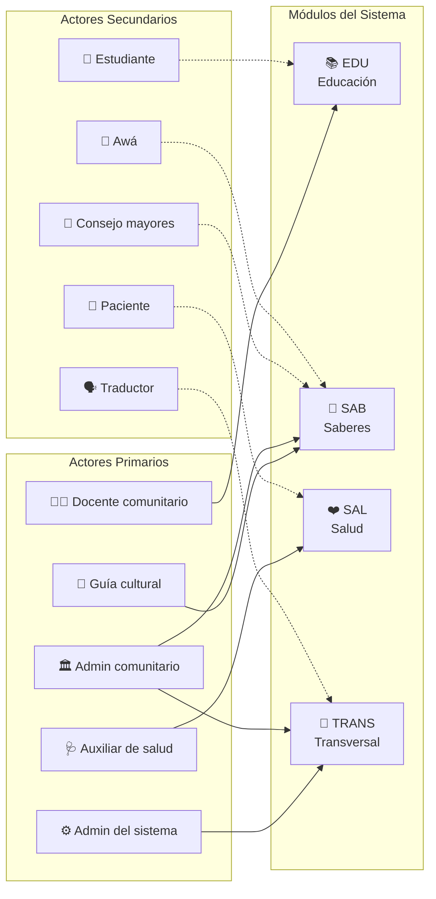

---

## 3. Lista General de Casos de Uso

El sistema Raíces Vivas comprende **23 casos de uso** derivados de los 23 requerimientos funcionales aprobados. Se organizan por módulo y alineados con la priorización MoSCoW.

| # | ID | Caso de Uso | Módulo | RF | Actor Principal | Prioridad | Expandido |
|---|-----|-------------|--------|-----|-----------------|-----------|-----------|
| 1 | CU-EDU-01 | Registrar docente comunitario | EDU | RF-EDU-01 | Admin del sistema | Must | ✅ §4.1 |
| 2 | CU-EDU-02 | Registrar estudiante | EDU | RF-EDU-02 | Docente comunitario | Should | — |
| 3 | CU-EDU-03 | Cargar material educativo multimedia | EDU | RF-EDU-03 | Docente comunitario | Must | ✅ §4.2 |
| 4 | CU-EDU-04 | Organizar material por asignatura y competencia | EDU | RF-EDU-04 | Docente comunitario | Should | — |
| 5 | CU-EDU-05 | Realizar ejercicio de práctica | EDU | RF-EDU-05 | Estudiante | Should | — |
| 6 | CU-EDU-06 | Consultar progreso de estudiante | EDU | RF-EDU-06 | Docente comunitario | Could | — |
| 7 | CU-EDU-07 | Compartir material entre comunidades del mismo pueblo | EDU | RF-EDU-07 | Docente comunitario | Should | ✅ §4.9 |
| 8 | CU-SAB-01 | Registrar saber ancestral multimedia | SAB | RF-SAB-01 | Guía cultural | Must | ✅ §4.3 |
| 9 | CU-SAB-02 | Clasificar saber por categoría | SAB | RF-SAB-02 | Admin comunitario | Should | — |
| 10 | CU-SAB-03 | Buscar saberes por filtros | SAB | RF-SAB-03 | Usuario autorizado | Should | — |
| 11 | CU-SAB-04 | Configurar restricción de acceso por autorización comunitaria | SAB | RF-SAB-04 | Admin comunitario | Must | ✅ §4.4 |
| 12 | CU-SAB-05 | Registrar consentimiento informado | SAB | RF-SAB-05 | Admin comunitario | Must | — |
| 13 | CU-SAB-06 | Revocar contenido por decisión comunitaria | SAB | RF-SAB-06 | Admin comunitario | Must | ✅ §4.10 |
| 14 | CU-SAB-07 | Consultar registro de auditoría de acceso | SAB | RF-SAB-07 | Admin comunitario | Should | ✅ §4.11 |
| 15 | CU-SAL-01 | Registrar paciente con ID único | SAL | RF-SAL-01 | Auxiliar de salud | Must | ✅ §4.5 |
| 16 | CU-SAL-02 | Registrar historial médico básico | SAL | RF-SAL-02 | Auxiliar de salud | Must | ✅ §4.6 |
| 17 | CU-SAL-03 | Programar cita médica | SAL | RF-SAL-03 | Auxiliar de salud | Should | — |
| 18 | CU-SAL-04 | Gestionar brigada de salud | SAL | RF-SAL-04 | Auxiliar de salud | Could | — |
| 19 | CU-SAL-05 | Configurar alerta de seguimiento clínico | SAL | RF-SAL-05 | Auxiliar de salud | Should | — |
| 20 | CU-SAL-06 | Exportar expediente a EDUS (CCSS) | SAL | RF-SAL-06 | Auxiliar de salud | Could | ✅ §4.12 |
| 21 | CU-TRANS-01 | Sincronizar datos offline/online | TRANS | RF-TRANS-01 | Sistema / Usuario | Must | ✅ §4.7 |
| 22 | CU-TRANS-02 | Seleccionar idioma de interfaz | TRANS | RF-TRANS-02 | Usuario autenticado | Must | ✅ §4.8 |
| 23 | CU-TRANS-03 | Configurar gobernanza de datos comunitarios | TRANS | RF-TRANS-03 | Admin comunitario | Must | — |

**Resumen:** 23 casos de uso — 11 Must, 8 Should, 3 Could, 1 Won't (ninguno). Se documentan **12 en formato expandido**, 3 por cada módulo principal.

---

## 4. Documentación Detallada de Casos de Uso

> Los 12 casos de uso documentados a continuación siguen el formato expandido con los 14 campos requeridos: caso de uso, actor principal, objetivo, precondiciones, disparador, escenario (flujos principal y alternos), excepciones, prioridad, disponibilidad, frecuencia de uso, canal para el actor, actores secundarios, canales para actores secundarios y aspectos pendientes.

### 4.1 CU-EDU-01: Registrar docente comunitario

| Campo | Detalle |
|-------|---------|
| **Caso de uso** | CU-EDU-01 — Registrar docente comunitario |
| **Actor principal** | Administrador del sistema |
| **Objetivo** | Registrar un nuevo docente comunitario con sus datos personales, lingüísticos y profesionales en el módulo EDU |
| **Precondiciones** | 1) El administrador está autenticado y tiene rol "Admin". 2) El sistema está operativo (online u offline). 3) El docente no está previamente registrado. |
| **Disparador** | El administrador selecciona "Nuevo Docente" en el panel de gestión del módulo EDU |

**Escenario principal:**

| Paso | Actor | Sistema |
|------|-------|---------|
| 1 | Selecciona "Nuevo Docente" | Muestra formulario de registro |
| 2 | Ingresa nombre completo y cédula | Valida formato de cédula (9 dígitos) |
| 3 | Selecciona territorio y centro educativo | Carga lista de centros del territorio |
| 4 | Selecciona lengua(s) indígena(s) dominada(s) | Muestra opciones: bribri, cabécar, ngäbere, maleku, etc. |
| 5 | Asigna nivel académico y grado | — |
| 6 | Confirma registro | Valida campos obligatorios completos |
| 7 | — | Genera ID único (DOC-XXXX) |
| 8 | — | Almacena localmente (PouchDB) y marca para sincronización |
| 9 | — | Muestra confirmación con ID generado |

**Flujo alterno A — Modo offline:**

| Paso | Detalle |
|------|---------|
| 3a | Si no hay conexión, el sistema usa la lista de centros educativos cacheada localmente |
| 8a | El registro se almacena localmente y se sincronizará cuando haya conexión |

| Campo | Detalle |
|-------|---------|
| **Excepciones** | E1: Campos obligatorios incompletos → mensaje indicando campos faltantes, no se permite guardar. E2: Cédula ya registrada → alerta de duplicado, ofrece buscar el docente existente. E3: Sin almacenamiento local disponible → alerta de espacio insuficiente. |
| **Prioridad** | Alta (Must) |
| **Cuándo estará disponible** | Sprint-03 (abril 2026) |
| **Frecuencia de uso** | Baja — inicio de período lectivo o ingreso de nuevo docente (estimado: 2-5 veces por año por centro) |
| **Canal para el actor** | PWA en tablet Android o computadora de escritorio |
| **Actores secundarios** | Docente comunitario (proporciona su información personal) |
| **Canales para actores secundarios** | Presencial (entrevista directa en centro educativo) |
| **Aspectos pendientes** | Validación cruzada con lista oficial de docentes del MEP; definir política de actualización de datos; considerar fotografía opcional del docente |

---

### 4.2 CU-EDU-03: Cargar material educativo multimedia

| Campo | Detalle |
|-------|---------|
| **Caso de uso** | CU-EDU-03 — Cargar material educativo multimedia |
| **Actor principal** | Docente comunitario |
| **Objetivo** | Subir material didáctico bilingüe (texto, audio, video, imagen) al repositorio educativo del módulo EDU |
| **Precondiciones** | 1) El docente está autenticado y asignado a un centro educativo. 2) Existe al menos un curso registrado. 3) El dispositivo tiene almacenamiento disponible. |
| **Disparador** | El docente selecciona "Cargar Material" desde el panel de su curso |

**Escenario principal:**

| Paso | Actor | Sistema |
|------|-------|---------|
| 1 | Selecciona "Cargar Material" | Muestra formulario de carga con opciones de tipo |
| 2 | Selecciona tipo de material (texto/audio/video/imagen) | Ajusta el formulario según el tipo |
| 3 | Sube archivo o graba audio/video in-app | Muestra barra de progreso de carga |
| 4 | Ingresa título y descripción | — |
| 5 | Selecciona asignatura, nivel educativo y competencia alineada | Filtra opciones según el currículo del centro |
| 6 | Selecciona lengua del material (español / bribri / cabécar / ngäbere) | — |
| 7 | Confirma carga | Comprime archivo: Opus (audio), WebP (imagen), HLS (video) |
| 8 | — | Almacena localmente y marca para sincronización |
| 9 | — | Muestra preview del material cargado y confirmación |

**Flujo alterno A — Grabación de audio in-app:**

| Paso | Detalle |
|------|---------|
| 3a | El docente selecciona "Grabar audio" → el sistema activa el micrófono del dispositivo |
| 3b | El docente graba su explicación → el sistema muestra duración y nivel de audio |
| 3c | El docente finaliza → el sistema codifica en Opus y retorna al paso 4 |

**Flujo alterno B — Material bilingüe:**

| Paso | Detalle |
|------|---------|
| 6a | Si el docente selecciona dos idiomas, el sistema solicita vincular la versión en la otra lengua |
| 6b | El sistema crea la relación entre las dos versiones del material |

| Campo | Detalle |
|-------|---------|
| **Excepciones** | E1: Archivo excede 50 MB → sugerencia de compresión o división. E2: Formato no soportado → lista de formatos aceptados (PDF, DOCX, PNG, JPG, MP3, MP4, WEBM). E3: Almacenamiento insuficiente → alerta con espacio disponible y sugerencia de liberar caché. E4: Grabación de audio falla → verificar permisos de micrófono. |
| **Prioridad** | Alta (Must) |
| **Cuándo estará disponible** | Sprint-03 (abril 2026) |
| **Frecuencia de uso** | Media — semanal durante período lectivo (estimado: 3-5 materiales/semana por docente) |
| **Canal para el actor** | PWA en tablet Android (preferente) o computadora |
| **Actores secundarios** | Estudiante (consume el material subido) |
| **Canales para actores secundarios** | PWA en tablet Android (modo offline disponible) |
| **Aspectos pendientes** | Política de moderación de contenido; límite de almacenamiento por docente/centro; soporte para contenido en formato SCORM (futuro) |

---

### 4.3 CU-SAB-01: Registrar saber ancestral multimedia

| Campo | Detalle |
|-------|---------|
| **Caso de uso** | CU-SAB-01 — Registrar saber ancestral multimedia |
| **Actor principal** | Guía cultural / Portador de saber |
| **Objetivo** | Documentar un saber ancestral en formato multimedia (audio, video, texto, imagen) con metadatos culturales y nivel de acceso según gobernanza CARE |
| **Precondiciones** | 1) El guía está autenticado en el sistema. 2) Existe un consentimiento informado aprobado (CU-SAB-05). 3) El admin comunitario ha configurado los niveles de acceso (CU-SAB-04). |
| **Disparador** | El guía selecciona "Registrar Saber" en el módulo SAB |

**Escenario principal:**

| Paso | Actor | Sistema |
|------|-------|---------|
| 1 | Selecciona "Registrar Saber" | Verifica que existe consentimiento vigente para el portador |
| 2 | — | Muestra confirmación: "Consentimiento activo desde [fecha]" |
| 3 | Selecciona tipo de consentimiento (oral grabado / escrito) | Muestra formulario de registro de saber |
| 4 | Ingresa título, descripción y territorio de origen | — |
| 5 | Selecciona categoría (agricultura, medicina, artesanía, etc.) | Carga categorías configuradas por la comunidad |
| 6 | Selecciona nivel de acceso: público / comunitario / restringido / ceremonial | Muestra descripción del nivel y autorización requerida |
| 7 | Sube contenido multimedia (audio/video/imagen/texto) | Comprime y almacena localmente |
| 8 | Selecciona lengua del contenido y agrega etiquetas culturales | — |
| 9 | Confirma registro | Encripta según nivel de acceso (AES-256 para restringido/ceremonial) |
| 10 | — | Almacena y marca para sincronización (excepto ceremonial: solo local) |
| 11 | — | Confirma registro exitoso con ID generado |

**Flujo alterno A — Nivel ceremonial:**

| Paso | Detalle |
|------|---------|
| 6a | Si selecciona "Ceremonial", el sistema requiere autorización previa del Awá |
| 6b | Si no existe autorización → el sistema suspende el registro y notifica al admin comunitario |
| 6c | El admin comunitario gestiona la autorización y retorna al paso 6 |

| Campo | Detalle |
|-------|---------|
| **Excepciones** | E1: Sin consentimiento vigente → bloqueo del registro; se redirige al formulario de consentimiento (CU-SAB-05). E2: Nivel ceremonial sin autorización del Awá → registro suspendido; notificación al admin comunitario. E3: Sin conexión → almacena localmente con encriptación; sincronización posterior. E4: Contenido multimedia excede capacidad → sugerencia de formato alternativo. |
| **Prioridad** | Alta (Must) |
| **Cuándo estará disponible** | Sprint-04 (mayo 2026) |
| **Frecuencia de uso** | Media — mensual durante campañas de documentación (estimado: 5-10 saberes/mes por comunidad) |
| **Canal para el actor** | PWA en tablet Android con micrófono y cámara |
| **Actores secundarios** | Admin comunitario (aprueba consentimientos y niveles); Consejo de mayores (autoriza nivel restringido); Awá (autoriza nivel ceremonial) |
| **Canales para actores secundarios** | Presencial / oral en reunión comunitaria; el admin comunitario ingresa la autorización al sistema |
| **Aspectos pendientes** | Protocolo de revocación de consentimiento; soporte para grabación de video en baja conectividad (<1 Mbps); metadatos culturales específicos por pueblo (bribri vs. cabécar vs. maleku) |

---

### 4.4 CU-SAB-04: Configurar restricción de acceso por autorización comunitaria

| Campo | Detalle |
|-------|---------|
| **Caso de uso** | CU-SAB-04 — Configurar restricción de acceso por autorización comunitaria |
| **Actor principal** | Administrador comunitario |
| **Objetivo** | Establecer y modificar los niveles de acceso a saberes registrados según la autorización de la comunidad, cumpliendo los principios CARE de soberanía de datos indígenas |
| **Precondiciones** | 1) El admin comunitario está autenticado con rol "Admin comunitario". 2) Existen saberes registrados en el sistema. 3) El admin tiene la autorización explícita de la comunidad para gestionar acceso. |
| **Disparador** | El admin selecciona "Configurar Acceso" en el panel de gobernanza del módulo SAB |

**Escenario principal:**

| Paso | Actor | Sistema |
|------|-------|---------|
| 1 | Selecciona "Configurar Acceso" | Muestra lista de saberes con nivel de acceso actual |
| 2 | Filtra por categoría, territorio o nivel | Actualiza la lista filtrada |
| 3 | Selecciona un saber específico | Muestra detalle: título, portador, nivel actual, historial de cambios |
| 4 | Selecciona nuevo nivel de acceso | — |
| 5 | — | Si nivel es restringido/ceremonial → solicita justificación |
| 6 | Ingresa justificación y referencia de autorización (acta, fecha, autoridad) | Valida que la justificación sea completa |
| 7 | Confirma cambio | Registra cambio con timestamp, responsable y justificación |
| 8 | — | Aplica nueva restricción de acceso inmediatamente |
| 9 | — | Notifica a usuarios que tenían acceso previo (si se restringió) |

**Flujo alterno A — Elevación a ceremonial:**

| Paso | Detalle |
|------|---------|
| 5a | Si el nuevo nivel es "Ceremonial", el sistema verifica que existe autorización del Awá |
| 5b | Si no existe → muestra alerta: "Se requiere autorización del Awá para nivel Ceremonial" |
| 5c | El admin registra la autorización del Awá (nombre, fecha, contexto) |

| Campo | Detalle |
|-------|---------|
| **Excepciones** | E1: Intento de elevar a "Ceremonial" sin autorización del Awá → bloqueo; requiere aprobación adicional documentada. E2: Conflicto con consentimiento original del portador → alerta al admin con detalle del consentimiento. E3: Sin conexión → cambio aplicado localmente con prioridad alta de sincronización. E4: Intento de reducir nivel sin justificación → bloqueo; toda acción de gobernanza requiere trazabilidad. |
| **Prioridad** | Alta (Must) |
| **Cuándo estará disponible** | Sprint-04 (mayo 2026) |
| **Frecuencia de uso** | Baja — excepcional (estimado: 1-3 cambios/mes por comunidad, generalmente tras reuniones comunitarias) |
| **Canal para el actor** | PWA en computadora (preferente por la complejidad de la interfaz de gobernanza) |
| **Actores secundarios** | Consejo de mayores (autoriza nivel restringido); Awá (autoriza nivel ceremonial); Portador del saber (consultado ante cambios) |
| **Canales para actores secundarios** | Presencial en reunión comunitaria; decisiones se registran posteriormente en el sistema |
| **Aspectos pendientes** | Mecanismo formal de apelación para portadores; registro de auditoría CARE exportable; integración con actas de reuniones comunitarias |

---

### 4.5 CU-SAL-01: Registrar paciente con ID único

| Campo | Detalle |
|-------|---------|
| **Caso de uso** | CU-SAL-01 — Registrar paciente con ID único |
| **Actor principal** | Auxiliar de salud (ATAP) |
| **Objetivo** | Crear el registro de un nuevo paciente con un identificador único, datos demográficos y territorio de pertenencia |
| **Precondiciones** | 1) El auxiliar está autenticado con rol "Personal salud". 2) El sistema tiene capacidad de almacenamiento local disponible. 3) El paciente no está previamente registrado. |
| **Disparador** | El auxiliar selecciona "Nuevo Paciente" en el módulo SAL |

**Escenario principal:**

| Paso | Actor | Sistema |
|------|-------|---------|
| 1 | Selecciona "Nuevo Paciente" | Muestra formulario de registro de paciente |
| 2 | Ingresa nombre completo | — |
| 3 | Ingresa fecha de nacimiento y sexo | Calcula edad automáticamente |
| 4 | Selecciona territorio y comunidad | Carga lista de comunidades del territorio |
| 5 | — | Genera ID único (SAL-XXXX-YYYY) |
| 6 | Ingresa datos opcionales: tipo de sangre, alergias conocidas | — |
| 7 | Confirma registro | Valida que no exista duplicado (nombre + fecha + territorio) |
| 8 | — | Almacena localmente (PouchDB) y marca para sincronización |
| 9 | — | Muestra ID generado y confirmación de registro |

**Flujo alterno A — Posible duplicado:**

| Paso | Detalle |
|------|---------|
| 7a | El sistema detecta registros similares (nombre parcial + fecha + territorio) |
| 7b | Muestra lista de posibles duplicados con ID, nombre y fecha de nacimiento |
| 7c | El auxiliar confirma que es un paciente nuevo → se completa el registro |
| 7d | El auxiliar identifica el paciente existente → cancela registro y abre expediente existente |

| Campo | Detalle |
|-------|---------|
| **Excepciones** | E1: Posible duplicado detectado → flujo alterno A. E2: Campos obligatorios incompletos → mensaje de validación indicando campos faltantes. E3: Sin conexión → almacena localmente; ID temporal hasta sincronización (se confirma ID definitivo post-sync). E4: Sin espacio de almacenamiento → alerta y sugerencia de sincronizar para liberar espacio. |
| **Prioridad** | Alta (Must) |
| **Cuándo estará disponible** | Sprint-03 (abril 2026) |
| **Frecuencia de uso** | Media — durante brigadas de salud y consultas (estimado: 10-30 pacientes nuevos por brigada) |
| **Canal para el actor** | PWA en tablet Android (uso en campo durante brigadas) |
| **Actores secundarios** | Paciente (proporciona información personal); Médico EBAIS (consulta posterior del registro) |
| **Canales para actores secundarios** | Presencial (entrevista directa durante brigada o visita domiciliar) |
| **Aspectos pendientes** | Integración con sistema de identificación del CCSS para evitar duplicados inter-centros; protocolo de consentimiento de datos de salud (Ley 8968); soporte para pacientes sin documento de identidad |

---

### 4.6 CU-SAL-02: Registrar historial médico básico

| Campo | Detalle |
|-------|---------|
| **Caso de uso** | CU-SAL-02 — Registrar historial médico básico |
| **Actor principal** | Auxiliar de salud (ATAP) |
| **Objetivo** | Agregar una nueva entrada al historial médico de un paciente registrado, documentando la consulta, diagnóstico y tratamiento |
| **Precondiciones** | 1) El paciente existe en el sistema (CU-SAL-01 completado). 2) El auxiliar tiene rol autorizado para datos médicos. 3) El módulo SAL está operativo. |
| **Disparador** | El auxiliar busca al paciente y selecciona "Agregar al Historial" |

**Escenario principal:**

| Paso | Actor | Sistema |
|------|-------|---------|
| 1 | Busca al paciente por ID, nombre o territorio | Muestra resultados de búsqueda |
| 2 | Selecciona al paciente | Muestra expediente con historial existente |
| 3 | Selecciona "Nueva Entrada" | Muestra formulario de entrada médica |
| 4 | Registra: fecha, motivo de consulta, síntomas | — |
| 5 | Registra: diagnóstico y tratamiento prescrito | — |
| 6 | Agrega notas adicionales (condiciones crónicas detectadas, alergias nuevas) | — |
| 7 | Indica si requiere seguimiento y selecciona tipo de alerta | Precarga alertas sugeridas según diagnóstico |
| 8 | Confirma entrada | Encripta información médica (AES-256) |
| 9 | — | Almacena y marca para sincronización segura (TLS 1.3) |
| 10 | — | Confirma registro con número de entrada |

**Flujo alterno A — Paciente no encontrado:**

| Paso | Detalle |
|------|---------|
| 1a | La búsqueda no arroja resultados |
| 1b | El sistema ofrece: "¿Desea registrar un nuevo paciente?" |
| 1c | El auxiliar acepta → se redirige a CU-SAL-01 (registrar paciente) |
| 1d | Después del registro, retorna al paso 3 para agregar la entrada médica |

**Flujo alterno B — Alerta de interacción medicamentosa:**

| Paso | Detalle |
|------|---------|
| 5a | Si el paciente tiene medicación activa registrada, el sistema verifica interacciones conocidas |
| 5b | Si detecta posible interacción → muestra advertencia con detalle |
| 5c | El auxiliar confirma o modifica el tratamiento → continúa en paso 6 |

| Campo | Detalle |
|-------|---------|
| **Excepciones** | E1: Paciente no encontrado → flujo alterno A. E2: Rol no autorizado para datos médicos → acceso denegado; se genera log de auditoría (RNF-02). E3: Conflicto de sincronización (mismo paciente editado en dos dispositivos) → flag para resolución manual por personal autorizado. E4: Error de almacenamiento → reintentar o guardar en modo emergencia (texto plano temporal). |
| **Prioridad** | Alta (Must) |
| **Cuándo estará disponible** | Sprint-04 (mayo 2026) |
| **Frecuencia de uso** | Alta — cada consulta médica o evento de salud (estimado: 20-50 entradas/brigada) |
| **Canal para el actor** | PWA en tablet Android (uso en campo) |
| **Actores secundarios** | Paciente (confirma síntomas y antecedentes); Médico EBAIS (revisa historial posteriormente) |
| **Canales para actores secundarios** | Presencial (consulta directa); sistema CCSS (exportación futura) |
| **Aspectos pendientes** | Integración con formato de expediente estándar del CCSS; firma digital del personal de salud; catálogo CIE-10 para codificación de diagnósticos; visor de historial resumido para emergencias |

---

### 4.7 CU-TRANS-01: Sincronizar datos offline/online

| Campo | Detalle |
|-------|---------|
| **Caso de uso** | CU-TRANS-01 — Sincronizar datos offline/online |
| **Actor principal** | Sistema (automático) / Usuario autenticado (manual) |
| **Objetivo** | Sincronizar los datos almacenados localmente en PouchDB con el servidor central CouchDB al recuperar conectividad, asegurando integridad y consistencia |
| **Precondiciones** | 1) Existen datos locales pendientes de sincronización. 2) Se detecta conexión a internet (automático) o el usuario decide sincronizar manualmente. 3) El servidor central o servidor local RPi está accesible. |
| **Disparador** | Detección automática de conexión a internet, o el usuario presiona "Sincronizar ahora" en el panel de estado |

**Escenario principal:**

| Paso | Actor | Sistema |
|------|-------|---------|
| 1 | — (automático) / Presiona "Sincronizar" | Detecta conexión disponible; muestra indicador de sincronización |
| 2 | — | Identifica registros locales pendientes en PouchDB (changesfeed) |
| 3 | — | Clasifica registros por prioridad: salud > saberes restringidos > educación > general |
| 4 | — | Inicia envío al servidor (CouchDB) vía HTTP/REST con TLS 1.3 |
| 5 | — | El servidor procesa registros y resuelve conflictos (timestamp más reciente prevalece) |
| 6 | — | El servidor envía registros nuevos/actualizados desde otros dispositivos |
| 7 | — | Actualiza indicador: registros enviados / recibidos / conflictos |
| 8 | — | Muestra resumen de sincronización al usuario |

**Flujo alterno A — Conexión intermitente:**

| Paso | Detalle |
|------|---------|
| 4a | La conexión se interrumpe durante la transmisión |
| 4b | El sistema marca el punto de interrupción y registra progreso parcial |
| 4c | Al recuperar conexión, reanuda desde el último checkpoint (sin reenvío de datos ya confirmados) |

**Flujo alterno B — Contenido ceremonial:**

| Paso | Detalle |
|------|---------|
| 3a | El sistema identifica registros con nivel de acceso "Ceremonial" |
| 3b | Estos registros NO se sincronizan al servidor central; permanecen solo en el dispositivo local y el RPi del territorio |

| Campo | Detalle |
|-------|---------|
| **Excepciones** | E1: Conexión interrumpida → reanudación automática desde checkpoint (flujo alterno A). E2: Conflicto irreconciliable (misma entidad editada con datos contradictorios) → flag visible para resolución manual por admin del sistema. E3: Datos de salud requieren sincronización encriptada obligatoria (TLS 1.3 + AES-256). E4: Servidor no responde tras 3 reintentos → alerta al admin; datos permanecen locales seguros. |
| **Prioridad** | Alta (Must) — fundamento de la arquitectura offline-first |
| **Cuándo estará disponible** | Sprint-03 (abril 2026) |
| **Frecuencia de uso** | Alta — cada vez que se detecta conexión disponible (estimado: 1-3 veces/día en territorios con conectividad parcial) |
| **Canal para el actor** | PWA (proceso automático en background); interfaz de estado visible en todas las pantallas |
| **Actores secundarios** | Administrador del sistema (resuelve conflictos de sincronización); Raspberry Pi servidor local (nodo intermedio de sincronización LAN) |
| **Canales para actores secundarios** | Panel de admin vía PWA; RPi se comunica por LAN local (HTTP) |
| **Aspectos pendientes** | Política de priorización de sincronización en ancho de banda limitado (<256 Kbps); límite de datos por sesión de sync; compresión de payload; manejo de sincronización masiva post-brigada (batch mode) |

---

### 4.8 CU-TRANS-02: Seleccionar idioma de interfaz

| Campo | Detalle |
|-------|---------|
| **Caso de uso** | CU-TRANS-02 — Seleccionar idioma de interfaz |
| **Actor principal** | Cualquier usuario autenticado |
| **Objetivo** | Cambiar el idioma de la interfaz de usuario entre español y las lenguas indígenas disponibles, para que cada usuario trabaje en su lengua preferida |
| **Precondiciones** | 1) El usuario está autenticado. 2) Los archivos de traducción (i18next JSON) para la lengua deseada están disponibles localmente. 3) El sistema tiene al menos español como idioma base. |
| **Disparador** | El usuario accede a Configuración → Idioma, o presiona el selector de idioma visible en la barra superior de todas las pantallas |

**Escenario principal:**

| Paso | Actor | Sistema |
|------|-------|---------|
| 1 | Presiona el selector de idioma (🌐) | Muestra idiomas disponibles: Español, Bribri, Cabécar, Ngäbere |
| 2 | Selecciona el idioma deseado | — |
| 3 | — | Carga el archivo de traducciones (i18next namespace) |
| 4 | — | Actualiza toda la interfaz al idioma seleccionado (sin recargar página) |
| 5 | — | Guarda la preferencia en el perfil del usuario (localStorage + perfil sincronizable) |
| 6 | — | En la siguiente sesión, carga automáticamente el idioma preferido |

**Flujo alterno A — Traducción incompleta:**

| Paso | Detalle |
|------|---------|
| 4a | Si una cadena no tiene traducción en el idioma seleccionado, se muestra en español (fallback) |
| 4b | El sistema marca visualmente los textos en fallback (ej: texto en itálica) para que el traductor identifique faltantes |

**Flujo alterno B — Archivo de idioma no disponible offline:**

| Paso | Detalle |
|------|---------|
| 3a | Si el archivo de traducciones no está cacheado localmente |
| 3b | El sistema muestra: "Idioma no disponible offline. ¿Descargar cuando haya conexión?" |
| 3c | El usuario acepta → se encola la descarga; mientras tanto, permanece en idioma actual |

| Campo | Detalle |
|-------|---------|
| **Excepciones** | E1: Traducción incompleta → fallback a español con indicador visual (flujo alterno A). E2: Archivo de idioma no disponible offline → flujo alterno B. E3: Contenido multimedia no tiene versión en el idioma seleccionado → indicador del idioma original del contenido. E4: Error al cargar namespace → mantiene idioma anterior y muestra alerta. |
| **Prioridad** | Alta (Must) — requisito de accesibilidad e inclusión cultural |
| **Cuándo estará disponible** | Sprint-03 (abril 2026) |
| **Frecuencia de uso** | Baja — configuración inicial por usuario (estimado: 1 vez por usuario; cambios posteriores esporádicos) |
| **Canal para el actor** | PWA en cualquier dispositivo (tablet, computadora, teléfono) |
| **Actores secundarios** | Traductor comunitario (provee y valida traducciones en JSON) |
| **Canales para actores secundarios** | Plataforma de gestión de traducciones (futura, por definir); actualmente edición manual de archivos JSON |
| **Aspectos pendientes** | Completar traducciones bribri, cabécar y ngäbere (actualmente solo español disponible); validación lingüística con hablantes nativos; definir proceso de actualización de traducciones; soporte para variantes dialectales |

---

### 4.9 CU-EDU-07: Compartir material entre comunidades del mismo pueblo

| Campo | Detalle |
|-------|---------|
| **Caso de uso** | CU-EDU-07 — Compartir material educativo entre comunidades del mismo pueblo |
| **Actor principal** | Docente comunitario |
| **Objetivo** | Publicar material educativo local en un repositorio compartido por pueblo indígena, permitiendo que docentes de otras comunidades del mismo pueblo accedan y reutilicen el contenido |
| **Precondiciones** | 1) El docente está autenticado con rol "Docente comunitario". 2) Existe material educativo propio previamente cargado (CU-EDU-03). 3) El docente pertenece a un pueblo con al menos dos comunidades registradas. |
| **Disparador** | El docente selecciona "Compartir con mi pueblo" desde el detalle de un material educativo |

**Escenario principal:**

| Paso | Actor | Sistema |
|------|-------|---------|
| 1 | Selecciona material educativo propio | Muestra detalle del material con opción "Compartir con mi pueblo" |
| 2 | Selecciona "Compartir con mi pueblo" | Muestra panel de publicación: pueblo destino (auto-detectado), permisos (lectura / lectura+adaptación), nota de contexto |
| 3 | Selecciona permisos de uso y agrega nota de contexto | — |
| 4 | Confirma publicación | Valida que el material cumpla requisitos mínimos (título, idioma, formato) |
| 5 | — | Publica en repositorio compartido del pueblo, marcando origen (comunidad, docente, fecha) |
| 6 | — | Notifica a docentes de otras comunidades del pueblo sobre nuevo material disponible |
| 7 | — | Almacena localmente y marca para sincronización al repositorio central |

**Flujo alterno A — Descarga por otro docente:**

| Paso | Detalle |
|------|---------|
| A1 | Un docente de otra comunidad del mismo pueblo accede al repositorio compartido |
| A2 | Busca/filtra material por asignatura, idioma o comunidad de origen |
| A3 | Descarga material a su colección local con atribución de autoría original |
| A4 | Si permisos lo permiten, adapta el material a su contexto comunitario |

**Flujo alterno B — Sin conectividad:**

| Paso | Detalle |
|------|---------|
| B1 | El docente marca material para compartir sin conexión |
| B2 | El sistema almacena la intención de publicación localmente |
| B3 | Al restaurarse conectividad, sincroniza automáticamente al repositorio del pueblo |

| Campo | Detalle |
|-------|---------|
| **Excepciones** | E1: Material sin idioma ni título → bloqueo con mensaje de campos obligatorios. E2: Nombre duplicado en repositorio del pueblo → alerta con sugerencia de renombrar. E3: Sin conexión → flujo alterno B (sincronización diferida). E4: Material referencia contenido restringido SAB → bloqueo; requiere verificación de permisos de gobernanza. |
| **Prioridad** | Media (Should) — identificado en ENT-001 como necesidad de las 3 comunidades maleku |
| **Cuándo estará disponible** | Sprint-04 (mayo 2026) |
| **Frecuencia de uso** | Media — estimado: 5-10 materiales compartidos/mes por pueblo activo |
| **Canal para el actor** | PWA en tablet o computadora |
| **Actores secundarios** | Docentes de otras comunidades del mismo pueblo (consumen material); Admin comunitario (puede moderar contenido compartido) |
| **Canales para actores secundarios** | PWA — notificación de nuevo material disponible |
| **Aspectos pendientes** | Definir política de moderación del repositorio compartido; mecanismo de versionado cuando un docente adapta material de otro; integración con CU-EDU-04 para organización automática por asignatura; límites de almacenamiento por pueblo |

---

### 4.10 CU-SAB-06: Revocar contenido por decisión comunitaria

| Campo | Detalle |
|-------|---------|
| **Caso de uso** | CU-SAB-06 — Revocar contenido por decisión comunitaria |
| **Actor principal** | Administrador comunitario |
| **Objetivo** | Retirar o archivar un saber ancestral registrado cuando la comunidad decide que no debe permanecer visible, garantizando trazabilidad de la decisión y aplicando eliminación lógica (soft-delete) |
| **Precondiciones** | 1) El admin comunitario está autenticado con rol "Admin comunitario". 2) Existe un saber registrado en estado "Publicado" o "Restringido". 3) Existe decisión documentada de la autoridad comunitaria competente (Consejo de mayores, Awá o asamblea). |
| **Disparador** | El admin selecciona "Revocar contenido" desde el panel de gobernanza del módulo SAB |

**Escenario principal:**

| Paso | Actor | Sistema |
|------|-------|---------|
| 1 | Selecciona "Revocar contenido" en panel de gobernanza | Muestra lista de saberes activos filtrable por categoría, territorio, nivel de acceso |
| 2 | Selecciona el saber a revocar | Muestra detalle: título, portador, nivel actual, fecha de registro, consentimiento asociado |
| 3 | Selecciona motivo de revocación (catálogo: decisión comunitaria, solicitud del portador, apropiación indebida detectada, otro) | — |
| 4 | Ingresa referencia de autorización: autoridad (Consejo/Awá/Asamblea), fecha de decisión, identificador de acta | Valida que los campos de autorización estén completos |
| 5 | Describe justificación narrativa | — |
| 6 | Confirma revocación | Aplica soft-delete: cambia estado a "Revocado", oculta de búsquedas y listados públicos |
| 7 | — | Registra en log de auditoría: quién, cuándo, qué, motivo, referencia de autorización |
| 8 | — | Identifica contenido derivado (adaptaciones, referencias) y notifica a responsables |
| 9 | — | Genera confirmación con número de registro de revocación |

**Flujo alterno A — Contenido con derivados:**

| Paso | Detalle |
|------|---------|
| 6a | El sistema detecta que el saber tiene contenido derivado (adaptaciones, citas, materiales educativos que lo referencian) |
| 6b | Muestra lista de contenido derivado con responsables |
| 6c | El admin decide: revocar en cascada (oculta todos los derivados) o revocar solo el original (los derivados muestran aviso de fuente revocada) |

**Flujo alterno B — Sin conectividad:**

| Paso | Detalle |
|------|---------|
| B1 | Revocación se aplica localmente con prioridad alta de sincronización |
| B2 | Al restaurarse conectividad, se propaga la revocación al servidor central y a otros nodos |
| B3 | Conflicto: si otro nodo modificó el saber antes de recibir la revocación → la revocación prevalece (principio de soberanía comunitaria) |

| Campo | Detalle |
|-------|---------|
| **Excepciones** | E1: Intento de revocar sin referencia de autorización → bloqueo (toda revocación requiere trazabilidad). E2: Saber ya revocado → mensaje informativo con fecha y motivo de revocación previa. E3: Sin conexión → flujo alterno B (revocación local con sincronización prioritaria). E4: Conflicto de sincronización → la revocación siempre prevalece sobre ediciones. |
| **Prioridad** | Alta (Must) — responde a trauma documentado de apropiación cultural (ENT-002, ENT-004) |
| **Cuándo estará disponible** | Sprint-04 (mayo 2026) |
| **Frecuencia de uso** | Baja — excepcional (estimado: 1-2 revocaciones/año por comunidad) |
| **Canal para el actor** | PWA en computadora (preferente por la criticidad del proceso) |
| **Actores secundarios** | Consejo de mayores (autoriza revocación de nivel restringido); Awá (autoriza revocación de nivel ceremonial); Portador del saber (notificado de la revocación) |
| **Canales para actores secundarios** | Presencial en reunión comunitaria; decisiones registradas posteriormente en el sistema |
| **Aspectos pendientes** | Protocolo de restauración post-revocación (¿es reversible?); política de retención de datos revocados (¿cuánto tiempo se conservan en estado soft-delete?); integración con CU-SAB-07 para auditoría automática; notificación a investigadores externos que tenían acceso previamente autorizado |

---

### 4.11 CU-SAB-07: Consultar registro de auditoría de acceso

| Campo | Detalle |
|-------|---------|
| **Caso de uso** | CU-SAB-07 — Consultar registro de auditoría de acceso a saberes ancestrales |
| **Actor principal** | Administrador comunitario |
| **Objetivo** | Consultar, filtrar y exportar el registro inmutable de todos los accesos a saberes ancestrales, permitiendo a la comunidad verificar quién accedió a qué contenido y cuándo |
| **Precondiciones** | 1) El admin comunitario está autenticado con rol "Admin comunitario". 2) Existen registros de auditoría en el sistema (generados automáticamente por accesos a saberes). |
| **Disparador** | El admin selecciona "Auditoría de acceso" en el panel de gobernanza del módulo SAB |

**Escenario principal:**

| Paso | Actor | Sistema |
|------|-------|---------|
| 1 | Selecciona "Auditoría de acceso" | Muestra dashboard de auditoría: resumen de accesos últimos 30 días, alertas de acceso inusual |
| 2 | Aplica filtros: rango de fechas, saber específico, usuario, tipo de acción (lectura, descarga, modificación, revocación) | Actualiza listado filtrado con resultados paginados |
| 3 | Selecciona un registro de auditoría | Muestra detalle: timestamp, usuario, acción, saber accedido, IP/dispositivo, resultado (exitoso/denegado) |
| 4 | — | Permite navegación al saber referenciado (si aún existe y el admin tiene acceso) |
| 5 | Selecciona "Exportar" | Genera reporte en CSV con los registros filtrados |
| 6 | — | Descarga el archivo; registra la propia exportación en el log de auditoría |

**Flujo alterno A — Detección de acceso inusual:**

| Paso | Detalle |
|------|---------|
| 1a | El dashboard muestra alertas automáticas: accesos fuera de horario habitual, múltiples descargas en poco tiempo, intentos denegados repetidos |
| 1b | El admin revisa la alerta y marca como "revisada" o "requiere acción" |
| 1c | Si requiere acción → el admin puede restringir acceso del usuario directamente desde la auditoría |

| Campo | Detalle |
|-------|---------|
| **Excepciones** | E1: Sin registros en el rango de fechas → mensaje informativo "No se encontraron registros". E2: Exportación excede 10,000 registros → se ofrece exportación asincrónica con notificación al completar. E3: Sin conexión → muestra solo registros almacenados localmente con aviso de datos parciales. E4: Intento de modificar o eliminar registros de auditoría → bloqueo (log inmutable). |
| **Prioridad** | Media (Should) — complementa CU-SAB-06 como herramienta de supervisión comunitaria |
| **Cuándo estará disponible** | Sprint-04 (mayo 2026) |
| **Frecuencia de uso** | Baja-media — estimado: 2-4 consultas/mes por comunidad, con picos tras eventos de acceso masivo |
| **Canal para el actor** | PWA en computadora (preferente por volumen de datos tabulares) |
| **Actores secundarios** | Consejo de mayores (puede solicitar reportes de auditoría); Awá (puede solicitar auditoría específica de saberes ceremoniales) |
| **Canales para actores secundarios** | Reporte impreso o PDF exportado para revisión en reuniones comunitarias presenciales |
| **Aspectos pendientes** | Definir período de retención de logs (¿indefinido o con purga?); alertas automáticas configurables por comunidad; integración con sistema de permisos para acción directa desde auditoría; formato de reporte para presentación a asambleas comunitarias |

---

### 4.12 CU-SAL-06: Exportar expediente a EDUS (CCSS)

| Campo | Detalle |
|-------|---------|
| **Caso de uso** | CU-SAL-06 — Exportar expediente clínico al sistema EDUS de la CCSS |
| **Actor principal** | Auxiliar de salud (ATAP) |
| **Objetivo** | Generar un archivo de exportación estructurado (CSV/HL7) con los datos clínicos de un paciente, mapeados a los campos del sistema EDUS de la CCSS, eliminando la transcripción manual que actualmente toma 3+ horas |
| **Precondiciones** | 1) El auxiliar está autenticado con rol "Personal salud". 2) El paciente tiene historial clínico registrado (CU-SAL-02). 3) Los campos obligatorios de EDUS están completos en el expediente local. |
| **Disparador** | El auxiliar selecciona "Exportar a EDUS" desde el expediente de un paciente |

**Escenario principal:**

| Paso | Actor | Sistema |
|------|-------|---------|
| 1 | Abre el expediente del paciente y selecciona "Exportar a EDUS" | Muestra panel de exportación: rango de fechas, tipo de datos (consultas, medicamentos, signos vitales) |
| 2 | Selecciona rango de fechas y tipo de datos a exportar | — |
| 3 | — | Ejecuta mapeo de campos locales → campos EDUS según tabla de correspondencia |
| 4 | — | Muestra previsualización: datos mapeados, campos vacíos o con formato incompatible resaltados en amarillo |
| 5 | Revisa previsualización y corrige campos incompatibles si los hay | — |
| 6 | Selecciona formato de exportación (CSV estándar CCSS / HL7 FHIR) | — |
| 7 | Confirma exportación | Genera archivo cifrado con los datos exportados |
| 8 | — | Descarga archivo al dispositivo; registra exportación en log de auditoría (qué datos, cuándo, quién, destino) |
| 9 | — | Muestra confirmación con resumen: registros exportados, campos mapeados, advertencias |

**Flujo alterno A — Exportación acumulativa:**

| Paso | Detalle |
|------|---------|
| A1 | El auxiliar selecciona "Exportación acumulativa" (varios pacientes de una brigada) |
| A2 | Selecciona pacientes de la brigada o selecciona todos los pacientes atendidos en un rango de fechas |
| A3 | El sistema genera un archivo consolidado con los expedientes de todos los pacientes seleccionados |
| A4 | Cada expediente se separa como un registro individual dentro del archivo consolidado |

**Flujo alterno B — Campos incompletos:**

| Paso | Detalle |
|------|---------|
| 4a | El sistema detecta que campos obligatorios de EDUS están vacíos en el expediente local |
| 4b | Muestra lista de campos faltantes con indicación de dónde completarlos |
| 4c | El auxiliar completa los campos desde el panel de exportación o navega al expediente |
| 4d | Regresa a previsualización con campos actualizados |

| Campo | Detalle |
|-------|---------|
| **Excepciones** | E1: Campos obligatorios de EDUS incompletos → flujo alterno B (no se permite exportar sin campos mínimos). E2: Formato de campo incompatible (ej. fecha en formato diferente) → conversión automática con advertencia visual. E3: Archivo excede tamaño máximo de EDUS → se ofrece dividir en lotes. E4: Sin conexión → exportación local; el archivo se genera para transferencia manual (USB u otro medio). |
| **Prioridad** | Baja (Could) — alta demanda expresada en ENT-003 pero requiere validación con la CCSS |
| **Cuándo estará disponible** | Sprint-05 (junio 2026) |
| **Frecuencia de uso** | Media — estimado: 1 exportación acumulativa post-brigada (20-50 pacientes) + exportaciones individuales esporádicas |
| **Canal para el actor** | PWA en computadora (requiere revisión detallada de campos y acceso a formularios EDUS) |
| **Actores secundarios** | Médico EBAIS (valida datos exportados antes de ingreso a EDUS); Paciente (titular de los datos exportados, requiere consentimiento implícito por Ley 8968) |
| **Canales para actores secundarios** | EDUS (sistema destino de la CCSS, acceso web institucional); presencial para validación médica |
| **Aspectos pendientes** | Obtener especificación oficial de campos EDUS de la CCSS; validar formato de exportación aceptado; protocolo de consentimiento de datos de salud para exportación interinstitucional (Ley 8968); tabla de mapeo campo-a-campo pendiente de definir con personal EBAIS; cifrado requerido para datos en tránsito |

---

## 5. Diagrama de Casos de Uso

> Diagrama UML de casos de uso representado en Mermaid, agrupando los 23 casos por módulo (subsistema) y mostrando las relaciones entre actores y casos de uso.

```mermaid
graph TB
    %% === ACTORES PRIMARIOS (izquierda) ===
    DOC["👨‍🏫 Docente<br>comunitario"]
    GC["🧓 Guía cultural /<br>Portador de saber"]
    AUX["🩺 Auxiliar de<br>salud (ATAP)"]
    ADM["⚙️ Administrador<br>del sistema"]
    ADMC["🏛️ Admin<br>comunitario"]

    %% === MÓDULO EDU ===
    subgraph EDU ["📚 Módulo EDU — Educación Intercultural"]
        CU_EDU_01(["CU-EDU-01<br>Registrar docente<br>comunitario"])
        CU_EDU_02(["CU-EDU-02<br>Registrar<br>estudiante"])
        CU_EDU_03(["CU-EDU-03<br>Cargar material<br>educativo multimedia"])
        CU_EDU_04(["CU-EDU-04<br>Organizar material<br>por asignatura"])
        CU_EDU_05(["CU-EDU-05<br>Realizar ejercicio<br>de práctica"])
        CU_EDU_06(["CU-EDU-06<br>Consultar progreso<br>de estudiante"])
        CU_EDU_07(["CU-EDU-07<br>Compartir material<br>entre comunidades"])
    end

    %% === MÓDULO SAB ===
    subgraph SAB ["🌿 Módulo SAB — Saberes Ancestrales"]
        CU_SAB_01(["CU-SAB-01<br>Registrar saber<br>ancestral multimedia"])
        CU_SAB_02(["CU-SAB-02<br>Clasificar saber<br>por categoría"])
        CU_SAB_03(["CU-SAB-03<br>Buscar saberes<br>por filtros"])
        CU_SAB_04(["CU-SAB-04<br>Configurar restricción<br>de acceso"])
        CU_SAB_05(["CU-SAB-05<br>Registrar<br>consentimiento"])
        CU_SAB_06(["CU-SAB-06<br>Revocar contenido<br>por decisión comunitaria"])
        CU_SAB_07(["CU-SAB-07<br>Consultar registro<br>de auditoría"])
    end

    %% === MÓDULO SAL ===
    subgraph SAL ["❤️ Módulo SAL — Salud Comunitaria"]
        CU_SAL_01(["CU-SAL-01<br>Registrar paciente<br>con ID único"])
        CU_SAL_02(["CU-SAL-02<br>Registrar historial<br>médico básico"])
        CU_SAL_03(["CU-SAL-03<br>Programar<br>cita médica"])
        CU_SAL_04(["CU-SAL-04<br>Gestionar brigada<br>de salud"])
        CU_SAL_05(["CU-SAL-05<br>Configurar alerta<br>de seguimiento"])
        CU_SAL_06(["CU-SAL-06<br>Exportar expediente<br>a EDUS"])
    end

    %% === MÓDULO TRANS ===
    subgraph TRANS ["🔄 Módulo TRANS — Transversal"]
        CU_TRANS_01(["CU-TRANS-01<br>Sincronizar datos<br>offline/online"])
        CU_TRANS_02(["CU-TRANS-02<br>Seleccionar idioma<br>de interfaz"])
        CU_TRANS_03(["CU-TRANS-03<br>Configurar gobernanza<br>de datos"])
    end

    %% === ACTORES SECUNDARIOS (derecha) ===
    EST["📖 Estudiante"]
    PAC["🧑 Paciente"]
    CM["👥 Consejo<br>de mayores"]
    AWA["🔮 Awá"]
    RPI["🖥️ Raspberry Pi<br>(servidor local)"]
    COUCH["☁️ CouchDB<br>(servidor central)"]

    %% === RELACIONES ACTORES PRIMARIOS → CU ===
    ADM --> CU_EDU_01
    DOC --> CU_EDU_02
    DOC --> CU_EDU_03
    DOC --> CU_EDU_04
    DOC --> CU_EDU_06
    DOC --> CU_EDU_07
    GC --> CU_SAB_01
    ADMC --> CU_SAB_02
    ADMC --> CU_SAB_04
    ADMC --> CU_SAB_05
    ADMC --> CU_SAB_06
    ADMC --> CU_SAB_07
    AUX --> CU_SAL_01
    AUX --> CU_SAL_02
    AUX --> CU_SAL_03
    AUX --> CU_SAL_04
    AUX --> CU_SAL_05
    AUX --> CU_SAL_06
    ADM --> CU_TRANS_01
    ADMC --> CU_TRANS_03

    %% === RELACIONES ACTORES SECUNDARIOS ===
    EST -.-> CU_EDU_05
    EST -.-> CU_EDU_03
    PAC -.-> CU_SAL_01
    PAC -.-> CU_SAL_02
    CU_SAB_03 -.-> EST
    CU_SAB_03 -.-> DOC
    CU_SAB_03 -.-> AUX
    CM -.-> CU_SAB_04
    AWA -.-> CU_SAB_04
    CM -.-> CU_SAB_06
    AWA -.-> CU_SAB_06
    AWA -.-> CU_SAB_01
    RPI -.-> CU_TRANS_01
    COUCH -.-> CU_TRANS_01

    %% === RELACIONES INCLUDE ===
    CU_SAB_01 -- "«include»" --> CU_SAB_05
    CU_SAL_02 -- "«include»" --> CU_SAL_01
    CU_EDU_06 -- "«include»" --> CU_EDU_05
    CU_SAB_06 -- "«include»" --> CU_SAB_07

    %% === RELACIONES EXTEND ===
    CU_SAL_05 -. "«extend»" .-> CU_SAL_02
    CU_EDU_04 -. "«extend»" .-> CU_EDU_03
    CU_SAB_02 -. "«extend»" .-> CU_SAB_01
    CU_EDU_07 -. "«extend»" .-> CU_EDU_03
    CU_SAL_06 -. "«extend»" .-> CU_SAL_02

    %% === ESTILOS ===
    classDef actor fill:#E3F2FD,stroke:#1565C0,stroke-width:2px
    classDef secondary fill:#FFF3E0,stroke:#E65100,stroke-width:1px
    classDef system fill:#E8F5E9,stroke:#2E7D32,stroke-width:1px
    classDef cuEdu fill:#E8EAF6,stroke:#283593,stroke-width:1px
    classDef cuSab fill:#E8F5E9,stroke:#2E7D32,stroke-width:1px
    classDef cuSal fill:#FCE4EC,stroke:#880E4F,stroke-width:1px
    classDef cuTrans fill:#FFF8E1,stroke:#F57F17,stroke-width:1px

    class DOC,GC,AUX,ADM,ADMC actor
    class EST,PAC,CM,AWA secondary
    class RPI,COUCH system
```

### 5.1 Relaciones entre Casos de Uso

| Relación | Origen | Destino | Tipo | Justificación |
|----------|--------|---------|------|---------------|
| CU-SAB-01 → CU-SAB-05 | Registrar saber | Registrar consentimiento | `«include»` | Todo registro de saber **requiere** consentimiento previo |
| CU-SAL-02 → CU-SAL-01 | Registrar historial | Registrar paciente | `«include»` | No se puede crear historial sin paciente registrado |
| CU-EDU-06 → CU-EDU-05 | Consultar progreso | Realizar ejercicio | `«include»` | El progreso se calcula a partir de los ejercicios realizados |
| CU-SAL-05 → CU-SAL-02 | Alerta de seguimiento | Registrar historial | `«extend»` | Opcionalmente, al registrar historial se puede configurar alerta |
| CU-EDU-04 → CU-EDU-03 | Organizar material | Cargar material | `«extend»` | Opcionalmente, al cargar material se puede organizar por asignatura |
| CU-SAB-02 → CU-SAB-01 | Clasificar saber | Registrar saber | `«extend»` | Opcionalmente, al registrar se puede clasificar inmediatamente |
| CU-EDU-07 → CU-EDU-03 | Compartir material | Cargar material | `«extend»` | Opcionalmente, al cargar material se puede compartir con el pueblo |
| CU-SAB-06 → CU-SAB-07 | Revocar contenido | Auditoría de acceso | `«include»` | Toda revocación **genera** registro en el log de auditoría |
| CU-SAL-06 → CU-SAL-02 | Exportar expediente | Registrar historial | `«extend»` | Opcionalmente, desde el historial se puede exportar a EDUS |

---

## 6. Referencia Cruzada: Requerimientos Funcionales ↔ Casos de Uso

### 6.1 Matriz de Trazabilidad Completa

| # | Requerimiento | Caso de Uso | Módulo | Actor Principal | MoSCoW | Sprint | Documentado |
|---|--------------|-------------|--------|-----------------|--------|--------|-------------|
| 1 | RF-EDU-01 | CU-EDU-01 | EDU | Admin del sistema | Must | Sprint-03 | ✅ §4.1 |
| 2 | RF-EDU-02 | CU-EDU-02 | EDU | Docente comunitario | Should | Sprint-04 | — |
| 3 | RF-EDU-03 | CU-EDU-03 | EDU | Docente comunitario | Must | Sprint-03 | ✅ §4.2 |
| 4 | RF-EDU-04 | CU-EDU-04 | EDU | Docente comunitario | Should | Sprint-04 | — |
| 5 | RF-EDU-05 | CU-EDU-05 | EDU | Estudiante | Should | Sprint-04 | — |
| 6 | RF-EDU-06 | CU-EDU-06 | EDU | Docente comunitario | Could | Sprint-05 | — |
| 7 | RF-EDU-07 | CU-EDU-07 | EDU | Docente comunitario | Should | Sprint-04 | ✅ §4.9 |
| 8 | RF-SAB-01 | CU-SAB-01 | SAB | Guía cultural | Must | Sprint-04 | ✅ §4.3 |
| 9 | RF-SAB-02 | CU-SAB-02 | SAB | Admin comunitario | Should | Sprint-04 | — |
| 10 | RF-SAB-03 | CU-SAB-03 | SAB | Usuario autorizado | Should | Sprint-04 | — |
| 11 | RF-SAB-04 | CU-SAB-04 | SAB | Admin comunitario | Must | Sprint-04 | ✅ §4.4 |
| 12 | RF-SAB-05 | CU-SAB-05 | SAB | Admin comunitario | Must | Sprint-04 | — |
| 13 | RF-SAB-06 | CU-SAB-06 | SAB | Admin comunitario | Must | Sprint-04 | ✅ §4.10 |
| 14 | RF-SAB-07 | CU-SAB-07 | SAB | Admin comunitario | Should | Sprint-04 | ✅ §4.11 |
| 15 | RF-SAL-01 | CU-SAL-01 | SAL | Auxiliar de salud | Must | Sprint-03 | ✅ §4.5 |
| 16 | RF-SAL-02 | CU-SAL-02 | SAL | Auxiliar de salud | Must | Sprint-04 | ✅ §4.6 |
| 17 | RF-SAL-03 | CU-SAL-03 | SAL | Auxiliar de salud | Should | Sprint-04 | — |
| 18 | RF-SAL-04 | CU-SAL-04 | SAL | Auxiliar de salud | Could | Sprint-05 | — |
| 19 | RF-SAL-05 | CU-SAL-05 | SAL | Auxiliar de salud | Should | Sprint-05 | — |
| 20 | RF-SAL-06 | CU-SAL-06 | SAL | Auxiliar de salud | Could | Sprint-05 | ✅ §4.12 |
| 21 | RF-TRANS-01 | CU-TRANS-01 | TRANS | Sistema / Usuario | Must | Sprint-03 | ✅ §4.7 |
| 22 | RF-TRANS-02 | CU-TRANS-02 | TRANS | Usuario autenticado | Must | Sprint-03 | ✅ §4.8 |
| 23 | RF-TRANS-03 | CU-TRANS-03 | TRANS | Admin comunitario | Must | Sprint-04 | — |

### 6.2 Cobertura por Prioridad

| MoSCoW | Total RF | Total CU | CU Documentados | Cobertura |
|--------|----------|----------|-----------------|-----------|
| Must | 11 | 11 | 9 (82%) | ✅ Completa para MVP |
| Should | 8 | 8 | 3 (38%) | 3 expandidos, 5 listados |
| Could | 3 | 3 | 1 (33%) | 1 expandido, 2 listados |
| Won't | 0 | 0 | 0 | N/A |
| **Total** | **23** | **23** | **12** | **100% trazabilidad** |

> **Nota:** Se documentaron en formato expandido 12 casos de uso: los 9 de prioridad **Must** correspondientes al MVP, 3 de prioridad **Should** y 1 **Could**, seleccionados por su complejidad o relevancia cultural. Los 11 restantes están identificados y trazados, y serán documentados en formato expandido conforme se aborden en Sprint-04 y Sprint-05.

---

## 7. Conclusiones y Recomendaciones

### 7.1 Conclusiones

1. **Complejidad multi-dominio confirmada.** El análisis de 23 casos de uso evidenció que Raíces Vivas no es un sistema CRUD convencional; integra educación, patrimonio cultural y salud, cada uno con reglas de negocio, actores y restricciones propios. La decisión de separar en módulos (EDU, SAB, SAL, TRANS) fue acertada y se valida con la distribución natural de los casos de uso.

2. **La gobernanza cultural atraviesa todo el sistema.** Los principios CARE no solo afectan al módulo SAB; están presentes en los flujos de sincronización (CU-TRANS-01 excluye datos ceremoniales), en el registro de salud (CU-SAL-02 aplica encriptación por rol), y en la configuración de acceso (CU-SAB-04). Esto confirma que la gobernanza debe implementarse como un módulo transversal, no como una funcionalidad aislada.

3. **El diseño offline-first impacta todos los casos de uso.** Cada escenario principal documenta un flujo alterno de operación sin conexión. Esto fue consistente en los 12 casos expandidos: todos almacenan localmente, marcan para sincronización y manejan conflictos. La arquitectura PouchDB/CouchDB elegida en ADR-008 soporta nativamente este patrón.

4. **Los actores secundarios tienen influencia crítica sin acceso directo.** El Consejo de mayores y el Awá no operan el sistema, pero su autorización es **bloqueante** para casos de uso con nivel de acceso restringido/ceremonial. Este patrón de "autoridad delegada" requiere un diseño de workflows que trasciende la interacción digital.

5. **La trazabilidad RF ↔ CU es completa (23:23).** Cada requerimiento funcional tiene un caso de uso correspondiente, y cada caso de uso tiene al menos un requerimiento que lo origina. No se identificaron requerimientos huérfanos ni casos de uso sin fundamento funcional.

6. **La investigación de campo reveló necesidades críticas de protección cultural.** Los 4 nuevos casos de uso (CU-EDU-07, CU-SAB-06, CU-SAB-07, CU-SAL-06) emergieron directamente del análisis de entrevistas y observaciones. La revocación de contenido (CU-SAB-06) y la auditoría de acceso (CU-SAB-07) responden al trauma documentado de apropiación cultural indebida; la exportación a EDUS (CU-SAL-06) aborda la ineficiencia de transcripción manual de 3+ horas; y el repositorio compartido (CU-EDU-07) atiende la necesidad de las 3 comunidades maleku de intercambiar material didáctico.

### 7.2 Recomendaciones

1. **Implementar los casos Must del módulo TRANS primero (Sprint-03).** CU-TRANS-01 (sincronización) y CU-TRANS-02 (idioma) son dependencias transversales para todos los demás módulos. Sin sincronización offline/online funcional, los módulos EDU, SAB y SAL no pueden operar en territorios con conectividad limitada.
   > **Actualización 2026-03-28:** El scaffold de implementación de Sprint-03 está completo. El proyecto `app/` (Vite 8 + React 19 + TypeScript 5.9) incluye PouchDB sync, i18next con 4 idiomas, React Router, componentes base (AppShell, Header, SyncIndicator, BottomNav) y las páginas del módulo EDU (Dashboard, Materiales, Docentes). Build de producción exitoso: 97 módulos, 452 KB JS (145 KB gzip). CU-TRANS-01 y CU-TRANS-02 están IN PROGRESS.

2. **Validar los flujos de consentimiento con comunidades reales antes de implementar.** CU-SAB-01 y CU-SAB-04 incluyen flujos de autorización comunitaria (Consejo de mayores, Awá) que fueron diseñados teóricamente. Se recomienda realizar al menos 2 sesiones de validación con líderes de Guatuso y Talamanca durante Sprint-03 para confirmar que los flujos reflejan la realidad de la gobernanza indígena.

3. **Establecer un mecanismo de resolución de conflictos de sincronización.** CU-TRANS-01 documenta una excepción de "conflicto irreconciliable" que actualmente requiere intervención manual. Se recomienda diseñar una interfaz de resolución de conflictos y un protocolo claro para Sprint-04, dado que los escenarios de brigadas de salud pueden generar ediciones simultáneas en múltiples dispositivos.

4. **Priorizar la creación de catálogos base antes de los formularios.** Múltiples casos de uso dependen de catálogos (centros educativos, territorios, categorías de saberes, medicamentos). Se recomienda crear un caso de uso de "Gestión de Catálogos" transversal y poblar los datos maestros durante Sprint-03 para desbloquear el trabajo de Sprint-04.

5. **Diseñar wireframes orientados a usabilidad con alfabetización digital básica.** El RNF-03 establece que toda acción crítica debe completarse en ≤2 minutos con ≤6 campos obligatorios. Los casos de uso documentados muestran formularios con 5-7 campos; se recomienda validar la complejidad con usuarios reales y considerar un asistente guiado (wizard) para los flujos más complejos como CU-SAB-01.

6. **Validar los nuevos mecanismos de protección cultural con las comunidades.** CU-SAB-06 (revocación) y CU-SAB-07 (auditoría) fueron identificados a partir de casos de apropiación cultural documentados en las entrevistas. Se recomienda presentar los flujos propuestos al Consejo de mayores de Talamanca y Guatuso para confirmar que el proceso de revocación y la granularidad de auditoría son adecuados para la gobernanza comunitaria real.

7. **Coordinar con la CCSS la especificación de campos EDUS para CU-SAL-06.** La exportación de expedientes (CU-SAL-06) requiere una tabla de mapeo campo-a-campo entre el sistema local y EDUS. Se recomienda programar una reunión con personal EBAIS durante Sprint-03 para obtener la especificación oficial y validar los formatos de exportación aceptados (CSV vs. HL7 FHIR).

---

## Anexo A: Contexto Arquitectónico

> Los siguientes artefactos de arquitectura fueron desarrollados durante Sprint-02 y complementan el análisis de casos de uso. El detalle completo se encuentra en la carpeta `04-Arquitectura/`.

### A.1 Diagramas de Contexto (C4 — Level 1 y Level 2)

> Documento completo: [[04-Arquitectura/Visión General]]

El diagrama C4 Level 1 muestra el sistema Raíces Vivas en su contexto, con los 5 actores primarios, 3 módulos funcionales y 4 sistemas externos. El diagrama Level 2 descompone los módulos en servicios internos.

#### C4 — Nivel 1: Contexto del Sistema

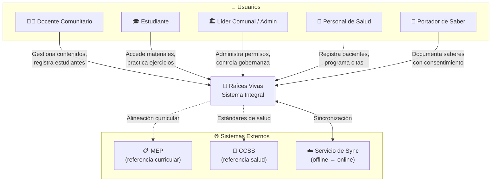

#### C4 — Nivel 2: Módulos y Servicios Transversales

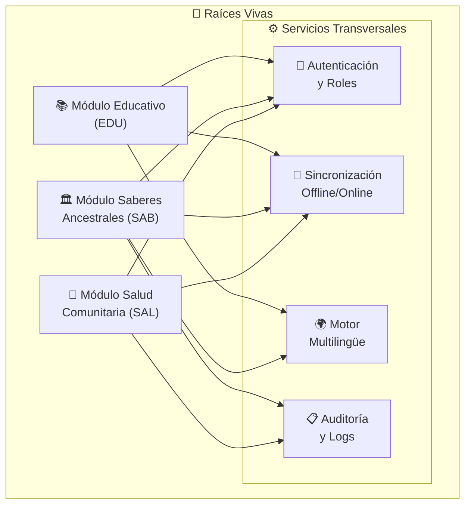

### A.2 Modelos Entidad-Relación

> Documento completo: [[04-Arquitectura/Modelo de Datos]]

Se diseñaron modelos ER detallados para cada módulo, derivados de los 23 RF y 4 RNF. Todas las entidades incluyen campos de sincronización offline (`sync_status`, `last_synced`, `device_id`) y los datos médicos están marcados con cifrado AES-256 en reposo.

| Módulo | Entidades | Total | Relaciones clave |
|--------|-----------|-------|------------------|
| **TRANS** | USUARIO, PUEBLO, COMUNIDAD, ROL, PERMISO, ROL_PERMISO, IDIOMA, LOG_AUDITORIA, SINCRONIZACION | 9 | USUARIO ↔ ROL ↔ PERMISO, COMUNIDAD → PUEBLO |
| **EDU** | DOCENTE, ESTUDIANTE, CENTRO_EDUCATIVO, ASIGNATURA, COMPETENCIA, MATERIAL_EDUCATIVO, MATERIAL_COMPARTIDO, EJERCICIO, INTENTO, PROGRESO | 10 | DOCENTE → MATERIAL → EJERCICIO → INTENTO → PROGRESO |
| **SAB** | PORTADOR_SABER, CATEGORIA_SABER, SABER, CONSENTIMIENTO, ROL_COMUNITARIO, PERMISO_ACCESO_SABER, HISTORIAL_NIVEL_ACCESO, REVOCACION, LOG_ACCESO_SABER | 9 | SABER ← CONSENTIMIENTO (obligatorio), SABER → REVOCACION (prevalece en sync) |
| **SAL** | PACIENTE, HISTORIAL_MEDICO, CONDICION_CRONICA, ALERGIA, MEDICACION, CITA, BRIGADA, BRIGADA_PARTICIPACION, ALERTA_SEGUIMIENTO, EXPORTACION_EDUS | 10 | PACIENTE → HISTORIAL ↔ CONDICION/ALERGIA/MEDICACION, BRIGADA → EXPORTACION_EDUS |
| **Total** | | **38** | 5 diagramas Mermaid (incluye vista integrada inter-módulos) |

#### ER — Entidades Transversales (TRANS)

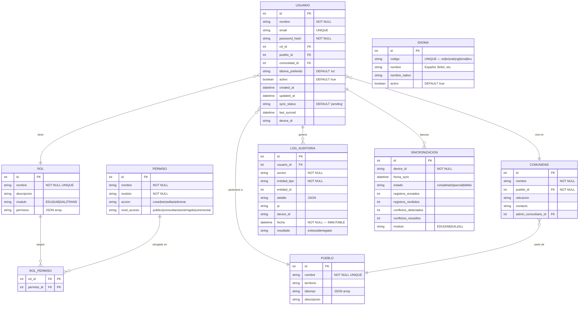

#### ER — Módulo Educativo (EDU)

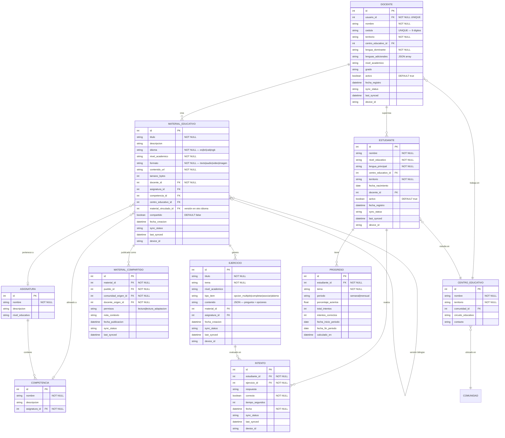

#### ER — Módulo Saberes Ancestrales (SAB)

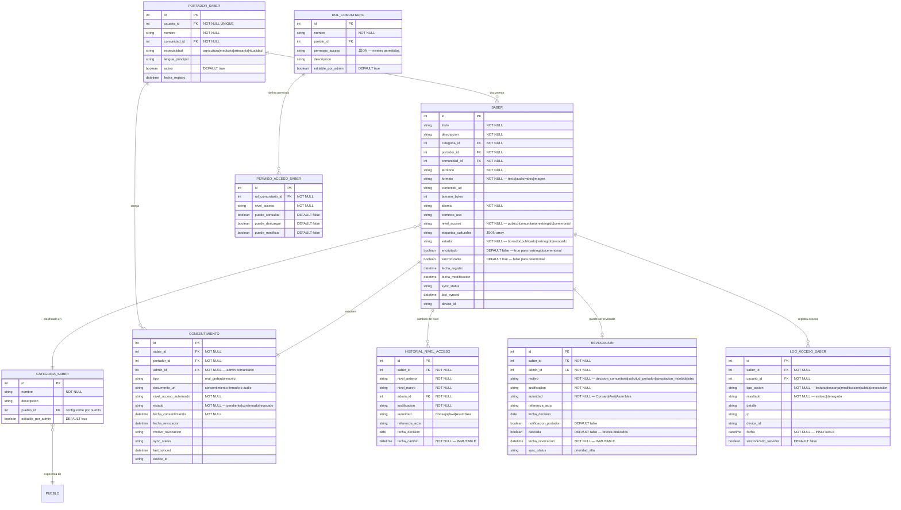

#### ER — Módulo Salud Comunitaria (SAL)

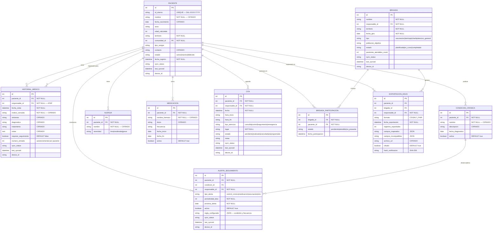

#### ER — Vista Integrada (Inter-Módulos)

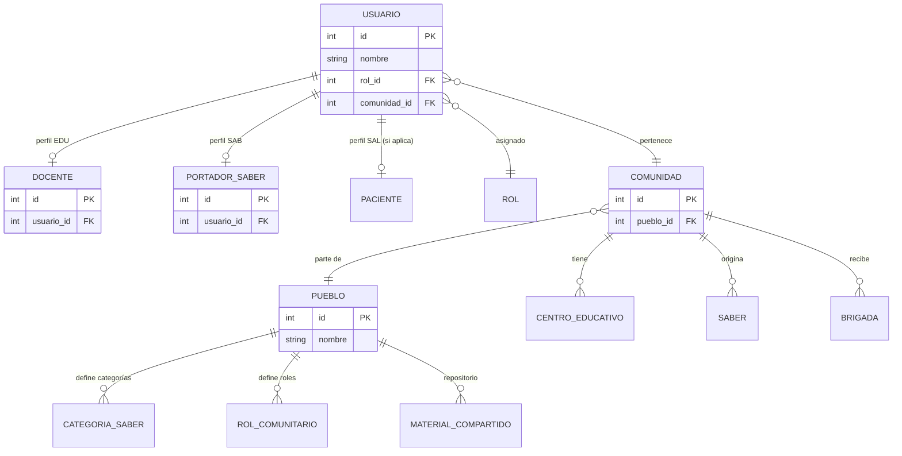

### A.3 Stack Tecnológico (ADR-008)

> Decisión completa: [[ADR-008]] | Documento técnico: [[04-Arquitectura/Stack Tecnológico]]
> **Estado:** Aceptado

| Capa | Tecnología |
|------|-----------|
| Frontend | React 19.2 + TypeScript 5.9 + Tailwind CSS v4 |
| Build | Vite 8 + workbox-build (PWA offline) |
| Offline DB | PouchDB 9 (cliente) ↔ CouchDB (servidor) |
| i18n | i18next 26 + react-i18next 17 (es, bri, cab, ngb) |
| Backend | Node.js + Express |
| Multimedia | Opus (audio), WebP (imágenes), HLS (video) |
| Seguridad | AES-256 reposo, TLS 1.3 tránsito, RBAC + CARE 4 niveles |

### A.4 Gobernanza Cultural (ADR-009)

> Decisión completa: [[ADR-009]]
> **Estado:** Aceptado

Principios CARE aplicados: Collective Benefit, Authority to Control, Responsibility, Ethics. Cuatro niveles de acceso (Público, Comunitario, Restringido, Ceremonial). Marco legal: Convenio 169 OIT, Ley 6172, Ley 7788, Ley 8968.

### A.5 WBS (Work Breakdown Structure)

> Documento completo: [[04-Arquitectura/WBS]]

16 paquetes de trabajo organizados en 4 módulos, con diccionario de alcance.

#### Diagrama WBS

```mermaid
graph TD
    RV["🌿 Raíces Vivas<br/>Sistema Integral"]
    
    RV --> RV1["📚 RV-1<br/>Módulo Educativo (EDU)"]
    RV --> RV2["🏛️ RV-2<br/>Módulo Saberes Ancestrales (SAB)"]
    RV --> RV3["🏥 RV-3<br/>Módulo Salud Comunitaria (SAL)"]
    RV --> RV4["⚙️ RV-4<br/>Requerimientos Transversales (NFR)"]
    
    RV1 --> RV11["RV-1.1<br/>Gestión de Actores Educativos"]
    RV1 --> RV12["RV-1.2<br/>Gestión de Contenidos Educativos"]
    RV1 --> RV13["RV-1.3<br/>Evaluación y Práctica Académica"]
    RV1 --> RV14["RV-1.4<br/>Acceso Bilingüe / Offline"]
    
    RV2 --> RV21["RV-2.1<br/>Registro Multiformato de Saberes"]
    RV2 --> RV22["RV-2.2<br/>Catalogación y Búsqueda"]
    RV2 --> RV23["RV-2.3<br/>Gobernanza y Control Comunitario"]
    RV2 --> RV24["RV-2.4<br/>Preservación y Trazabilidad Cultural"]
    
    RV3 --> RV31["RV-3.1<br/>Registro y Gestión de Pacientes"]
    RV3 --> RV32["RV-3.2<br/>Citas y Brigadas Comunitarias"]
    RV3 --> RV33["RV-3.3<br/>Seguimiento y Alertas"]
    RV3 --> RV34["RV-3.4<br/>Confidencialidad / Offline"]
    
    RV4 --> RV41["RV-4.1<br/>Conectividad y Modo Offline"]
    RV4 --> RV42["RV-4.2<br/>Multilingüismo y Accesibilidad"]
    RV4 --> RV43["RV-4.3<br/>Seguridad, Privacidad y Auditoría"]
    RV4 --> RV44["RV-4.4<br/>Rendimiento y Compatibilidad"]
```

#### Mapa de Trazabilidad WBS ↔ Epics ↔ Stories

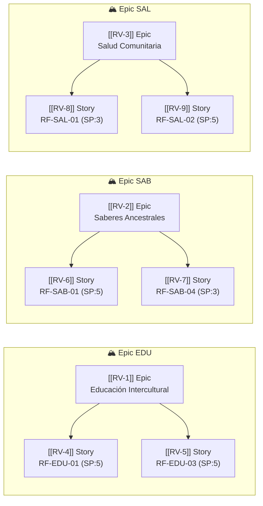

---

## Anexo B: Contribuciones del Equipo

### B.1 Distribución de Trabajo — Avance 2

| Sección del Documento | Responsable | Horas | Evidencia |
|----------------------|-------------|-------|-----------|
| §2 Actores del sistema | Geovanny | 2h | T-032 |
| §3 Lista de casos de uso | Elkin | 3h | T-033 |
| §4.1-4.2 CU módulo EDU | Geovanny | 4h | T-034 |
| §4.3-4.4 CU módulo SAB | Elkin | 4h | T-035 |
| §4.5-4.6 CU módulo SAL | Santiago | 4h | T-036 |
| §4.7-4.8 CU módulo TRANS | Santiago | 4h | T-037 |
| §5 Diagrama UML | Geovanny | 3h | T-038 |
| §6 Matriz de trazabilidad | Elkin | 2h | T-039 |
| §7 Conclusiones | Santiago | 2h | T-040 |
| Compilación y revisión | Geovanny | 3h | T-041 |
| Exportación PDF y entrega | Geovanny | 1h | T-042 |
| **Total** | | **32h** | **11 tareas** |

### B.2 Horas por Miembro

| Miembro | Rol | Tareas | Horas | % |
|---------|-----|--------|-------|---|
| **Geovanny Alpízar** | PM / Arquitecto | T-032, T-034, T-038, T-041, T-042 | 13h | 41% |
| **Elkin** | Investigación / SAB | T-033, T-035, T-039 | 9h | 28% |
| **Santiago** | QA / SAL | T-036, T-037, T-040 | 10h | 31% |

> La distribución refleja la mayor carga en el PM por tareas de compilación y exportación, mientras el trabajo de documentación de casos de uso se distribuyó equitativamente (2 CU por cada miembro no-PM, 2 CU para el PM).

---

## Anexo C: Análisis FODA del Proyecto

> Análisis estratégico de **F**ortalezas, **O**portunidades, **D**ebilidades y **A**menazas del proyecto Raíces Vivas, con orientación Lean Six Sigma para identificar factores internos y externos que impactan la entrega de valor.

### C.1 Matriz FODA

| | **Factores Positivos** | **Factores Negativos** |
|---|---|---|
| **Internos** | **Fortalezas** | **Debilidades** |
| | F1. Arquitectura offline-first (PouchDB/CouchDB) diseñada para territorios sin conectividad | D1. Conectividad limitada en 80% del territorio operativo dificulta validaciones remotas |
| | F2. Gobernanza cultural CARE integrada como principio de diseño (ADR-009) — no como parche | D2. Alfabetización digital básica en comunidades objetivo: usuarios requieren interfaces ≤6 campos |
| | F3. Stack tecnológico moderno y abierto (React 19, TypeScript, PWA) — sin dependencia de vendor | D3. Equipo de 3 personas con carga académica paralela limita velocidad de entrega |
| | F4. 23 RF trazados 1:1 con casos de uso; 12 expandidos con 14 campos cada uno | D4. Ausencia de infraestructura CouchDB de producción — sync solo validado localmente |
| | F5. Investigación de campo real: 4 entrevistas, observación directa, análisis de contenido | D5. Sin acceso directo a sistema EDUS/CCSS para validar mapeo de exportación (RF-SAL-06) |
| | F6. Soporte multilingüe nativo (es, bribri, cabécar, ngäbere) con i18next | D6. Validación con comunidades pendiente — flujos de consentimiento diseñados teóricamente |
| **Externos** | **Oportunidades** | **Amenazas** |
| | O1. 24 territorios indígenas en Costa Rica como universo de expansión | A1. Obsolescencia de dispositivos Android en comunidades (presupuesto de reemplazo inexistente) |
| | O2. Alineación con Convenio 169 OIT, Ley 6172 y principios CARE — marco legal favorable | A2. Pérdida acelerada de lenguas indígenas: hablantes de bribri < 3000, maleku < 600 |
| | O3. Interés CONARE y MEP en herramientas educativas para pueblos indígenas | A3. Riesgo de apropiación cultural si los controles de acceso presentan brechas |
| | O4. Modelo replicable para comunidades indígenas en Centroamérica (UNESCO) | A4. Rotación de personal de salud (ATAP) dificulta adopción — requiere onboarding continuo |
| | O5. Datos de salud exportables a EDUS/CCSS mejoran cobertura sanitaria oficial | A5. Resistencia potencial de autoridades tradicionales a digitalización de saberes ceremoniales |
| | O6. PWA permite distribución sin App Store — reduce fricción de adopción | A6. Cambios regulatorios (LGPD o reforma Ley 8968) pueden requerir rediseño de flujos de datos |

### C.2 Estrategias Cruzadas

| Estrategia | Combinación | Acción |
|---|---|---|
| **FO — Ofensiva** | F1 + O1 | Escalar la PWA offline-first a los 24 territorios usando el mismo stack |
| **FO — Ofensiva** | F2 + O4 | Posicionar la gobernanza CARE como caso de estudio replicable (UNESCO/CONARE) |
| **DO — Reorientación** | D2 + O6 | Aprovechar distribución PWA para interfaces ultra-simplificadas sin store |
| **DO — Reorientación** | D5 + O5 | Coordinar con CCSS para obtener especificación EDUS durante Sprint-04 |
| **FA — Defensiva** | F6 + A2 | Acelerar módulo i18n para documentar lenguas en riesgo de extinción |
| **FA — Defensiva** | F2 + A3 | Fortalecer auditoría (RF-SAB-07) y revocación (RF-SAB-06) como controles anti-apropiación |
| **DA — Supervivencia** | D1 + A1 | Diseñar para Android 8+ / RAM 2GB; optimizar bundle < 500KB |
| **DA — Supervivencia** | D6 + A5 | Priorizar sesiones de validación presencial con Consejo de mayores antes de Sprint-04 |

---

## Anexo D: Diagrama de Ishikawa — Causa-Efecto

> Análisis de causa raíz para el problema central: **"Riesgo de fracaso en la adopción del sistema por las comunidades indígenas"**. Aplicamos las 6M adaptadas al contexto del proyecto.

### D.1 Diagrama de Ishikawa

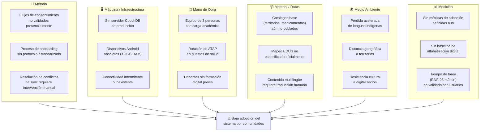

### D.2 Causas Priorizadas (Pareto)

| # | Causa raíz | Categoría | Impacto | Frecuencia | RPN | Mitigación propuesta |
|---|---|---|---|---|---|---|
| 1 | Conectividad intermitente | Máquina | 5 | 5 | 25 | Arquitectura offline-first ya implementada (PouchDB) |
| 2 | Flujos de consentimiento no validados | Método | 5 | 4 | 20 | Sesiones de validación con comunidades en Sprint-04 |
| 3 | Dispositivos obsoletos | Máquina | 4 | 4 | 16 | Bundle < 500KB, Android 8+, PWA sin App Store |
| 4 | Resistencia cultural a digitalización | Medio | 4 | 4 | 16 | Gobernanza CARE: nivel ceremonial nunca sincroniza |
| 5 | Docentes sin formación digital | Mano de obra | 4 | 3 | 12 | Interfaces ≤6 campos, wizard guiado, capacitación presencial |
| 6 | Catálogos base no poblados | Material | 3 | 4 | 12 | Tarea T-043: poblar catálogos en Sprint-03 |
| 7 | Sin métricas de adopción | Medición | 3 | 3 | 9 | Definir KPIs en Sprint-04: MAU, tasa de sync, tiempo de tarea |
| 8 | Sin servidor CouchDB producción | Máquina | 3 | 3 | 9 | Planificado para Sprint-05 (infraestructura) |

> **RPN** = Risk Priority Number (Impacto × Frecuencia, escala 1-5).

---

## Anexo E: Casa de la Calidad (QFD)

> Despliegue de la Función de Calidad (Quality Function Deployment) que traduce las necesidades de los stakeholders ("Qué") en características técnicas del sistema ("Cómo"), con correlaciones y priorización.

### E.1 Voz del Cliente — Necesidades Priorizadas

| # | Necesidad (Qué) | Stakeholder | Importancia (1-5) | Fuente |
|---|---|---|---|---|
| N1 | Funcionar sin internet | Docentes, ATAP | 5 | Entrevistas, RSK-001 |
| N2 | Proteger saberes según nivel cultural | Autoridades, Portadores | 5 | ADR-009, CARE |
| N3 | Operar en lengua indígena | Docentes, Estudiantes | 4 | RF-TRANS-02 |
| N4 | Registrar pacientes de forma sencilla | Auxiliar de salud | 4 | RF-SAL-01, RNF-03 |
| N5 | Compartir material entre comunidades | Docentes | 3 | RF-EDU-07 |
| N6 | Exportar datos al sistema CCSS | ATAP, EBAIS | 3 | RF-SAL-06 |
| N7 | Revocar contenido en cualquier momento | Admin comunitario | 5 | RF-SAB-06 |
| N8 | Auditar quién accedió a qué | Admin comunitario | 4 | RF-SAB-07 |
| N9 | Funcionar en dispositivos básicos | Todos los usuarios | 4 | RNF-01 |
| N10 | Completar tareas en < 2 minutos | Todos los usuarios | 4 | RNF-03 |

### E.2 Características Técnicas (Cómo)

| # | Característica técnica | Unidad / Meta | Dirección |
|---|---|---|---|
| T1 | PouchDB local + CouchDB sync | % disponibilidad offline = 100% | ↑ Maximizar |
| T2 | RBAC + CARE 4 niveles acceso | Niveles = 4 (público → ceremonial) | = Objetivo |
| T3 | i18next con 4 idiomas nativos | Idiomas soportados ≥ 4 | ↑ Maximizar |
| T4 | Formularios ≤ 6 campos obligatorios | Campos por formulario ≤ 6 | ↓ Minimizar |
| T5 | PWA + Service Worker (workbox) | Bundle JS < 500 KB | ↓ Minimizar |
| T6 | AES-256 reposo + TLS 1.3 tránsito | Cifrado = 100% datos médicos | ↑ Maximizar |
| T7 | LOG_ACCESO_SABER inmutable | Registros auditables = 100% | ↑ Maximizar |
| T8 | Exportación CSV/HL7 FHIR | Campos mapeados a EDUS ≥ 80% | ↑ Maximizar |
| T9 | Android 8+ / RAM 2GB mínimo | Dispositivos compatibles ≥ 90% | ↑ Maximizar |
| T10 | Revocación con prioridad de sync | Latencia revocación < 1 sync cycle | ↓ Minimizar |

### E.3 Matriz de Relaciones (Necesidades × Características)

| | T1 Offline | T2 CARE | T3 i18n | T4 ≤6 campos | T5 PWA | T6 Cifrado | T7 Auditoría | T8 EDUS | T9 Android 8+ | T10 Revocación |
|---|:---:|:---:|:---:|:---:|:---:|:---:|:---:|:---:|:---:|:---:|
| **N1** Funcionar sin internet | ●● | | | | ●● | | | | ● | |
| **N2** Proteger saberes | | ●● | | | | ● | ●● | | | ●● |
| **N3** Lengua indígena | | | ●● | | | | | | | |
| **N4** Registro sencillo | | | ● | ●● | | | | | ● | |
| **N5** Compartir material | ● | ● | ● | | ● | | | | | |
| **N6** Exportar a CCSS | | | | | | ● | | ●● | | |
| **N7** Revocar contenido | ● | ●● | | | | | ●● | | | ●● |
| **N8** Auditar acceso | | ● | | | | | ●● | | | |
| **N9** Dispositivos básicos | | | | ● | ●● | | | | ●● | |
| **N10** Tareas < 2 min | ● | | | ●● | ● | | | | ● | |

> **Leyenda:** ●● = Relación fuerte (9 pts) · ● = Relación moderada (3 pts) · vacío = Sin relación

### E.4 Priorización Técnica

| Característica técnica | Puntuación ponderada | Prioridad |
|---|---|---|
| T1 PouchDB offline sync | (5×9)+(3×3)+(5×3)+(4×3) = 81 | **1** |
| T2 CARE 4 niveles | (5×9)+(3×3)+(5×9)+(4×3) = 111 | **🥇** |
| T7 Auditoría inmutable | (5×9)+(5×9)+(4×9) = 126 | **🥇** |
| T5 PWA < 500KB | (5×9)+(3×3)+(4×9)+(4×3) = 102 | **2** |
| T10 Revocación rápida | (5×9)+(5×9) = 90 | **2** |
| T4 ≤6 campos | (4×9)+(4×3)+(4×9) = 84 | **3** |
| T6 AES-256 | (5×3)+(3×3)+(5×3) = 39 | **4** |
| T3 i18n 4 idiomas | (4×9)+(4×3)+(3×3) = 57 | **3** |
| T9 Android 8+ | (4×3)+(4×3)+(4×9) = 60 | **3** |
| T8 EDUS export | (3×3)+(3×9) = 36 | **4** |

> Las prioridades confirman que **gobernanza cultural (T2)**, **auditoría (T7)** y **offline sync (T1)** son los pilares técnicos del proyecto, alineados con los principios CARE y la realidad del contexto operativo.

---

## Anexo F: Metodología DMAIC — Lean Six Sigma

> Aplicación del ciclo **Definir → Medir → Analizar → Mejorar → Controlar** al proyecto Raíces Vivas, integrando los análisis previos (FODA, Ishikawa, QFD) como insumos en cada fase.

### F.1 Visión General del Ciclo DMAIC

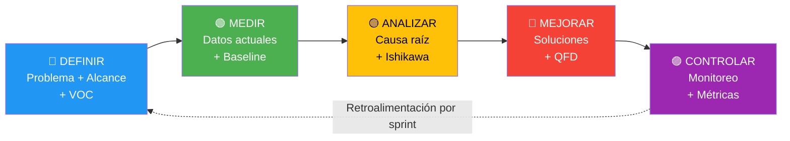

### F.2 Fase 1 — Definir

**Problema:** Las comunidades indígenas de Costa Rica carecen de herramientas digitales adaptadas a su contexto cultural, lingüístico y geográfico para gestionar educación, saberes ancestrales y salud comunitaria.

**Alcance:** 23 requerimientos funcionales distribuidos en 4 módulos (EDU 7, SAB 7, SAL 6, TRANS 3), priorizados por MoSCoW (11 Must, 8 Should, 3 Could, 1 Won't).

**Voz del Cliente (VOC):** Consolidada en la Casa de la Calidad (Anexo E): las 10 necesidades priorizadas por los stakeholders se traducen en 10 características técnicas medibles.

**CTQ (Critical to Quality):**

| CTQ | Métrica | Meta |
|---|---|---|
| Disponibilidad offline | % operaciones exitosas sin conexión | 100% |
| Protección cultural | Saberes ceremoniales sincronizados | 0 |
| Usabilidad | Tiempo para completar tarea crítica | ≤ 2 min |
| Cobertura lingüística | Idiomas soportados | ≥ 4 |
| Integridad de auditoría | Registros de acceso inmutables | 100% |

**Insumo FODA (Anexo C):** Las fortalezas F1 (offline-first) y F2 (CARE) dan sustento al alcance; las debilidades D1 (conectividad) y D6 (validación pendiente) definen las restricciones del proyecto.

### F.3 Fase 2 — Medir

**Baseline actual (Sprint-03):**

| Indicador | Estado actual | Meta Sprint-05 | Método de medición |
|---|---|---|---|
| Módulos funcionales | 1 parcial (EDU scaffold) | 3 operativos | Conteo de rutas con componentes funcionales |
| Entidades del modelo de datos | 38 diseñadas | 38 implementadas | Schema PouchDB vs. Modelo de Datos.md |
| Cobertura de pruebas | 0% | ≥ 60% | Jest coverage report |
| Idiomas en i18n | 4 archivos JSON | 4 con ≥ 80% cadenas | `npx i18next-parser` |
| Tiempo de build | 452 KB / 145 KB gzip | < 500 KB / < 160 KB | Vite build output |
| Usuarios validados | 0 | ≥ 6 (2 por módulo) | Sesiones de validación documentadas |

**Datos de sincronización (aún no medidos):**
- Latencia de primera sincronización
- Tasa de conflictos por sesión
- Tiempo de resolución de conflictos

> Estos indicadores se medirán cuando el servidor CouchDB esté disponible (Sprint-05).

### F.4 Fase 3 — Analizar

**Herramienta principal:** Diagrama de Ishikawa (Anexo D).

**Hallazgos clave del análisis de causa raíz:**

1. **Causa #1 (RPN 25): Conectividad intermitente** → Ya mitigada por diseño con PouchDB offline-first. Riesgo residual: conflictos de sincronización.
2. **Causa #2 (RPN 20): Flujos de consentimiento no validados** → Mayor distancia entre diseño y realidad. Requiere validación etnográfica presencial.
3. **Causa #3 (RPN 16): Dispositivos obsoletos** → Mitigación técnica (bundle < 500KB, Android 8+). Riesgo residual: dispositivos con RAM < 1GB.
4. **Causa #4 (RPN 16): Resistencia cultural** → El nivel "ceremonial" que **nunca** sincroniza es la mitigación clave. Requiere comunicación clara con autoridades.

**Análisis 5 Porqués — Causa #2 (Consentimiento no validado):**

| Nivel | Pregunta | Respuesta |
|---|---|---|
| ¿Por qué? | Los flujos de consentimiento no han sido validados | No se han realizado sesiones presenciales con comunidades |
| ¿Por qué? | No se han realizado sesiones presenciales | Sprint-02 se enfocó en diseño y documentación |
| ¿Por qué? | Sprint-02 se enfocó en documentación | El backlog priorizó CU expandidos sobre validación de campo |
| ¿Por qué? | Se priorizó documentación | La rúbrica académica requirió 12 CU expandidos antes de implementar |
| **Raíz** | Restricción académica genera desfase entre diseño y validación | **Acción:** Programar validación en Sprint-04 como criterio de aceptación |

### F.5 Fase 4 — Mejorar

**Herramienta principal:** Casa de la Calidad (Anexo E).

**Soluciones priorizadas por QFD:**

| Prioridad | Solución (Cómo) | Sprint | CTQ que atiende | Esfuerzo |
|---|---|---|---|---|
| 🥇 | Implementar RBAC + CARE en middleware | Sprint-04 | Protección cultural | Alto |
| 🥇 | LOG_ACCESO_SABER con registros inmutables | Sprint-04 | Integridad auditoría | Medio |
| 2 | PouchDB sync con regla "revocación prevalece" | Sprint-03 | Disponibilidad offline | Alto |
| 2 | PWA con Service Worker y cache de 4 idiomas | Sprint-03 | Usabilidad + Cobertura | Medio |
| 3 | Formularios wizard (≤6 campos por paso) | Sprint-04 | Usabilidad | Medio |
| 3 | i18n completo con glossary por idioma | Sprint-04 | Cobertura lingüística | Medio |
| 4 | Cifrado AES-256 en PouchDB para datos SAL | Sprint-05 | Confidencialidad | Alto |
| 4 | Exportación CSV/HL7 FHIR con validador | Sprint-05 | Interoperabilidad | Alto |

**Principio Lean aplicado:** Cada mejora se implementa en el sprint más temprano posible que maximice valor para el usuario final, evitando desperdicio (muda) de sobreproducción — no se implementan features que no tienen validación de campo programada.

### F.6 Fase 5 — Controlar

**Mecanismos de control por sprint:**

| Sprint | Control | Herramienta | Frecuencia |
|---|---|---|---|
| Sprint-03 | Build exitoso, 0 errores TS | `npx tsc --noEmit` | Cada commit |
| Sprint-04 | Cobertura tests ≥ 40% | Jest + `--coverage` | Semanal |
| Sprint-04 | Validación comunitaria documentada | Minutas + fotos | 2 sesiones |
| Sprint-05 | Sync sin pérdida de datos | Test de conflictos PouchDB | Pre-release |
| Sprint-05 | Tiempo de tarea ≤ 2 min | Sesiones de usabilidad cronometradas | 3 sesiones |
| Continuo | Revocación propagada en ≤ 1 ciclo sync | Log de sincronización | Cada sync |
| Continuo | 0 saberes ceremoniales en servidor | Query `sync_status != 'local_only'` + `nivel_acceso = 'ceremonial'` | Diaria |

**Dashboard de métricas propuesto:**

| Métrica | Indicador | Semáforo |
|---|---|---|
| Disponibilidad offline | % operaciones exitosas sin conexión | 🟢 ≥ 99% · 🟡 90-98% · 🔴 < 90% |
| Protección ceremonial | Saberes ceremoniales en servidor | 🟢 = 0 · 🔴 > 0 |
| Usabilidad | Tiempo promedio por tarea | 🟢 ≤ 2min · 🟡 2-4min · 🔴 > 4min |
| Cobertura lingüística | % cadenas traducidas por idioma | 🟢 ≥ 80% · 🟡 50-79% · 🔴 < 50% |
| Cobertura de pruebas | % líneas cubiertas | 🟢 ≥ 60% · 🟡 40-59% · 🔴 < 40% |
| Adopción | Usuarios activos mensuales (MAU) | 🟢 ≥ 10 · 🟡 4-9 · 🔴 < 4 |

> **Ciclo de retroalimentación:** Al final de cada sprint, las métricas de la fase Controlar retroalimentan a la fase Definir del siguiente ciclo DMAIC. Este loop continuo es la esencia de la mejora Lean Six Sigma aplicada al desarrollo ágil.

---

## Referencias

- [[01-Proyecto/Charter|Charter del Proyecto]]
- [[01-Proyecto/Alcance|Alcance]]
- [[04-Arquitectura/Visión General|Arquitectura General (C4)]]
- [[04-Arquitectura/Modelo de Datos|Modelo de Datos (ER)]]
- [[04-Arquitectura/Stack Tecnológico|Stack Tecnológico]]
- [[04-Arquitectura/WBS|Work Breakdown Structure]]
- [[ADR-008|ADR-008 — Selección de Stack Tecnológico]]
- [[ADR-009|ADR-009 — Gobernanza Cultural y Protocolos de Consentimiento]]
- [[02-Investigación/Contexto/Mapa de Territorios Indígenas|Mapa de Territorios Indígenas]]
- [[03-Requerimientos/_RTM|Matriz de Trazabilidad de Requerimientos]]
- [[05-Sprints/Sprint-02/Sprint-02-Review|Sprint-02 Review]]

---

*Documento creado el 2026-03-26 · Actualizado 2026-03-29 · Equipo Raíces Vivas · CENFOTEC*
*Curso: SOFT-09 — Introducción a la Ingeniería del Software — Prof. Johnny Marin*
