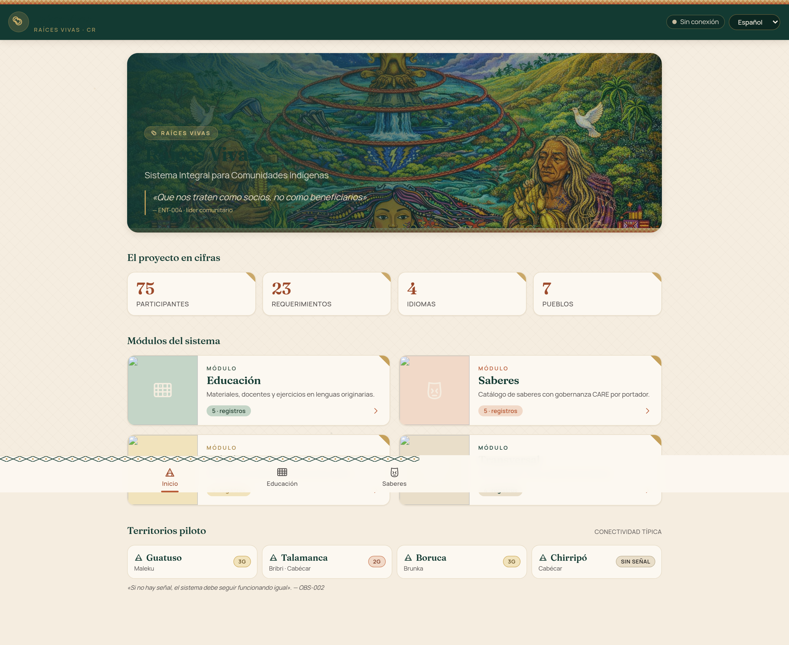
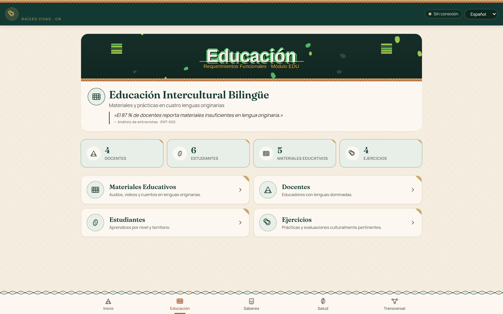
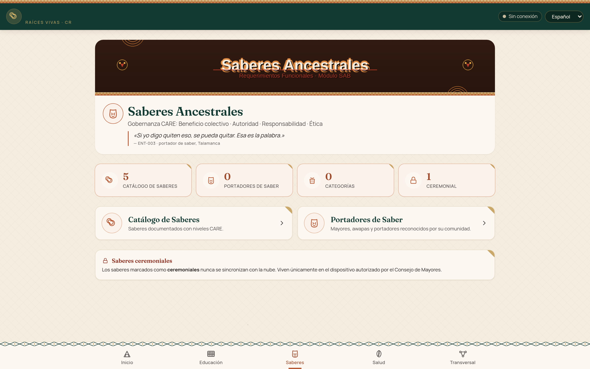
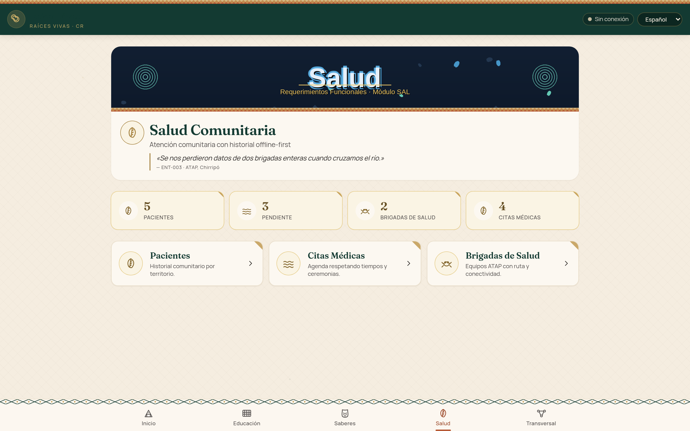
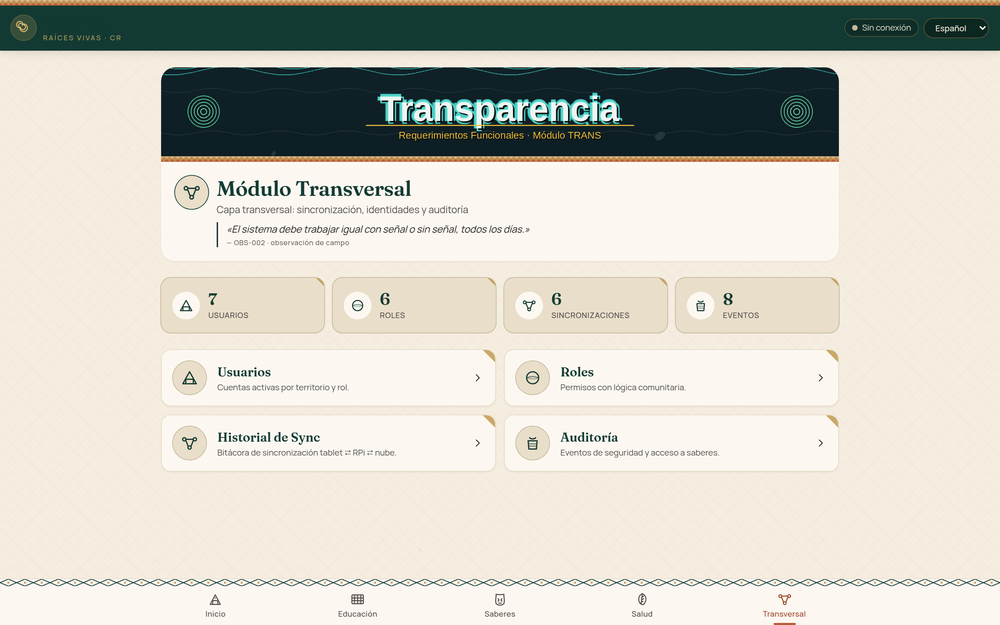
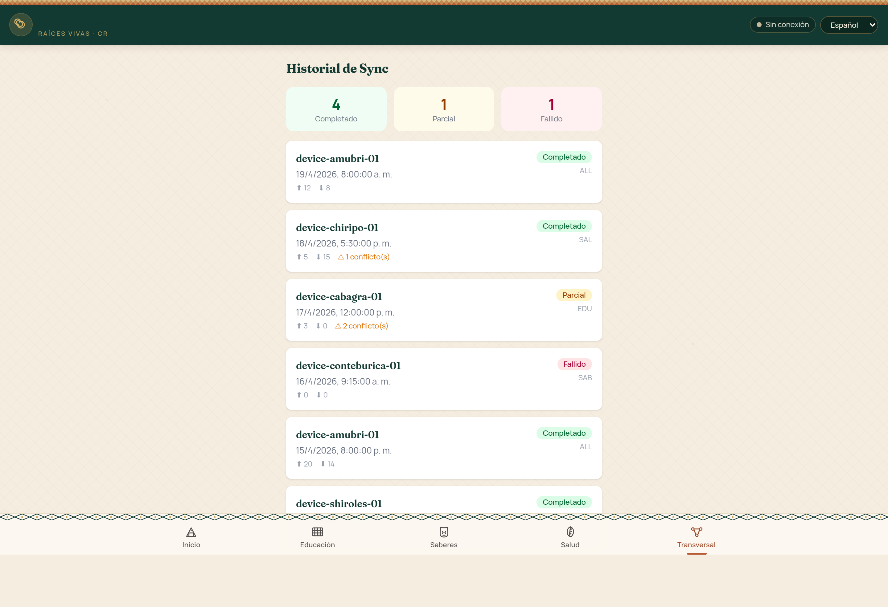
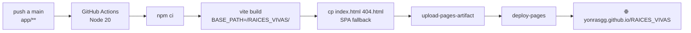

# 🌿 Raíces Vivas — Sistema Integral de Apoyo a Comunidades Indígenas

<p align="center">
  
</p>

<p align="center">
  <strong>Proyecto académico · Introducción a la Ingeniería de Software</strong><br/>
  <a href="https://ucenfotec.ac.cr/">Universidad CENFOTEC</a> — Escuela de Ingeniería de Software<br/>
  I Cuatrimestre 2026
</p>

<p align="center">
  <a href="https://yonrasgg.github.io/RAICES_VIVAS/">
    
  </a>
  <a href="https://github.com/yonrasgg/RAICES_VIVAS/actions/workflows/deploy-pages.yml">
    
  </a>
  
  
  
  
  
  
</p>

---

## 🚀 Prototipo Interactivo — `yonrasgg.github.io/RAICES_VIVAS`

> **👉 Probá la demo en vivo: [yonrasgg.github.io/RAICES_VIVAS](https://yonrasgg.github.io/RAICES_VIVAS/)**

Prototipo funcional **offline-first** desplegado en GitHub Pages. Implementa los 4 módulos del sistema (EDU · SAB · SAL · TRANS) con persistencia local via **PouchDB (IndexedDB)**, diseño tribal responsivo y soporte multilingüe (ES · BRI · CAB · NGB).

### 🧭 Recorrido rápido por módulos

<table>
  <tr>
    <td width="50%" align="center">
      <a href="https://yonrasgg.github.io/RAICES_VIVAS/"></a>
      <br/><sub><strong>🏠 <a href="https://yonrasgg.github.io/RAICES_VIVAS/">Home</a></strong> — Portal tribal con acceso a los 4 módulos</sub>
    </td>
    <td width="50%" align="center">
      <a href="https://yonrasgg.github.io/RAICES_VIVAS/edu"></a>
      <br/><sub><strong>📚 <a href="https://yonrasgg.github.io/RAICES_VIVAS/edu">Educativo</a></strong> — Materiales, docentes, estudiantes, ejercicios</sub>
    </td>
  </tr>
  <tr>
    <td width="50%" align="center">
      <a href="https://yonrasgg.github.io/RAICES_VIVAS/sab"></a>
      <br/><sub><strong>🏛️ <a href="https://yonrasgg.github.io/RAICES_VIVAS/sab">Saberes Ancestrales</a></strong> — Catálogo, portadores de saberes</sub>
    </td>
    <td width="50%" align="center">
      <a href="https://yonrasgg.github.io/RAICES_VIVAS/sal"></a>
      <br/><sub><strong>🏥 <a href="https://yonrasgg.github.io/RAICES_VIVAS/sal">Salud Comunitaria</a></strong> — Pacientes, citas, brigadas</sub>
    </td>
  </tr>
  <tr>
    <td width="50%" align="center">
      <a href="https://yonrasgg.github.io/RAICES_VIVAS/trans"></a>
      <br/><sub><strong>⚙️ <a href="https://yonrasgg.github.io/RAICES_VIVAS/trans">Transversal</a></strong> — Usuarios, roles, sync, auditoría</sub>
    </td>
    <td width="50%" align="center">
      <a href="https://yonrasgg.github.io/RAICES_VIVAS/trans/sync"></a>
      <br/><sub><strong>🔄 <a href="https://yonrasgg.github.io/RAICES_VIVAS/trans/sync">Sincronización</a></strong> — Estado offline/online por módulo</sub>
    </td>
  </tr>
</table>

<details>
<summary><strong>📸 Galería completa — 18 vistas del prototipo</strong></summary>

| # | Vista | Ruta |
|---|-------|------|
| 01 | [Home](08-Recursos/Imágenes/prototipo/01-home.png) | `/` |
| 02 | [EDU · Dashboard](08-Recursos/Imágenes/prototipo/02-edu-dashboard.png) | `/edu` |
| 03 | [EDU · Materiales](08-Recursos/Imágenes/prototipo/03-edu-materiales.png) | `/edu/materiales` |
| 04 | [EDU · Docentes](08-Recursos/Imágenes/prototipo/04-edu-docentes.png) | `/edu/docentes` |
| 05 | [EDU · Estudiantes](08-Recursos/Imágenes/prototipo/05-edu-estudiantes.png) | `/edu/estudiantes` |
| 06 | [EDU · Ejercicios](08-Recursos/Imágenes/prototipo/06-edu-ejercicios.png) | `/edu/ejercicios` |
| 07 | [SAB · Dashboard](08-Recursos/Imágenes/prototipo/07-sab-dashboard.png) | `/sab` |
| 08 | [SAB · Catálogo](08-Recursos/Imágenes/prototipo/08-sab-catalogo.png) | `/sab/catalogo` |
| 09 | [SAB · Portadores](08-Recursos/Imágenes/prototipo/09-sab-portadores.png) | `/sab/portadores` |
| 10 | [SAL · Dashboard](08-Recursos/Imágenes/prototipo/10-sal-dashboard.png) | `/sal` |
| 11 | [SAL · Pacientes](08-Recursos/Imágenes/prototipo/11-sal-pacientes.png) | `/sal/pacientes` |
| 12 | [SAL · Citas](08-Recursos/Imágenes/prototipo/12-sal-citas.png) | `/sal/citas` |
| 13 | [SAL · Brigadas](08-Recursos/Imágenes/prototipo/13-sal-brigadas.png) | `/sal/brigadas` |
| 14 | [TRANS · Dashboard](08-Recursos/Imágenes/prototipo/14-trans-dashboard.png) | `/trans` |
| 15 | [TRANS · Usuarios](08-Recursos/Imágenes/prototipo/15-trans-usuarios.png) | `/trans/usuarios` |
| 16 | [TRANS · Roles](08-Recursos/Imágenes/prototipo/16-trans-roles.png) | `/trans/roles` |
| 17 | [TRANS · Sincronización](08-Recursos/Imágenes/prototipo/17-trans-sync.png) | `/trans/sync` |
| 18 | [TRANS · Auditoría](08-Recursos/Imágenes/prototipo/18-trans-auditoria.png) | `/trans/auditoria` |

> Screenshots tomados en viewport `1440×900 @2x` sobre el deploy de producción con [`app/capture-screenshots.cjs`](app/capture-screenshots.cjs) (Puppeteer).

</details>

### 🧱 Stack técnico del prototipo

| Capa | Tecnología | Rol |
|------|------------|-----|
| **UI** | React 19.2 + TypeScript 5.9 | Componentes tipados, Strict Mode |
| **Build** | Vite 8 + Rolldown | Bundling ESM, tree-shaking, HMR |
| **Estilos** | Tailwind CSS 4 | Sistema de diseño tribal, dark mode |
| **Ruteo** | React Router 7 | SPA con `basename` dinámico para subpath |
| **Datos** | PouchDB-browser + pouchdb-find | Persistencia local IndexedDB, índices Mango |
| **Sync** | PouchDB ↔ CouchDB (opt-in) | Replicación offline-first por módulo |
| **i18n** | i18next + react-i18next | 4 idiomas: `es`, `bri`, `cab`, `ngb` |
| **PWA** | Manifest + SVG icons | Instalable en móvil/tablet |
| **Deploy** | GitHub Pages + Actions | CI/CD en cada push a `main` |

### ⚡ Correr el prototipo en local

```bash
cd app
npm install
npm run dev          # http://localhost:5173
npm run build        # build de producción en ./dist
npm run preview      # preview del build local
```

---

## 📖 Descripción

**Raíces Vivas** es un proyecto de la materia de **Introducción a la Ingeniería de Software** de la [Universidad CENFOTEC](https://ucenfotec.ac.cr/) (San José, Costa Rica).

El objetivo es diseñar y documentar los requerimientos de un **sistema tecnológico integral** orientado a apoyar:

- 📚 **Procesos educativos bilingües e interculturales** en territorios indígenas
- 🏛️ **Preservación de saberes ancestrales** y conocimiento tradicional
- 🏥 **Gestión básica de salud comunitaria** (registros, citas, seguimiento)

Todo el trabajo se enmarca dentro de las comunidades indígenas de Costa Rica, aplicando un enfoque de **respeto cultural, consulta comunitaria y sensibilidad intercultural**.

> **Nota:** Este proyecto cubre las fases de análisis, educción de requerimientos, especificación (RF/RNF), validación con usuarios potenciales y diseño de arquitectura. **No incluye implementación de software** en esta etapa.

---

## 🧩 Módulos del Sistema

| Módulo | Código | RF | CU | Descripción |
|--------|--------|----|----|-------------|
| **Educativo** | `EDU` | 7 | 7 | Apoyo educativo bilingüe e intercultural. Gestión de contenidos curriculares adaptados, seguimiento estudiantil y herramientas para docentes en territorios indígenas. |
| **Saberes Ancestrales** | `SAB` | 7 | 6 | Documentación, preservación y transmisión de conocimiento tradicional. Registro de prácticas, medicina tradicional, historias orales y artesanías. |
| **Salud Comunitaria** | `SAL` | 6 | 7 | Gestión básica de registros de salud, citas médicas, seguimiento de pacientes y coordinación con servicios itinerantes en comunidades remotas. |
| **Transversal** | `TRANS` | 3 | 3 | Funcionalidades compartidas entre módulos: autenticación, auditoría, configuración multilingüe y sincronización offline. |

---

## 👥 Equipo

| Integrante | Rol | Módulo Lead |
|-----------|-----|-------------|
| **Geovanny** | Project Lead / Arquitecto | EDU + Transversal |
| **Elkin** | Líder de Investigación / Analista | SAB |
| **Santiago** | Líder de QA / Analista | SAL |

---

## ⚙️ Configuración Rápida

### 1. Requisitos Previos

| Requisito | Dónde obtenerlo |
|-----------|-----------------|
| **Git** (≥ 2.39) | https://git-scm.com/downloads |
| **Obsidian** (≥ 1.5) | https://obsidian.md/download |
| **Cuenta GitHub** | https://github.com (con acceso al repo) |

#### 1.1 Tener acceso al repositorio en GitHub

1. Abrí https://github.com en tu navegador
2. Iniciá sesión con tu **usuario y contraseña de GitHub**
3. Verificá que podés ver el repositorio: https://github.com/yonrasgg/RAICES_VIVAS
   - Si no ves el repo, pedile acceso a **Geovanny** (owner del proyecto)
4. Listo ✅ — solo necesitás recordar tu **usuario** y **contraseña** de GitHub

> 💡 **No necesitás tokens, PATs, ni herramientas extra.** Al abrir el vault en Obsidian, el plugin de Git mostrará una ventanita pidiendo tus credenciales de GitHub. Es normal y ocurre cada vez que se abre el vault, por seguridad.

---

### 2. Clonar el Repositorio

Abrí una **terminal** (Terminal en Linux/Mac, Git Bash en Windows):

```bash
cd ~/Documents
git clone https://github.com/yonrasgg/RAICES_VIVAS.git
```

Si pide usuario y contraseña:
- **Username:** tu usuario de GitHub
- **Password:** tu contraseña de GitHub

---

### 3. Abrir el Vault en Obsidian

1. Abrí **Obsidian**
2. En la pantalla de inicio, clic en **"Open folder as vault"** (Abrir carpeta como vault)
3. Navegá hasta: `~/Documents/RAICES_VIVAS`
4. Clic en **"Abrir"** / **"Open"**
5. Si aparece un aviso sobre **"Trust author and enable plugins"**:
   - Clic en **"Trust author and enable plugins"** ✅
   - Esto activa los 22 plugins que el proyecto necesita

> ⚠️ **IMPORTANTE:** Si no confiás en los plugins, el Dashboard, las métricas, los templates y las automatizaciones **NO funcionarán**.

---

### 4. Configurar el Plugin Git (obsidian-git)

El plugin ya viene configurado en el vault. **No hay que configurar nada extra.**

#### Autenticación (cada vez que se abre el vault)

Al abrir Obsidian (o al hacer la primera operación Pull/Push), aparece una **ventanita emergente** pidiendo credenciales. Esto es **normal** y ocurre por seguridad:

1. En **Username:** escribí tu **usuario de GitHub**
2. En **Password:** escribí tu **contraseña de GitHub**
3. Listo — el plugin sincroniza automáticamente

> 💡 Este popup aparece **cada vez que abrís el vault**. Es el comportamiento esperado. Simplemente ingresá tus credenciales de GitHub y continuá trabajando.

#### Verificar que funciona:

1. Después de ingresar las credenciales, presioná `Ctrl+P` (o `Cmd+P` en Mac)
2. Escribí: `Git: Pull`
3. Seleccioná **"Obsidian Git: Pull"** presionando `Enter`
4. Debe aparecer una notificación: *"Pull successful"* o *"Already up to date"*

#### Configuración automática (ya incluida):

| Parámetro | Valor | Qué hace |
|-----------|-------|----------|
| Auto pull interval | `10 min` | Trae cambios del repo cada 10 minutos |
| Auto commit interval | `10 min` | Commitea cambios locales cada 10 minutos |
| Auto push interval | `10 min` | Sube cambios al repo cada 10 minutos |
| Commit message | `vault backup: {{date}}` | Mensaje automático con fecha |
| Pull on startup | ✅ Activado | Trae cambios al abrir Obsidian |
| Push on backup | ✅ Activado | Sube al hacer commit |

#### Si el auto-sync NO funciona:

1. `Ctrl+P` → escribe `Git: Open source control view` → `Enter`
2. Revisá si hay errores en rojo
3. Si dice *"Authentication failed"*: verificá que tu usuario y contraseña de GitHub son correctos (probá iniciando sesión en https://github.com desde el navegador)
4. Si dice *"Git is not ready"*: cerrá y reabrí Obsidian

---

## 🗂️ Estructura del Proyecto

```
RAICES_VIVAS/
│
├── 00-Dashboard/              ← Panel principal, métricas y roadmap
│   ├── Home.md                    Dashboard central con métricas del proyecto
│   ├── Métricas.md                KPIs, velocidad, calidad, costos
│   └── Roadmap.md                 Gantt y calendario de entregables
│
├── 01-Proyecto/               ← Gestión del proyecto
│   ├── Charter.md                 Acta de constitución del proyecto
│   ├── Alcance.md                 Scope statement (incluido / excluido)
│   ├── Equipo.md                  Integrantes, roles y responsabilidades
│   ├── Stakeholders.md            Mapa de interesados
│   ├── Plan de Gestión.md         Plan maestro de gestión del proyecto
│   ├── Finanzas.md                Presupuesto, tarifas, costos por sprint
│   ├── Guía de Workflow.md        Convenciones, frontmatter, automatizaciones
│   ├── Onboarding.md              Guía paso a paso para nuevos integrantes
│   ├── Glosario.md                Terminología del proyecto
│   ├── Propuesta de Gestión.md    Propuesta inicial del plan de proyecto
│   ├── Decisiones/                ADR-001 a ADR-017 (17 registros de decisión)
│   └── Riesgos/                   RSK-001 a RSK-014 (14 riesgos identificados)
│
├── 02-Investigación/          ← Investigación y contexto
│   ├── Contexto/                  Documentos de contexto sociocultural
│   │   ├── Educación.md               Contexto educativo en territorios
│   │   ├── Saberes Ancestrales.md     Conocimiento tradicional
│   │   ├── Salud Comunitaria.md       Situación de salud comunitaria
│   │   └── Mapa de Territorios Indígenas.md
│   ├── Encuestas/                 Instrumentos y resultados de encuestas
│   ├── Entrevistas/               Entrevistas con actores clave
│   ├── Fuentes/                   Referencias bibliográficas
│   └── Observaciones/             Notas de campo
│
├── 03-Requerimientos/         ← Especificación de requerimientos
│   ├── _RTM.md                    Matriz de Trazabilidad (RTM)
│   ├── Funcionales/
│   │   ├── EDU/                       RF-EDU-01 a RF-EDU-07 (7 requerimientos)
│   │   ├── SAB/                       RF-SAB-01 a RF-SAB-07 (7 requerimientos)
│   │   ├── SAL/                       RF-SAL-01 a RF-SAL-06 (6 requerimientos)
│   │   └── TRANS/                     RF-TRANS-01 a RF-TRANS-03 (3 requerimientos)
│   └── No Funcionales/
│       └── RNF-01 a RNF-04                    Rendimiento, seguridad, usabilidad, accesibilidad
│
├── 04-Arquitectura/           ← Diseño y arquitectura
│   ├── Visión General.md          Arquitectura de alto nivel
│   ├── Modelo de Datos.md         Modelo ER conceptual
│   ├── Stack Tecnológico.md       Tecnologías propuestas
│   ├── WBS.md                     Work Breakdown Structure
│   ├── Diagramas/                 Diagramas técnicos
│   └── Prototipos/                Wireframes y prototipos UI
│
├── 05-Sprints/                ← Ejecución ágil + Jerarquía Jira
│   ├── Backlog.md                 Backlog del producto (tablero Kanban)
│   ├── Epics/                     Epics: RV-1, RV-2, RV-3, EPIC-TRANS
│   ├── Stories/                   User Stories: RV-4→RV-9, RV-55→RV-64, US-* (23 stories)
│   ├── Sprint-01/                 Sprint 1 (cerrado): 20 tareas → Done
│   ├── Sprint-02/                 Sprint 2 (cerrado): 22 tareas (T-021→T-042) + Review
│   ├── Sprint-03/                 Sprint 3 (activo): 16 tareas (T-043→T-058)
│   ├── Sprint-04/                 (planificado)
│   └── Sprint-05/                 (planificado)
│
├── 06-Entregables/            ← Documentos de entrega
│   ├── Avance-1/                  Primer avance: Propuesta del proyecto
│   ├── Avance-2/                  Segundo avance: Diseño y Arquitectura (PDF + HTML)
│   └── Presentaciones/            Slides y material de presentación
│
├── 07-Reuniones/              ← Minutas de reunión
│   └── MIN-001 a MIN-006          6 minutas de reuniones del equipo
│
├── 08-Recursos/               ← Recursos del proyecto
│   ├── Datos/                     Datasets y datos de referencia
│   ├── Imágenes/                  29 archivos: covers, logos, diagramas UML pre-renderizados
│   ├── PDFs/                      Documentos de referencia
│   └── scripts/                   Scripts de automatización
│       ├── md_to_pdf.py               Pipeline MD→PDF (WeasyPrint + Mermaid + UML)
│       ├── generate_covers.py         Generador de banners del vault
│       ├── extract-frontmatter-to-csv.py  Extractor de frontmatter a CSV
│       └── setup-hooks.sh             Configuración de Git hooks
│
├── 09-QA/                     ← Control de calidad
│   └── README.md                  Lineamientos de QA
│
├── 99-Templates/              ← Plantillas reutilizables
│   ├── _template-tarea.md
│   ├── _template-minuta.md
│   ├── _template-requerimiento-funcional.md
│   ├── _template-requerimiento-nofuncional.md
│   ├── _template-riesgo.md
│   ├── _template-adr.md
│   ├── _template-sprint-planning.md
│   ├── _template-sprint-review.md
│   ├── _template-entrevista.md
│   ├── _template-daily-note.md
│   ├── _template-weekly-note.md
│   └── ... (variantes from-minuta)
│
└── Daily Notes/               ← Notas diarias y semanales de seguimiento
    ├── 2026-03-01 … 2026-03-21    9 notas diarias
    └── 2026-W09 … 2026-W12        4 notas semanales
```

---

## 📊 Metodología

El proyecto se gestiona con un enfoque **ágil adaptado** para contexto académico:

- **5 sprints** de duración variable (2 completados, 1 activo, 2 planificados)
- **4 módulos** funcionales: EDU, SAB, SAL, TRANS
- **23 casos de uso** documentados con notación UML
- **23 requerimientos funcionales** + **4 no funcionales**
- **Backlog** priorizado con MoSCoW
- **Daily/Weekly notes** para seguimiento (9 diarias + 4 semanales)
- **6 minutas** de reuniones de equipo
- **17 ADRs** (Architecture Decision Records)
- **14 riesgos** gestionados con probabilidad, impacto y estrategias de mitigación
- **RTM** (Requirements Traceability Matrix) para trazabilidad completa

---

## 📄 Pipeline de Generación de PDF (Avance 2)

El documento **Avance 2 — Diseño y Arquitectura** se genera automáticamente desde Markdown:

```bash
source .venv/bin/activate
python 08-Recursos/scripts/md_to_pdf.py
```

**Stack de generación:**

| Componente | Versión | Función |
|---|---|---|
| WeasyPrint | 68.1 | Renderizado HTML → PDF con CSS paged media |
| Mermaid CLI | 11.12.0 | 11 diagramas renderizados como PNG (@scale 4) |
| CairoSVG | 2.9.0 | 2 diagramas UML pre-renderizados (SVG → PNG) |
| Python Markdown | — | Conversión MD → HTML con extensiones |

**Características del PDF:**

- 📑 ~65 páginas, ~4.9 MB
- 🗂️ Tabla de contenido con hipervínculos de navegación
- 📊 13 diagramas Mermaid (ER, flujo, arquitectura, Ishikawa, QFD…)
- 🎭 2 diagramas UML con stick figures (Actores ↔ Módulos, Casos de Uso)
- 🏛️ Portada con logo CENFOTEC
- 📐 CSS optimizado para impresión APA con control de page-breaks
- 📎 Anexos Lean Six Sigma: FODA, Ishikawa, QFD, DMAIC

---

## 🚢 Despliegue del Prototipo (GitHub Pages)

El prototipo se publica automáticamente en cada push a `main` que toque `app/**`, mediante el workflow [`.github/workflows/deploy-pages.yml`](.github/workflows/deploy-pages.yml):



**Consideraciones técnicas aplicadas:**

- **Subpath-aware base path** — `vite.config.ts` lee `BASE_PATH` del entorno (`/RAICES_VIVAS/` en CI, `/` en dev) para que los assets resuelvan correctamente tanto en `localhost:5173` como en `yonrasgg.github.io/RAICES_VIVAS/`.
- **BrowserRouter `basename`** — `main.tsx` deriva el basename de `import.meta.env.BASE_URL` para que las rutas (`/edu`, `/sab`, `/sal`, `/trans`) funcionen bajo el subpath sin hash.
- **SPA fallback** — `404.html` clonado de `index.html` permite navegación directa a rutas internas sin romper.
- **Events polyfill explícito** — `pouchdb-browser` depende de `events`; se añadió como dep explícita para que el bundler de CI (rolldown) resuelva determinísticamente y no falle con `Class extends value #<Object>`.
- **Seguridad** — `npm audit` reporta **0 vulnerabilidades** en `app/` y en el root tras la última remediación de Dependabot (14 alertas cerradas).

---

## 🛠️ Stack de Gestión

<table>
  <tr>
    <td align="center" width="150">
      <a href="https://obsidian.md/">
        <br/>
        <strong>Obsidian</strong>
      </a>
      <br/>
      <sub>Knowledge base, dashboard, templates, automatizaciones (SQLSeal, Templater, QuickAdd, Kanban)</sub>
    </td>
    <td align="center" width="150">
      <a href="https://git-scm.com/">
        <br/>
        <strong>Git</strong>
      </a>
      <br/>
      <sub>Control de versiones, historial de cambios, colaboración distribuida</sub>
    </td>
    <td align="center" width="150">
      <a href="https://github.com/">
        <br/>
        <strong>GitHub</strong>
      </a>
      <br/>
      <sub>Repositorio remoto, sincronización del equipo, backup en la nube</sub>
    </td>
  </tr>
  <tr>
    <td align="center" width="150">
      <a href="https://weasyprint.org/">
        <strong>🖨️ WeasyPrint</strong>
      </a>
      <br/>
      <sub>Generación de PDF desde HTML/CSS con paged media</sub>
    </td>
    <td align="center" width="150">
      <a href="https://mermaid.js.org/">
        <strong>🧜 Mermaid</strong>
      </a>
      <br/>
      <sub>Diagramas ER, flujo, arquitectura, Gantt renderizados como PNG</sub>
    </td>
    <td align="center" width="150">
      <a href="https://www.atlassian.com/software/jira">
        <strong>📋 Jira</strong>
      </a>
      <br/>
      <sub>Gestión de sprints, epics, stories y tareas sincronizadas con Obsidian</sub>
    </td>
  </tr>
</table>

---

## 🏫 Contexto Académico

- **Universidad:** [CENFOTEC](https://ucenfotec.ac.cr/) — San José, Costa Rica
- **Escuela:** Ingeniería de Software
- **Materia:** Introducción a la Ingeniería de Software
- **Período:** I Cuatrimestre 2026
- **Profesor/a:** *(ver detalles en el vault)*

---

## 📜 Licencia

[](https://creativecommons.org/licenses/by-nc-sa/4.0/)

Este proyecto se distribuye bajo [**CC BY-NC-SA 4.0**](LICENSE) — ver el archivo [LICENSE](LICENSE) para más detalles.

---

<p align="center">
  <em>Raíces Vivas · CENFOTEC · 2026</em>
</p>
